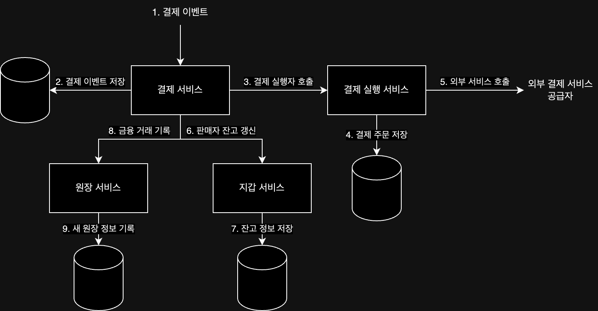
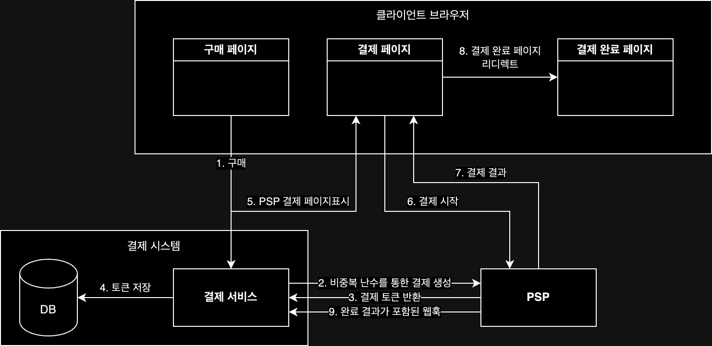

## 요구사항

- 결제 기능 및 판매자에게 대금 지급 기능 지원
- 신용 카드 결제 지원
- 서드파티 전문 결제 서비스 업체 사용
- 신용 카드 데이터 저장 X
- 하나의 통화만 지원
- 하루 100만 건의 거래

위의 기능을 지원하기 위해 아래 두 가지를 추가적으로 고려하는 것이 좋다.

- 결제 신뢰성 보장(결제 실패에 대해 신중히 처리)
- 내부 서비스(결제 시스템 / 회계 시스템)와 외부 서비스(결제 서비스 제공업체) 간 결제 정보가 일치하는지 비동기적으로 확인

개략적인 규모를 추정하면 다음과 같다.

- 하루 TPS: 1,000,000 / 24 / 3600 = 11.6

## 결제 및 대금 수신 흐름

결제 시스템을 구현하기 위해 필요한 컴포넌트는 다음과 같다.

- 결제 서비스: 사용자로부터 결제 이벤트를 수신하고, 결제 프로세스 진행
- 결제 실행자: 외부 결제 서비스 공급자를 통해 결제 주문 처리
- 외부 결제 서비스 공급자(Payment Service Provider, PSP): 결제 처리를 위한 서비스 제공
- 원장 서비스: 결제 트랜잭션에 대한 금융 기록(=원장)을 남기고, 결제 후 분석 역할 수행
- 지갑 서비스: 판매자의 계정 잔액 기록

일반적인 결제의 흐름은 다음과 같이 흘러가게 된다.(실패 없이 모두 성공하는 경우)

1. 사용자가 결제 이벤트를 생성하여 결제 서비스에 전송
2. 결제 서비스는 결제 이벤트를 데이터베이스에 저장
3. 판매자별로 분할하여 결제 실행자 호출
4. 결제 실행자는 결제 주문을 데이터베이스에 저장
5. 결제 실행자는 외부 결제 서비스 공급자를 호출하여 결제 처리
6. 지갑을 갱신하여 해당 판매자의 잔액 갱신
7. 갱신된 잔액 정보를 데이터베이스에 저장
8. 원장 서비스에서 원장 정보 생성
9. 생성된 새 원장 정보를 데이터베이스에 저장

## API 단위 기능 정의

결제 시스템을 구현하기 위한 기능을 RESTful API 단위로 나누어 정의하면 다음과 같다.

### `POST /payments`

결제 이벤트를 실행하는 API, 요청 매개변수는 다음과 같다.

- `buyer_info`: 구매자 정보
- `checkout_id`: 해당 결제 이벤트를 식별하는 고유 ID
- `credit_card_info`: 암호화된 신용 카드 정보 또는 결제 토큰
- `payment_orders`: 결제 주문 목록
    - `seller_account`: 대금 수령할 판매자
    - `amount`: 해당 주문으로 전송되어야 할 대금(string 형태)
    - `currency`: 통화 단위
    - `payment_order_id`: 해당 무준을 식발하는 고유 ID

`amount`를 정수나 실수가 아닌 string 형태로 받는 이유 아래 두 가지 이유가 있다.

- 프로토콜/소프트웨어/하드웨어마다 직렬화/역직렬화 시 숫자 정밀도가 일치하지 않음
- 숫자가 매우 크거나 작은 경우 정밀도 손실 가능성 존재

### `GET /payments/{:payment_order_id}`

payment_order_id에 해당하는 결제 주문 정보를 조회하는 API

## 결제 서비스 데이터 모델

결제 서비스에는 결제 이벤트와 결제 주문 두 개의 테이블을 사용할 수 있는데, 하나의 결제 이벤트에는 여러 결제 주문이 포함될 수 있어 두 테이블의 관계는 1:N 관계이다.

- 결제 이벤트 테이블

|                   이름                    |     자료형      |
|:---------------------------------------:|:------------:|
|               checkout_id               |  string PK   |
|               buyer_info                |    string    |
|               seller_info               |    string    |
|            credit_card_info             | 카드 제공업체마다 다름 |
| is_payment_done (모든 결제 주문 완료 시 TRUE) |   boolean    |

- 결제 주문 테이블

|                       이름                        |                     자료형                      |
|:-----------------------------------------------:|:--------------------------------------------:|
|                payment_order_id                 |                  string PK                   |
|                  buyer_account                  |                    string                    |
|                     amount                      |                    string                    |
|                    currency                     |                    string                    |
|                   checkout_id                   |                  string FK                   |
|              payment_order_status               | enum(NOT_STARTED, EXECUTNG, SUCCESS, FAILED) |
| ledger_updated (지갑 업데이트 후 원장 정보 업데이트 시 TRUE) |                   boolean                    |
| wallet_updated (결제 성공 후 판매자 잔액 업데이트 시 TRUE)  |                   boolean                    |

테이블을 보면 구매자의 카드 정보만 저장하고, 판매자의 계정 정보는 저장하지 않는 것을 알 수 있는데,  
판매자에게 대금을 지급하는 것은 정산 과정에서 처리하므로 결제를 처리하는 중인 결제 서비스에서는 판매자 정보를 저장할 필요가 없다.

## 복식부기 원장 시스템

원장 시스템에는 복식부기라는 중요한 설게 원칙이 존재하기 때문에, 모든 기록을 정확히 추적하기 위해 아래의 원칙을 따라야 한다.

- 모든 결제 거래를 두 개의 별도 원장 계좌에 같은 금액으로 기록
- 하나의 계좌에서는 차감이 일어나고, 다른 계좌에서는 증가가 일어나도록 기록

| 계정  |  차감  |  증가  |
|:---:|:----:|:----:|
| 구매자 | $100 |      |
| 판매자 |      | $100 |

결과적으로 차감과 증가를 모두 기록하게 되어, 복식부기 시스템에서 모든 거래 항목의 합계는 항상 0이 된다.

## 상세 설계

### PSP 연동

카드 시스템에 직접 연결하는 방법도 존재하지만, 대부분의 회사는 보안 및 구축 비용 문제로 아래 두 가지 방법 중 하나로 PSP와 연동하게 된다.

1. 민감한 결제 정보를 안전하게 저장 가능한 경우: 결제 웹페이지를 직접 개발하고 결제 정보를 수집하며, PSP는 은행 연결 및 다양한 카드 유형을 지원하는 역할 수행
2. 민감한 결제 정보를 안전하게 저장 않는 경우: PSP의 결제 페이지를 사용하여 결제 정보를 수집하고, 결제 정보는 PSP에 저장

대부분의 회사가 2번 방식을 사용하는데, 전체 결제 프로세스는 다음과 같이 진행된다.

1. 사용자가 클라이언트 브라우저에서 결제 시작
2. 결제 주문 정보를 수신한 결제 서비스는 결제 등록 요청을 PSP에 전송
    - 등록 요청 정보: 결제 금액 / 통화 / 결제 요청 만료일 / 리디렉션 URL 등 정보 포함
    - 결제 주문 데이터엔 UUID를 주문 ID로 사용하여 한 번만 등록되도록 함
3. PSP는 결제 서비스에 토큰을 반환
    - 해당 토큰은 등록된 결제 요청을 식별하고 결제 등록 및 실행 상태를 추적
4. 결제 서비스는 반환 받은 토큰을 데이터베이스에 저장
5. 결제 서비스는 클라이언트에게 토큰과 리디렉션 URL을 포함한 응답을 반환하여 결제 페이지 표시
    - 토큰: PSP의 자바스크립트 코드는 해당 토큰을 사용해 PSP의 백엔드에서 결제 요청에 대한 상세 정보 조회(결제 상태 / 결제 금액 등)
    - 리디렉션 URL: 결제 완료 후 호출될 웹 페이지 URL
6. 사용자는 신용 카드 번호 / 소유자 / 카드 유효기간 등 결제 세부 정보를 PSP 웹 페이지 입력 후 결제 요청
7. PSP에서 결제 처리 시작 후 결제 상태 반환
8. 리디렉션 URL로 이동
9. 비동기적으로 PSP는 웹훅을 통해 결제 상태와 함께 결제 서비스를 호출하여 결제 상태를 최신 상태로 업데이트

### 조정

시스템 성능을 높이기 위해 비동기 통신을 사용하게 되는데, 모든 통신이 잘 전달거나 응답이 반환된다는 보장이 없고, 결제 결과가 정확히 일치하지 않을 수 있다.  
때문에, 관련 서비스 간의 상태를 주기적으로 비교하여 일치하는지 확인하는 조정 시스템이 필요하다.

1. 주기적으로 은행 혹은 PSP는 고객에게 정산 파일 전송
2. 정산 파일에는 잔액과 발생한 모든 거래 내역이 포함되어 있음
3. 조정 시스템은 정산 파일을 읽어 결제 서비스의 원장 정보와 비교

발생 가능한 문제 유형과 자동화 가능 여부에 따라 해결할 수 있는 방법은 다음과 같다.

| 문제 유형 인지 여부 |                자동화 가능                 |             자동화 불가능              |
|:-----------:|:-------------------------------------:|:--------------------------------:|
|    알고 있음    | 자동화된 조정 시스템을 구축하여 문제 분류와 조정 작업 모두 자동화 | 발생한 문제를 작업 대기열에 넣고 재무팀에서 수동으로 수정 |
|     모름      |                   -                   |      특별 작업 대기열에 넣고 재무팀에서 조사      |

### 결제 지연 처리

대부분의 결제는 몇 초안에 처리되지만, 처리하기 까지 시간이 소요되는 경우도 존재한다.

- PSP가 해당 결제 요청의 위험성이 높다고 보고 검토하는 경우
- 신용 카드사가 구매 확인 용도로 카드 소유자의 추가 정보를 요청하는 3D 보안 인증 같은 추가 보호 장치를 요구하는 경우

시간이 오래 걸리는 요청을 처리하기 위해 PSP는 일반적으로 다음과 같이 처리하고 있다.

- PSP는 결제가 대기 상태임을 클라이언트에 반환(클라이언트에선 고객에게 결제 최신 상태를 확인할 수 있는 방안 제공)
- PSP에선 대기 중인 결제 진행 상황을 추적하고, 상태가 바뀌면 웹훅을 통해 결제 서비스에 알림

### 내부 서비스 간 커뮤니케이션

내부 서비스 통신에는 동기식/비동기식 두 가지 패턴이 있다.

#### 동기식 통신

소규모 시스템에서는 잘 작동할 수 있지만, 규모가 커질수록 아래의 단점이 발생할 수 있다.

- 성능 저하: 요청 처리 관계 서비스 중 하나가 지연되면 전체 시스템 성능에 영향을 미칠 수 있음
- 장애 격리 곤란: PSP 등의 서비스에 장애 발생 시 클라이언트에서 응답을 받을 수 없음
- 높은 결합도: 요청 발신자와 수신자가 서로 강하게 결합되어 있음
- 낮은 확장성: 갑작스러운 트래픽 증가 시 서비스 확장이 어려움

#### 비동기식 통신

비동기 통신은 일단 크게 두 가지 범주로 나눌 수 있다.

- 단일 수신자: 각 요청은 하나의 수신자 또는 서비스가 처리
    - 일반적으로 공유 메시지 큐를 사용해 구현
    - 처리된 메시지는 큐에서 바로 제거
- 다중 수신자: 각 요청은 여러 수신자 또는 서버가 처리
    - 일반적으로 카프카를 통해 구현
    - 소비자가 수신한 메시지는 바로 사라지지 않기 때문에 여러 서비스(수신자)가 동일한 메시지를 처리 가능
    - 하나의 결제 요청에 여러 서비스(결제 시스템/분석 등)가 처리할 수 있어 결제 시스템 구현에 적합

동기식에 비해 설계 난이도는 올라가지만, 비즈니스 로직이 복잡하고 타사 서비스 의존성이 높은 대규모 결제 시스템에서는 비동기식 통신을 채택하는 것이 좋다.

### 결제 실패 처리

안정성 및 결함 내성은 결제 시스템의 핵심적 요구사항인데, 이 문제를 해결하는 기법은 다음과 같다.

#### 결제 상태 추적

실패가 일어날 때마다 결제 거래의 현재 상태를 파악하고 재시도 또는 환불이 필요한지 결정하고, 결제 상태를 데이터베이스에 저장하여 추적 가능하도록 한다.

#### 재시도 큐 및 실패 메시지 큐

실패를 처리하기 위해서 재시도 큐와 실패 메시지 큐를 두어 실패한 결제 이벤트를 처리하는 것이 좋다.

- 재시도 큐(Retry Queue): 일시적 오류와 같은 재시도 가능 오류를 처리하기 위한 큐
- 실패 메시지 큐(Dead Letter Queue): 반복적으로 처리에 실패한 메시지를 저장하는 큐, 메시지를 디버깅하고 문제를 해결하기 위해 사용

두 큐를 사용해 결제 실패를 처리하는 과정은 다음과 같다.

1. 재시도 가능한지 확인
    1) 재시도 가능 실패는 재시도 큐로 보냄
    2) 잘못된 입력과 같이 재시도가 불가능한 실패는 오류 내역을 데이터베이스에 저장
2. 결제 시스템은 재시도 큐에 쌓인 이벤트를 읽어 실패한 결제를 재시도
3. 결제가 다시 실패하는 경우 다음과 같이 처리
    1) 재시도 횟수가 임계값 이내라면 해당 이벤트를 다시 재시도 큐로 보냄
    2) 재시도 횟수가 임계값을 넘어가면 실패 메시지 큐로 보냄

### 정확히 한 번 전달

결제 시스템에서는 이중 결제를 방지하기 위해 정확히 한 번 전달을 보장해야하는데, 이를 위해 아래 두 가지 원칙을 세울 수 있다.

1. 최소 한 번은 실행
2. 최대 한 번 실행

재시도를 통해 최소 한 번 실행을 보증하고, 멱등성 검사를 통해 최대 한 번만 실행을 보장할 수 있다.

#### 재시도

네트워크 오류나 시간 초과로 인해 결제 거래를 다시 시도해야하는 경우가 발생하는데, 이를 위해 다음과 같은 재시도 전략을 사용할 수 있다.

- 즉시 재시도: 즉시 다시 요청
- 고정 간격: 재시도 전에 일정 시간 대기
- 증분 간격: 재시도 전에 각 시도마다 특정 시간만큼 대기 시간 증가
- 지수적 백오프: 재시도 전에 각 시도마다 대기 시간을 지수적으로 증가

이 중 지수적 백오프 전략을 사용하는 것이 가장 일반적이다.

#### 멱등성

이중 결제를 방지하기 위해선 결제가 최대 한 번 이루어야 하는데, 이는 다른 말로 멱등성을 보장해야 한다는 말과 같다.(= 여러 번 호출해도 동일한 결과)  
UUID를 멱등 키로 사용하는데, 이 키를 HTTP 헤더에 포함하여 사용자가 여러 번 요청하게 되면, 결제 시스템은 아래와 같이 처리하게 된다.

1. 첫 번째 요청: 결제 서비스는 정상적으로 처리하고, 멱등키를 데이터베이스에 저장
2. 두 번째 이후 요청: 결제 서비스는 멱등키를 데이터베이스에서 조회하여 이미 처리된 요청인지 확인 후, 이미 처리 된 요청인 경우 이미 처리된 결과 반환

마찬가지로 PSP에서 결제가 성공적으로 처리하고, 응답을 결제 시스템에 받지 못한 경우에도 비중복 난수인 UUID를 멱등키로 사용하여 중복 결제를 방지하게 된다.

### 일관성

결제 실행 과정에서 상태 정보를 유지 관리하는 여러 서비스가 존재하고, 많은 호출을 수행하게 된다.

1. 결제 서비스: 비중복 난수/토큰/결제 주문/실행 상태 등의 결제 관련 데이터를 유지 관리
2. 원장: 모든 회계 데이터 보관
3. 지갑: 판매자의 계정 잔액 유지
4. PSP: 결제 실행 상태 유지

이러한 서비스 간의 일관성을 유지하기 위해 멱등성 보장과 조정 프로세스를 사용하여 결제 시스템의 일관성을 유지할 수 있다.

### 결제 보안

결제 시스템은 사용자의 신용 카드 정보를 다루기 때문에 보안이 매우 중요한데, 결제 시스템의 보안을 강화하기 위해 아래의 방법을 사용할 수 있다.

- 요청/응답 도청: HTTPS 사용
- 데이터 변조: 암호화 및 무결성 강화 모니터링
- 중간자 공격: 인증서 고정과 함께 SSL 사용
- 데이터 손실: 여러 지역에 걸친 데이터베이스 복제 및 스냅샷 생성
- 분산 서비스 거부 공격: 처리율 제한 및 방화벽
- 카드 도난: 실제 카드 번호 대신 토큰을 저장하고 결제에 사용
- PCI 규정 준수: 정보 보안 표준인 규정 준수

###### 참고자료

- [가상 면접 사례로 배우는 대규모 시스템 설계 기초 2](https://kobic.net/book/bookInfo/view.do?isbn=9788966264254)
