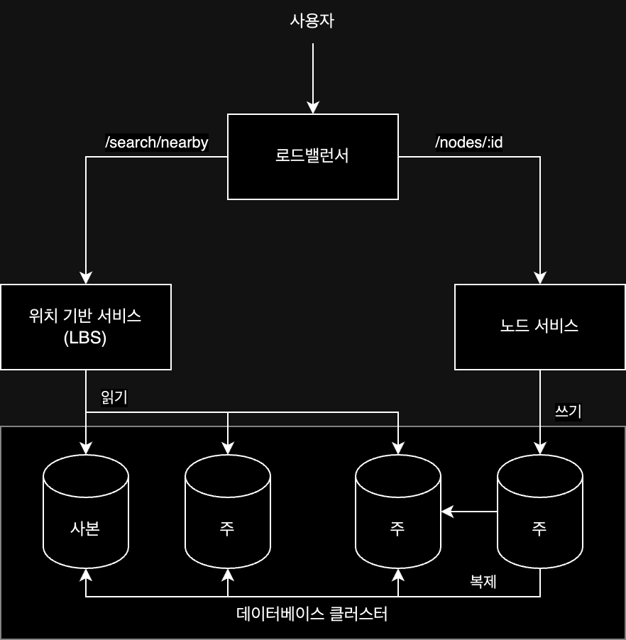

## 요구사항

- 주어진 반경 내 노드(사업장)을 찾는 서비스
- 최대 허용 반경 20km(선택에 따라 그 아래로 설정 가능, 0.5, 1, 2, 5, 20km)
- 노드(사업자) 정보는 사용자(사업장 소유주)가 추가/삭제/수정 가능
- 변경도니 정보는 다음날 반영

### 기능 목록

위의 요구사항을 충족 시키기 위한 기능 목록은 다음과 같다.

- 사용자 위체와 검색 반경 정보에 매치되는 노드 리스트 조회
- 사용자가 노드 추가/삭제/수정 시 해당 정보를 저장
- 해당 노드의 상세 정보 조회

또한 이러한 기능을 지원하기 위해 아래의 사항들을 추가적으로 고려해야 한다.

- 낮은 응답 지연: 주변 노드를 빠르게 조회할 수 있어야 함
- 고가용성 및 규모 확장성: 트래픽이 급증해도 서비스가 중단되지 않아야 함

### 개략적 규모 추정

DAU 1억 명, 등록된 노드 수 2억 개, 하루 5회 검색이라고 가정하였을 때 다음과 같은 규모를 가정할 수 있다.

- 1억 * 5회 /86,400초(1일) = 약 5800QPS

## API 설계

### `GET /search/nearby`

특정 검색 기준에 맞는 노드 목록을 반환하는 API, 요청 매개변수는 다음과 같다.

- 요청 매개 변수
    - `latitude`: 위도
    - `longitude`: 경도
    - `radius`: 검색 반경
- 반환 값
    - `total`: 검색된 노드 수
    - `nodes`: 검색된 노드 목록(도메인에 따라 적절한 이름 사용)

노드의 상세 정보 조회 및 추가/삭제/수정은 다음과 같은 API로 구현할 수 있다.

### 노드 관련 API

- `GET /nodes/:id`: 노드 상세 정보 조회
- `POST /nodes`: 노드 추가
- `PUT /nodes/:id`: 노드 수정
- `DELETE /nodes/:id`: 노드 삭제

### 데이터 모델

대부분의 근접성 서비스는 다음 기능의 이용 빈도가 굉장히 높다.

- 주변 노드 검색
- 노드 상세 정보 조회

읽기 연산이 많이 수행되는 반면, 노드가 추가되거나 수정되는 쓰기 연산의 빈도는 낮기 때문에 MySQL과 같은 관계형 데이터베이스가 적합할 수 있다.

## 아키텍처

위치 기반 서비스의 계략적 설계는 다음과 같이 구성할 수 있다.



각 컴포넌트들은 다음과 같은 역할을 수행한다.

- 로드밸런서: 유입 트래픽을 자동으로 알맞는 서비스로 전달
- 위치 기반 서비스(Location-Based Service): 위치와 반경 정보를 이용해 주변 노드 검색
    - 쓰기 요청이 없는 읽기 요청만 처리하는 서비스
    - 높은 QPS
    - 무상태 서비스로 수평적 규모 확장 용이
- 노드 서비스: 노드 추가/삭제/수정을 처리하는 서비스
    - 상대적으로 낮은 QPS
    - 노드 상세 조회가 빈번히 발생하는 시간대에 QPS가 높아질 수 있음
    - 무상태 서비스로 수평적 규모 확장 용이
- 데이터베이스 클러스터: 주-부(primary-secondary) 구조로 구성
    - 주 데이터베이스에서 쓰기 요청 처리 / 부 데이터베이스에서 읽기 요청 처리
    - 복제에 시간이 소요되지만, 대부분의 서비스는 실시간으로 반영되지 않아도 무방

주요 기능을 제공하는 두 개의 서버(LBS / 노드 서비스)가 무상태 서비스로 설계되어 있기 때문에 트래픽에 따른 수평적 규모 확장이 가능하다.

## 주변 노드 검색 알고리즘

많은 회사가 Redis Geohash나 PostGIS 확장 설치한 Postgres 데이터베이스를 활용하게 된다.  
때문에 직접적인 알고리즘을 구현할 필요는 없지만, 대략적인 위치 색인을 위한 알고리즘들을 알아보면 다음과 같다.

### 1. 2차원 검색

주어진 반경 안에 있는 노드를 검색하는 방법으로, 직관적이지만 단순하고 느리다.

```sql
SELECT *
FROM nodes
WHERE (latitute BETWEEN :my_lat - :radius AND :my_lat + :radius)
  AND (longitude BETWEEN :my_lon - :radius AND :my_lon + :radius)
```

조회하기 위해선 위 쿼리가 수행되어야 하는데, 테이블 전부를 읽어야 하기 때문에 느리다.  
`latitute`와 `longitude` 컬럼에 인덱스를 걸더라도 두 개의 교집합 데이터를 찾아야 하기 때문에 느리다.

결국엔 한 차원의 검색 속도만 빠르기 때문에 2차원에서의 검색에서는 한계가 있다.

### 2. 균등 격자

지도를 단순히 작은 격자 또는 구획으로 나누어 접근하는 방식으로, 각 구획에 대한 정보를 저장해 두고 검색할 수 있다.  
하지만 이 방법 또한 노드들의 분포가 균등하지 않을 가능성이 높기 때문에 효율적이지 않다.

### 3. 지오해시

2차원의 위도 경도 데이터를 1차원 문자열로 변환하는 방법으로, 지도를 작은 격자로 분할해가는 방법이다.  
두 개의 비트로 나누었을 때 다음과 같이 나뉠 수 있게 된다.

```
| 01 | 11 |
|----+----|
| 00 | 10 |
```

이걸 다시 재귀적으로 나누어 나가면 다음과 같이 나눌 수 있다.

```
| 01 01 | 01 11 | 11 01 | 11 11 |
|-------+-------+-------+-------|
| 01 00 | 01 10 | 11 00 | 11 10 |
|-------+-------+-------+-------|
| 00 00 | 00 11 | 10 01 | 10 11 |
|-------+-------+-------+-------|
| 00 00 | 00 10 | 10 00 | 10 10 |
```

이 절차를 원하는 정밀도(precision)를 얻을 때 까지 반복하면, 늘어나는 비트 수 만큼 더 정밀한 위치 정보를 얻을 수 있게 된다.

| 지오해시 길이 |          격자 너비 * 높이          |
|:-------:|:----------------------------:|
|    1    | 5,009.4km * 4,992.6km(지구 전체) |
|    2    |     1,252.3km * 624.1km      |
|    3    |       156.5km * 156km        |
|    4    |       39.1km * 19.5km        |
|    5    |        4.9km * 4.9km         |
|    6    |        1.2km * 609.4m        |
|    7    |       152.9m * 152.4m        |
|    8    |         38.2m * 19m          |
|    9    |         4.8m * 4.8m          |
|   10    |        1.2m * 59.5cm         |
|   11    |       14.9cm * 14.9cm        |
|   12    |        3.7cm * 1.9cm         |

이렇게 나온 지오해시는 통상적으로 base32 표현법을 사용한다.

- 길이 6의 지오해시: `1001 11010 01001 10001 11111 11110` -> `9q9hvu`

지정한 반경으로 그린 원을 덮는 최소 크기 격자를 선택하는 것이 최적 정밀도라고 볼 수 있는데, 요구 사항의 반경과 지오해시 관계를 표로 나타내면 다음과 같다.

|  반경   | 지오 해시 길이 |
|:-----:|:--------:|
| 0.5km |    6     |
|  1km  |    5     |
|  2km  |    5     |
|  5km  |    4     |
| 20km  |    4     |

이와 같이 지오해시를 사용하면 노드 검색을 효율적으로 할 수 있게 되는 이유는 다음과 같다.

1. 인접 격자의 효율적인 탐색: 지오해시는 공간을 계층적으로 분할하기 때문에, 특정 위치의 인접 격자를 쉽게 계산 가능
2. 문자열 비교를 통한 검색 속도 향상: 지오해시는 base 32 문자열로 표현될 수 있어 문자열 비교를 통해 빠르게 검색 가능

예를들어 현재 위치의 지오해시 코드가 `9q9hv`인 경우 해당 지오해시 혹은 인접 지오해시 코드를 사용해 노드를 검색할 수 있게 된다.  
하지만 인접한 모든 격자의 지오해시 코드가 공통 접두어를 가지지 않는 문제가 있기 때문에 추가적인 해결 방안이 필요하다.

### 4. 쿼드트리

격자의 내용이 특정 기준을 만족할 때까지 2차원 공간을 재귀적으로 사분면 분할할때 사용되는 자료구조다.  
메모리 안에 놓이는 자료구조로 데이터베이스가 아니기 때문에 서버가 시작하는 시점에 LBS 서버 안에 구축된다.

200백만개의 노드가 있다고 가정할 때, 아래와 같이 계속해서 분할해 나가면서 데이터를 저장할 수 있다.

```
|-----------------------|
|                       |
|         200만개        |
|                       |
|-----------------------|
            |
            |
            ↓
|-----------------------|
| NW(40만개) | NE(30만개) |
|-----------+-----------|
| SW(70만개) | SE(60만개) |
|-----------------------|
```

이를 트리 구조로 나타내면 다음과 같다.

```
    200만개
  /  /   \  \
40만 30만 70만 60만
   / / \ \
 12 4  5  9   
```

이 과정을 의사 코드로 나타내면 다음과 같다.

```java
class Quadtree {

    public void buildQuadtree(TreeNode node) {
        if (countNumberOfBusinessesInCurrentGrid(node) > 100) {
            node.subdivide();
            for (TreeNode child : node.getChildren()) {
                buildQuadtree(child);
            }
        }
    }
}
```

실제로 쿼드트리를 이용해 주변 노드를 검색하는 과정은 다음과 같다.

1. 서버 실행 시 메모리에 쿼드트리 인덱스 구축
2. 루트 노드부터 시작해 조회 시작
3. 현재 노드의 자식 노드 중 검색 반경에 포함되는 노드 확인 후 재귀적으로 탐색
4. 말단 노드에 도달하면 해당 노드의 리스트 반환

말단 노드에 100개 이하의 노드를 저장할 때 까지 계속해서 분할한다고 하게되면, 메모리는 약 2GB 정도, 구축에는 몇 분 정도 소요된다.   
메모리에는 큰 문제가 없을 수 있으나, 구축에는 시간이 어느정도 소요되기 때문에 동시에 많은 서버 배포하여 트래픽을 처리하지 못하는 일이 없도록 주의해야 한다.

### 비교

1번의 2차원 검색과 2번의 균등 격자는 실제로 사용하기에 적합하지 않아 실제로 많은 서비스들이 나머지 지오해시나 쿼드트리 방식(혹은 혼용)을 사용하게 된다.  
지오해시와 쿼드트리를 비교하면 다음과 같다.

- 지오해시
    - 구현과 사용이 쉬움
    - 지정 반경 이내 노드 검색 용이
    - 정밀도를 고정하면 격자 크기도 고정되어 동적으로 격자 크기 조정 불가능(가능하지만 복잡한 구현 필요)
    - 색인 갱신 용이(노드 삭제 시 열 하나만 제거하면 됨)
- 쿼드 트리
    - 구현이 복잡하고 트리 구축 시간이 필요
    - 가장 가까운 노드 검색 용이
    - 트리 형태의 자료구조기 때문에 삭제 시 복잡한 구현 필요

## 상세 설계

### 지리 정보 색인 테이블 구축 방법

노드 상세 정보 테이블: 데이터를 한 서버에 담을 수 없을 수도 없기 때문에 샤딩을 고려해볼 수 있다.  
지리 정보 색인 테이블(지오해시 쓴다고 가정)의 경우 조금 더 복잡한데, 우선 아래 두 가지 방법으로 구축 가능하다.

- 해당 지오 해시에 연결되는 사업장 ID를 배열로 관리
- 노드 ID에 지오해시를 각각 저장

두 번째 방법을 사용하는 것을 더 권장하는데 이유는 다음과 같다.

- 배열로 관리되는 경우 노드 정보 갱신 시 배열을 읽은 후 갱신할 노드 ID를 찾는 별도의 과정 필요
- 노드 ID에 지오해시를 저장하면 쉽게 조회하고 정보를 추가/수정/삭제 가능

### 지리 정보 색인 테이블 규모 확장성

관계형 데이터베이스 서버의 부하 분산에는 샤딩과 사본 데이터베이스를 늘리는 방법이 있다.  
지오해시 테이블은 샤딩이 까다롭기 때문에 사본 데이터베이스를 늘리는 방법을 사용하는 것이 개발도 쉽고 관리가 간편하다.

## 최종 동작 흐름

지오해시를 기반으로 설계되었다고 가정했을 때, 사용자가 주변 노드를 검색하면 다음과 같은 과정을 거친다.

1. 사용자가 로드밸런서에 주변 노드 검색 요청
2. 로드밸런서는 LBS 서버에 요청 전달
3. 주어진 사용자 위치와 반경 정보를 이용해 지오해시 길이 계산(500m인 경우 길이는 6)
4. 인접한 지오해시를 계산한 뒤 List에 저장(`listOfGeohashes= [9q9hvu, 9q9hvv, 9q9hvs ...]`)
5. 해당 리스트에 있는 지오해시 각각에 대해 데이터베이스(혹은 캐시)에 조회 요청
6. 조회된 노드 ID들을 통해 노드 상세 정보 조회
7. 필요한 경우 데이터 가공(해당 노드 정보, 거리 계산) 후 사용자에게 반환

###### 참고자료

- [가상 면접 사례로 배우는 대규모 시스템 설계 기초 2](https://kobic.net/book/bookInfo/view.do?isbn=9788966264254)
