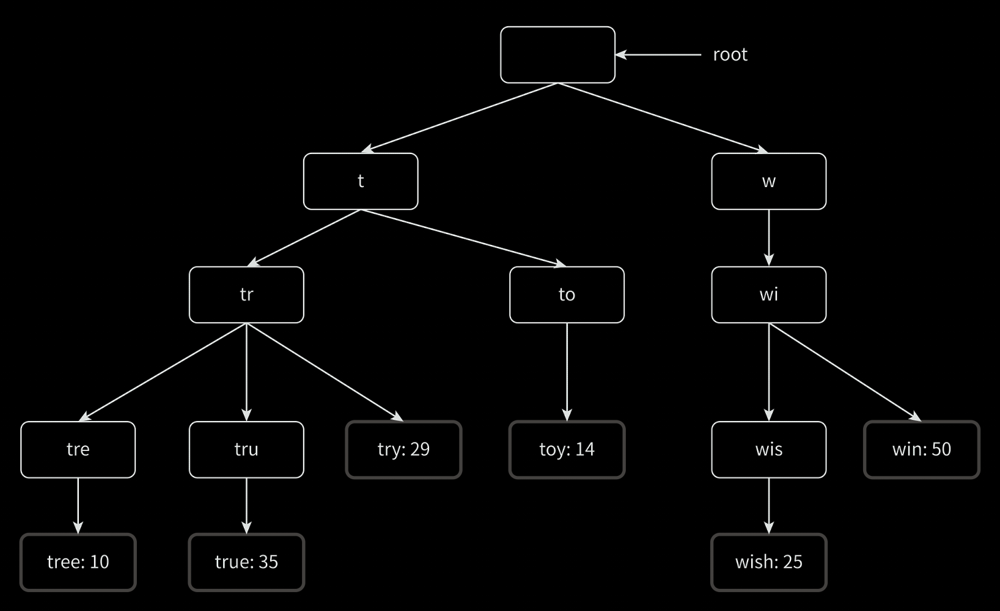

## 요구사항 및 개략적 추정

- 빠른 응답 속도: 사용자가 검색어를 입력함에 따라 자동완성 검색어가 100ms 이내로 노출
- 표시 건수: 사용자가 입력한 검색어에 대해 5개의 자동완성 검색어를 제공
- 연관성: 자동완성 출력 검색어는 사용자 입력 단어와 연관성이 있어야 함
- 정렬: 시스템 계산 결과는 인기도 및 순위 모델에 의해 정렬되어야 함
- 규모 확장성: 많은 트래픽을 감당할 수 있도록 확장 가능한 시스템
- 고가용성: 시스템 일부 장애 발생시에도 서비스 중단이 없어야 함
- DAU: 1,000만명으로 가정
- 검색수: 사용자당 매일 10건의 검색을 수행한다고 가정
- 검색 입력 데이터: 평균적으로 4개의 단어로 검색어를 입력한다고 가정
- 신규 검색 여부: 검색 가운데 20% 정도를 신규 검색어라 가정

검색어 자동완성 시스템에서 위와 같은 요구사항을 만족해야할 때, 아래와 같이 추정할 수 있다.

- 검색 입력 데이터: 각 단어를 평균적으로 5글자로 가정하면 4 * 5 = 20byte(문자 인코딩 방법 ASCII로 가정)
- 검색당 서버 요청 수: 검색 1회당 20건(한 글자 입력할 때마다 매번 요청)
- 초당 서버 요청 수(QPS): 1,000만명 * 10검 검색 * 20번 요청 / 24 / 3600 = 23,148
- 최대 QPS: 23,148 * 2(부하를 고려하여) = 46,296
- 데이터 저장량:  1,000만명 * 10검 검색 * 20byte * 20% = 400MB

## 시스템 설계

검색어 자동완성 시스템을 구현하기 위해 크게 두 부분으로 나눌 수 있다.

- 데이터 수집 서비스: 사용자가 입력한 질의를 수집하는 시스템
- 질의 서비스: 주어진 질의에 다섯 개의 인기 검색어를 정렬하여 반환하는 시스템

### 데이터베이스 자료구조 - 트라이 자료구조

```sql
SELECT *
FROM TB
WHERE keyword LIKE 'prefix%'
ORDER BY popularity DESC
LIMIT 5
```

관계형 데이터베이스로 위와 같은 쿼리를 수행할 수 있지만, 많은 데이터를 처리할 때는 효율적이지 않기 때문에 트라이 자료구조를 사용하는 것이 좋다.  
트라이는 문자열들을 간략하게 저장할 수 있는 자료구조로 아래와 같은 특징을 가진다.

- 트리 형태의 자료구조
- 트리의 루트 노드는 빈 문자열을 나타냄
- 각 노드는 글자 하나를 저장하며, 해당 글자 다음에 등장할 수 있는 글자 수(알파벳의 경우 26개)만큼의 자식 노드를 가질 수 있음
- 각 트리 노드는 하나의 단어 혹은 접두어 문자열을 나타냄

이러한 특징에 더해 이용 빈도가 높은 단어를 빠르게 찾기 위해 노드에 빈도 정보를 저장할 수도 있다.



위 사진 처럼 트리 형태로 저장되며, 자세한 설명을 위한 용어를 정의하면 다음과 같다.

- p: 접두어(prefix)의 길이
- n: 트라이 안에 있는 노드 개수
- c: 주어진 노드의 자식 노드 개수

트라이 구조로 자동완성을 구현하기 위해 아래와 같은 방법을 사용한다.

| 순번 | 설명                                   |   시간 복잡도   |
|:--:|:-------------------------------------|:----------:|
| 1  | 해당 접두어를 표현하는 노드 탐색                   |    O(p)    |
| 2  | 해당 노드부터 시작하는 하위 트리를 탐색하여 모든 유효 노드 탐색 |    O(c)    |
| 3  | 유효 노드들을 정렬하여 인기있는 검색어 탐색             | O(c log c) |

만약 'tr' 입력했다고 가정하면 위 알고리즘은 다음과 같이 동작하게 된다.

1. 접두어 노드 'tr' 찾음
2. 해당 노드부터 시작하는 하위 트리를 탐색하여 모든 유효 노드 탐색
    - tree: 10 / true: 35 / try: 29가 유효 노드
3. 유효 노드를 정렬
    - true: 35 / try: 29 / tree: 10

이 알고리즘은 직관적이지만 최악의 경우 전체 트라이를 다 검색해야 하는 일이 생길 수 있기 때문에 다음과 같은 방법을 사용하여 방지할 수 있다.

- 접두어 최대 길이 제한: 사용자가 검색창에 긴 검색어를 입력하는 일이 거의 없으므로, 작은 정숫값(예를 들어 50)으로 제한하여 O(1) 시간 복잡도를 유지
- 노드에 인기 검색어 캐시: 각 노드에 k개의 인기 검색어를 저장하면 하위 트리를 탐색하는 시간을 줄일 수 있음(이미 캐싱되어 있는 검색어는 O(1) 시간에 반환 가능)

### 데이터 수집 서비스

데이터 수집을 실시간으로 하는 방법도 있지만, 아래 두 가지 문제가 존재한다.

- 매일 수천만 건의 검색어에 대해 트라이가 갱신되기 때문에 부하가 커짐
- 일단 트라이가 만들어지고 나면 인기 검색어는 자주 바뀌지 않아 자주 갱신할 필요가 없음

실시간 수집 대신에 데이터 분석 서비스나 로깅 서비스를 통해 데이터를 수집하고, 트라이 자료구조를 주기적으로 갱신하는 방법을 사용할 수 있다.

1. 데이터 분석 서비스 로그: 사용자가 검색한 검색어를 로깅
2. 로그 취합 서버: 수집된 로그를 취합하여 저장
3. 취합된 데이터: 검색어 / 수집 시간 날짜 / 검색 횟수의 형태로 저장
4. 작업 서버: 취합된 데이터를 주기적으로 읽어 트라이 자료구조를 만들어 트라이 데이터베이스에 저장
5. 트라이 데이터베이스: 트라이 자료구조를 저장하는 데이터베이스, 두 가지 데이터베이스 형태로 구현 가능
    - 문서 저장소: 트라이를 직렬화하여 저장
    - 키-값 저장소: 트라이에 보관된 모든 접두어를 해시 테이블 키로, 각 트라이 노드의 데이터를 값으로 저장
6. 트라이 캐시: 트라이 데이터를 메모리에 유지하여 조회 성능을 향상(일정 주기로 트라이 데이터베이스의 스냅샷을 가져와 갱신)

### 질의 서비스

질의 서비스를 구현하기 위해 아래의 순서로 진행할 수 있다.

1. 검색 질의가 로드밸런서로 전달
2. 로드밸런서는 요청을 질의 API 서버로 전달
3. 질의 API 서버는 트라이 캐시에서 데이터를 가져와 해당 요청에 대한 자동완성 검색어 제안 응답 구성
    - 데이터가 트라이 캐시에 없는 경우 데이터를 트라이 데이터베이스에서 가져와 트라이 캐시에 저장

추가적으로 아래 최적화 방안으로 성능을 향상할 수 있다.

- 브라우저 캐싱: 대부분 애플리케이션의 경우 자동완성 검색어 제안 결과는 자주 바뀌지 않기 때문에 브라우저 캐싱을 통해 성능 향상
- 데이터 샘플링: 모든 질의 결과를 로깅하면 CPU 자원과 저장 공간을 많이 사용하게 되므로, N개의 요청중 하나만 로깅하도록 샘플링하여 로깅

### 트라이 연산

트라이는 검색어 자동완성의 핵심 컴포넌트로, 다음과 같이 동작한다.

- 트라이 생성: 트라이 생성을 담당하는 서버가 생성하며, 데이터 분석 서비스의 로그나 데이터베이스로부터 취합된 데이터를 이용하여 생성
- 트라이 갱신: 트라이를 갱신하는 데는 두 가지 방법 존재
    - 매주 한 번 갱신: 새로운 트라이를 만든 후, 기존 트라이를 대체
    - 트라이의 각 노드를 개별적으로 갱신: 각 노드를 개별적으로 갱신(하나의 노드가 갱신될 때 상위 노드들을 모두 갱신해야하므로, 트라이가 작을 때 고려해볼 수 있음)
- 검색어 삭제: 트라이 캐시에서 데이터를 가져올 때 필터 계층을 추가하여 부적절한 검색어를 제거(혐오성/폭력적/성적인 단어 등)

### 저장소 규모 확장

트라이의 크기가 한 서버에 넣기에 너무 커지는 경우 샤딩을 통해 규모 확장을 할 수 있다.

- prefix 기반으로 샤딩('aa' - 'ag': 1번 샤드, 'ah' - 'az': 2번 샤드, ...)
- 각 prefix를 균등하게 분배하여 샤드에 저장
- 검색어 대응 샤드 관리자를 두어 어떤 샤드에 저장되어 있는지 확인

## 추가적인 고려사항

- 다국어 지원: 트라이에 유니코드 문자로 저장하여 다국어 지원
- 국가별 인기 검색어 순위 지원: 국가별로 다른 트라이 사용 및 트라이를 CDN에 저장하여 지연 시간을 줄임

###### 참고자료

- [가상 면접 사례로 배우는 대규모 시스템 설계 기초](https://kobic.net/book/bookInfo/view.do?isbn=9788966263158)
