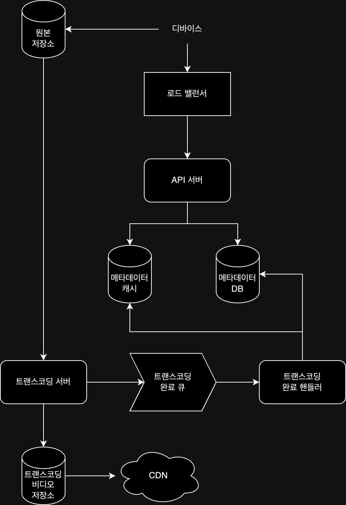

## 요구사항

- 빠른 비디오 업로드
- 원활한 스트리밍 환경
- 모바일 앱 / 웹 / TV 등 다양한 플랫폼 지원
- 다국어 지원
- 재생 품질 선택 가능
- 비디오 종류 및 해상도 대부분 지원
- 사용자가 업로드한 비디오는 1GB 이하
- 클라우드 서비스 활용 가능
- 높은 가용성 / 규모 확장성 / 안정성
- DAU 500만명
- 평균 이용 시간 30분 / 하루 평균 5개 비디오 시청
- 10%의 사용자가 하루에 1 비디오 업로드 / 비디오 평균 크기 300MB

비디오 스트리밍 서비스를 구현하기 위해 위와 같은 요구사항을 만족해야할 때, 아래와 같이 추정할 수 있다.

- 매일 새로 요구되는 저장 용량: 500만 * 10% * 300MB = 150TB
- CDN 비용: 각 클라우드 제공업체의 CDN 비용에 따라 다름(AWS CloudFront의 경우 500만 * 5개 * 0.3GB * 0.02$ = 150,000$)

클라우드 서비스의 CDN을 통해 비디오 스트리밍 서비스를 하게 되면 비용이 매우 많이 발생하기 때문에, 이 비용을 줄일 수 있는 방법을 고려해야 한다.

## 시스템 설계

비디오 스트리밍 서비스를 구현하기 위해 크게 두 개의 컴포넌트로 구성할 수 있다.

- CDN: 비디오를 저장하기 위한 저장소
- API 서버: 비디오 스트리밍을 제외한 모든 요청을 처리하기 위한 서버(피드 추천 / 비디오 업로드 URL 생성 / 메타데이터 데이터베이스 및 캐시 갱신 / 사용자 인증 등)

또한 해당 서비스에서 핵심이 될 수 있는 기능은 비디오 업로드 / 비디오 스트리밍으로, 이를 구현하기 위한 개략적인 절차는 다음과 같다.

### 비디오 업로드

- API 서버: 비디오 스트리밍을 제외한 다른 요청 처리
- 메타데이터 데이터베이스: 비디오 메타데이터 저장
- 메타데이터 캐시: 메타데이터 캐싱
- 원본 저장소: 원본 비디오를 저장할 대형 이진 파일(BLOB, Binary Large Object Storage) 저장소
- 트랜스코딩 서버: 비디오 포맷을 변환하는 인코딩 서버, 단말이나 대역폭 요구사항에 맞게 최적의 비디오 스트림으로 변환
- 트랜스코딩 비디오 저장소: 트랜스코딩이 완료된 비디오를 저장하는 BLOB 저장소
- CDN: 비디오 캐싱 및 스트리밍
- 트랜스코딩 완료 큐: 비디오 트랜스코딩 완료 이벤트를 보관하는 메시지 큐
- 트랜스코딩 완료 핸들러: 트랜스코딩 완료 큐에서 이벤트 꺼내 메타데이터 캐시 및 데이터베이스를 갱신하는 작업 서버

위 컴포넌트들을 통해 비디오가 업로드 요청을 하면 비디오 업로드와 메타데이터 갱신이 이루어지며, 두 작업이 병렬적으로 진행된다.

- 비디오 업로드
    1. 비디오를 원본 저장소에 업로드
    2. 트랜스코딩 서버는 원본 저장소에서 업로드 된 비디오를 가져와 트랜스코딩 시작
    3. 트랜스코딩 완료 후 아래 두 작업을 병렬로 진행
        - 트랜스코딩이 완료된 비디오를 트랜스코딩 비디오 저장소에 저장 -> CDN에 캐싱
        - 트랜스코딩 완료 이벤트를 트랜스코딩 완료 큐에 보냄 -> 완료 핸들러가 이벤트를 처리해 메타데이터 데이터베이스 및 캐시 갱신
    4. API 서버에서 디바이스에 비디오 업로드 완료 알림 전송
- 메타데이터 갱신
    1. 원본 저장소에 파일이 업로드되는 동안, 병렬적으로 비디오 메타데이터를 API 서버에 갱신 요청
    2. API 서버는 메타데이터 데이터베이스에 메타데이터 저장

### 비디오 스트리밍

비디오 스트리밍을 위해 데이터를 전송할 때 표준화된 통신 방법(스트리밍 프로토콜)이 필요한데, 널리 사용되는 방법은 아래와 같은 방법이 있다.

- MPEG-DASH(Moving Picture Experts Group - Dynamic Adaptive Streaming over HTTP)
- Apple HLS(HTTP Live Streaming)
- Microsoft Smooth Streaming
- Adobe HTTP Dynamic Streaming

프로토콜마다 지원하는 비디오 인코딩이 다르고 플레이어도 다르기 때문에, 비디오 스트리밍 서비스를 설계할 땐 서비스에 맞는 프로토콜을 선택해야 한다.

## 비디오 트랜스코딩

비디오가 재생되기 위해선 호환되는 비트레이트와 포맷이어야 하는데, 이를 위해 비디오 트랜스코딩이 필요하다.

- 가공되지 않은 원본 비디오는 높은 용량을 차지
- 상당수 단말과 브라우저는 특정 종류의 비디오 포맷만 지원하기 때문에, 하나의 비디오를 여러 포맷으로 인코딩 필요
- 네트워크 대역폭에 따른 비디오 품질 제공 필요
- 비디오 끊김 현상 방지를 위해 네트워크 상황에 따른 비디오 화질 자동 조절 필요

인코딩 포맷은 아주 다양한데, 대부분 다음 두 부분으로 구성된다.

- 컨테이너: 비디오 파일 / 오디오 / 메타데이터를 담는 바구니 역할
- 코덱: 비디오 화질을 보존하면서 파일 크기를 줄일 목적으로 고안된 압축 및 압축 해제 알고리즘

### 비디오 트랜스코딩 아키텍처

비디오 트랜스코딩을 수행하기 위한 아키텍처는 다섯 개의 주요 컴포넌트로 구성된다.

- 전처리기: 작업을 처리하기 전 아래 세 가지 작업 수행
    - 비디오 분할: 비디오 스트림을 GOP 단위로 비디오 분할
    - DAG 생성: 실행할 작업을 DAG(Directed Acyclic Graph)로 생성
    - 데이터 캐시: GOP와 메타데이터를 임시 저장소에 보관하여 비디오 인코딩 실패 시 보관된 데이터를 사용해 재시도
- DAG 스케줄러: DAG를 몇 개의 단계로 분할한 뒤 각각을 자원 관리자의 작업 큐에 넣어 작업 수행
- 자원 관리자: 효과적인 자원 배분을 할 수 있도록 아래 세개의 큐와 작업 스케줄러를 이용해 작업을 관리
    - 작업 큐: 실행할 작업이 보관되어 있는 우선순위 큐
    - 작업 서버 큐: 작업 서버의 가용 상태 정보가 보관되어 있는 우선순위 큐
    - 실행 큐: 현재 실행 중인 작업 및 작업 서버 정보과 보관되어 있는 큐
    - 작업 스케줄러: 최적의 작업/서버 조합을 골라, 해당 작업 서버에 작업 할당
    - 작업 선정 -> 작업 서버 선정 -> 작업 서버에 작업 할당 -> 해당 작업이 어떤 서버에 할당되었는지 실행 큐에 보관 -> 작업 완료 시 실행 큐에서 제거
- 작업 실행 서버: DAG에 정의된 작업 수행
- 임시 저장소: 임시 저장소에 보관된 데이터는 비디오 프로세싱 실패 시 재시도에 사용, 완료 후에는 삭제

다섯 개의 컴포넌트를 통한 비디오 트랜스코딩이 수행되는 절차는 다음과 같다.

1. 전처리기는 비디오를 분할하고 DAG를 생성한 뒤, 데이터 캐시에 보관
2. DAG 스케줄러는 DAG를 단계로 분할한 뒤 각각을 자원 관리자의 작업 큐에 전달
3. 자원 관리자는 작업 큐에서 작업을 선정해 작업 서버 큐에 넣고, 작업 서버를 선정해 작업을 할당
4. 작업 실행 서버는 할당된 작업을 수행
5. 작업 완료 후 임시 저장소에 보관된 데이터 삭제 및 실행 큐에서 제거

## 시스템 최적화

### 속도 최적화

비디오의 용량은 매우 크기 때문에, 비디오 업로드 및 스트리밍 속도를 최적화하기 위해 아래와 같은 방법을 사용할 수 있다.

- 비디오 병렬 업로드: 하나의 비디오에서 분할된 작은 GOP를 병렬적으로 업로드
- 업로드 센터: 사용자와 가까운 업로드 센터를 선택해 빠른 업로드 속도 보장
- 모든 절차 병렬화: 기존 절차적으로 수행되던 작업(원본 저장 -> 트랜스코딩 -> 처리된 비디오 저장 -> CDN 캐싱)을 메시지 큐를 통해 병렬화 및 결합도를 낮춤
    - 트랜스코딩 수행 시, 다운로드 작업을 모두 기다릴 필요 없이 메시지 큐에 보관된 이벤트 각각을 병렬적으로 처리 가능

### 안정성 최적화

비디오 스트리밍 서비스의 안정성을 높이기 위해 아래와 같은 방법을 사용할 수 있다.

- Pre-Signed URL: 비디오 업로드 URL을 생성할 때, 허가 받은 사용자만 올바른 저장소에 비디오를 업로드할 수 있도록 사전에 서명된 URL을 제공
    1. 클라이언트는 API 서버에 비디오 업로드 요청하여 Pre-Signed URL을 받음
    2. 클라이언트는 Pre-Signed URL에 비디오 업로드
- 비디오 보호: 디지털 저작권 관리 / AES 암호화 / 워터마크 등을 이용해 비디오의 무단 복사 방지

### 비용 최적화

비디오 스트리밍 서비스에선 인기 있는 비디오는 빈번히 재생되지만, 나머진 거의 재생되지 않는다. 이를 고려해 비용을 최적화할 수 있는 방법은 아래와 같다.

- 인기 있는 비디오만 CDN에 캐싱하고, 나머지는 필요할 때 혹은 데이터베이스에서 가져와 스트리밍
- 특정 지역에만 인기 있는 비디오가 있는 경우, 해당 지역에만 CDN에 캐싱

###### 참고자료

- [가상 면접 사례로 배우는 대규모 시스템 설계 기초](https://kobic.net/book/bookInfo/view.do?isbn=9788966263158)
