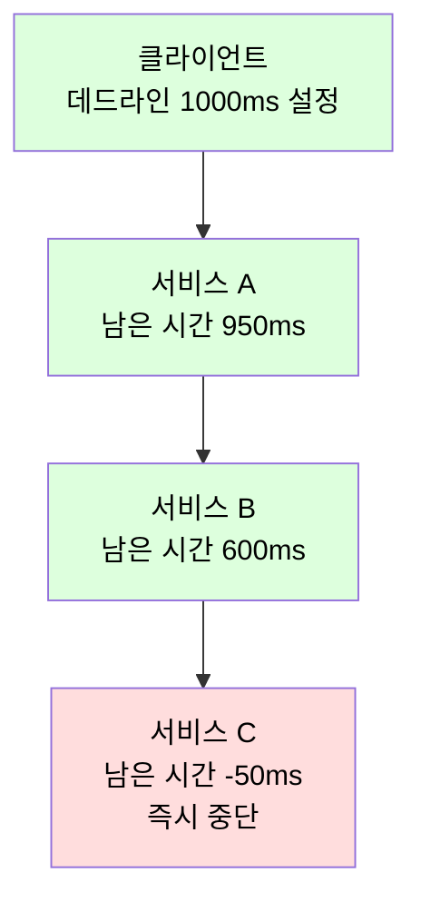
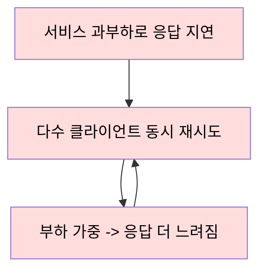
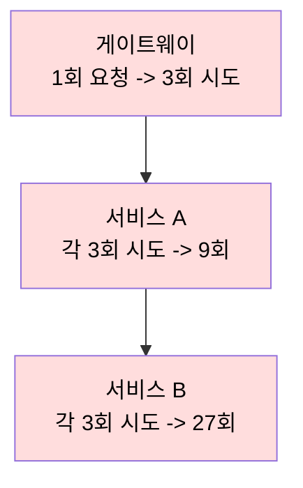

서킷 브레이커와 벌크헤드가 장애의 확산을 막는 구조적 방어라면, 타임아웃과 재시도는 개별 호출 단위에서 실패에 대응하는 방어 메커니즘이다.

## 타임아웃 (Timeout)

타임아웃은 응답 없는 호출을 무한정 기다리지 않도록 상한 시간을 설정하여 자원을 회수하는 장치다.

### 타임아웃의 종류

원격 호출은 여러 단계로 나뉘며, 각 단계마다 별도의 타임아웃을 설정해야 한다.

|         종류         |             대상              |         미설정 시 위험         |
|:------------------:|:---------------------------:|:------------------------:|
| Connection Timeout | 대상 서버와 TCP 연결을 맺기까지의 대기 시간  |  장애 서버로의 연결 시도가 무한정 대기   |
|    Read Timeout    | 연결 후 데이터(응답)를 수신하기까지의 대기 시간 | 응답이 느린 서버가 호출자 스레드를 고갈시킴 |
|  Request Timeout   |  단일 요청 전체(연결+처리+응답)의 상한 시간  | 단계별 타임아웃의 합보다 긴 총 지연 허용  |

특히 Read Timeout이 없거나 지나치게 길면, 대상 서비스의 지연이 그대로 호출자의 스레드 고갈로 이어져 전체 시스템 장애로 확산된다.

### 타임아웃 값 설정 기준

타임아웃은 짧으면 정상 요청을 실패 처리하고, 길면 자원 회수가 늦어지는 트레이드오프를 가진다.

- 대상 서비스의 응답 시간 분포(p99 등)를 기준으로, 정상 범위는 통과시키되 비정상 지연은 차단하는 값으로 설정
- 고정 추정값이 아니라 실측 지표를 기반으로 주기적으로 조정

### 데드라인 전파 (Deadline Propagation)

하나의 요청이 여러 서비스를 거치는 호출 체인에서는, 단계마다 고정 타임아웃을 두면 전체 소요 시간이 누적되어 의미를 잃는다.

- 최초 진입점에서 "이 요청은 N초 안에 끝나야 한다"는 데드라인(절대 시각)을 정하고, 하위 호출에 남은 시간을 함께 전달
- 이미 데드라인이 지난 요청은 하위 서비스가 처리하지 않고 즉시 중단하여 무의미한 작업을 제거
- gRPC의 deadline이 대표적인 구현으로, 클라이언트가 설정한 데드라인이 호출 체인을 따라 전파됨



## 재시도 (Retry)

재시도는 일시적 네트워크 오류나 순간 부하처럼 회복 가능한 실패에 한해 호출을 다시 시도하는 전략이다.

### 재시도 대상의 구분

실패의 성격에 따라 재시도 여부를 결정한다.

- 재시도 대상: 네트워크 타임아웃, 일시적 커넥션 실패, `503 Service Unavailable` 등 일시적 장애(Transient Faults)
- 재시도 제외: `4xx` 클라이언트 오류처럼 같은 요청을 반복해도 결과가 바뀌지 않는 영구적 실패
- 지속적 장애: 서비스 다운처럼 즉시 회복되지 않는 장애는 재시도 대신 서킷 브레이커로 대응

### 멱등성 전제

재시도는 동일 요청이 여러 번 처리되어도 안전한 멱등(Idempotent) 연산에만 적용해야 한다.

- 조회(`GET`)나 멱등하게 설계된 변경 연산은 중복 실행되어도 결과가 동일하여 안전
- 결제·주문 생성처럼 부수 효과가 있는 연산은, 요청 ID 기반 중복 제거 없이 재시도하면 이중 처리 발생
    - 요청마다 고유 키(Idempotency Key)를 부여하고 서버가 중복 요청을 식별하도록 설계

멱등성 키는 다음과 같이 구현할 수 있다.

- 서버는 수신한 키를 저장소(예: Redis)에 기록하고, 같은 키의 재요청이 오면 저장된 결과를 반환하거나 무시
- 키에 TTL을 두어 일정 기간 후 정리하되, TTL은 클라이언트의 최대 재시도 윈도우보다 길게 설정

## 재시도 폭풍 (Retry Storm)

이미 과부하 상태인 서비스에 다수의 클라이언트가 동시에 재시도하면, 추가 부하가 장애를 가속하는 재시도 폭풍(Retry Storm)이 발생한다.



### 재시도 증폭 (Retry Amplification)

호출이 여러 계층을 거치면, 각 계층이 독립적으로 재시도할 때 횟수가 곱으로 쌓여 최하위 서비스의 부하가 폭증한다.



- 3개 계층이 각각 3회씩 재시도하면, 한 번의 원 요청이 최하위 서비스에는 최대 27회(3×3×3) 호출로 증폭
- 이미 과부하인 서비스에 증폭된 호출이 쏟아져 회복을 더 어렵게 만듦

이 곱셈 효과를 막으려면 재시도 계층을 한정하는 방식으로 설계할 수 있다.

- 재시도는 가장 바깥 계층(또는 단일 지점)에서만 수행하고, 중간 계층은 실패를 그대로 전파
- 계층마다 재시도가 필요하면 계층별 횟수를 낮춰 전체 증폭 배수를 통제

## 재시도 제어 전략

잘못 설계한 재시도는 부하를 키우므로, 다음 전략으로 재시도 자체를 제어한다.

### 지수 백오프 (Exponential Backoff)

재시도 간격을 1초, 2초, 4초처럼 지수적으로 늘려 장애 서버에 가해지는 부하를 점진적으로 완화한다.

- 고정 간격 재시도보다 회복 시간을 벌어주어, 장애 서비스가 스스로 회복할 여지를 제공
- 무한정 늘어나지 않도록 최대 간격(Max Backoff)으로 상한을 둠

### 지터 (Jitter)

지수 백오프만으로는 동일 시점에 실패한 클라이언트들의 재시도 시각이 여전히 동기화되어, 일정 간격마다 부하가 몰리는 현상이 남는다.

지터는 백오프 간격에 무작위성을 더해 재시도 시점을 시간축에 고르게 분산시킨다.

|      전략      |                계산 방식                 |             특성             |
|:------------:|:------------------------------------:|:--------------------------:|
|  No Jitter   |             `base * 2^n`             |      동기화된 재시도 스파이크 발생      |
| Full Jitter  |       `random(0, base * 2^n)`        |  전체 구간에 균등 분산, 가장 넓게 흩어짐   |
| Equal Jitter | `base*2^n/2 + random(0, base*2^n/2)` |    최소 대기를 보장하며 절반만 무작위화    |
| Decorrelated |  `min(상한, random(base, 직전대기 * 3))`   | 직전 대기 기반으로 상한을 키워 자연스럽게 분산 |

AWS의 분석에 따르면 지터를 적용한 방식 모두 클라이언트 작업량과 서버 부하를 크게 줄이며, Full Jitter와 Decorrelated Jitter가 특히 효과적이다.

### 데드라인과의 연동

재시도는 호출 전체의 데드라인을 공유하므로 무한정 반복하지 않으며, 타임아웃과 맞물려 동작한다.

- 남은 데드라인이 다음 시도의 타임아웃보다 짧으면, 재시도하지 않고 즉시 실패 처리
- 백오프 대기까지 포함했을 때 데드라인을 넘길 시도는 건너뜀

### 서킷 브레이커와의 결합

타임아웃·재시도는 개별 호출 수준의 방어이고, 서킷 브레이커는 호출 대상 단위의 방어로 서로를 보완한다.

- 일시적 장애는 백오프·지터를 적용한 재시도로 흡수
- 재시도가 반복적으로 실패하면 서킷 브레이커가 열려 추가 호출 자체를 차단
- 무분별한 재시도가 장애 서비스의 부하를 가중시키는 것을 서킷 브레이커가 상위에서 차단

## Spring 기반 구현 (Resilience4j)

Resilience4j는 `@Retry` 어노테이션과 설정으로 재시도 정책을 선언적으로 적용한다.

```java

@Service
public class ExternalApiService {

    @Retry(name = "externalApiService", fallbackMethod = "fallback")
    public String callApi() {
        return new RestTemplate().getForObject("http://example.com/api", String.class);
    }

    // 모든 재시도가 소진되면 호출되는 Fallback
    private String fallback(Throwable t) {
        return "캐시된 데이터 또는 기본 응답";
    }
}
```

재시도 횟수, 백오프 간격, 지터, 재시도 대상 예외는 설정으로 제어한다.

```yaml
resilience4j:
  retry:
    instances:
      externalApiService:
        max-attempts: 3                  # 최초 호출 포함 최대 3회 시도
        wait-duration: 1s                # 기본 대기 시간
        enable-exponential-backoff: true # 지수 백오프 활성화
        exponential-backoff-multiplier: 2 # 1s → 2s → 4s
        enable-randomized-wait: true     # 지터 적용
        retry-exceptions: # 재시도 대상 예외
          - java.io.IOException
          - org.springframework.web.client.HttpServerErrorException
        ignore-exceptions: # 재시도 제외 예외
          - org.springframework.web.client.HttpClientErrorException
```

- `retry-exceptions`와 `ignore-exceptions`로 일시적 장애만 재시도하고 클라이언트 오류는 제외
- `enable-randomized-wait`로 지터를 적용하여 재시도 동기화 방지
