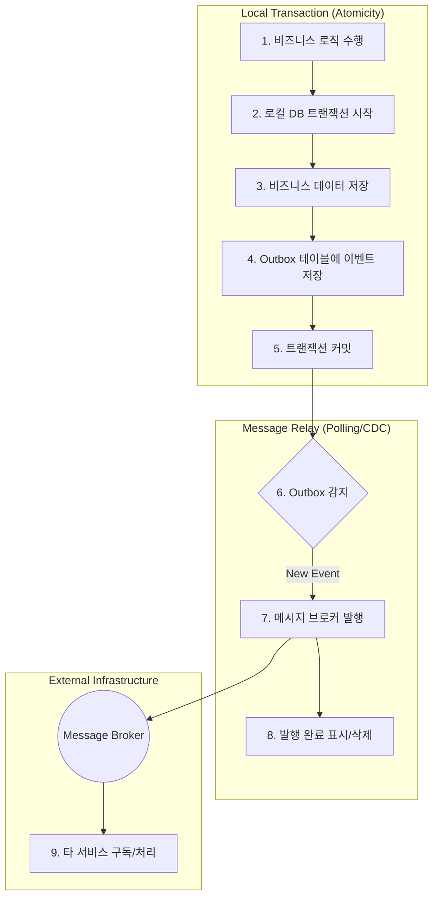

마이크로서비스 환경에서 데이터베이스의 상태 변경과 메시지 발행 일관성 문제를 해결하기 위해 트랜잭셔널 아웃박스 (Transactional Outbox) 패턴을 사용할 수 있다.

## DB 트랜잭션 + 이벤트 발행

두 작업을 하나의 트랜잭션으로 묶는 방법도 고려해볼 수 있지만, 메시지 브로커가 DB 트랜잭션의 생명주기에 참여할 수 없기 때문에 현실적으로 불가능하다.

```java

@Transactional
public void completeOrder(Long orderId) {
    // 1. 주문 상태를 '완료'로 변경
    orderRepository.updateStatus(orderId, "COMPLETED");

    // 2. 주문 완료 이벤트 발행
    kafkaProducer.send("order_completed", event);
}
// 모든 작업이 성공해야 COMMIT
```

위 코드에서, 만약 이벤트 발행 (`kafkaProducer.send`)은 성공했지만, 그 직후 어떠한 이유로든 DB `COMMIT`이 실패한다면 다음과 같은 상황이 발생한다.

- 메시지 큐: 이미 주문 완료 이벤트를 수신하여 다른 서비스에 전파
- 데이터베이스: `COMMIT` 실패로 주문 상태 변경은 롤백 (Rollback)

결과적으로, 메시지는 발행되었지만 데이터는 원복되는 심각한 데이터 불일치가 발생하게 된다.

## 트랜잭셔널 아웃박스 패턴

이러한 문제를 해결하기 위해 외부 시스템에 대한 호출을 '발행할 이벤트' (아웃 박스)라는 데이터로 변환하여, 비즈니스 데이터와 동일한 트랜잭션 내에서 저장하는 방법을 사용한다.

1. 원자적 저장
    - `UPDATE orders ...` 와 `INSERT INTO outbox ...` 를 하나의 로컬 트랜잭션에서 실행
    - 데이터베이스의 ACID 특성 덕분에, 두 작업은 반드시 함께 성공하거나 함께 실패
2. 안전한 발행
    - `outbox` 테이블에 저장된 이벤트를 별도의 프로세스가 읽어 외부 메시지 브로커로 전달

### 동작 흐름도



## 이벤트 발행 방식

`outbox` 테이블의 이벤트를 외부로 발행하는 방식은 크게 두 가지로 나뉜다.

| 구분      |                       폴링 발행자(Polling Publisher)                       |                        변경 데이터 캡처(Change Data Capture)                        |
|:----------|:--------------------------------------------------------------------------:|:-----------------------------------------------------------------------------------:|
| 동작 방식 | 워커 프로세스가 `outbox` 테이블을 주기적으로 조회(Polling)하여 이벤트 발행 | Debezium과 같은 CDC 도구가 데이터베이스의 트랜잭션 로그를 직접 감시하여 이벤트 발행 |
| 장점      |                비교적 단순한 구현, 외부 도구 의존성 최소화                 |              실시간에 가까운 이벤트 전파, 데이터베이스 조회 부하 없음               |
| 단점      |          폴링 주기에 따른 지연 발생, 데이터베이스 조회 부하 유발           |                 CDC 도구 도입 및 운영의 복잡성, 인프라 의존성 증가                  |
| 구현 주체 |                                애플리케이션                                |                                   인프라 / 플랫폼                                   |

### 규모별 아키텍처 전략

이벤트 발행 프로세스를 어떻게 구성할 것인가는 정확한 정답이 없으며, 시스템의 규모와 요구 사항에 따라 달라질 수 있다.

|   단계   |      핵심 기술       |        인프라 구조         |          격리 수준           |
|:--------:|:--------------------:|:--------------------------:|:----------------------------:|
|   초기   |    단순 스케줄러     | 단일 인스턴스(스레드 분리) |      낮음(리소스 공유)       |
|  안정기  | 트랜잭셔널 아웃박스  |    독립된 워커 인스턴스    | 중간(DB만 공유, 리소스 격리) |
| 고가용성 | 아웃박스 + 메시지 큐 | 완전 분산된 인스턴스 그룹  | 높음(완벽한 격리 및 확장성)  |

## 단점 및 한계 (오버엔지니어링 비판)

트랜잭셔널 아웃박스 패턴은 강력한 원자성을 보장하지만, 도입 시 다음과 같은 치명적인 단점과 유지보수 비용을 동반한다.

- 데이터베이스 부하 증가: 비즈니스 트랜잭션마다 `outbox` 테이블 `INSERT`가 동반되며, 워커가 주기적으로 폴링 (Polling)할 경우 지속적인 `SELECT` / `UPDATE` 쿼리 발생
- 스키마 관리 비용: 비즈니스 요구사항이 변하여 이벤트 포맷이 바뀌면, `outbox` 테이블의 구버전과 신버전 페이로드 간의 하위 호환성을 일일이 맞춰야 하는 마이그레이션 문제 발생
- 단일 장애 지점 (SPOF) 및 동시성 제어 복잡도: 이벤트를 퍼나르는 릴레이 워커가 죽으면 전체 파이프라인이 중단
- 발행 지연 (Latency): 비즈니스 로직 커밋 직후 브로커로 즉시 발송되는 것이 아니라, 워커가 읽어갈 때까지 미세한 지연 (Delay)이 발생

## 한계 극복 및 실무 대안

### 1. 패턴 자체를 고도화하는 방법

- CDC (Change Data Capture) 도입: 폴링 방식 대신, Debezium 같은 도구를 이용해 데이터베이스의 트랜잭션 로그 (MySQL Binlog 등)를 직접 읽어가는 방식
- 페이로드 없는 아웃박스 (Payload-less Outbox): `outbox` 테이블에 무거운 JSON 데이터 전체를 담지 않고, `{엔티티 ID, 이벤트 타입}` 처럼 식별자만 저장
    - 컨슈머 측에서 이 식별자를 받은 뒤 API로 최신 상태를 직접 조회 (Fetch)해가도록 하여 스키마 유지보수 비용을 낮춤

### 2. 아웃박스를 대체하는 아키텍처 전략

- 실패 건만 저장하는 PDL (Producer Dead Letter)
    - 평소엔 메시지 브로커로 이벤트를 바로 발행
    - 브로커 전송에 실패한 이벤트만 예외적으로 DB 에러 테이블 (PDL)에 저장하여 재처리하는 방식
- 동기 API 호출 + 새벽 배치 대사 (Reconciliation)
    - 복잡한 카프카나 아웃박스를 도입하지 않고 일반적인 REST API를 호출
    - 유실된 극소수의 데이터는 매일 새벽 대사 (Reconciliation) 배치를 돌려 양쪽 DB를 대조하고 누락분을 보정

## 그 외 고려사항

- 전달 보장 수준과 소비자 멱등성
    - 아웃박스 패턴은 동일한 이벤트가 두 번 이상 발행될 수 있는 `적어도 한 번 전달(At-least-once delivery)`을 보장
    - 따라서 이벤트를 수신하는 모든 소비자는 멱등성 (idempotency) 보장 필요
- 이벤트 순서 보장
    - 이벤트 발행 순서가 중요한 경우, `outbox` 테이블에 이벤트 생성 시간을 기록하고 워커가 이를 기준으로 순차적으로 발행하도록 구현
    - CDC 방식은 트랜잭션 로그 순서를 따르므로 이벤트 발생 순서를 자연스럽게 보장
- 이벤트 스키마 관리
    - `outbox` 테이블에 저장되는 이벤트 페이로드의 스키마 버전을 관리하는 전략 필요
    - 스키마가 변경될 때 하위 호환성을 보장하지 않으면, 이전 버전의 이벤트를 처리하지 못하는 문제 발생 가능
- 폴링 방식의 최적화
    - 폴링 발행자 방식 사용 시, `outbox` 테이블에 대한 `SELECT` 쿼리가 부하를 유발하지 않도록 처리 상태를 나타내는 컬럼에 적절한 인덱스를 생성
    - 단순히 삭제하는 대신 '발행 완료' 상태로 업데이트하면, 발행 이력을 추적하는 데 용이하지만 테이블 크기가 계속 커지는 단점 존재
