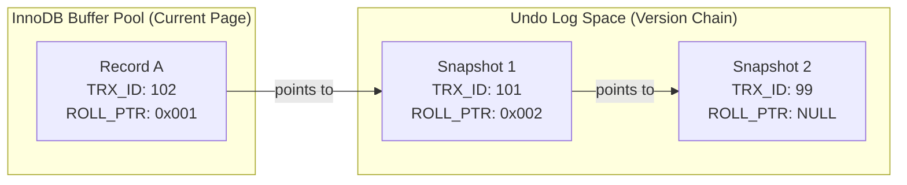

MySQL 서버는 논리적으로 MySQL 엔진과 스토리지 엔진으로 구성된다.

- MySQL 엔진: 클라이언트와의 접속, 쿼리 분석 및 최적화, 실행 등 MySQL 서버의 핵심 기능 담당
    - 구성 요소: 커넥션 핸들러, SQL 파서, 전처리기, 옵티마이저, 실행 엔진 등
    - 역할: 스토리지 엔진에게 데이터의 CRUD(Create, Read, Update, Delete)를 요청하는 명령을 전달
        - 모든 스토리지 엔진에 공통적으로 적용되는 기능을 구현(예: 스토어드 프로시저, 트리거, 뷰 등)
    - 하나의 MySQL 서버 인스턴스에는 하나의 MySQL 엔진만 존재

- 스토리지 엔진: 실제 데이터를 디스크에 저장하거나 디스크로부터 읽어오는 물리적인 작업 담당
    - MySQL 엔진이 전달한 명령에 따라 데이터 처리
    - 하나의 MySQL 서버에서 여러 스토리지 엔진을 동시에 사용
        - 테이블 단위로 다른 스토리지 엔진을 지정하는 것도 가능(InnoDB 기본 스토리지 엔진)

## 스레딩 구조

MySQL 서버는 프로세스 기반이 아닌 스레드 기반으로 동작하며, 포그라운드(Foreground) 스레드와 백그라운드(Background) 스레드로 구분된다.

- 포그라운드 스레드(클라이언트 스레드): 사용자가 요청하는 쿼리 문장을 처리하는 스레드
    - 클라이언트가 MySQL 서버에 접속하면 하나의 스레드가 할당되며, 이 스레드는 해당 커넥션의 모든 쿼리를 처리
    - 사용이 끝난 스레드는 스레드 캐시(Thread Cache)로 돌아가 다음 요청을 위해 대기
    - 여기서 이미 스레드 캐시에 일정 개수 이상의 대기 스레드가 있으면, 캐시에 넣지 않고 스레드를 종료 시켜 일정 개수의 스레드만 캐시에 유지
    - 캐시에 유지되는 최대 스레드 개수는 `thread_cache_size` 시스템 변수로 설정 가능
- 백그라운드 스레드: InnoDB 스토리지 엔진 레벨에서 동작하며, 사용자의 요청과 무관하게 내부적인 여러 작업을 처리하는 스레드
    - 로그 스레드 (Log Thread): 리두 로그(Redo Log)를 디스크의 로그 파일에 기록
    - 쓰기 스레드 (Write Thread): 버퍼 풀의 변경된 데이터(Dirty Page)를 디스크의 데이터 파일에 기록
    - 페이지 클리너 스레드 (Page Cleaner Thread): 쓰기 스레드의 작업을 분산하여 처리하며, 버퍼 풀의 더티 페이지 플러시(Flush) 수행
    - 마스터 스레드 (Master Thread): InnoDB의 주요 작업을 총괄하며 주기적으로 내부 작업을 조율하고 실행(예: 버퍼 풀 플러시, 언두 로그 정리 등)
    - 이 외에도 잠금 및 데드락 모니터링, 데이터 페이지 읽기 등의 작업을 수행하는 다수의 백그라운드 스레드 존재

## 메모리 구조

MySQL의 메모리 공간은 모든 스레드가 공유하는 글로벌 메모리 영역과 각 스레드(커넥션)별로 독립적으로 할당되는 로컬 메모리 영역으로 구분된다.

- 글로벌 메모리 영역: MySQL 서버 프로세스가 시작될 때 할당되며, 모든 스레드에서 접근 가능
    - InnoDB 버퍼 풀: 데이터와 인덱스 페이지를 캐싱하는 가장 중요한 메모리 공간(I/O 성능에 직접적인 영향을 줌)
    - InnoDB 어댑티브 해시 인덱스: 자주 사용되는 데이터 페이지에 대한 접근 경로를 해시 형태로 저장하여 B-Tree 탐색 비용을 줄이는 메모리 구조
    - InnoDB 리두 로그 버퍼: 리두 로그를 디스크에 기록하기 전 임시로 보관하는 버퍼
- 로컬 메모리 영역 (세션 메모리): 클라이언트 스레드가 쿼리를 처리하는 동안 개별적으로 사용하는 메모리 공간(커넥션이 유지되는 동안 할당)
    - 정렬 버퍼 (Sort Buffer): `ORDER BY`나 `GROUP BY` 같은 정렬 작업 시 사용되는 메모리
    - 조인 버퍼 (Join Buffer): 조인 시 인덱스를 사용하지 못할 경우, 드라이빙 테이블의 레코드를 임시로 저장하는 데 사용되는 메모리
    - 커넥션 버퍼, 읽기 버퍼 등 각 세션의 상태와 쿼리 처리를 위한 다양한 버퍼가 해당 영역에 해당

## 쿼리 실행 구조

클라이언트의 SQL 쿼리는 MySQL 내부에서 여러 단계를 거쳐 처리되고 결과가 반환된다.

1. 쿼리 파서
    - 사용자 요청으로 들어온 쿼리 문장을 토큰(MySQL 인식 최소 단위)을 분리해 트리 형태 구조로 만드는 작업
    - 쿼리 문장의 기본 문법을 검사하고, 문법에 맞지 않는 문장이면 에러를 반환
2. 전처리기
    - 파서 과정에서 만들어진 파서 트리를 기반으로 유효성 검증
    - 각 토큰을 테이블 이름이나 칼럼 이름 또는 내장 함수와 같은 개체를 매핑해 해당 객체 존재 여부 및 접근 권한 등 확인
3. 옵티마이저
    - 쿼리 문장을 저렴한 비용으로 처리할 수 있는 최적의 실행 계획을 생성
    - 통계 정보를 바탕으로 다양한 실행 계획(예: 인덱스 선택, 조인 순서)의 비용을 계산하고, 최적의 실행 계획을 선택
4. 쿼리 실행 엔진
    - 옵티마이저가 생성한 실행 계획에 따라 스토리지 엔진의 핸들러(Handler)를 호출하여 실제 작업을 요청
5. 스토리지 엔진(핸들러)
    - 실행 엔진의 요청에 따라 디스크에서 데이터를 읽거나, 데이터를 저장/수정/삭제하는 물리적인 작업을 수행

## InnoDB 스토리지 엔진 아키텍처

InnoDB는 MySQL에서 가장 많이 사용되는 스토리지 엔진으로, MySQL 스토리지 엔진 중 거의 유일하게 레코드 기반 잠금 제공하여 높은 동시성 처리가 가능하다.

### PK 기반 저장

- InnoDB는 모든 테이블을 프라이머리 키(PK) 순서대로 물리적으로 정렬하여 저장하는 클러스터링 인덱스(Clustering Index) 구조를 사용
- 실제론 PK 없이 테이블을 생성할 수 있지만, 내부적으론 아래의 규칙에 따라 PK로 사용할 컬럼을 결정
    1. 지정된 PK를 사용
    2. PK가 없다면 NOT NULL + 유니크 인덱스 중 첫 번째 컬럼을 PK로 사용
    3. 둘 다 해당하지 않는다면 AUTO_INCREMENT를 사용한 유니크 컬럼을 추가하여 PK로 사용(노출되지 않으며 쿼리에서 사용 불가능)

### PK에 의한 클러스터링

- 유사한 PK(Primary Key)끼리 물리적인 위치에 클러스터링하여 저장하여 PK 값의 순서대로 디스크에 저장하는 구조
- 장점
    - PK만으로 데이터 레코드를 찾아올 수 있어 다른 인덱스를 통한 조회보다 빠름
    - 연속 조회 시에도 디스크에 PK 값의 순서대로 저장되어 랜덤 IO가 아닌 순차 IO로 읽어오기 때문에 성능 향상
        - 실행 계획에서 다른 보조 인덱스보다 PK를 이용한 레인지 스캔을 우선적으로 사용
- 단점
    - 물리적인 위치를 순차적으로 유지해야 하기 때문에 레코드의 삽입/삭제 시 성능 저하
    - 모든 인덱스가 PK에 의존하여 PK 값이 큰 경우 인덱스의 크기가 커지게 되면서 페이지의 양도 많아짐

### 보조 인덱스의 구조와 데이터 접근

- 보조 인덱스(Secondary Index)의 리프 노드는 데이터 레코드의 물리적 주소 대신, 해당 레코드의 프라이머리 키(PK) 값을 저장하는 구조
- 리프노드에 저장된 PK 값으로 실제 레코드를 읽어오는 방식으로 동작
    1. 보조 인덱스에서 검색 조건에 맞는 리프 노드를 찾아 PK 값 조회
    2. 조회한 PK 값을 사용하여 클러스터링 인덱스를 다시 검색해 최종 데이터 레코드 조회
- 보조 인데이터 레코드의 물리적 위치가 변경되어도 덱스를 수정할 필요가 없다는 장점 존재
- PK의 크기가 크면 보조 인덱스의 크기도 커지는 단점 존재

### 외래키 지원

- 외래키를 이용한 무결성 제약 조건을 지원하여 데이터 무결성 보장
- `foreign_key_checks` 시스템 변수를 OFF 하여 제약 조건에 대한 검사를 생략할 수 있게 변경 가능

### 언두 로그(Undo log)

- DML 작업을 수행할 때마다 이전 버전의 데이터를 별도로 백업하는 기능
- 트랜잭션을 롤백해야할 때 이전 데이터를 복구하기 위해 사용
- 트랜잭션 격리 수준에 맞게 데이터를 읽어오기 위해 사용
- DML을 실행한 트랜잭션이 완료될 때 삭제되는 것이 아닌, 해당 레코드에 접근한 모든 트랜잭션이 완료될 때 삭제

### MVCC(Multi-Version Concurrency Control) 지원

- 하나의 레코드에 대해 여러 버전의 데이터를 동시에 관리하는 기능
- 특정 레코드가 변경될 때마다, 변경 전의 데이터는 언두 로그(Undo Log)라는 별도의 공간에 저장
- 이를 통해 각 트랜잭션은 자신의 격리 수준(Isolation Level)에 맞는 버전의 데이터를 조회
- `ROLLBACK` 시에는 언두 로그에 저장된 이전 버전의 데이터를 사용하여 복구

#### MVCC 동작 원리 - 시스템 컬럼과 언두 체인

InnoDB의 모든 레코드에는 사용자가 정의한 컬럼 외에 3개의 숨겨진 시스템 컬럼이 포함되어 MVCC를 실현한다.

1. DB_TRX_ID(6 bytes): 해당 레코드를 마지막으로 삽입하거나 업데이트한 트랜잭션의 식별자
2. DB_ROLL_PTR(7 bytes): 롤백 포인터라고 하며, 언두 로그에 저장된 해당 레코드의 이전 버전 데이터(Snapshot)를 가리키는 주소
3. DB_ROW_ID(6 bytes): 프라이머리 키가 없는 테이블에서 내부적으로 생성하는 행 식별자

- 언두 체인(Undo Chain): `DB_ROLL_PTR`을 따라가면 해당 레코드의 과거 이력을 순차적으로 탐색 가능
    - 옵티마이저는 트랜잭션의 시작 시점과 `DB_TRX_ID`를 비교하여, 어떤 버전의 데이터를 읽어야 할지 결정
- 가비지 컬렉션: 더 이상 어떤 활성 트랜잭션에서도 참조하지 않는 오래된 언두 로그는 `Purge 스레드`에 의해 비동기적으로 삭제

### 잠금 없는 일관된 읽기(Non-Locking Consistent Read) 지원

- 다른 트랜잭션이 가지고 있는 잠금을 기다리지 않고 읽기 작업을 수행할 수 있는 기능
- MVCC 기능을 사용해 이용하여 잠금된 레코드의 언두 로그를 읽어오는 방식으로 구현
- 락을 걸지 않는 순수한 SELECT 쿼리를 사용하여 읽기 작업을 수행할 때 사용

### 자동 데드락 감지

- InnoDB 스토리지 엔진의 데드락 감지 스레드가 주기적으로 데드락을 감지
- 일반적으로 데드락이 발생하면 교착 상태에 빠진 트랜잭션 중 언두 로그가 가장 작은 트랜잭션을 롤백(롤백 시 처리량이 가장 적기 때문)

### 리두 로그 (Redo Log)와 장애 복구

- 트랜잭션의 ACID 속성 중 영속성(Durability)을 보장하기 위한 메커니즘
- 모든 데이터 변경 내용은 디스크 데이터 파일에 기록되기 전에, 리두 로그라는 별도의 파일에 먼저 순차적으로 기록
- 서버 비정상 종료 시, InnoDB는 시작 과정에서 리두 로그의 내용을 바탕으로 데이터 파일에 미처 반영되지 못한 변경 사항을 재적용(Replay)하여 데이터의 일관성을 복구

### InnoDB 버퍼 풀

- InnoDB의 핵심 메모리 영역
- 디스크의 데이터 파일과 인덱스 정보를 페이지 단위로 메모리에 캐시하는 공간
- 데이터 읽기 시에는 디스크가 아닌 버퍼 풀에서 우선적으로 데이터를 찾아 I/O를 최소화
- 데이터 쓰기 시에는 디스크에 즉시 기록하지 않고 버퍼 풀의 페이지만 변경한 뒤(= Dirty Page), 백그라운드 스레드가 디스크에 점진적으로 기록(Flush)

### 체인지 버퍼(Change Buffer)

- 레코드가 INSERT / UPDATE 될 때 인덱스를 변경해야하는데, 이 때 디스크 I/O 작업이 생겨 성능 저하가 발생
- 이때 체인지 버퍼라는 공간에 변경 내용을 임시로 기록하여 디스크 I/O 작업을 지연시켜 성능 향상
- 변경해야 할 인덱스 페이지를 디스크에 기록하는 체인지 버퍼라는 임시 공간에 저장하여 지연시켜 성능 향상
- 체인지 버퍼에 저장된 변경 내용은 백그라운드 스레드에 의해 반영
- 유니크 인덱스는 즉시 중복 여부를 체크해야 하기 때문에 체인지 버퍼 사용이 불가능

### 어댑티브 해시 인덱스(Adaptive Hash Index)

- InnoDB가 자주 접근하는 데이터 페이지에 대해 내부적으로 생성하는 인메모리(in-memory) 해시 인덱스
- B-Tree를 루트부터 리프까지 탐색하는 대신, 해시 값을 통해 데이터 페이지에 즉시 접근할 수 있도록 하여 특정 쿼리의 검색 속도를 향상

## 그 외

- MySQL 8.0 이전에는 쿼리 캐시 기능이 존재했으나, 현재 8.0 버전에서는 동시성 저하로 인해 완전히 제거되고 사용하지 않음

###### 참고자료

- [Real MySQL 8.0 (1권)](https://kobic.net/book/bookInfo/view.do?isbn=9791158392703)