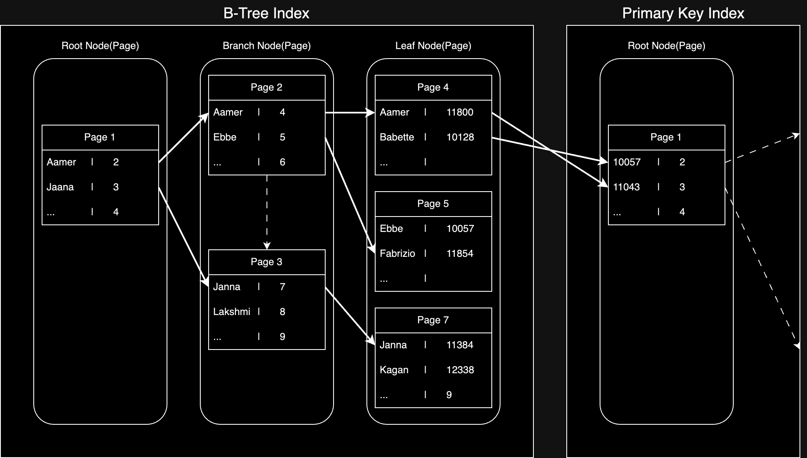

> B-Tree 인덱스는 데이터베이스의 인덱스를 구성하는 가장 기본적인 방법, Binary의 B가 아니라 Balanced의 B

## 구조 및 특성

최상위에 하나의 루트 노드가 존재하고, 그 하위에 자식 노드가 붙어 있는 형태로 아래의 노드로 구성된다.

- Root Node: 최상위 노드
- Branch Node: 중간에 있는 노드
- Leaf Node: 가장 하위에 있는 노드

### InnoDB의 리프 노드

InnoDB에서는 리프 노드에서 PK 값을 가지고 있어 실제 데이터 레코드를 찾기 위해서는 아래와 같은 과정을 거쳐야 한다.(MyISAM은 리프 노드에 실제 데이터 레코드를 가지고 있음)

1. 보조 인덱스에서 조건에 맞는 리프 노드를 찾아 PK 조회
2. PK를 통해 클러스터형 인덱스를 다시 검색해 최종 데이터 레코드 조회



결국 위와 같이 여러 뎁스를 거쳐 실제 데이터 레코드를 찾아야 하기 때문에, 바로 데이터 레코드를 찾을 때 보다 약 4-5배 정도 더 많은 비용이 발생한다.

## 레코드 추가/삭제/변경/검색 과정

인덱스가 적용된 테이블에 레코드를 저장하거나 변경하는 경우 인덱스 키 추가나 삭제 작업이 발생하는데, 각 작업은 아래와 같이 처리된다.

- 인덱스 키 추가
    - B-Tree에 저장될 때 저장될 키 값을 이용해 적절한 위치를 탐색 후 리프 노드에 저장
    - 만약 저장할 위치에 리프 노드가 꽉 차있다면 리프 노드를 분리하고 새로운 리프 노드를 생성
        - 이 때 상위 브랜치 노드까지 처리 범위가 넓어져 많은 비용이 발생
        - 이 때 발생하는 비용의 대부분이 메모리와 CPU에서 발생하는 것이 아닌, 디스크로부터 읽고/쓰기 작업에 많은 비용(시간)이 발생
    - InnoDB의 경우 인덱스 키 추가 작업을 지연시켜 나중에 처리하는 방식도 존재(=체인지 버퍼)
        - Primary Key, Unique Index 경우 중복체크가 필요하기 때문에 지연시킬 수 없음
- 인덱스 키 삭제
    - 해당 키 값이 저장된 B-Tree 리프 노드를 찾아 삭제 마크만 하면 작업 완료
        - 삭제 마킹된 인덱스 키 공간은 방치하거나 재활용 가능
    - 삭제 또한 디스크 쓰기가 필요하기 때문에 디스크 I/O 비용 발생
    - 추가와 마찬가지로 삭제 작업도 지연시킬 수 있음
- 인덱스 키 변경
    - B-Tree의 키 값이 변경되는 경우 리프 노드 위치의 변경 필요하기 때문에, 이 때 키 값을 삭제한 후 새로운 키 값을 추가하는 방식으로 처리
    - 위의 삭제 및 추가 과정이 절차적으로 진행(마찬가지로 지연 처리 가능)
- 인덱스 키 검색
    - 위의 비용들을 감수하고 인덱스를 사용하는 이유 중 하나(빠른 탐색)
    - 루트 노드로부터 시작해 브랜치 노드를 거쳐 최종 리프 노드까지 이동하면서 탐색(=트리 탐색)
    - SELECT(조회)에서만 사용되는 것이 아닌 UPDATE/DELETE에서도 조회 후 변경/삭제 작업을 수행하기 때문에 사용됨

## 페이지(Page)

페이지는 디스크에 데이터를 저장하는 기본 단위로, 디스크의 모든 읽기 및 쓰기 작업의 최소 작업 단위가 된다.

- InnoDB 스토리지 엔진의 버퍼 풀에서 데이터를 버퍼링하는 기본 단위
- 하나의 레코드를 읽더라도 결국엔 하나의 페이지 단위로 조회 필요

때문에 하나의 페이지에 많은 레코드가 저장되어 있을수록 디스크 I/O가 발생하는 횟수가 줄어들게 되고, 성능 향상에 도움이 된다.

## 인덱스 사용에 영향을 미치는 요소

인덱스를 구성하는 컬럼의 크기 / 레코드 건수 / 유니크 인덱스 키 값의 개수 등에 따라 변경/조회 성능이 달라질 수 있다.

### 1. 인덱스 키 값의 크기

인덱스는 페이지 단위로 관리되기 때문에, B-Tree의 각 노드에서 자식 노드를 가질 수 있는 개수는 인덱스 키 값의 크기에 따라 결정된다.

- 인덱스 페이지 크기: 16KB
- 인덱스 키: 16 Byte
- 자식노드 주소: 12 Byte
- 하나의 인덱스 페이지에 저장할 수 있는 최대 키 값의 개수: 16 * 1024 / (16 + 12) = 585

인덱스의 키가 커지게 되면, 그만큼 하나의 인덱스 페이지에 저장할 수 있는 키 값의 개수가 줄어들게 되면서, 디스크 I/O 횟수가 증가하고 그만큼 성능이 저하된다.

### 2. B-Tree 깊이

B-Tree 인덱스의 깊이는 성능이 중요한 요소 중 하나지만, 직접 제어할 수 있는 요소가 아니며, 인덱스 키 값의 크기에 따라 결정된다.

1. 인덱스 키 값의 평균 크기가 늘어나면 하나의 페이지에 저장할 수 있는 키 값의 개수 감소
2. 하나의 페이지에 저장할 수 있는 키 값의 개수가 줄어들어, 하나의 노드에 저장할 수 있는 자식 노드의 개수도 감소
3. 결국 B-Tree의 깊이 증가
4. 깊이가 깊어질 수록 디스크 I/O 횟수가 증가 -> 성능 저하

때문에 인덱스 키 값의 평균 크기를 줄이는 것은 깊이를 줄이는 것과 직결되고, 이는 디스크 I/O 횟수를 줄이게 되면서, 그만큼 성능 향상을 가져올 수 있다.

### 3. 읽어야 하는 레코드의 건수

인덱스를 통한 읽기는 많은 데이터를 읽어야 한다면 오히려 성능이 저하될 수 있다.

- 직접 레코드를 읽는 것보다 높은 비용(4-5배)이 발생
- 전체 레코드의 20-25%를 넘어가는 경우 인덱스를 사용하지 않는 것이 더 효율적

### 4. 선택도(기수성)

선택도(Selectivity) / 기수성(Cardinality)는 거의 같은 의미로 사용되며, 모든 인덱스 키 값 가운데 유니크한 값의 수를 의미한다.

- 전체 인덱스 키 값: 100개
- 유니크한 값: 10개
- 기수성: 10

중복된 값이 많아지면 기수성이 낮아지게 되고, 기수성이 낮아지면 인덱스를 통해 데이터를 읽어야 할 레코드의 건수가 늘어나게 된다.

#### 예시

```sql
-- 전체 레코드 수: 1,000,000개
-- `country` 컬럼은 10개의 유니크한 값만 가짐 (기수성 낮음)
-- `city` 컬럼은 100,000개의 유니크한 값 가짐 (기수성 높음)
CREATE TABLE tb_test
(
    country VARCHAR(10),
    city    VARCHAR(50),
    INDEX idx_country (country), -- 기수성 낮음
    INDEX idx_city (city)        -- 기수성 높음
);

-- Case A: 기수성이 낮은 컬럼(country)만 인덱스가 걸려 있을 때
SELECT *
FROM tb_test
WHERE country = 'Korea'
  AND city = 'Seoul';

-- 전체 레코드: 1,000,000개
-- country 유니크 값 개수: 10개 (기수성 낮음)
-- 평균적으로 하나의 country 값(Korea)에 대해 포함된 레코드 수: 1,000,000 / 10 = 100,000개
-- country 인덱스를 사용하더라도 평균 99,999개의 불필요한 데이터를 읽어야 함

-- Case B: 기수성이 높은 컬럼(city)에 인덱스를 적용하여 검색
SELECT *
FROM tb_test
WHERE city = 'Seoul';

-- 전체 레코드: 1,000,000개
-- city 유니크 값 개수: 100,000개 (기수성 높음)
-- 평균적으로 하나의 city 값(Seoul)에 대해 포함된 레코드 수: 1,000,000 / 100,000 = 10개
-- city 인덱스를 사용하면 평균적으로 9개의 불필요한 데이터를 읽어야 함
```

- 인덱스된 컬럼(country)에 대해서는 전체 레코드의 건수나 유니크한 값의 개수 등에 대한 통계 정보를 가짐
- 전체 레코드 건수를 유니크 값 개수로 나누게되면 하나의 키 값으로 검색했을 때 평균적으로 읽어야 하는 레코드 건수를 알 수 있음

기수성이 낮아지면 인덱스를 통해 읽어야 할 레코드의 건수가 늘어나게 되면서, 그만큼 페이지를 읽어야 하는 횟수가 늘어나게 되고, 그만큼 성능이 저하된다.

## B-Tree 인덱스를 통한 데이터 읽기

### 1. 인덱스 레인지 스캔

인덱스 접근 방법 가운데 가장 대표적인 방법으로, 시작해야 할 위치를 찾고 그 위치부터 끝까지 순차적으로 읽어서 검색 조건을 만족하는 레코드를 찾는 방법이다.

```sql
SELECT *
FROM employee
WHERE first_name BETWEEN 'Ebbe' AND 'Gad';
```

1. 인덱스 탐색: 리프 노드까지 들어가 조건을 만족하는 값인 스캔 시작 지점 탐색
2. 인덱스 스캔: 위에서 탐색된 위치부터 필요한 만큼 인덱스를 차례대로 스캔
3. 테이블 데이터 접근: 읽어들인 인덱스 키와 PK를 이용해 일치한 실제 데이터 레코드 조회(랜덤 I/O 발생)

#### 커버링 인덱스

쿼리를 충족시키는데 필요한 모든 데이터를 인덱스에서만 읽어올 수 있는 인덱스를 커버링 인덱스라고 한다.

- 인덱스 스캔만으로 원하는 데이터 조회 가능
- 3번에 해당하는 레코드를 읽어오는 작업을 생략하여 랜덤 I/O가 발생하지 않음

```sql
-- first_name 컬럼에 인덱스가 존재하는 경우
SELECT first_name
FROM employee
WHERE first_name BETWEEN 'Ebbe' AND 'Gad';
```

### 2. 인덱스 풀 스캔

인덱스의 처음부터 끝까지 모두 읽는 방식으로, 보통 조건절에 사용된 컬럼이 인덱스의 첫 번째 컬럼이 아닌 두 번째 이후의 컬럼인 경우에 사용된다.

- 인덱스에 명시된 컬럼만으로 조건을 처리할 수 있는 경우(커버링 인덱스 조건) 사용
- 보통 인덱스의 크기는 실제 레코드가 담긴 테이블의 크기보다 작으므로 직접 테이블을 처음부터 끝까지 읽는 테이블 풀 스캔보다 효율적

### 3. 루스 인덱스 스캔

중간에 필요치 않는 인덱스 키 값은 무시(SKIP)하고 읽는 방식으로, 일반적으로 GROUP BY 또는 MAX(), MIN() 같은 집합 함수에 대해 최적화 하는 경우에 사용한다.

```sql
CREATE INDEX idx_deptno_empno ON dept_emp (dept_no, emp_no);

SELECT dept_no, MIN(emp_no)
FROM dept_emp
WHERE dep_no BETWEEN 'd002' AND 'd004'
GROUP BY dept_no;
```

인덱스가 (dept_no, emp_no) 조합으로 이미 정렬되어있기 때문에 depth_no 그룹 별로 첫 번째 레코드(가장 작은 emp_no)만 읽어오면 된다.

| 리프 노드 페이지 | dept_no | emp_no | dept_name | first_name | 스캔 여부 |
|:---------:|:-------:|:------:|:---------:|:----------:|:-----:|
|     5     |  d002   | 10042  |  Finance  |    Magy    |   O   |
|     5     |  d002   | 10043  |  Finance  |  Yinghua   |   X   |
|     5     |  d002   | 10044  |  Finance  |    Eber    |   X   |
|    ...    |   ...   |  ...   |    ...    |    ...     |   X   |
|    ...    |   ...   |  ...   |    ...    |    ...     |   X   |
|     6     |  d003   | 10045  |   Human   |  Kyoichi   |   O   |
|     6     |  d003   | 10046  |   Human   | Eberhardt  |   X   |
|     6     |  d003   | 10047  |   Human   | Admanatios |   X   |
|    ...    |   ...   |  ...   |    ...    |    ...     |   X   |
|    ...    |   ...   |  ...   |    ...    |    ...     |   X   |
|     7     |  d004   | 10048  |   Legal   |   Seong    |   O   |
|     7     |  d004   | 10049  |   Legal   |    Ziya    |   X   |
|     7     |  d004   | 10050  |   Legal   |    Eber    |   X   |
|    ...    |   ...   |  ...   |    ...    |    ...     |  ...  |

즉 인덱스에서 WHERE 조건에 만족하는 범위 전체를 스캔할 필요가 없는 것을 옵티마이저가 판단하고 중간의 레코드는 무시하고 필요한 레코드만 읽어오는 방식이다.

### 인덱스 스킵 스캔

다중 컬럼 인덱스 `(col_a, col_b)`에서 `col_a` 조건 없이 `col_b`만으로도 인덱스를 활용할 수 있게 해주는 기능이다.

```sql
-- 인덱스 생성
ALTER TABLE employees
    ADD INDEX ix_gender_birthdate (gender, birth_date);
-- 인덱스 스킵 스캔 기능 비활성화
SET optimizer_switch = 'skip_scan=off';

EXPLAIN
SELECT gender, birth_date
FROM exployees
WHERE birth_date = > '1965-05-09';
+----+-----------+-------+-------------+----------------------------+
| id | table     | type  | key         | Extra                      |
+----+-----------+-------|-------------+----------------------------+
|  1 | employees | index | ix_g_b      | Using where, Using index   |
+----+-----------+-------+-------------+----------------------------+
-- 풀 인덱스 스캔으로 처리
    
-- 인덱스 스킵 스캔 기능 활성화
SET optimizer_switch = 'skip_scan=on';

EXPLAIN
SELECT gender, birth_date
FROM exployees
WHERE birth_date = > '1965-05-09';
+----+-----------+-------+-------------+------------------------------------------+
| id | table     | type  | key         | Extra                                    |
+----+-----------+-------|-------------+------------------------------------------+
|  1 | employees | range | ix_g_b      | Using where, Using index for skip scan   |
+----+-----------+-------+-------------+------------------------------------------+
-- 레인지 스캔으로 처리
-- Using index for skip scan 문구는 인덱스 스킵 스캔을 사용했다는 것을 의미
```

| 리프 노드 페이지 | gender | birth_date | 스캔 여부 |
|:---------:|:------:|:----------:|:-----:|
|     5     |   M    | 1965-03-09 |   X   |
|     5     |   M    | 1965-05-09 |   O   |
|     5     |   M    | 1965-06-09 |   O   |
|    ...    |  ...   |    ...     |   O   |
|     6     |   M    | 1965-12-09 |   O   |
|     6     |   F    | 1965-01-09 |   X   |
|     6     |   F    | 1965-02-09 |   X   |
|    ...    |  ...   |    ...     |   X   |
|     7     |   F    | 1965-04-09 |   X   |
|     7     |   F    | 1965-05-09 |   O   |
|     7     |   F    | 1965-06-09 |   O   |
|    ...    |  ...   |    ...     |   O   |

1. gender 컬럼이 가진 유니크 값을 구함(컬럼의 타입은 상관 없음)
2. 각 유니크 값에 대해 조건을 추가한 쿼리를 실행
3. 각 쿼리를 레인지 스캔으로 처리
4. 각 쿼리의 결과를 합쳐서 최종 결과를 반환

결국 gender 컬럼에서 유니크한 값을 모두 조회하여 주어진 쿼리에 gender 컬럼의 조건을 추가해서 쿼리를 실행하는 것과 같은 형태의 최적화를 실행하는 것이다.

```sql
-- gender 컬럼에 대해 가능한 값 2개('M', 'F')를 구한 뒤 아래 쿼리를 실행하는 것과 비슷한 형태의 최적화를 실행
SELECT gender, birth_date
FROM employees
WHERE gender = 'M'
  AND birth_date > '1965-05-09';
SELECT gender, birth_date
FROM employees
WHERE gender = 'F'
  AND birth_date > '1965-05-09';
```

하지만 아래 두 가지 단점이 존재하기 때문에 항상 빠른 성능을 보장하는 것은 아니다.

- WHERE 조건절에 조건이 없는 인덱스의 선행 컬럼의 유니크한 값의 개수가 많을수록 성능이 저하
- 쿼리가 인덱스에 존재하는 컬럼만 존재(= 커버링 인덱스)
    - 인덱스 외의 컬럼을 필요로 하는 경우 풀 테이블 스캔으로 처리

## 다중 컬럼(Multi-column) 인덱스

첫 번째 컬럼을 기준으로 정렬된 후, 그 안에서 두 번째 컬럼을 기준으로 정렬되는 방식으로 구성된다.

- 인덱스를 구성하는 컬럼의 순서가 중요
- 첫 번째 컬럼에 대한 조건이 없으면 인덱스 사용 불가능(인덱스 스킵 스캔 기능 제외)
- 첫 번째 컬럼에 대한 조건이 있으면 그 다음 컬럼에 대한 조건이 없어도 인덱스를 사용 가능

## B-Tree 인덱스의 정렬 및 스캔 방향

인덱스를 생성하면 설정한 정렬 규칙에 따라 항상 오름차순/내림차순 중 하나로 정렬되어 저장된다.

```sql
# 인덱스를 생성한는 시점에 인덱스를 구성하는 각 컬럼의 정렬을 혼합하여 지정할 수 있다.(MySQL 8.0 이상)
CREATE INDEX ix_teamname_userscore ON employees (team_name ASC, user_score DESC);
```

- 생성된 인덱스와는 별개로 스캔 할 때는 생성된 인덱스의 정렬 규칙과는 상관없이 원하는 방향으로 스캔 가능(방향은 옵티마이저가 실시간으로 만들어낸 실행 계획에 따라 결정)  
- 기본적으로 페이지 잠금이 인덱스 정순 스캔(Forward index scan)에 더 적합한 구조기 때문에 정방향 스캔을 더 빠르게 처리

## B-Tree 인덱스의 가용성과 효율성

### 비교 조건 종류

다중 컬럼 인덱스에서 각 컬럼의 순서와 비교 조건에 따라 인덱스의 가용성과 효율성이 달라진다.

```sql
SELECT *
FROM dept_emp
WHERE dept_no = 'd002'
  AND emp_no >= 10114;
```

#### 케이스 A: INDEX(dept_no, emp_no)

`dept_no='d002' AND emp_no>=10114`인 레코드를 찾고 dept_no가 'd002'가 아닐 때 까지 스캔

| 페이지 번호 | dept_no | emp_no | 스캔 여부 |
|:------:|:-------:|:------:|:-----:|
|  ...   |   ...   |  ...   |   X   |
|   6    |  d002   | 10114  |   O   |
|   6    |  d002   | 10117  |   O   |
|   6    |  d002   | 10300  |   O   |
|  ...   |   ...   |  ...   |   O   |
|   7    |  d002   | 10595  |   O   |
|   7    |  d003   | 10111  |   X   |
|  ...   |   ...   |  ...   |   X   |

#### 케이스 B: INDEX(emp_no, dept_no)

`dept_no='d002' AND emp_no>=10114`인 레코드를 찾고 그 후 모든 레코드에 대해 dept_no가 'd002'인지 확인

| 페이지 번호 | emp_no | dept_no | 스캔 여부 |
|:------:|:------:|:-------:|:-----:|
|  ...   |  ...   |   ...   |  ...  |
|   6    | 10111  |  d003   |   X   |
|   6    | 10114  |  d002   |   O   |
|   6    | 10117  |  d002   |   O   |
|   6    | 10300  |  d002   |   O   |
|  ...   |  ...   |   ...   |   O   |
|   7    | 10595  |  d002   |   O   |
|  ...   |  ...   |  d001   |   O   |

### 인덱스 사용 불가 조건

B-Tree 인덱스는 아래와 같은 비교 조건에 대해서는 인덱스를 사용할 수 없다.

- NOT-EQUAL로 비교된 경우
    - `WHERE column <> 'N'`
    - `WHERE column NOT IN ('N', 'M')`
    - `WHERE column IS NOT NULL`
- LIKE '%??'(뒷 부분 일치)로 비교된 경우
    - `WHERE column LIKE '%mer'`
    - `WHERE column LIKE '_mer'`
    - `WHERE column LIKE '%mer%'`
- 스토어드 함수나 다른 연산자로 인덱스 컬럼이 변형된 후 비교된 경우
    - `WHERE SUBSTRING(column, 1, 1) = 'X'`
    - `WHERE DAYOFMONTH(column) = 1`
- NOT-DETERMINISTIC 속성의 스토어드 함수가 비교 조건에 사용된 경우
    - `WHERE column = deterministic_function()`
- 데이터 타입이 서로 다른 비교
    - `WHERE char_column = 10`
- 문자열 데이터 타입의 콜레이션이 다른 경우
    - `WHERE utf8_bin_char_column = euckr_bin_char_column`

###### 참고자료

- [Real MySQL 8.0 (1권)](https://kobic.net/book/bookInfo/view.do?isbn=9791158392703)
