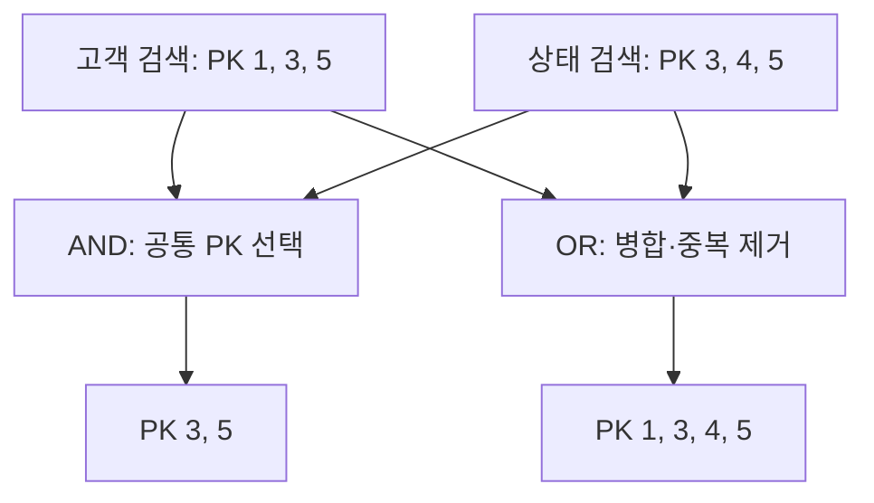
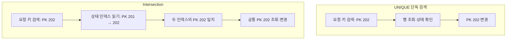
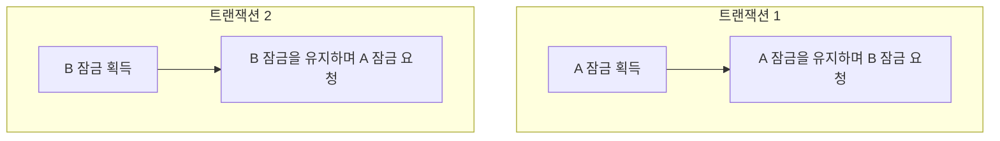

Index Merge는 같은 테이블의 여러 인덱스 검색 결과를 행 식별자 기준으로 병합하는 접근 방식이다.

- 옵티마이저는 단일 인덱스 검색·Index Merge·테이블 스캔 등의 예상 비용을 비교
- 병합에는 각 인덱스의 스캔과 결과 대조 비용도 들므로, 인덱스를 여러 개 사용한다고 항상 빠른 것은 아님
- UNIQUE 인덱스로 최대 한 행을 지정하는 UPDATE에서도 병합이 선택될 수 있음

## 병합 원리와 알고리즘

InnoDB 보조 인덱스에는 프라이머리 키 (PK)가 포함되어 있다. 각 인덱스는 자신에게 해당하는 WHERE 조건으로 검색하고, 읽은 PK를 병합에 사용한다.

예를 들어 Intersection은 한 인덱스에서 PK를 읽고, 다른 인덱스에서도 PK를 읽어 비교한다. 값이 다르면 작은 쪽에서 다음 PK를 읽고 다시 비교한다.



- 병합 후 필요한 컬럼을 인덱스에서 얻지 못하면 PK로 클러스터형 인덱스의 전체 행을 읽음
- Intersection에서 사용한 인덱스들이 필요한 컬럼을 모두 제공하면 커버링 처리가 가능
- 병합은 같은 테이블 안의 검색 결과를 대조하는 작업이며, 테이블 간 조인이나 복합 인덱스 생성과는 다른 처리 방식

|   알고리즘   |     대표 조건     |               처리                |     EXPLAIN의 Extra     |
|:------------:|:-----------------:|:---------------------------------:|:-----------------------:|
| Intersection | `a = 1 AND b = 2` |        공통 행 식별자 선택        | `Using intersect(...)`  |
|    Union     | `a = 1 OR b = 2`  |         합집합·중복 제거          |   `Using union(...)`    |
|  Sort-Union  | `a < 10 OR b = 2` | 행 식별자를 모아 정렬한 뒤 합집합 | `Using sort_union(...)` |

표의 조건은 후보 예시로, AND·OR 조건에 해당한다고 반드시 병합되는 것은 아니다.

### Intersection의 PK 순서

Intersection의 대표 적용 조건은 서로 다른 인덱스의 모든 키 파트에 대한 동등 조건과 InnoDB PK 범위 조건이다.
인덱스 A에서 `1 → 3 → 5`, 인덱스 B에서 `3 → 4 → 5` 순서로 PK를 읽는 경우를 예로 든다.

1. 인덱스 A에서 첫 PK인 1을 읽음
2. 인덱스 B에서 첫 PK인 3을 읽고, 앞서 읽은 A의 PK 1과 비교
3. A의 PK가 작으므로 A에서 다음 PK인 3을 읽음. B의 PK와 일치하므로 공통 행으로 선택
4. 이후 A에서 5, B에서 4를 읽음. 이번에는 B에서 다음 PK인 5를 읽으면 일치하므로 공통 행으로 선택

각 인덱스의 PK를 오름차순으로 읽으며 비교한다. PK 순서가 유지되지 않으면 이미 비교한 범위의 공통 행을 누락할 수 있다.

### Union

Union은 OR 조건으로 검색한 결과를 합친다. 어느 한 조건에 해당하면 결과에 포함하고, 두 조건에 모두 해당하는 행은 한 번만 포함한다.
각 인덱스의 PK를 오름차순으로 읽으며 작은 값부터 선택한다.

1. 첫 번째 인덱스에서 PK 1, 두 번째 인덱스에서 PK 3을 읽고 비교하여 작은 값인 1을 결과에 포함
2. 첫 번째 스캔에서 다음 PK인 3을 읽고, 두 값이 같으므로 3을 한 번만 포함하고 양쪽에서 다음 PK를 읽음
3. 같은 방식으로 4와 5를 포함하면 최종 결과는 `1 → 3 → 4 → 5`

Intersection은 양쪽에 있는 PK만 선택하고, Union은 어느 한쪽에 있는 PK도 선택한다.

### Sort-Union

Sort-Union도 OR 조건의 검색 결과를 합치지만, 각 검색 결과가 PK 오름차순이 아닐 때 사용한다. 조건에 맞는 PK를 모두 읽어 정렬한 뒤 같은 PK를 하나로 합친다.

1. 두 인덱스에서 PK를 각각 `5 → 1 → 3`, `3 → 4 → 5` 순서로 읽음
2. 읽은 PK를 정렬하면 `1 → 3 → 3 → 4 → 5 → 5`
3. 중복된 PK를 제거하면 최종 결과는 `1 → 3 → 4 → 5`

## UNIQUE 인덱스가 있어도 병합하는 경우

UNIQUE 인덱스로 최대 한 행을 찾을 수 있어도, 다른 조건의 인덱스와 함께 Index Merge를 사용할 수 있다.

```sql
# `request_key`에 UNIQUE 인덱스가 있고 `status`에 별도 인덱스가 있다고 가정
UPDATE processing_requests
SET status = 'COMPLETED'
WHERE request_key = 'request-1001'
  AND status = 'IN_PROGRESS';
```

UNIQUE 인덱스만 사용하면 다음 순서로 처리하게 된다.

1. 요청 키 인덱스에서 PK를 찾음
2. PK로 전체 행을 읽고 상태를 확인
3. 상태가 `IN_PROGRESS`이면 변경

다만 옵티마이저가 두 조건을 함께 검색하는 비용을 더 낮게 계산하면 Intersection을 선택할 수 있다.
예를 들어 처리 중인 행이 적으면, 상태 조건까지 적용한 후 전체 행을 조회할 건수도 적게 추정하고, 이런 추정이 실제보다 낮으면 UNIQUE 단독 검색보다 병합이 저렴하게 평가될 수 있다.

Intersection에서는 요청 키 인덱스로 PK를 찾은 뒤에도 상태 인덱스를 읽어 PK를 비교한다.



### 각 인덱스의 잠금과 데드락

UPDATE·DELETE에서는 인덱스 레코드를 읽을 때 잠금을 얻을 수 있다. 따라서 위처럼 여러 인덱스를 읽는 과정에서, 먼저 읽은 인덱스의 잠금을 가진 채 다음 인덱스의 잠금을 요청할 수 있다.
두 트랜잭션이 같은 레코드의 잠금을 반대 순서로 얻으려 하면 데드락이 발생할 수 있다.



트랜잭션 1은 B의 잠금이 풀리기를 기다리고, 트랜잭션 2는 A의 잠금이 풀리기를 기다린다. 이미 얻은 잠금을 유지한 채 서로 기다리므로 데드락이 된다.
