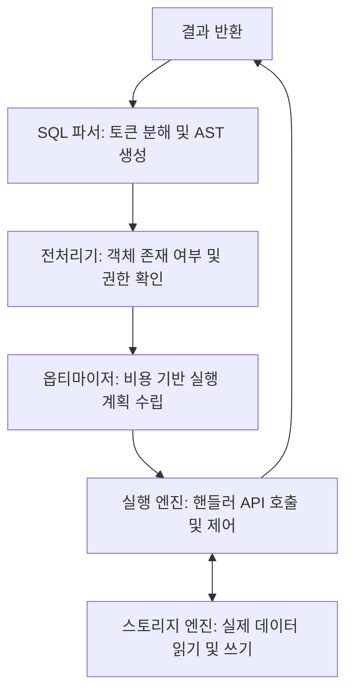

MySQL이 하나의 SQL 쿼리를 받아 결과를 반환하기까지, 내부는 MySQL 서버(Server)와 스토리지 엔진(Storage Engine) 두 컴포넌트가 핸들러 API를 통해 협력하여 처리한다.

### MySQL 서버 (MySQL Server)

|      기능       |             설명             |
|:-------------:|:--------------------------:|
|    SQL 파싱     |       구문 분석 및 토큰화 수행       |
|  권한 및 스키마 확인  |  데이터 접근 권한 및 객체 존재 여부 검증   |
|    쿼리 재작성     | 논리적으로 동일하지만 더 효율적인 쿼리로 변환  |
|   비용 기반 최적화   |  통계 정보를 활용한 최적의 실행 계획 수립   |
| 실행 계획 수립 및 제어 |   수립된 플랜에 따라 전체 실행 흐름 관리   |
|    정렬 및 집계    |  스토리지 엔진에서 받은 데이터 가공 및 계산  |
|   임시 테이블 관리   | 필요 시 메모리 또는 디스크에 임시 테이블 생성 |
|  바이너리 로그 관리   |    데이터 변경 내역 기록 및 복제 지원    |

### 스토리지 엔진 (Storage Engine)

|     기능      |              설명              |
|:-----------:|:----------------------------:|
|   페이지 접근    | 실제 데이터 및 인덱스 페이지의 디스크 I/O 관리 |
|   인덱스 탐색    |    B+Tree 구조를 활용한 데이터 검색     |
| 레코드 읽기 및 쓰기 |        실제 행 단위 데이터 처리        |
|   MVCC 제어   |     동시성 확보를 위한 다중 버전 관리      |
|    잠금 관리    |     레코드 및 인덱스 수준의 잠금 제어      |
|    로그 관리    |  리두 및 언두 로그를 통한 복구 및 정합성 보장  |
|  크래시 리커버리   |     시스템 장애 시 데이터 일관성 복구      |
|   핸들러 API   |   서버와 스토리지 엔진 간의 통신 인터페이스    |

## 쿼리 처리 방식의 종류

MySQL은 클라이언트와 통신하고 쿼리를 처리하는 방식에 따라 두 가지 프로토콜을 사용한다.

### 1. 일반 쿼리 (Text Protocol)

우리가 흔히 사용하는 방식(`COM_QUERY`)이다.

- 모든 SQL 문장과 데이터를 문자열 형태로 전송
- 매번 요청 시마다 파싱, 전처리, 최적화 단계를 새롭게 거침

### 2. Prepared Statement (Binary Protocol 활용)

보안과 성능을 위해 도입된 방식(`COM_STMT_PREPARE`, `COM_STMT_EXECUTE`)으로, 쿼리의 구조와 데이터를 분리하여 처리한다.

- 2단계 처리 (2-Step Process)
    1. PREPARE: SQL 템플릿(파라미터 `?` 포함)을 서버에 전송
        - 서버는 이 시점에 파싱과 구조적 검증(권한·객체 확인 등)을 수행하여 Statement ID 발급
    2. EXECUTE: 클라이언트는 Statement ID와 실제 값(파라미터)만 전송
        - 서버는 바인딩된 파라미터 값을 기준으로 비용 기반 최적화를 수행하여 실행 계획을 수립하고 실행
- 바이너리 프로토콜: 데이터 전송 시 문자열 변환 없이 타입별 바이너리 형식 사용
    - 숫자·날짜·부울 등 고정 길이 타입에서 패킷 크기 감소 및 문자열 ↔ 값 변환 오버헤드 최소화 (VARCHAR·TEXT 등 가변 문자열은 텍스트 프로토콜과 크기 차이 거의 없음)

#### SQL Injection 방어 원리 (DB 관점)

Prepared Statement가 보안에 강력한 이유는 데이터와 명령어를 물리적으로 분리하기 때문이다.

1. 문법 해석의 선행: `PREPARE` 단계에서 이미 SQL의 문법 구조(AST)가 생성되고 고정
    - 이후 `EXECUTE` 시점에 어떤 값이 들어와도 이미 확정된 쿼리의 구조(Structure) 변경 불가능
2. 리터럴 강제 바인딩: 바인딩되는 파라미터는 서버 내부적으로 항상 단순 리터럴(Literal) 취급되어, 값에 포함된 SQL 키워드·메타문자가 문법으로 재해석되지 않음

#### Prepared Statement 직접 사용

MySQL은 SQL 구문으로 Prepared Statement를 직접 제어할 수 있다.

```sql
PREPARE stmt FROM 'SELECT * FROM users WHERE id = ?';
SET @id = 42;
EXECUTE stmt USING @id;
DEALLOCATE PREPARE stmt;
```

- 세션 스코프: `PREPARE`된 statement는 해당 세션 내에서만 유효하며, `DEALLOCATE` 또는 세션 종료 시 소멸
- 전역 제한: `max_prepared_stmt_count` 시스템 변수(기본값 16,382)가 서버 전체 등록 개수를 제한하며, 초과 시 새 `PREPARE`는 거부

## 쿼리 생명주기 (Query Lifecycle)

MySQL이 하나의 SQL을 처리하는 과정은 크게 4단계로 나뉜다.



- 일반 쿼리: 요청 시마다 모든 단계를 순차적으로 수행
- Prepared Statement:
    - PREPARE: `1단계(파싱·전처리)`까지 수행하여 AST를 캐싱
    - EXECUTE: 전달받은 실제 값을 바인딩하고, 데이터 분포에 따른 최종 실행 계획(인덱스 선택 등)을 수립하여 `3단계(실행)` 수행

### 1단계: 접속 / 파싱 / 전처리

클라이언트의 요청을 받아 쿼리를 이해하는 초기 단계

1. 커넥션 및 인증: 클라이언트 연결을 수립하고, 스레드를 할당하며 사용자 인증 및 권한 확인
2. SQL 파싱: SQL 텍스트를 최소 단위인 토큰으로 분해하고, 문법을 검사하여 추상 구문 트리(AST, Abstract Syntax Tree) 생성
3. 전처리: AST를 기반으로 의미 분석 수행
    - 상수 전파/폴딩 (Constant Folding): `WHERE id = 1 + 2` 같은 표현식을 `WHERE id = 3`으로 미리 계산하여 단순화
    - 기타 전처리: 함수, 표현식 등을 내부적으로 처리하기 쉬운 형태로 변환

### 2단계: 쿼리 최적화

옵티마이저가 가장 효율적인 실행 계획(Execution Plan)을 수립하는 핵심 단계

1. 쿼리 재작성 (Query Rewrite): 옵티마이저는 더 효율적인 실행이 가능한 형태로 쿼리 구조를 내부적으로 변환
    - 서브쿼리 변환: `IN (subquery)` 형태를 더 효율적인 세미조인(Semi-Join)으로 변환하는 등 다양한 최적화 시도
    - 파티션 프루닝 (Partition Pruning): 파티션된 테이블에서, `WHERE` 조건에 명시된 파티션만 스캔하도록 계획하여 불필요한 I/O를 제거
    - SARGable 변환: `WHERE a * 10 = 100`을 `WHERE a = 10`처럼 인덱스를 사용할 수 있는 형태(SARGable)로 최대한 변환
2. 비용 기반 최적화 (Cost-Based Optimization): 테이블의 통계 정보(레코드 수, 컬럼 값의 분포 등)를 바탕으로 각 실행 방법의 비용을 계산하고 최적의 계획 선택
    - 접근 경로 선택: `const`, `ref`, `range`, `index`, `ALL`(Full Table Scan) 등 최적의 데이터 접근 방식 결정
    - 조인 순서 결정: 여러 테이블 조인 시, 중간 결과 집합을 최소화하는 최적의 조인 순서를 탐색
    - 인덱스 전략 결정
        - 인덱스 스캔 범위 산출: `WHERE` 조건에서 인덱스를 사용할 수 있는 부분을 추출하여 스토리지 엔진에 전달할 스캔 경계 결정
        - 특수 인덱스 스캔 검토: 인덱스 머지, 인덱스 스킵 스캔, 루스 인덱스 스캔(`Using index for group-by`) 등의 사용 여부 평가
        - Index Condition Pushdown(ICP): 인덱스에 포함된 컬럼만으로 판단 가능한 `WHERE` 조건을 스토리지 엔진으로 내려보낼지 결정(스토리지 엔진 단에서 필터링 효율 상승)
    - 정렬/그룹화 전략 결정: `ORDER BY`나 `GROUP BY`를 인덱스 순서만으로 처리할 수 있는지 판단(가능하다면 filesort나 임시 테이블 생성 생략)
    - I/O 최적화 결정: Multi-Range Read (MRR), Batched Key Access (BKA) 등 I/O 효율을 높이는 고급 기법의 사용 여부 결정

### 3단계: 실행(서버 + 엔진)

옵티마이저가 수립한 실행 계획에 따라 실제 작업 수행

1. 핸들러 준비: 서버가 실행 계획에 따라 각 테이블에 대한 핸들러를 열고, 선택된 인덱스와 스캔 범위를 스토리지 엔진에 전달
2. 데이터 접근 및 필터링(엔진 수행)
    - 인덱스 탐색 및 행 읽기: 스토리지 엔진이 B+Tree 인덱스를 실제로 탐색하여 레코드 조회
    - 커버링 인덱스 vs 더블 리드
        - 커버링 인덱스: 세컨더리 인덱스 사용 시, 인덱스만으로 모든 데이터를 처리할 수 있으면 즉시 반환
        - 더블 리드: 그렇지 못하는 경우, 세컨더리 인덱스에서 찾은 PK를 사용해 클러스터형 인덱스를 다시 한번 조회
    - 엔진 레벨 최적화 수행
        - ICP: 인덱스에 포함된 컬럼만으로 `WHERE` 조건을 미리 필터링하여 서버로 전달되는 데이터 양을 줄임
        - MRR/BKA: 서버의 지시에 따라 여러 키 조회를 모아 물리적으로 정렬 후 처리하거나(MRR), 조인 키를 배치로 묶어(BKA) 랜덤 I/O를 최소화
3. 서버 후처리 작업: 스토리지 엔진으로부터 받은 로우(Row)를 가지고 나머지 논리적인 처리를 수행
    - WHERE 잔여 조건 평가: 인덱스나 ICP로 거르지 못한 나머지 `WHERE` 조건(다른 테이블 컬럼 참조, 함수 사용 등)을 최종 평가
    - JOIN 수행: 드라이빙 테이블의 로우를 기준으로 조인 순서에 따라 다음 테이블에 키 조회를 요청하고 결과 병합
    - GROUP BY / 집계: 인덱스로 최적화되지 않은 경우, 내부 임시 테이블을 사용하여 그룹화 수행
    - ORDER BY (Filesort): 인덱스 순서로 정렬이 해결되지 않았다면, 서버가 정렬 버퍼(메모리)를 사용해 정렬(filesort)을 수행(데이터가 크면 디스크 기반 임시 파일 사용)
    - DISTINCT / 윈도우 함수 / 표현식 계산: 중복 제거, 윈도우 함수 계산, 모든 스칼라 표현식 계산 등 수행
    - LIMIT 처리: 결과가 `LIMIT` 개수에 도달하면 서버는 즉시 실행을 중단시키고 결과 반환

### 4단계: 쓰기 쿼리 및 트랜잭션

`INSERT`, `UPDATE`, `DELETE` 쿼리의 추가적인 단계

1. 변경 대상 탐색: 읽기 쿼리와 유사하게 플랜에 따라 변경할 로우 탐색
2. 엔진 작업: 스토리지 엔진이 실제 변경 수행
    - 트랜잭션 처리: 언두(Undo) 로그를 기록하고, MVCC 및 잠금(레코드 락, 넥스트 키 락)을 적용하여 데이터 정합성 보장
    - 제약 조건 확인: 유니크 키, 외래 키 등의 제약 조건 충돌을 감지
3. 서버-엔진 협력
    - 바이너리 로그 기록(서버 수행): 복제 및 시점 복구를 위해 변경 내역을 바이너리 로그 기록
    - 리두 로그 기록(엔진 수행): 크래시 리커버리를 위해 변경 내역을 리두(Redo) 로그 기록
    - 2단계 커밋: 바이너리 로그와 리두 로그의 원자성을 보장하기 위해 두 컴포넌트가 협력하여 커밋 완료

## 요약

|    기능/작업     | 주 담당 |             설명              |
|:------------:|:----:|:---------------------------:|
|   실행 계획 수립   |  서버  |     옵티마이저를 통한 최적 경로 탐색      |
| 인덱스 탐색 및 I/O |  엔진  |    B+Tree 접근 및 페이지 읽기 수행    |
|  트랜잭션 및 잠금   |  엔진  |  InnoDB 내부의 MVCC 및 데이터 보호   |
| WHERE 조건 평가  |  서버  |   엔진의 ICP 지원을 포함한 조건 필터링    |
|   정렬 및 집계    |  서버  | 인덱스 미활용 시 정렬 버퍼 및 임시 테이블 사용 |
|  바이너리 로그 관리  |  서버  |       복제 지원을 위한 로그 기록       |

## 실제 쿼리 실행 예시

```sql
# `users` 테이블: `id`(PK), `name`, `status` (`status` 컬럼에 인덱스 존재)
# `orders` 테이블: `id`(PK), `user_id`, `order_date`, `amount` (`order_date` 컬럼에 인덱스 존재)
SELECT u.name,
       o.order_date,
       o.amount
FROM users u
         JOIN
     orders o ON u.id = o.user_id
WHERE u.status = 'ACTIVE'
  AND o.amount > 10000
ORDER BY o.order_date DESC
LIMIT 10;
```

### 1단계: 접속, 파싱, 전처리

- 서버는 클라이언트로부터 위 SQL 텍스트를 수신
- 파서는 SQL 문법을 검사하고 `SELECT`, `FROM`, `JOIN`, `WHERE` 등의 키워드와 `users`, `orders` 같은 객체를 식별하여 AST 생성
- 전처리기는 `users`와 `orders` 테이블 및 그 안의 `id`, `name`, `status`, `order_date` 등 컬럼이 실제로 존재하는지 확인

### 2단계: 쿼리 최적화

1. 조인 순서 결정: `users`를 먼저 읽을지, `orders`를 먼저 읽을지 비용 계산
2. 접근 경로 평가
    - users 테이블: `WHERE u.status = 'ACTIVE'` 조건을 처리하기 위해 `status` 인덱스를 사용 혹은 테이블 전체를 스캔하는 것이 나은지 평가
    - `orders` 테이블: `ORDER BY o.order_date DESC LIMIT 10` 구문을 보고, `order_date` 인덱스를 이용해 먼저 가져오는 것으로 판단
3. 실행 계획 최종 결정(예시): 옵티마이저는 `order_date` 인덱스를 활용하는 것이 비용이 가장 적다고 판단하여 다음과 같은 실행 계획 수립
    - 드라이빙(Driving) 테이블: `orders`
    - 접근 방식
        1. `orders` 테이블의 `order_date` 인덱스를 역순(DESC)으로 스캔
        2. `WHERE o.amount > 10000` 조건을 만족하는 레코드를 찾음
        3. 찾은 `orders` 레코드의 `user_id`를 이용해 `users` 테이블을 PK로 조인
        4. 조인된 `users` 레코드의 `status`가 `'ACTIVE'`인지 최종 확인
        5. 위 조건을 모두 만족하는 결과 10개를 찾을 때까지 반복하고, 10개가 채워지면 즉시 실행을 중단

### 3단계: 실행

1. 핸들러 준비: 서버가 `orders` 테이블과 `users` 테이블에 대한 핸들러를 열음
2. 데이터 접근
    - 서버 -> 엔진: `orders` 테이블의 `order_date` 인덱스를 역순으로 스캔해서 레코드 찾아달라는 요청 전송
    - 엔진: `order_date` 인덱스의 B+Tree를 역순으로 스캔하여, 해당 인덱스의 실제 데이터 레코드에 접근하여 `o.amount > 10000` 조건을 만족하는 레코드를 찾아 서버에 전달
    - 서버 -> 엔진: 방금 받은 `orders` 레코드의 `user_id` 값으로 `users` 테이블의 PK를 조회해서 레코드를 찾아달라는 요청 전송
    - 엔진: `users` 테이블의 PK 인덱스를 통해 해당 사용자를 즉시 찾아 서버에 전달
3. 서버 후처리 작업
    - WHERE 잔여 조건 평가: 서버는 전달받은 `users` 레코드의 `status`가 `'ACTIVE'`인지 최종 확인
        - 만약 `'ACTIVE'`가 아니라면, 해당 레코드 쌍은 버리고 2단계로 돌아가 다음 `orders` 레코드 요청
    - ORDER BY (Filesort): 이 실행 계획에서는 `order_date` 인덱스를 순서대로 읽었으므로, 별도의 정렬(Filesort) 작업은 필요하지 않음
    - LIMIT 처리: 위 과정을 반복하여 최종 조건을 만족하는 결과 10개가 모이면, 서버는 스토리지 엔진에 더 이상 데이터를 요청하지 않고 실행을 즉시 중단
