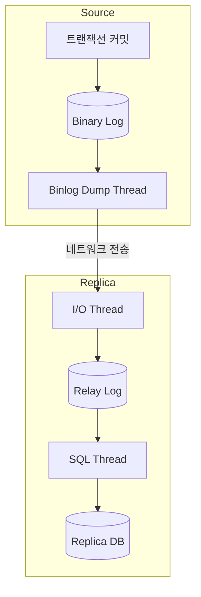
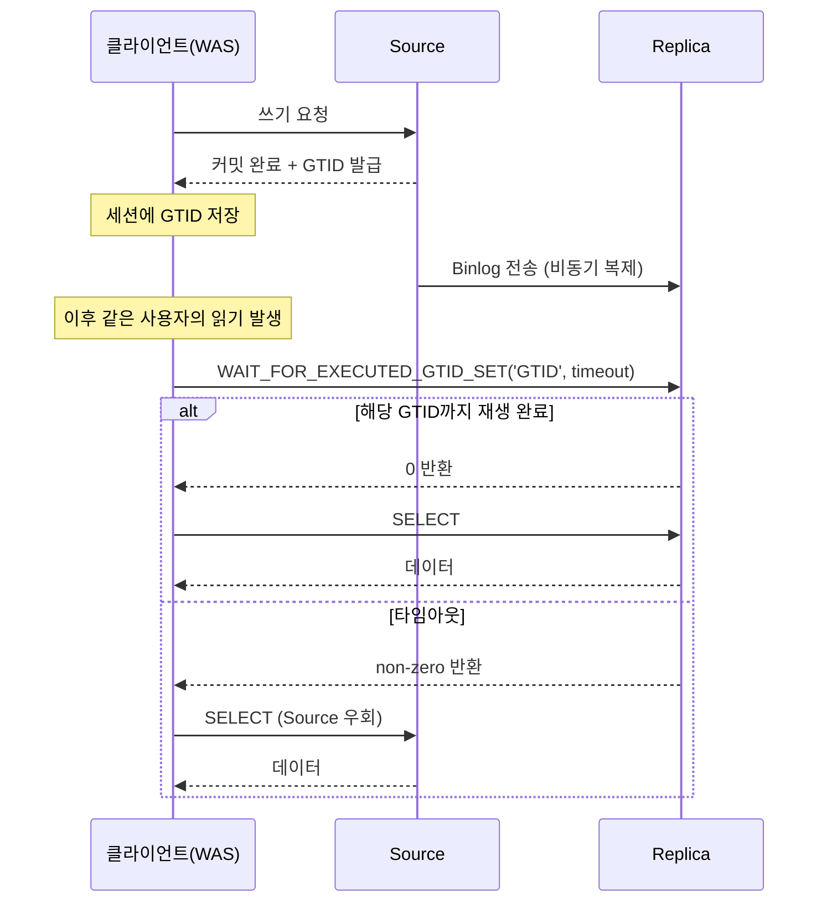

레플리케이션은 하나의 MySQL 서버(Source)의 데이터를 다른 서버(Replica)로 실시간에 가깝게 복사하여 동기화하는 기술로, 가용성과 확장성을 높이는 데 중요한 역할을 한다.

- 원본 데이터를 가진 서버: 소스(Source) 서버
- 복제된 데이터를 가지는 서버: 레플리카(Replica) 서버

## 목적

레플리케이션은 단순히 서버의 부하를 분산하는 스케일 아웃을 넘어, 현대적인 서비스 아키텍처에서 다양한 목적으로 활용된다.

1. 스케일 아웃: 데이터 변경이 발생하는 쓰기 작업은 소스 서버에서 처리하고, 데이터 조회가 많은 읽기 작업은 여러 대의 레플리카 서버로 분산시켜 전체 시스템의 처리량을 향상
2. 데이터 백업: 데이터 백업을 레플리카 서버에서 수행하여 데이터를 보호하고, 소스 서버의 성능에 미치는 영향을 최소화
3. 데이터 분석: 무거운 분석 쿼리나 통계 작업을 레플리카 서버에서 실행하여 소스 서버의 부하 격리
4. 데이터의 지리적 분산: 데이터를 사용자에게 가까운 지역에 위치한 레플리케이션 서버에 분산시켜, 읽기 지연 시간을 줄이고 더 나은 사용자 경험을 제공
5. 고가용성: 소스 서버에 장애가 발생했을 때, 레플리카 서버 중 하나를 새로운 소스 서버로 승격시켜 서비스 중단을 최소화하는 장애 복구(Failover) 환경 구축

## 복제 아키텍처 및 동작 원리

MySQL 레플리케이션은 소스 서버에서 발생하는 모든 데이터 변경 이력을 기록하는 바이너리 로그(Binary Log)를 기반으로 동작한다.

- 로그에는 데이터의 변경 내역뿐만 아니라 데이터베이스나 테이블의 구조 변경과 계정이나 권한 변경 정보까지 모두 기록
- 레플리케이션은 바이너리 로그에 기록된 변경 정보들(=`이벤트`) 기반으로 동작
- 소스 서버에서 발생한 바이너리 로그를 레플리카 서버로 전송하여 레플리카 서버에서도 동일한 변경 사항을 수행하여 데이터를 동기화

위 동작은 MySQL의 세 개의 스레드에 의해 수행하는데, 하나는 소스 서버에 존재하고 나머지 두 개는 레플리카 서버에 존재한다.

- 바이너리 로그 덤프 스레드(Binary Log Dump Thread): 소스 서버에서 바이너리 로그를 읽어 레플리카 서버로 전송하는 스레드
- 레플리케이션 I/O 스레드(Replication I/O Thread): 레플리카 서버에서 소스 서버로부터 전송받은 바이너리 로그 이벤트를 가져와 레플리카 서버의 릴레이 로그에 기록하는 스레드
- 레플리케이션 SQL 스레드(Replication SQL Thread): 레플리카 서버의 릴레이 로그에 기록된 이벤트를 레플리카 서버의 데이터베이스에 실행하는 스레드

각 스레드들을 통해 다음과 같은 과정으로 레플리케이션이 수행된다.

1. 소스 서버에서 트랜잭션이 커밋되면 변경 내용이 바이너리 로그에 기록
2. 소스 서버의 바이너리 로그 덤프 스레드(Binary Log Dump Thread)가 바이너리 로그를 읽어 레플리카 서버로 전송
3. 레플리카 서버의 I/O 스레드가 네트워크를 통해 받은 바이너리 로그 이벤트를 릴레이 로그에 순차적으로 기록
4. 레플리카 서버의 SQL 스레드(Applier Thread)가 릴레이 로그의 이벤트를 순서대로 읽어 레플리카의 데이터베이스에 적용

이 과정은 비동기적으로 일어나므로, 소스 서버의 변경이 레플리카 서버에 반영되기까지 약간의 시간 차이, 즉 복제 지연(Replication Lag)이 발생할 수 있다.

## 바이너리 로그 포맷

소스가 어떤 단위로 변경 사항을 기록하느냐에 따라 레플리카의 재생 안전성과 로그 크기가 달라진다.

|    포맷     |            기록 단위             |                   재생 안전성                   |     주의점     |
|:---------:|:----------------------------:|:------------------------------------------:|:-----------:|
| STATEMENT |        실제 실행한 SQL 문장         | `NOW()`, `UUID()`, `RAND()` 같은 비결정 함수에서 분기 |  로그 크기는 작음  |
|    ROW    |       변경된 행 단위의 전·후 값        |             비결정 함수·트리거에도 일관 재생             |  로그 크기는 큼   |
|   MIXED   | 평소 STATEMENT, 비결정 상황만 ROW 전환 |                 상황별 자동 전환                  | 레거시 호환 시 사용 |

MySQL 8.0의 기본값은 ROW이며, 정합성을 우선하기 위한 선택이다.

- STATEMENT: 동일 SQL이라도 소스·레플리카의 시점·변수 차이로 결과가 갈릴 수 있음
- ROW: 행 단위 결과가 그대로 전달되어 재생 결과 일치 보장
- MIXED: 결정적 SQL은 STATEMENT, 비결정 SQL만 ROW로 기록

## 복제 방식과 일관성 트레이드오프

소스가 커밋을 응답하는 시점에 레플리카 반영을 어디까지 기다리느냐에 따라 일관성과 쓰기 지연이 갈린다.

| 방식  |           동작            |   소스 장애 시 데이터 손실   |       쓰기 지연       |
|:---:|:-----------------------:|:------------------:|:-----------------:|
| 비동기 | 소스 커밋 즉시 응답, 전송은 백그라운드  | 미전송 트랜잭션 손실 가능성 존재 | 가장 짧음 (MySQL 기본값) |
| 반동기 | 최소 1대 레플리카의 수신 ACK 후 응답 |   수신은 보장(RPO≈0)    |   레플리카 왕복만큼 증가    |
| 동기  | 모든 레플리카 적용 완료까지 대기 후 응답 |     사실상 손실 없음      |   가장 김 (잘 안 씀)    |

비동기가 기본인 이유는 쓰기 처리량을 보장하기 위해서다.

- 비동기: 처리량·지연 모두 유리하지만 페일오버 시 미전송분 유실 위험
- 반동기(`rpl_semi_sync_*` 플러그인): 적어도 1대 레플리카가 받았음이 보장되므로 페일오버 시 손실 회피 가능
- 동기: 모든 레플리카가 응답할 때까지 대기

## Replication Lag

Replication Lag는 소스에서 커밋된 시각과 레플리카에서 재생이 완료된 시각의 차이로, 비동기 복제에서는 항상 발생하게 된다.

- 단일 스레드 재생: MySQL 5.6 이전 기본 동작, 긴 트랜잭션 하나가 SQL 스레드 전체를 블로킹
- 긴 트랜잭션·대량 UPDATE: 소스에서 10분 걸린 배치는 레플리카에서도 동일 시간만큼 재생 필요
- 네트워크·디스크 병목: 레플리카 사양이 소스 TPS를 따라가지 못하는 경우
- 단일 핫 키 경합: 같은 행에 대한 직렬화 갱신은 병렬 재생으로도 분산 불가

해결 방향은 MySQL 8.0의 병렬 재생과 하드웨어 동등성 확보에 집중된다.

- `binlog_format=ROW` 고정으로 SQL 재파싱 비용 제거
- `replica_parallel_workers`, `replica_parallel_type=LOGICAL_CLOCK`로 트랜잭션 병렬 재생
- 레플리카 하드웨어 사양을 소스와 동등 이상으로 유지
- 긴 배치 트랜잭션을 청크 단위로 쪼개 재생 시간을 평탄화

## Read-After-Write 문제

소스-레플리카 분리 환경에서 발생하는 대표적인 부작용으로, 사용자가 방금 쓴 데이터를 직후 조회에서 보지 못하는 현상이다.

- 원인: 쓰기는 소스로, 읽기는 레플리카로 라우팅되는데 레플리카 재생이 아직 끝나지 않은 상태
- 사용자 체감: 결제 직후 마이페이지에 결제 내역이 보이지 않음, 댓글 작성 직후 새로고침에서 자기 댓글이 사라짐

해결 패턴은 강도와 비용이 다른 세 가지가 있다.

|      패턴       |            동작             |         장점          |         단점         |
|:-------------:|:-------------------------:|:-------------------:|:------------------:|
| 직후 Source 라우팅 | 쓴 직후 N초 동안 해당 사용자 읽기를 소스로 | 구현 단순, 쓰기 지연 영향 없음  | 복제 지연이 N초 초과 시 재발생 |
|    GTID 대기    | 쓰기 응답의 GTID까지 레플리카 재생 확인  |      정확도 가장 높음      |   클라이언트 로직 추가 필요   |
|   Semi-Sync   |  소스 커밋 전 레플리카 수신 ACK 강제   | 데이터 손실 사실상 0(RPO=0) |     모든 쓰기가 느려짐     |

도메인 특성에 따라 선택이 갈린다.

- 결제·정산 등 단 한 건의 손실도 허용할 수 없는 경우: Semi-Sync + GTID 대기를 겹쳐 방어
- 댓글·좋아요 등 사용자 체감 속도가 더 중요한 경우: 직후 Source 라우팅으로 충분

### GTID 대기 동작 흐름

GTID(Global Transaction Identifier)는 트랜잭션마다 부여되는 전역 고유 번호로, 클러스터 어디서든 같은 트랜잭션을 식별할 수 있게 해 준다.

- 형식: `server_uuid:transaction_id` (예: `3E11FA47-71CA-11E1-9E33-C80AA9429562:23`)
- 역할: 레플리카가 어디까지 재생했는지 GTID 집합으로 표현 가능

GTID 대기 흐름은 다음과 같다.

1. 소스 커밋 시 해당 트랜잭션의 GTID가 발급되어 바이너리 로그에 기록
2. 클라이언트(WAS)가 쓰기 응답에서 받은 GTID를 사용자 세션에 저장
3. 이후 동일 사용자의 읽기 직전, 레플리카에 `SELECT WAIT_FOR_EXECUTED_GTID_SET('<GTID>', <timeout>)` 실행
4. 반영 완료 시 0 반환 → 레플리카에서 SELECT, 타임아웃 시 비-0 반환 → 소스로 우회

###### 참고자료

- [Real MySQL 8.0 (2권)](https://kobic.net/book/bookInfo/view.do?isbn=9791158392727)
- [MySQL 8.0 Reference Manual - Replication](https://dev.mysql.com/doc/refman/8.0/en/replication.html)
