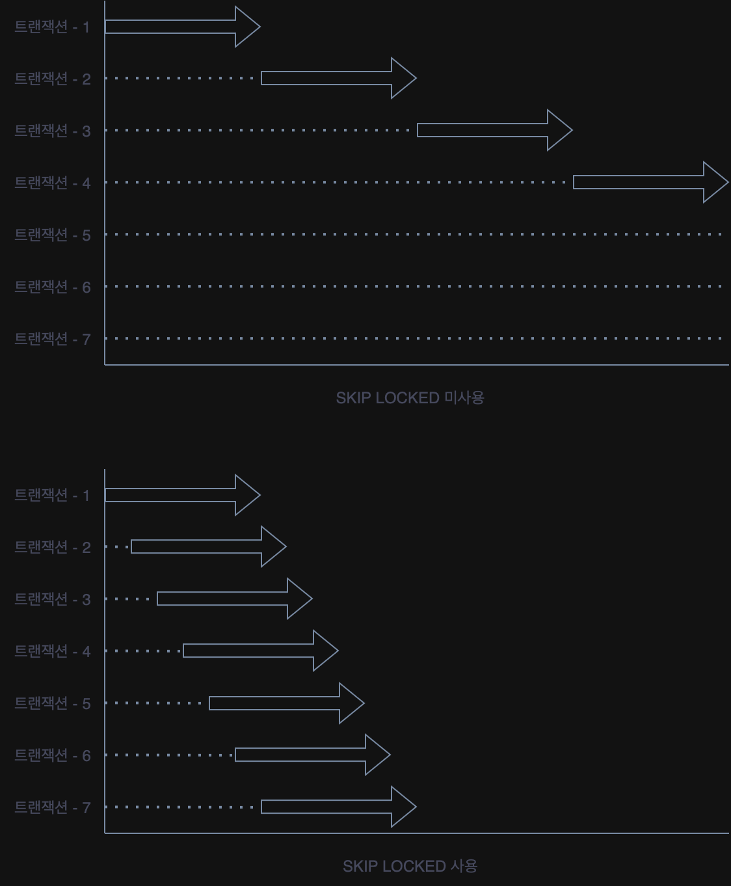

일반적인 `SELECT` 쿼리 실행 시에는 잠금을 사용하지 않고 데이터를 읽지만(Non-locking Consistent Read), 데이터 정합성 보장을 위해 명시적으로 잠금을 설정해야 하는 경우가 있다.

|            잠금 종류             |         설명         | 공유 잠금 획득 | 배타적 잠금 획득 |                             비고                             |
|:----------------------------:|:------------------:|:--------:|:---------:|:----------------------------------------------------------:|
|  `FOR SHARE` 공유 잠금 (S-Lock)  | 조회한 레코드에 공유 잠금 설정  |    허용    |    방지     |           데이터가 변경되면 안 되는 상황에서 일관된 읽기를 보장하기 위해 사용           |
| `FOR UPDATE` 배타적 잠금 (X-Lock) | 조회한 레코드에 배타적 잠금 설정 |    방지    |    방지     | 조회한 데이터를 곧바로 수정할 의도가 있음을 명시하고, 다른 트랜잭션의 접근을 완전히 차단하기 위해 사용 |

InnoDB 스토리지 엔진에서는 잠금 없는 읽기가 지원되기 때문에 배타적 잠금이 설정되어있더라도, 단순`SELECT` 쿼리는 정상적으로 읽기를 수행할 수 있다.

## 잠금 동작 제어

### 잠금 테이블 선택

여러 테이블을 조인할 때, `FOR UPDATE`는 기본적으로 조인에 포함된 모든 테이블의 레코드에 잠금을 설정한다.

```sql
SELECT *
FROM employees e
         INNER JOIN dept_emp de ON de.emp_no = employees.emp_no
         INNER JOIN departments d ON d.dept_no = de.dept_no
    FOR
UPDATE;
```

이 중 특정 테이블의 레코드에만 잠금을 설정하고 싶다면 `OF` 절을 사용할 수 있다.

```sql
SELECT *
FROM employees e
         INNER JOIN dept_emp de ON de.emp_no = employees.emp_no
         INNER JOIN departments d ON d.dept_no = de.dept_no
    FOR
UPDATE OF e;
```

## 잠금 대기 제어

잠금이 설정된 레코드를 다른 트랜잭션이 이미 잠금하고 있는 경우, 기본적으로는 해당 레코드의 잠금이 해제될 때까지 대기하게 되지만, 대기 동작을 제어할 수 있는 옵션이 있다.

- `NOWAIT`: 잠긴 레코드를 만났을 때 대기하지 않고, 즉시 오류를 반환
- `SKIP LOCKED`: 잠긴 레코드를 만났을 때, 해당 레코드를 결과에서 제외하고 건너뛰어 잠기지 않은 다음 레코드부터 조회를 계속

### `SKIP LOCKED` 활용한 작업 큐(Queue) 구현 예시

`NOWAIT`와 `SKIP LOCKED` 기능은 큐(Queue)와 비슷한 기능을 MySQL 서버에서 구현할 때 유용하게 사용할 수 있다.

- 하나의 쿠폰은 한 사용자만 사용 가능
- 쿠폰의 개수는 1000개 제한
- 선착순으로 요청한 사용자에게 발급

```sql
-- 쿠폰 테이블
CREATE TABLE coupon
(
    coupon_id     BIGINT      NOT NULL,
    owned_user_id BIGINT      NULL DEFAULT 0,
    coupon_code   VARCHAR(15) NOT NULL,
--  ...
    primary key (coupon_id),
    INDEX ix_owneduserid (owned_user_id)
);
```

```sql
-- 쿠폰 발급 과정
BEGIN;

SELECT *
FROM coupon
WHERE owned_User_id = 0
ORDER BY coupon_id ASC
LIMIT 1
FOR
UPDATE;

-- 애플리케이션 로직 수행

UPDATE coupon
SET owned_user_id = ?
WHERE coupon_id = ?;

COMMIT;
```

위 쿼리를 동시에 1000명의 사용자가 요청하게 되면 다음과 같은 상황이 발생한다.

1. 애플리케이션 서버는 그 요청만큼 프로세스를 생성해 위의 트랜잭션을 동시에 실행
2. 하지만 가장 첫 트랜잭션만 `FOR UPDATE` 쿼리로 인해 잠금을 걸고 나머지 999개의 트랜잭션은 해당 레코드가 잠겨져 있기 때문에 대기
3. 대기 시간 동안 잠금을 획득하지 못해서 에러를 반환

여기서 `SKIP LOCKED`를 사용하면, 한 트랜잭션이 특정 쿠폰을 잠그더라도 다른 트랜잭션들은 해당 레코드를 즉시 건너뛰고 다음 잠기지 않은 쿠폰을 조회하여 처리할 수 있다.

```sql
BEGIN;
-- 미사용 쿠폰 중 잠기지 않은 첫 번째 레코드를 조회하여 잠금
SELECT *
FROM coupon
WHERE owned_user_id = 0
LIMIT 1
FOR
UPDATE SKIP LOCKED;

-- 애플리케이션 로직 수행

COMMIT;
```



###### 참고자료

- [Real MySQL 8.0 (2권)](https://kobic.net/book/bookInfo/view.do?isbn=9791158392727)