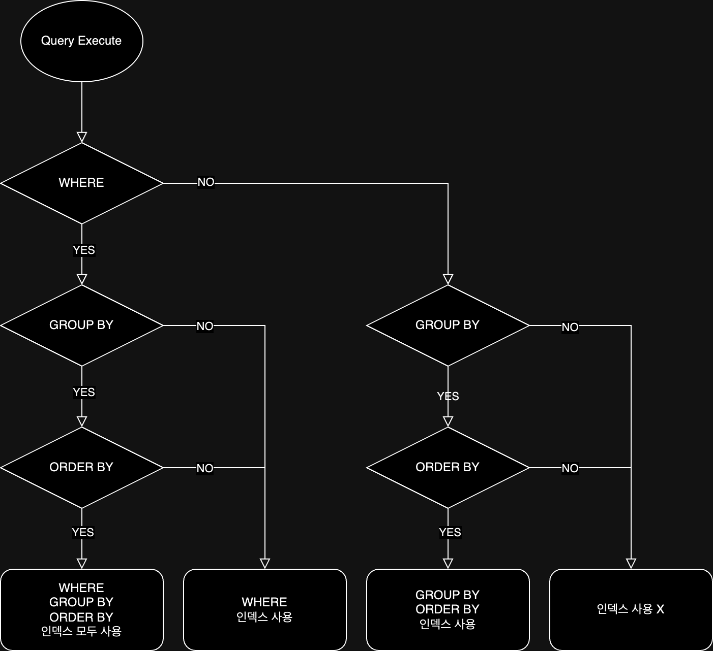

## SELECT 절의 인덱스 사용

### 인덱스 사용을 위한 기본 규칙

인덱스를 효과적으로 사용하려면 두 가지 규칙을 지켜야한다.

- `WHERE` 절의 조건문이 인덱스 컬럼 자체를 가공하지 않고 원래의 값 그대로 비교
- 비교 대상이 동일한 타입이어야 함

```sql
-- 인덱스 사용 불가
SELECT *
FROM salaries
WHERE salary * 10 > 1000000;

-- 인덱스 사용 가능
SELECT *
FROM salaries
WHERE salary > 1000000 / 10;
```

### WHERE 절의 인덱스

WHERE 조건에서 여러 개의 컬럼을 조합하여 사용하는 경우에는 인덱스를 어떻게 구성하느냐에 따라 성능이 크게 달라진다.

```sql
-- (first_name, last_name, age) 순서로 인덱스가 구성되어 있다고 가정

-- AND 조건
SELECT *
FROM employees
WHERE first_name = 'Platypus'
  AND last_name = 'Ogu'
  AND age = 25;
-- 인덱스 사용 가능


-- OR 조건
SELECT *
FROM employees
WHERE first_name = 'Platypus'
   OR last_name = 'Ogu'
   OR age = 25;
-- 인덱스 사용 불가
```

- `AND`: 인덱스의 가장 앞쪽 컬럼부터 순서대로 조건이 일치해야 인덱스를 사용할 수 있음
- `OR`: `OR`로 연결된 각 조건이 모두 개별적으로 인덱스를 사용할 수 있지 않다면, 옵티마이저는 풀 테이블 스캔 가능성 높음

### GROUP BY / ORDER BY 절의 인덱스

`GROUP BY`와 `ORDER BY`는 인덱스를 사용하여 불필요한 파일소트나 임시 테이블 생성을 피할 수 있으며, 다음과 같은 조건을 만족해야 인덱스를 사용할 수 있다.

- 명시된 컬럼이 인덱스 컬럼 순서와 위치 일치
- 인덱스 구성 컬럼 중 뒤쪽 컬럼은 명시되지 않아도 인덱스를 사용할 수 있지만, 앞쪽 컬럼이 명시되지 않으면 인덱스 사용이 불가능
- (ORDER BY 절에만 해당) 명시된 컬럼이 모두 오름차순이거나 내림차순으로 정렬되어야 함

### WHERE + ORDER BY(or GROUP BY) 절의 인덱스

WHERE 절과 ORDER BY 절을 동시에 사용하는 경우에는 아래의 방법으로 인덱스를 이용하게 된다.

- WHERE 절만 인덱스 이용
    - OWHERE 절의 대상 컬럼이 인덱스에 포함돼 있을 때 사용 가능
    - WHERE 인덱스를 통해 조회된 결과를 별도로 정렬하는 방식으로 처리
    - WHERE 절 조건에 일치하는 레코드 건수가 적을 수록(Cardinality가 높을 수록) 성능이 좋음
- ORDER BY 절만 인덱스 이용
    - ORDER BY 절의 정렬 대상 컬럼이 인덱스에 포함돼 있을 때 사용 가능
    - ORDER BY 절의 순서대로 인덱스를 읽으면서 레코드 한 건씩 WHERE 조건에 일치하는지 확인하는 방식으로 처리
- WHERE 절 + ORDER BY 절 동시에 같은 인덱스 이용
    - WHERE 절의 `범위` 비교 조건에서 사용하는 컬럼 + ORDER BY 절의 정렬 대상 컬럼이 모두 하나의 인덱스에 연속해서 포함돼 있을 때 사용 가능
    - WHERE 절의 `동등` 비교 조건으로 사용하는 컬럼 + ORDER BY 절의 정렬 대상 컬럼이 중첩 상관 없이 인덱스 순서대로 포함돼 있을 때 사용 가능

### GROUP BY + ORDER BY 절의 인덱스

- GROUP BY 절과 ORDER BY 절에 명시된 컬럼의 순서와 내용이 모두 같아야 인덱스 사용 가능
- 만약 둘 중 하나라도 인덱스를 이용할 수 없을 경우 모두 인덱스 사용 불가능

### WHERE + GROUP BY + ORDER BY 절의 인덱스

위의 규칙이 모두 적용되며, 그 흐름은 아래와 같다.



## WHERE 절 비교 조건 사용 시 주의사항

- 문자열 / 숫자 비교: 반드시 그 타입에 맞는 상수값 사용해야 인덱스를 정상적으로 사용 가능
- 날짜 비교: 날짜를 저장하는 타입에 DATETIME, DATE, TIMESTAMP, TIME 이 존재하기 때문에 각각 타입을 비교할 때 주의 필요
    - DATE(DATETIME) + 문자열: 문자열을 DATETIME 타입으로 변환하여 비교(인덱스 정상 사용 가능)
    - DATE + DATETIME: DATETIME 타입으로 변환하여 비교(인덱스 정상 사용 가능)

## LIMIT n

쿼리 결과에서 지정된 순서에 위치한 레코드만 가져올 때 사용하는 문법으로, 항상 쿼리의 마지막에 실행된다.

```sql
SELECT *
FROM employees
WHERE emp_no BETWEEN 10001 AND 10010 -- 1. employees 테이블에서 WHERE 조건에 일치하는 레코드를 전부 읽음
ORDER BY first_name -- 2. 1번에서 읽어온 레코드를 first_name 컬럼값에 따라 정렬
LIMIT 0, 5; -- 3. 정렬된 결과에서 상쉬 5개의 레코드만 반환
```

LIMIT은 필요한 레코드 건수가 조회되면 즉시 쿼리를 종료하게 되는데, 쿼리에 따라 성능 향상을 기대할 수 있다.

- 인덱스 처리 되지 않은 GROUP BY / ORDER BY 사용: 모든 레코드를 읽어야 하므로 성능 향상 미미
- DISTINCT 사용: 유니크한 레코드 건수가 LIMIT에 명시된 값보다 큰 경우 성능 향상 기대(테이블을 읽는 도중 중단)
- 그 외: 큰 성능 향상 기대 가능

### OFFSET

`LIMIT` 절과 함께 사용되는 경우가 많으며, 결과에서 몇 번째 레코드부터 가져올지를 지정한다.

```sql
SELECT *
FROM salaries
ORDER BY salary
LIMIT 200000, 10;
```

위 쿼리는 20만 번째 레코드부터 단 10개의 레코드만 조회하지만,MySQL은 20만 번째 레코드를 찾기 위해 앞의 200,000개의 레코드를 모두 읽어야하므로 성능 저하가 심각해진다.

## COUNT()

결과 레코드의 건수를 반환하는 함수

- 내부 인자
    - 컬럼명 / `*` / `1` 사용 가능
    - `*`는 SELECT 절에서 사용되는 것처럼 모든 컬럼을 가져오는 것을 의미하는 것이 아닌, 옵티마이저가 최적화하여 가장 빠르게 처리할 수 있는 컬럼 사용
        - 사용 가능한 가장 작은 세컨더리 인덱스를 탐색하여 처리(없는 경우, 클러스터된 PK 인덱스 사용)
    - 만약 인자로 컬럼을 넣은 경우 해당 컬럼이 NULL이 아닌 레코드만 카운트
- WHERE 조건
    - WHERE 조건이 없는 경우 클러스터 인덱스를 순차적으로 스캔하여 레코드 건수를 카운트(MyISAM 엔진: 메타 데이터를 사용)
        - 조건절 / GROUP BY 둘 다 없는 경우 쿼리 최적화를 통해 레코드 건수를 최적화하여 빠르게 가져올 수 있음
    - 조건이 있는 경우엔 WHERE 조건에 일치하는 레코드 조회하기 때문에 일반적인 DBMS와 동일하게 처리
- ORDER BY
    - 개수 조회를 하는 데에 정렬이 필요하지 않기 때문에 불필요한 성능 저하를 유발할 수 있음(MySQL 8.0 미만)
    - MySQL 8.0 이상부터는 ORDER BY를 사용하더라도 옵티마이저에서 최적화(무시)하여 성능 저하를 방지

여기서 InnoDB에서 메타 데이터를 사용하지 않는 이유는 MVCC 지원과 데이터 무결성을 위해 트랜잭션 단위로 데이터를 관리하기 때문이다.

## JOIN()

조인 성능은 드라이빙(Driving) 테이블과 드리븐(Driven) 테이블의 선택 / 조인 조건의 인덱스 유무에 따라 결정되는데, 옵티마이저는 일반적으로 다음 원칙에 따라 조인 순서를 최적화한다.

1. 두 테이블 모두 조인 컬럼에 인덱스가 있다면, 통계 정보를 기반으로 더 적은 레코드를 가진 테이블을 드라이빙 테이블로 선택
2. 한 테이블에만 인덱스가 있다면, 인덱스가 없는 테이블을 드라이빙 테이블로 선택하여 풀 스캔을 한 번만 수행하고, 인덱스가 있는 테이블을 드리븐 테이블로 삼아 효율적으로 조회
3. 두 테이블 모두 인덱스가 없다면, 레코드 건수가 더 적은 테이블을 드라이빙 테이블로 선택

```sql
SELECT *
FROM employees e,
     dept_emp de
WHERE e.emp_no = de.emp_no;
```

위의 쿼리가 존재할 때 옵티마이저는 아래와 같이 동작한다.(무조건 아래와 같이 동작하는 것은 아니지만 대부분의 경우 아래와 같이 동작한다.)

| emp_no 인덱스 | dept_no 인덱스 |                                               조인 순서와 옵티마이저 동작                                               |
|:----------:|:-----------:|:-----------------------------------------------------------------------------------------------------------:|
|     O      |      O      |                   어느 테이블을 드라이빙으로 선택하든 인덱스를 이용해 드리븐 테이블 조회를 빠르게 처리하기 때문에 통계 정보를 이용해 적절히 선택                   |
|     O      |      X      | dept_emp 테이블을 드라이빙 테이블로 선택하여 테이블 풀 스캔을 한 번만 수행할 수 있도록 하고, employees 테이블을 드리븐 테이블로 선택하여 인덱스를 이용해 조회할 수 있도록 함 |
|     X      |      O      |                                                  위와 반대로 동작                                                  |
|     X      |      X      |                        어떤 경우에서든 드리븐 테이블의 풀 스캔이 발생하기 때문에 레코드 건수가 적은 테이블을 드라이빙 테이블로 선택                        |

### 지연 조인(Delayed Join)

대용량 데이터를 조인한 후 `ORDER BY`나 `GROUP BY`를 수행하면, 거대해진 중간 결과 때문에 성능이 저하된다.

- 조인을 할 수록 레코드 건수와 레코드 자체의 크기가 늘어남
- GROUP BY, ORDER BY 등의 작업을 수행할 때 레코드 건수가 많거나 레코드 자체의 크기가 커지면서 성능 저하 발생

때문에 먼저 `WHERE`, `ORDER BY`,`LIMIT` 등을 통해 필요한 레코드의 PK만 추려낸 후, 그 결과와 드리븐 테이블을 조인하는 최적화 기법을 사용할 수 있다.

#### 지연 조인 적용 전

```sql
SELECT e.*
FROM salaries s,
     employees e
WHERE e.emp_no = s.emp_no
  AND s.emp_no BETWEEN 10001 AND 13000
GROUP BY s.emp_no
ORDER BY SUM(s.salary) DESC
LIMIT 10;
```

1. employees 테이블을 드라이빙 테이블로 선택
2. 10001 ~ 13000 사이의 레코드를 조회
3. salaries 테이블과 조인(조인 후 레코드 건수가 증가)
4. 위 결과를 임시테이블에 저장
5. GROUP BY 작업 수행하여 최대 3000개의 레코드로 줄어듦
6. ORDER BY 작업 수행
7. LIMIT 10으로 최종 결과 반환

#### 지연 조인 적용 후

```sql
SELECT e.*
FROM (SELECT s.emp_no
      FROM salaries s
      WHERE s.emp_no BETWEEN 10001 AND 13000
      GROUP BY s.emp_no
      ORDER BY SUM(s.salary) DESC
      LIMIT 10) x,
     employees e
WHERE e.emp_no = x.emp_no;
```

1. salaries 테이블에서 10001 ~ 13000 사이의 레코드를 조회
2. GROUP BY / ORDER BY / LIMIT 작업을 수행하여 최대 10개의 레코드로 줄어듦
3. employees 테이블과 조인

위의 예시는 지연 조인을 적용했을 때 성능이 향상되는 예시이지만, 지연 조인을 적용했을 때 성능이 저하되는 경우도 존재하므로 다음 조건을 만족하는지 확인해야 한다.

- LEFT(OUTER) JOIN인 경우
    - 드라이빙 테이블:드리븐 테이블 = 1:1 || M:1 관계
- INNER JOIN인 경우
    - 드라이빙 테이블:드리븐 테이블 = 1:1 || M:1 관계
    - 드라이빙 테이블에 있는 레코드는 드리븐 테이블에 모두 존재해야 함

### 래터럴 조인(Lateral Join)

MySQL 8.0부터 지원하는 기능으로 특정 그룹별로 서브쿼리를 실행해서 결과를 반환하는 기능이다.

```sql
-- `FROM` 절의 한 테이블(외부 쿼리)의 결과를 `JOIN` 절의 서브쿼리(내부 쿼리)에서 참조
-- employees 테이블에서 first_name이 Matt인 레코드를 조회하고, -> 외부 쿼리의 결과를
-- salaries 테이블에서 가장 최근에 받은 급여 2건을 조회하는 쿼리 -> 내부 쿼리에서 사용
SELECT *
FROM employees e
         LEFT JOIN LATERAL ( SELECT *
                             FROM salaries s
                             WHERE s.emp_no = e.emp_no
                             ORDER BY s.from_date DESC
                             LIMIT 2) s2 ON s2.emp_no = e.emp_no
WHERE e.first_name = 'Matt';
```

위 쿼리는 LATERAL 키워드를 사용하여 서브쿼리를 사용하고 있는데, 다음과 같은 큰 특징이 있다.

- LATERAL 키워드를 가진 서브쿼리는 조인 순서상 후순위로 밀리고, 외부 쿼리의 결과 레코드 단위로 임시 테이블이 생성되어 처리
- 내부에서 외부 쿼리의 FROM 절에 정의된 테이블의 컬럼을 참조 가능

## ORDER BY

ORDER BY는 레코드를 어떤 순서로 정렬하지 결정하는 절인데, 명시하지 않으면 아래와 같이 정렬되어 반환된다.

- 인덱스를 사용하여 조회 된 경우엔 인덱스의 정렬 순서대로 반환
- InnoDB에서 풀 테이블 스캔을 한 경우 기본적으로 프라이머리 키 순서대로 반환
- SELECT 쿼리가 임시 테이블을 사용하여 조회됐을 경우엔 레코드 순서를 예측하기 어려움

###### 참고자료

- [Real MySQL 8.0 (2권)](https://kobic.net/book/bookInfo/view.do?isbn=9791158392727)