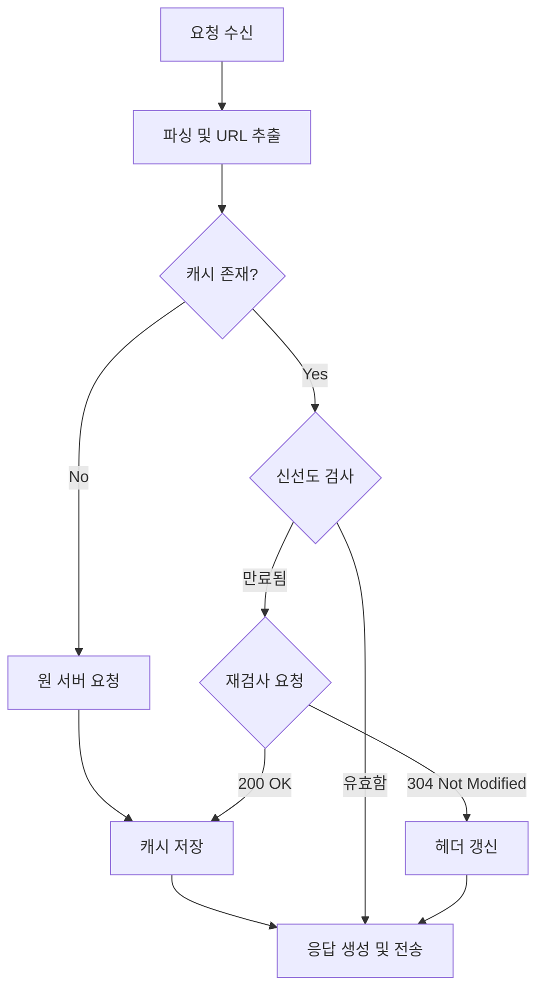

웹 요청이 캐시에 도착했을 때, 로컬에 저장된 사본이 존재한다면 원 서버가 아닌 캐시로부터 문서를 제공하는 것을 캐싱이라고 한다.

- 불필요한 데이터 전송을 줄여 네트워크 요금 비용 절감
- 네트워크 병목 현상을 해결하여 대역폭 확보
- 원 서버에 대한 요청을 줄여 서버 부하 감소
- 거리로 인한 지연 시간을 줄여 페이지 로드 속도 향상

## 적중과 비적중(Hit and Miss)

캐시에 해당 요청에 대한 데이터가 존재하는지 여부에 따라 두 가지 경우로 나뉜다.

- 캐시 적중(Cache Hit): 캐시에 해당 요청에 대한 데이터가 존재하는 경우 캐시에서 바로 응답
- 캐시 비적중(Cache Miss): 캐시에 해당 요청에 대한 데이터가 존재하지 않는 경우 원 서버에 요청을 보내 응답

### 재검사(Revalidation)

캐시된 데이터가 최신 상태인지 확인하는 과정을 재검사라 하며, 주로 캐시 만료 시점에 수행한다.

- 재검사 적중(304 Not Modified)
    - 서버가 확인 결과 리소스가 변경되지 않음
    - 캐시는 저장된 사본을 클라이언트에게 제공하고 헤더(만료일 등) 갱신
- 재검사 부적중(200 OK)
    - 서버가 확인 결과 리소스가 변경
    - 서버는 새로운 리소스 본문과 함께 응답 전송
- 객체 삭제(404 Not Found)
    - 서버에서 해당 리소스가 삭제
    - 캐시도 해당 사본 삭제

리소스 전체에 대해 검사를 하게 되면 네트워크 트래픽이 많아지기 때문에, 캐시는 콘텐츠의 일부분만 검사하게 된다.

### 적중률 (Hit Rate)

캐시가 요청을 처리하는 비율을 의미하며, 0에서 1 사이의 값(0% ~ 100%)을 가지며, 적중률이 높을수록 성능 향상 효과가 크다.(40% 정도면 웹 캐시로서 괜찮은 수준으로 평가한

## 캐시 토폴로지(Topology)

캐시는 사용 대상의 범위에 따라 크게 두 가지로 분류된다.

- 개인 전용 캐시(Private Cache)
    - 웹 브라우저에 내장된 디스크/메모리 캐시처럼 한 명의 사용자만 사용하는 캐시
    - 사용자 개인 설정이나 민감한 정보를 저장하기에 적합
- 공용 캐시 (Public Cache)
    - 프록시 서버나 CDN(Content Delivery Network)처럼 여러 사용자가 공유하는 캐시
    - 자주 요청되는 리소스를 한 번만 가져와 여러 사용자에게 제공되어 높은 네트워크 효율성을 제공

## 캐시 처리 단계

상용 프록시 캐시의 복잡한 내부 로직을 단순화하면 다음과 같은 흐름을 가진다.

## 캐시 신선도 유지

리소스는 변경될 수 있기 때문에 캐시된 사본은 항상 원 서버의 데이터와 일치하지 않을 수 있기 때문에, 문서 만료와 서버 재검사라는 단순한 매커니즘을 통해 캐시된 사본의 신선도를 유지하게 된다.

### 문서 만료

HTTP는 `Cache-Control`과 `Expires` 헤더를 통해 문서의 유효 기간을 명시한다.

|              헤더              |            설명             | 우선순위 |
|:----------------------------:|:-------------------------:|:----:|
| `Cache-Control: max-age=<초>` |  유효한 시간(초)(HTTP/1.1 표준)   |  높음  |
|       `Expires: <날짜>`        | 절대적인 날짜와 시간(HTTP/1.0 호환용) |  낮음  |

### 서버 재검사

유효 기간이 만료되었다고 해서 반드시 데이터가 변경된 것은 아니기 때문에, 캐시는 조건부 요청을 통해 대역폭을 낭비하지 않고 변경 여부만 확인할 수 있다.

- If-Modified-Since(Last-Modified 기반)
    - 서버가 제공한 `Last-Modified` 날짜를 보관했다가, 재검사 시 `If-Modified-Since` 헤더에 담아 전송
    - 해당 날짜 이후에 변경된 경우에만 200 OK와 새 데이터 전송
    - 1초 미만의 변경을 감지하지 못하거나, 내용이 같은데 날짜만 갱신된 경우 불필요한 다운로드 발생
- If-None-Match(ETag 기반)
    - 서버가 제공한 `ETag`(Entity Tag, 특정 버전의 식별자 해시값)를 보관했다가, 재검사 시 `If-None-Match` 헤더에 담아 전송
    - 서버의 현재 ETag와 다를 경우에만 200 OK와 새 데이터 전송
    - 내용의 미세한 변경까지 감지 가능

## Cache-Control 캐시 지시어

HTTP 헤더에는 문서가 만료되기 전까지 캐시된 사본을 어떻게 관리할지에 대한 정책을 가지고 있다.

- `max-age`: 리소스가 신선하다고 간주되는 시간(초)
- `expires` : 캐시 유효 시간을 날짜와 시간으로 지정, `max-age`가 지정되어 있으면 무시되며 `max-age` 사용을 권장`
- `no-cache`: 캐시에 저장은 하되, 사용할 때마다 반드시 원 서버에 재검사 필요
- `no-store`: 데이터에 민감한 정보가 포함되어 있으므로 캐시에 저장하지 않음
- `must-revalidate`: 만료된 캐시는 절대 사용하지 말고 재검사 필요

### 브라우저 새로고침과 캐시

사용자의 행동에 따라 브라우저가 보내는 요청 헤더가 달라진다.

- 일반 요청 (링크 클릭, 주소 입력): 유효한 캐시가 있으면 재검사 없이 사용
- 새로고침 (F5): 브라우저가 `Cache-Control: max-age=0`을 붙여 보내어 강제로 재검사(304 or 200) 수행
- 강력 새로고침 (Ctrl+F5): 브라우저가 `Cache-Control: no-cache`를 붙여 보내어 중간 캐시를 무시하고 무조건 원 서버에서 새로운 데이터 요청

###### 참고자료

- [HTTP 완벽 가이드](https://kobic.net/book/bookInfo/view.do?isbn=9788966261208)
- [그림으로 배우는 HTTP & Network Basic](https://kobic.net/book/bookInfo/view.do?isbn=9788931447897)
