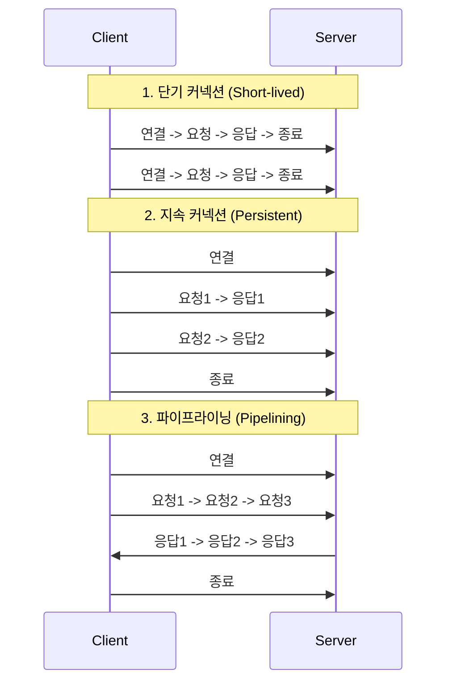

HTTP는 신뢰성 있는 전송을 보장하기 위해 TCP/IP 프로토콜을 기반으로 동작하기 때문에, HTTP 트랜잭션은 TCP 커넥션 위에서 이루어진다

- 오류 없는 데이터 전송
- 순서에 맞는 전달
- 조각나지 않는 데이터 스트림

때문에 위와 같은 이점을 가질 수 있게 되지만, 커넥션 관리가 HTTP 성능에 큰 영향을 미친다.

## 성능 관련 중요 요소

TCP는 데이터의 정확한 전송을 보장하지만, 이 과정에서 발생하는 여러 메커니즘이 HTTP 통신 속도에 지연(Latency)을 발생시키는 원인이 된다.

- TCP 커넥션의 핸드셰이크 설정
    - 새로운 TCP 커넥션을 맺기 위한 조건을 맞추기 위해 IP 패킷을 교환해 핸드셰이크 수행 필요
    - 이 과정이 데이터 전송에 걸리는 시간 중 상당 부분을 차지
    - TLS 통신 시 암호화 핸드셰이크까지 더해져 초기 연결 비용 증가
- TCP 느린 시작(slow start)
    - TCP의 혼잡 제어(Congestion Control) 기능 중 하나
    - 커넥션이 처음 맺어졌을 때 전송 속도를 낮게 시작하고, 성공적으로 패킷이 전송될 때마다 속도를 점차 높여감
    - 급격한 트래픽 유입으로 인한 네트워크 붕괴 방지 목적
- 데이터를 한 번에 전송하기 위한 네이글(Nagle) 알고리즘
    - 네이글 알고리즘은 네트워크 효율을 위해 TCP 세그먼트보다 작은 여러 개의 데이터를 하나의 TCP 세그먼트로 전송하기 위한 알고리즘
    - 하나의 TCP 세그먼트로 전송되기까지 데이터가 모이기를 기다리기 때문에 지연이 발생
- TCP 편승(piggyback) 확인 응답(ACK)을 위한 확인 응답 지연 알고리즘
    - 인터넷이 패킷 전송을 완벽히 보장하지 않음
    - TCP는 데이터 전송을 보장하기 위해 확인을 하는 확인 응답 알고리즘을 사용하는데, 지연의 원인이 됨

## HTTP 커넥션 관리

초기 HTTP/1.0의 비효율성을 개선하기 위해 다양한 커넥션 관리 기법이 도입되었다.

TCP 커넥션을 맺고 끊는 과정이 필요하게 되어 비효율적인 부분을 해결하기 위해 여러 가지 방법들이 제시되어, TCP 핸드셰이크 비용을 줄이고 지연 시간을 단축시키는 다양한 커넥션 관리 모델이 발전해왔다.

|        연결 모델         |          설명           |                특징                 |
|:--------------------:|:---------------------:|:---------------------------------:|
| 단기 커넥션 (Short-lived) |    요청마다 연결하고 즉시 종료    |  HTTP/1.0 초기 모델. 핸드셰이크 비용 과다 발생   |
|  병렬 커넥션 (Parallel)   | 여러 개의 TCP 커넥션을 동시에 생성 |     여러 리소스를 동시에 로딩. 메모리 소모 큼      |
| 지속 커넥션 (Persistent)  |     맺어진 커넥션을 재사용      | 핸드셰이크 생략, Slow Start 회피. 현대 웹의 표준 |
|  파이프라이닝 (Pipelined)  |   응답을 기다리지 않고 연속 요청   |   대기 시간 단축. HOL Blocking 문제 존재    |

### 병렬 연결(Parallel Connection)

브라우저가 여러 개의 TCP 커넥션(보통 도메인당 6개)을 동시에 맺어 이미지를 포함한 여러 객체를 한 번에 내려받는 방식이다.

- 장점: 단일 커넥션보다 페이지 로드 속도가 빠름
- 단점: 서버의 리소스(포트, 메모리) 소모가 크며, 클라이언트 쪽 대역폭을 경쟁적으로 사용하여 네트워크 혼잡 유발 가능

### 지속 연결(Persistent Connection)

처리가 완료된 커넥션을 끊지 않고 유지하여 다음 요청에 재사용하는 방식이다.

- TCP 핸드셰이크 비용 절감: 이미 연결된 통로 사용
- Slow Start 회피: 이미 데이터 전송 속도가 최적화된(Warmed up) 상태의 커넥션 사용

#### 병렬 vs 지속

병렬 커넥션은 여러 객체가 있는 페이지를 빠르게 전송하지만 몇 가지 단점이 존재한다.

- 각 트랜잭션마다 새로운 커넥션 생성 및 종료
- 각 커넥션마다 TCP 느린 시작(slow start) 문제 발생
- 제한적인 실제 연결 가능한 커넥션 수

이에 반해 지속 커넥션은 위의 단점을 보완할 수 있어, 현대 웹 애플리케이션에서는 적은 수의 병렬 커넥션을 지속하여 함께 사용하는 것이 일반적이다.

#### HTTP/1.0- Keep-Alive

HTTP/1.0은 기본적으로 연결을 닫는 방식이나, 성능 향상을 위해 `Connection: Keep-Alive` 헤더를 사용하여 지속 커넥션을 지원한다.(현재 표준에서 제외되었으나 호환성을 위해 사용)

- 동작 방식
    - 클라이언트: 요청에 해당 헤더와 함께 전송
    - 서버
        - 응답에 헤더 포함: 연결 유지
        - 응답에 없음: 지원하지 않는다고 판단하여 연결 종료
- 옵션: `timeout`(유지 시간)과 `max`(최대 처리 수)를 지정할 수 있으나, 서버가 반드시 따르지 않음

#### HTTP/1.1 - 지속 커넥션

HTTP/1.1부터는 별도의 설정이 없으면 기본적으로 지속 커넥션이 활성화된다.

- 연결을 끊으려면 명시적으로 `Connection: close` 헤더 전송 필요
- `Keep-Alive` 옵션(timeout, max)은 부가적인 정보일 뿐이며, 서버는 언제든 유휴 커넥션을 끊을 수 있음

### 파이프라인 연결(Pipelined Connection)

지속 커넥션을 전제로, 요청을 보내고 응답을 기다리지 않고 연속적으로 여러 요청을 보내는 기술이다.

- 순서 보장: 요청 순서와 응답 순서 일치 필요(1번 요청의 응답이 2번보다 먼저 와야 함)
- 제약 사항: POST와 같은 비멱등(Non-idempotent) 요청은 실패 시 재전송의 위험이 있어 파이프라이닝이 제한
- Head of Line Blocking: 앞선 요청(1번)의 처리가 서버에서 늦어지면, 뒤의 요청(2, 3번)이 처리가 끝났더라도 1번 응답이 나갈 때까지 대기해야 하는 성능 문제 발생
- 현황: 위와 같은 문제로 인해 모던 브라우저에서는 기본적으로 비활성화되어 있으며, HTTP/2의 멀티플렉싱 기술로 대체됨

###### 참고자료

- [HTTP 완벽 가이드](https://kobic.net/book/bookInfo/view.do?isbn=9788966261208)
