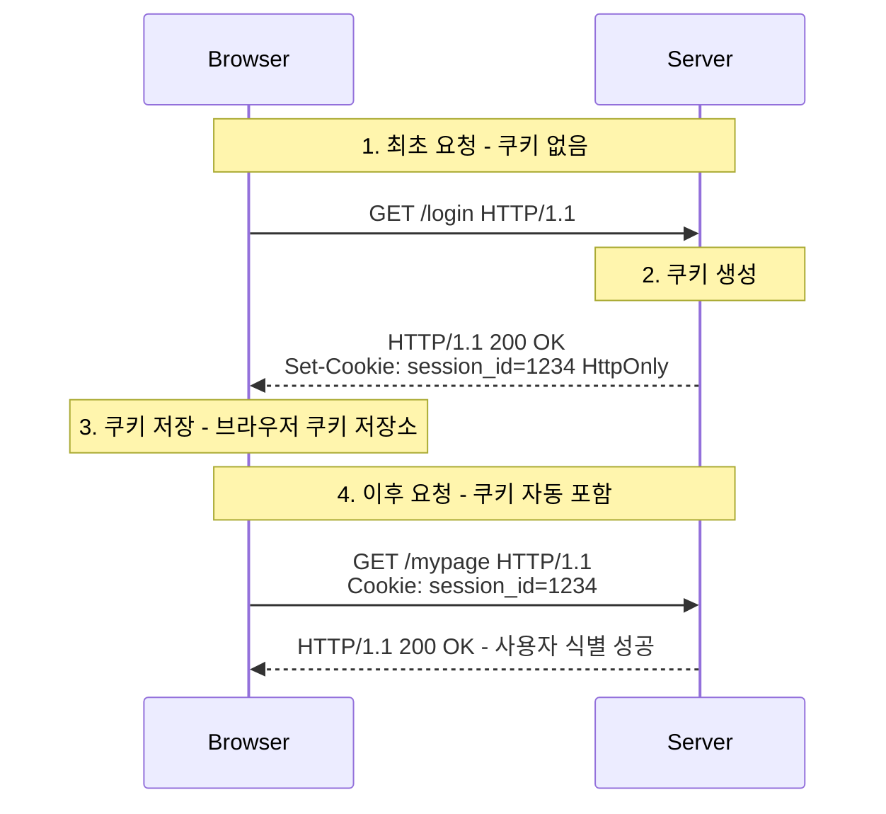

HTTP는 기본적으로 상태를 유지하지 않는 무상태(Stateless) 특성을 가지기 때문에, 클라이언트를 식별하고 상태 유지를 위해 브라우저(클라이언트)에 저장하는 작은 데이터 파일인 쿠키(Cookie)를 사용한다.

- 세션 관리: 사용자 로그인 유지, 장바구니 등 서버가 알아야 할 정보 관리
- 개인화: 사용자 테마, 언어 설정 등
- 트래킹: 사용자 행동 분석 및 맞춤형 광고 제공

## 동작 원리 및 흐름

쿠키는 서버에서 생성되어 클라이언트로 전송되고, 이후 클라이언트가 서버에 요청을 보낼 때마다 자동으로 헤더에 포함되어 다시 전송된다.

1. 요청: 클라이언트가 서버에 페이지 요청
2. 응답 및 설정: 서버는 응답 헤더의 `Set-Cookie`에 저장할 정보를 담아 전송
3. 저장: 브라우저는 응답 헤더를 확인하고 로컬 쿠키 저장소에 저장
4. 재전송: 이후 해당 도메인에 요청을 보낼 때마다 `Cookie` 요청 헤더에 값을 담아 자동 전송

## 쿠키의 생명주기

쿠키의 타입은 파기되는 시점에 따라 아래 두 가지로 나뉜다.

- 세션 쿠키(Session Cookie)
    - 만료 시간을 지정하지 않은 경우 생성
    - 브라우저 메모리에 저장되며, 브라우저 종료 시 삭제
    - 주로 임시 세션 관리에 사용
- 지속 쿠키(Persistent Cookie)
    - `Expires`나 `Max-Age` 속성으로 만료 시점을 지정한 경우 생성
    - 브라우저를 닫아도 삭제되지 않고 디스크에 파일 형태로 저장
    - 설정된 유효 기간까지 유지(예: 로그인 유지 기능)

### 만료 속성

- `Expires`: 날짜를 지정 (예: Wed, 21 Oct 2023 07:28:00 GMT)
- `Max-Age`: 현재 시간부터 만료될 때까지의 초를 지정 (Expires보다 우선순위가 높음)

## 도메인 스코프

모든 사이트에 브라우저 내의 모든 쿠키가 전송된다면 개인정보 문제와 불필요한 데이터를 전송하는 문제가 발생할 수 있기 때문에 해당 쿠키가 적용될 도메인과 경로를 지정할 수 있다.

- `Domain`
    - 명시하지 않음: 쿠키를 생성한 도메인(origin)에만 전송되며, 서브 도메인에는 전송되지 않음
    - 명시: 지정한 도메인 및 그 하위 서브 도메인까지 모두 전송(예: `domain=example.com` 설정 시 `dev.example.com`에도 전송)
- `Path`
    - 지정된 경로와 그 하위 경로에만 쿠키가 전송
    - 일반적으로 `path=/`로 설정하여 도메인 내 모든 경로에서 접근 가능하도록 함

## 보안

쿠키는 브라우저에 저장되기 때문에, 보안에 유의하지 않으면 여러 위험에 노출될 수 있다.

- 해당 브라우저가 다른 사람에 의해 접근될 경우, 쿠키를 통해 사용자의 정보 유출 가능
- 쿠키는 누구나 쉽게 볼 수 있는 평문 형태로 저장되기 때문에, 쿠키 값 변조 위험 존재

이러한 문제를 방지하기 위해 쿠키에 보안을 강화하는 속성을 지정할 수 있다.

- `Secure`
    - 쿠키는 기본적으로 `HTTP`, `HTTPS`를 구분하지 않고 전송
    - `Secure` 적용 시 HTTPS인 경우에만 쿠키 전송
- `HttpOnly`
    - 기본적으로 자바스크립트(`document.cookie`)를 통해 쿠키 값에 접근 가능
    - `HttpOnly` 적용 시 자바스크립트 접근이 차단되고 HTTP 전송 시에만 사용
    - XSS(Cross-Site Scripting) 공격으로 인한 쿠키 탈취 방지 목적
- `SameSite`
    - 요청 도메인과 쿠키의 도메인이 서로 다른 경우(Cross-Site) 쿠키 전송 여부를 결정
    - CSRF(Cross-Site Request Forgery) 공격 방지 목적
    - 속성 값
        - `Strict`: 가장 보수적인 정책. 퍼스트 파티(동일 도메인) 요청에만 쿠키 전송
        - `Lax`: 기본값(크롬 등 최신 브라우저). 대부분의 서드 파티 요청을 차단하지만, 안전한 Top-Level Navigation(링크 클릭 등)에서는 전송 허용
        - `None`: 모든 경우에 전송 허용. 단, 반드시 `Secure` 속성과 함께 사용해야 함

###### 참고자료

- [HTTP 완벽 가이드](https://kobic.net/book/bookInfo/view.do?isbn=9788966261208)
- [그림으로 배우는 HTTP & Network Basic](https://kobic.net/book/bookInfo/view.do?isbn=9788931447897)
