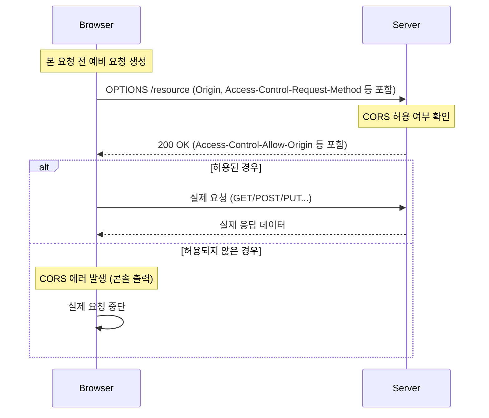

웹 애플리케이션은 보안을 위해 기본적으로 동일 출처 정책(SOP)을 따르지만, 다른 출처의 리소스를 사용해야 하는 정당한 상황(API 호출 등)을 위해 고안된 예외 조항이자 보안 메커니즘이다.

## Same-Origin Policy(동일 출처 정책)

브라우저는 보안상의 이유로 스크립트에서 시작된 교차 출처 HTTP 요청을 제한하는 Same-Origin Policy(SOP) 정책을 따른다.

### 출처(Origin)의 정의

출처는 아래의 요소들로 구성되며, 이 중 하나라도 다르면 다른 출처(Cross-Origin)로 간주된다.

- 다른 도메인 (example.com - test.com)
- 다른 하위 도메인 (example.com - store.example.com)
- 다른 포트 (example.com:80 - example.com:90)
- 다른 프로토콜 (https://example.com - http://example.com)

여기서 `https://example.com`과 `https://www.example.com`도 다른 도메인으로 간주되기 때문에 주의해야한다.

### 예시(기준 `http://store.ogufamily.com`)

|                   URL                   |    Result    |   Reason    |
|:---------------------------------------:|:------------:|:-----------:|
| http://store.ogufamily.com/babyogu.html | same origin  | path만 다른경우  |
|   http://store.ogufamily.com/ogu.html   | same origin  | path만 다른경우  |
|       https://store.ogufamily.com       | cross origin | 프로토콜이 다른 경우 |
|      http://store.ogufamily.com:81      | cross origin |  포트가 다른경우   |
|        http://news.ogufamily.com        | cross origin |  도메인이 다른경우  |

## CORS 동작 시나리오

CORS 요청은 브라우저가 자동으로 처리하며, 요청의 성격에 따라 크게 세 가지 시나리오로 나뉜다.

### 1. Simple Request (단순 요청)

예비 요청(Preflight) 없이 바로 본 요청을 보내는 방식이다. 아래 조건을 모두 만족해야 한다.

- 메서드: GET, HEAD, POST 중 하나
- 헤더: Accept, Accept-Language, Content-Language, Content-Type 등 허용된 헤더만 사용
- Content-Type: `application/x-www-form-urlencoded`, `multipart/form-data`, `text/plain` 중 하나

하지만 최신 웹 API는 대부분 `application/json`을 사용하므로 단순 요청 조건을 만족하지 못해 Preflight가 발생하는 경우가 많다.

### 2. Preflight Request(예비 요청)

단순 요청의 조건을 만족하지 못할 경우(예: `Content-Type: application/json` 또는 커스텀 헤더 사용), 브라우저는 실제 요청을 보내기 전에 안전한지 확인하기 위해 예비 요청을 먼저 보낸다.

1. 브라우저가 `OPTIONS` 메서드로 요청 정보(Origin, Method, Header)를 담아 서버에 전송
2. 서버는 허용 여부를 담은 헤더(`Access-Control-Allow-*`)와 함께 응답
3. 브라우저는 서버 응답을 확인하고 안전하다고 판단되면 실제 요청을 전송
4. 브라우저는 Preflight 결과를 `Access-Control-Max-Age` 시간만큼 캐싱하여 매번 예비 요청을 보내지 않도록 최적화

### 3. Credentialed Request (인증 정보를 포함한 요청)

클라이언트가 쿠키나 인증 헤더(Authorization)를 포함하여 요청을 보낼 때 발생한다.

- 클라이언트 설정: `credentials: 'include'` (fetch API) 또는 `withCredentials = true` (axios/XHR) 설정 필요
- 서버 설정 제약 사항
  - `Access-Control-Allow-Origin`에는 와일드카드(`-`)를 사용할 수 없으며, 반드시 구체적인 Origin(예: `http://localhost:3000`) 명시 필요
  - `Access-Control-Allow-Credentials: true` 헤더 추가 필요

## 주요 응답 헤더

서버는 다음 헤더들을 통해 CORS 정책을 브라우저에 알린다.

- `Access-Control-Allow-Origin`: 요청을 허용할 출처. 단일 도메인 또는 `-`
- `Access-Control-Allow-Methods`: 허용할 HTTP 메서드 (GET, POST, PUT, OPTIONS 등)
- `Access-Control-Allow-Headers`: 허용할 커스텀 헤더
- `Access-Control-Allow-Credentials`: 쿠키 등 인증 정보 허용 여부
- `Access-Control-Max-Age`: Preflight 요청의 캐시 시간(초)

###### 참고자료

- [MDN](https://developer.mozilla.org/ko/docs/Web/HTTP/CORS)
