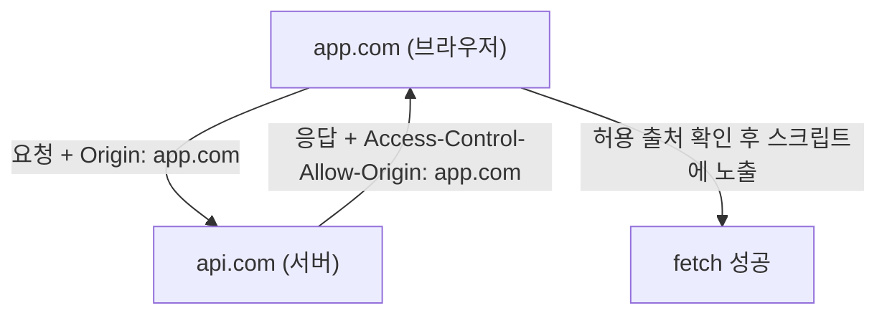
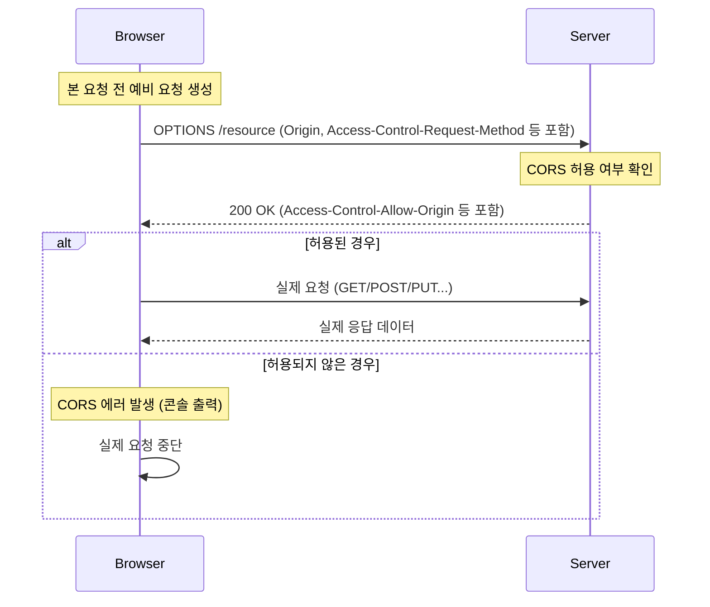
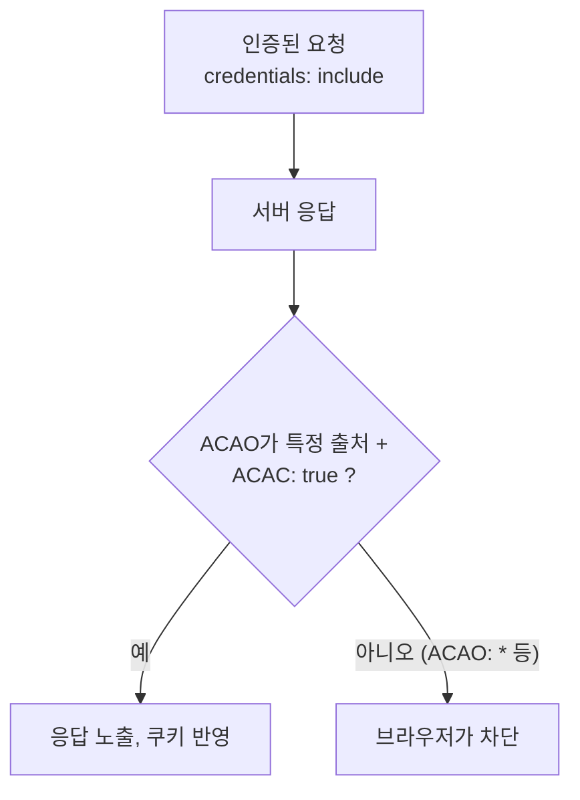
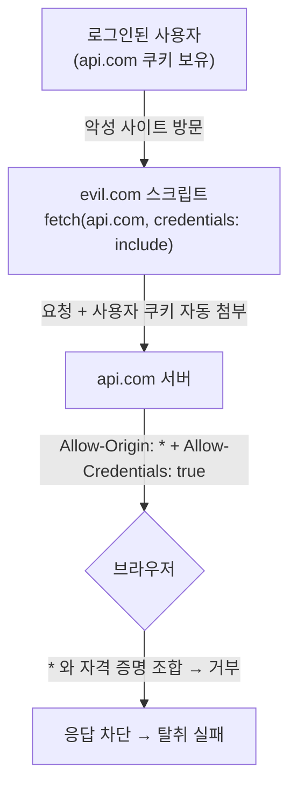

웹 애플리케이션은 보안을 위해 기본적으로 동일 출처 정책 (SOP)을 따르지만, 다른 출처의 리소스를 사용해야 하는 정당한 상황 (API 호출 등)을 위해 고안된 예외 조항이자 보안 메커니즘이다.

- 차단 주체는 서버가 아니라 브라우저로, 서버는 허용 헤더만 내려줄 뿐 응답을 스크립트에 노출할지는 브라우저가 결정
- 서버에 요청이 도달하는 것 자체를 막는 것이 아니라, 받아 온 응답을 스크립트가 읽도록 허용할지를 통제

## Same-Origin Policy (동일 출처 정책)

브라우저는 보안상의 이유로 스크립트에서 시작된 교차 출처 HTTP 요청을 제한하는 Same-Origin Policy (SOP) 정책을 따른다.

### SOP가 있는 이유

브라우저는 사용자가 로그인한 사이트의 쿠키를 요청에 자동으로 첨부하므로, 아무 제한이 없으면 악성 사이트의 스크립트가 그 쿠키로 다른 사이트의 응답을 읽어낼 수 있다.

- 막는 대상: 악성 사이트 스크립트가 사용자 인증 쿠키로 은행 등 다른 사이트의 응답을 `fetch`로 읽는 행위
- SOP는 한 출처에서 로드된 스크립트가 다른 출처의 리소스에 접근하는 것을 기본 차단하는 브라우저 보안 모델

반면 태그를 통한 단순 로드는 SOP가 막지 않는다.

- 허용: ``, `<script>`, `<link>` 태그를 통한 다른 출처 리소스 로드
- 태그는 리소스를 사용만 하고 응답 본문을 스크립트가 읽지는 못하므로, CDN·외부 폰트·이미지 호스팅이 정상 동작

### 출처 (Origin)의 정의

출처는 스킴 (scheme) + 호스트 (host) + 포트 (port) 세 가지의 조합이며, 이 중 하나라도 다르면 다른 출처 (Cross-Origin)로 간주된다.

- 다른 도메인 (example.com - test.com)
- 다른 하위 도메인 (example.com - store.example.com)
- 다른 포트 (example.com:80 - example.com:90)
- 다른 프로토콜 (https://example.com - http://example.com)

여기서 `https://example.com`과 `https://www.example.com`도 다른 도메인으로 간주되기 때문에 주의해야한다.

### 예시 (기준 `http://store.ogufamily.com`)

|                   URL                   |    Result    |        Reason        |
|:---------------------------------------:|:------------:|:--------------------:|
| http://store.ogufamily.com/babyogu.html | same origin  |   path만 다른경우    |
|   http://store.ogufamily.com/ogu.html   | same origin  |   path만 다른경우    |
|       https://store.ogufamily.com       | cross origin | 프로토콜이 다른 경우 |
|      http://store.ogufamily.com:81      | cross origin |   포트가 다른경우    |
|        http://news.ogufamily.com        | cross origin |  도메인이 다른경우   |

## CORS가 필요한 이유

SOP가 모든 교차 출처를 막아 버리면 API 서버와 프론트엔드 도메인이 다른 현대 웹 (예: `app.com` → `api.com`)이 동작할 수 없다.


```mermaid
flowchart TB
    C["app.com (브라우저)"] -->|" 요청 + Origin: app.com "| S["api.com (서버)"]
    S -->|" 응답 + Access-Control-Allow-Origin: app.com "| C
    C -->|" 허용 출처 확인 후 스크립트에 노출 "| OK[fetch 성공]
```

CORS는 서버가 응답에 특정 HTTP 헤더를 실어 "이 출처의 접근은 허용한다"고 선언함으로써 SOP를 안전하게 완화하는 메커니즘이다.

## CORS 동작 시나리오

CORS 요청은 브라우저가 자동으로 처리하며, 요청의 성격에 따라 크게 세 가지 시나리오로 나뉜다.

### 1. Simple Request (단순 요청)

예비 요청 (Preflight) 없이 바로 본 요청을 보내는 방식으로, 아래 조건을 모두 만족해야 한다.

|     항목     |                                                  조건                                                  |
|:------------:|:------------------------------------------------------------------------------------------------------:|
|    메서드    |                                     `GET`, `HEAD`, `POST` 중 하나                                      |
|     헤더     | CORS-safelisted 헤더만 사용 (`Accept`, `Accept-Language`, `Content-Language`, `Content-Type`, `Range`) |
| Content-Type |            `application/x-www-form-urlencoded`, `multipart/form-data`, `text/plain` 중 하나            |
|     기타     |                 `XMLHttpRequest.upload`에 이벤트 리스너 없음, `ReadableStream` 미사용                  |

이 중 하나라도 벗어나면 Preflight가 발생한다.

- 최신 웹 API는 대부분 `application/json`을 사용해 단순 요청 조건을 벗어나므로 Preflight가 발생하는 경우가 많음
- `Authorization` 같은 커스텀 헤더를 쓰거나 `PUT`·`DELETE`·`PATCH` 메서드를 쓰는 경우도 Preflight 대상

### 2. Preflight Request (예비 요청)

단순 요청의 조건을 만족하지 못할 경우 (예: `Content-Type: application/json` 또는 커스텀 헤더 사용), 브라우저는 실제 요청을 보내기 전에 안전한지 확인하기 위해 예비 요청을 먼저
보낸다.


```mermaid
sequenceDiagram
    participant Client as Browser
    participant Server
    Note over Client: 본 요청 전 예비 요청 생성
    Client ->> Server: OPTIONS /resource (Origin, Access-Control-Request-Method 등 포함)
    Note over Server: CORS 허용 여부 확인
    Server -->> Client: 200 OK (Access-Control-Allow-Origin 등 포함)

    alt 허용된 경우
        Client ->> Server: 실제 요청 (GET/POST/PUT...)
        Server -->> Client: 실제 응답 데이터
    else 허용되지 않은 경우
        Note over Client: CORS 에러 발생 (콘솔 출력)
        Client ->> Client: 실제 요청 중단
    end

```

1. 브라우저가 `OPTIONS` 메서드로 요청 정보 (Origin, Method, Header)를 담아 서버에 전송
2. 서버는 허용 여부를 담은 헤더 (`Access-Control-Allow-*`)와 함께 응답
3. 브라우저는 서버 응답을 확인하고 안전하다고 판단되면 실제 요청을 전송
4. 브라우저는 Preflight 결과를 `Access-Control-Max-Age` 시간만큼 캐싱하여 매번 예비 요청을 보내지 않도록 최적화

실제로 주고받는 요청·응답 헤더는 다음과 같다.

```http
OPTIONS /data HTTP/1.1
Origin: https://app.example
Access-Control-Request-Method: PUT
Access-Control-Request-Headers: content-type, authorization
```

```http
HTTP/1.1 204 No Content
Access-Control-Allow-Origin: https://app.example
Access-Control-Allow-Methods: PUT, GET, POST
Access-Control-Allow-Headers: content-type, authorization
Access-Control-Max-Age: 86400
```

#### Preflight가 필요한 이유

서버 상태를 바꾸는 요청을 검증 없이 바로 보내면, 요청이 서버에 도달하는 순간 이미 데이터가 변경될 수 있다.

- CORS는 응답을 읽는 것은 막지만, 요청이 서버에 도달하는 것 자체는 막지 못함
- 따라서 위험한 본 요청을 보내기 전에 허락을 먼저 구하고, 서버가 거부하면 본 요청을 아예 보내지 않음
- `GET`·`POST` 같은 단순 요청은 HTML form으로도 보낼 수 있어 이미 노출된 위험이라 사전 검증 없이 통과

#### Preflight 비용과 캐싱

Preflight는 본 요청마다 왕복이 한 번 더 늘어나는 비용이 있어, 결과를 캐시하는 수단을 제공한다.

- `Access-Control-Max-Age: 86400`은 같은 메서드와 헤더 조합의 Preflight 결과를 86400초 (24시간) 동안 캐시
- 캐시가 유효한 동안에는 `OPTIONS` 왕복을 생략하고 본 요청만 전송
- 단, 브라우저별 캐시 상한이 있어 지정값보다 짧게 적용될 수 있음

### 3. Credentialed Request (인증 정보를 포함한 요청)

인증된 요청은 메서드나 본문이 아니라 요청에 자격 증명을 실어 보내느냐로 구분된다.

- 자격 증명: 쿠키, HTTP 인증 (Authorization 기반 Basic 등), TLS 클라이언트 인증서
- 브라우저는 교차 출처 요청에 쿠키를 기본적으로 싣지 않으며, 명시적으로 켜야 전송

```javascript
// Fetch API
fetch(url, {credentials: "include"});
// XMLHttpRequest
xhr.withCredentials = true;
```

쿠키 등 자격 증명이 함께 가므로, 서버 설정에 추가 제약이 붙는다.

- `Access-Control-Allow-Origin`에는 와일드카드 (`*`)를 사용할 수 없으며, 요청을 보낸 정확한 Origin (예: `https://app.example`)을 그대로 명시
- `Access-Control-Allow-Credentials: true` 헤더가 함께 있어야 하며, 없으면 자격 증명을 보냈더라도 브라우저가 응답을 차단
- 둘 중 하나라도 어긋나면 응답은 스크립트에 노출되지 않음


```mermaid
flowchart TB
    R["인증된 요청<br/>credentials: include"] --> S[서버 응답]
    S --> C{"ACAO가 특정 출처 +<br/>ACAC: true ?"}
    C -->|예| OK["응답 노출, 쿠키 반영"]
    C -->|" 아니오 (ACAO: * 등) "| NG["브라우저가 차단"]
```

## 주요 응답 헤더

서버는 다음 헤더들을 통해 CORS 정책을 브라우저에 알린다.

|                헤더                |                      역할                      |
|:----------------------------------:|:----------------------------------------------:|
|   `Access-Control-Allow-Origin`    |    접근을 허용할 출처 (특정 출처 또는 `*`)     |
|   `Access-Control-Allow-Methods`   |      허용할 HTTP 메서드 (Preflight 응답)       |
|   `Access-Control-Allow-Headers`   |    허용할 커스텀 요청 헤더 (Preflight 응답)    |
| `Access-Control-Allow-Credentials` | 쿠키 등 자격 증명 포함 요청 허용 여부 (`true`) |
|      `Access-Control-Max-Age`      |        Preflight 결과를 캐시할 시간(초)        |
|  `Access-Control-Expose-Headers`   | 스크립트가 읽을 수 있게 노출할 응답 헤더 목록  |

기본적으로 스크립트는 안전 목록 (safelisted)에 속한 응답 헤더만 읽을 수 있어, 커스텀 헤더를 노출하려면 `Access-Control-Expose-Headers`에 명시해야 한다.

## 무차별 허용이 위험한 이유

CORS는 막혀 있는 것을 푸는 설정이라, 무작정 열면 SOP가 막아 주던 위협에 그대로 노출된다.

|                             설정                             | 자격 증명(쿠키) |                              결과                               |
|:------------------------------------------------------------:|:---------------:|:---------------------------------------------------------------:|
|               `Access-Control-Allow-Origin: *`               |     안 실림     | 모든 출처가 응답을 읽음 (공개 데이터면 무방, 내부망 API면 위험) |
| `Access-Control-Allow-Origin: *` + `Allow-Credentials: true` |      실림       |           브라우저가 응답을 차단 (CORS 표준에서 금지)           |

### `*`와 자격 증명을 함께 못 쓰는 이유

모든 출처를 열면서 쿠키까지 허용하는 `* + true`가 만약 동작한다면, 임의의 사이트가 사용자의 로그인 세션을 그대로 가로챌 수 있다.


```mermaid
flowchart TB
    U["로그인된 사용자<br/>(api.com 쿠키 보유)"] -->|악성 사이트 방문| E["evil.com 스크립트<br/>fetch(api.com, credentials: include)"]
    E -->|" 요청 + 사용자 쿠키 자동 첨부 "| S["api.com 서버"]
    S -->|" Allow-Origin: * + Allow-Credentials: true "| B{브라우저}
    B -->|" * 와 자격 증명 조합 → 거부 "| X["응답 차단 → 탈취 실패"]
```

1. 사용자가 `api.com`에 로그인한 상태 (쿠키 보유)로 악성 사이트 `evil.com`에 접속
2. `evil.com` 스크립트가 `fetch("https://api.com/me", { credentials: "include" })`를 실행하면 브라우저가 사용자 쿠키를 자동 첨부
3. 서버가 `Access-Control-Allow-Origin: *`와 `Allow-Credentials: true`로 응답

이 조합이 허용된다면 아무 사이트나 남의 쿠키로 내 API를 읽어 개인정보를 빼낼 수 있다.

- CORS 표준은 이 조합 자체를 금지해, 자격 증명이 실린 요청에 `Allow-Origin: *`이 오면 브라우저가 응답을 거부
- 자격 증명을 쓰려면 `*` 대신 정확한 출처 하나를 명시해야 함

### 안전한 사용

- 허용 출처는 와일드카드가 아니라 명시적 allowlist로 관리
- 자격 증명이 필요하면 출처를 정확히 명시하고, 불필요하면 `credentials`를 끄기

## 와일드카드 금지는 다른 헤더에도 적용

인증된 요청에서는 `Access-Control-Allow-Origin`뿐 아니라 다른 허용 헤더에서도 `*`가 와일드카드로 작동하지 않고 문자 그대로 해석된다.

|              헤더               |             인증된 요청에서의 제약              |
|:-------------------------------:|:-----------------------------------------------:|
|  `Access-Control-Allow-Origin`  |           `*` 불가, 특정 출처만 명시            |
| `Access-Control-Allow-Methods`  |          `*` 불가, `PUT, POST` 등 명시          |
| `Access-Control-Allow-Headers`  | `*` 불가, `content-type, authorization` 등 명시 |
| `Access-Control-Expose-Headers` |           `*` 불가, 노출할 헤더 명시            |

###### 참고자료

- [MDN](https://developer.mozilla.org/ko/docs/Web/HTTP/CORS)
