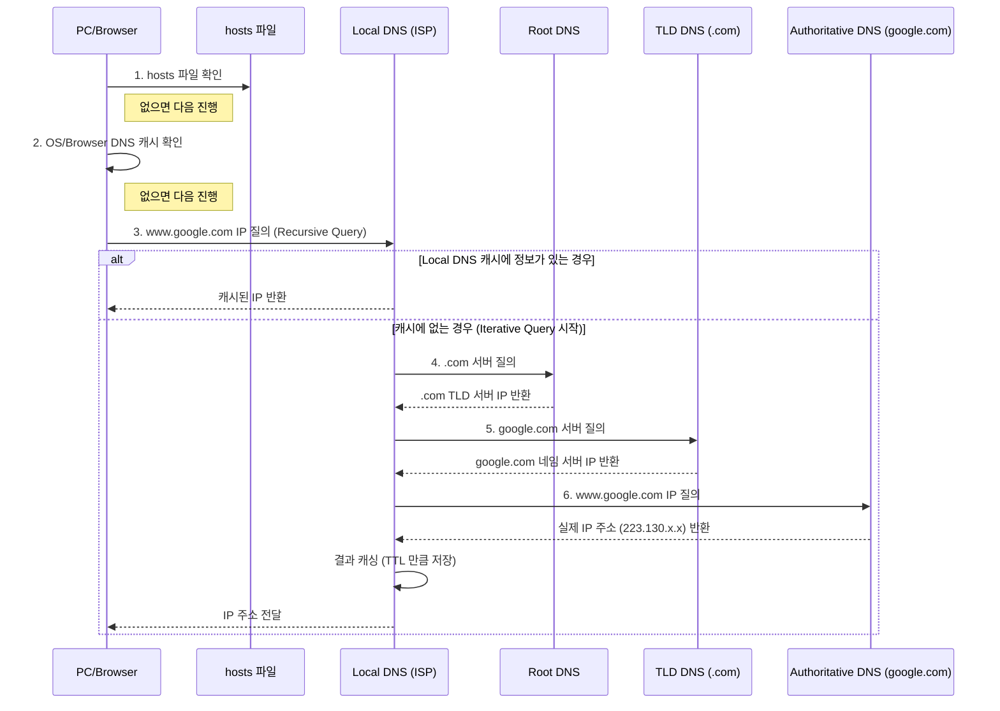

TCP/IP 네트워크 상에서 사람이 기억하기 어려운 IP 주소(예: 142.250.207.46) 대신, 기억하기 쉬운 도메인 이름을 사용하여 호스트를 식별할 수 있게 해주는 시스템이다.

- 핵심 역할: 도메인 이름을 IP 주소로 변환(Forward Zone)하거나, IP 주소를 도메인 이름으로 변환(Reverse Zone)하는 네임 레졸루션(Name Resolution) 수행
- 프로토콜: 주로 UDP 53번 포트를 사용 (데이터 크기가 512바이트를 초과하거나 Zone Transfer 시에는 TCP 53번 사용)

## 계층적 도메인 구조

DNS는 거대한 분산 데이터베이스 시스템으로, 역트리(Inverted Tree) 형태의 계층 구조를 가지며, 각 레벨은 `.`로 구분된다.

- 도메인 이름의 가장 오른쪽이 최상위 도메인(Top Level Domain) / 왼쪽으로 갈수록 하위 도메인(Sub Domain)
- 보통 사용되는 최상위 도메인은 `.com`, `.net`, `.org` 등 존재
- 최상위 도메인은 IANA(Internet Assigned Numbers Authority)에서 관리

|  레벨  |            명칭             |                    설명                     |             예시             |
|:----:|:-------------------------:|:-----------------------------------------:|:--------------------------:|
| Root |        Root Domain        | 도메인 체계의 최상위. 전 세계에 13개의 원본 루트 서버 클러스터가 존재 |          `.` (생략)          |
| 1단계  |  TLD (Top Level Domain)   |      국가 코드(ccTLD)나 일반 목적(gTLD)을 나타냄       |     `kr`, `com`, `org`     |
| 2단계  | SLD (Second Level Domain) |       조직의 종류나 성격을 나타냄 (국가 도메인인 경우)        | `co` (Company), `go` (Gov) |
| 3단계  |        Domain Name        |            사용자가 등록한 실제 도메인 이름             |         `example`          |
| 4단계  |   Hostname (Sub Domain)   |              특정 서버나 서비스를 식별               |    `www`, `blog`, `api`    |

## DNS 서버의 종류

DNS 서버는 도메인 이름을 IP 주소로 변환하는 역할을 하는데, 전세계적인 거대한 분산 시스템이라고 할 수 있다.

- DNS 서버는 계층 구조로 구성
- 사용자가 접속한 호스트의 도메인 이름을 가지고 있는 DNS 서버를 찾아가며 IP 주소 탐색(폴더 트리 구조와 비슷)
- 사용자가 가장 먼저 찾는 DNS 서버는 Local DNS 서버로, DHCP를 사용한다면 DHCP 서버가 자동으로 설정

아래의 4가지 주요 DNS 서버가 협력하여 도메인 이름을 IP 주소로 변환한다.

1. Local DNS (Recursive Resolver)
    - ISP(통신사)가 제공하거나 구글(8.8.8.8), 클라우드플레어(1.1.1.1) 등의 Public DNS를 사용
    - 클라이언트(PC)의 요청을 받아주는 첫 번째 서버
    - 캐싱 기능을 가지고 있어 자주 요청되는 도메인은 상위 서버에 묻지 않고 바로 응답
2. Root Name Server
    - TLD 서버의 IP 주소를 알고 있는 서버
    - 전 세계 인터넷의 도메인 시스템을 관장하는 최상위 서버
3. TLD Name Server
    - `.com`, `.kr` 등의 최상위 도메인을 관리하는 서버
    - 해당 도메인에 등록된 Authoritative Name Server의 위치를 알려줌
4. Authoritative Name Server (권한 있는 네임 서버)
    - 실제 도메인 소유자가 관리하거나 호스팅 업체가 제공하는 서버
    - 해당 도메인에 대한 실제 IP 주소(Record)를 가지고 있음 (가비아, AWS Route53 등에서 설정하는 곳)

## DNS 동작 원리(Name Resolution Process)

사용자가 브라우저 주소창에 `www.google.com`을 입력했을 때의 흐름이다.

###### 참고자료

- [현실 세상의 컴퓨터 공학 지식 - 네트워크](https://fastcampus.co.kr/dev_online_newcomputer)
