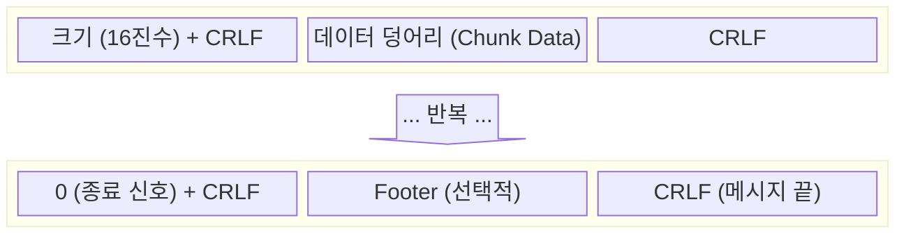

HTTP 상에서 데이터를 전송할 때, 전송 효율(압축)이나 보안을 목적으로 데이터를 변환하는 기술로, 주로 두 가지 방식이 있다.

- `Content Encoding`: 컨텐츠 자체를 압축/암호화
- `Transfer Encoding`: 전송 계층에서의 통신 방식 제어

## 컨텐츠 인코딩(Content Encoding)

엔티티 본문(Body)을 압축하여 전송 시간을 단축하고 대역폭을 절약하기 위한 기능이다.

- 주요 목적: 텍스트(HTML, CSS, JS, JSON) 파일의 용량 감소
    - 이미지는 이미 압축된 경우가 많아 효과가 미미
- 트레이드오프: 네트워크 대역폭 비용 절감 vs 암복호화에 따른 CPU 사용량 증가

### 협상 및 동작 과정

컨텐츠 인코딩은 아래의 과정을 거쳐 이루어진다.

1. 요청 (클라이언트 -> 서버):
    - `Accept-Encoding` 헤더를 통해 자신이 해독할 수 있는 압축 알고리즘 목록을 서버에 전달
    - 예: `Accept-Encoding: gzip, deflate, br`
2. 압축 및 응답 (서버 -> 클라이언트):
    - 서버는 클라이언트가 지원하는 알고리즘 중 하나를 선택(또는 미선택)하여 본문을 압축
    - `Content-Encoding` 헤더에 사용된 알고리즘을 명시
    - 압축으로 인해 본문 크기가 변하므로 `Content-Length` 헤더를 재계산하거나 `Transfer-Encoding: chunked` 사용
    - 예: `Content-Encoding: br`
3. 복원 (클라이언트):
    - 응답 헤더를 확인하고 해당 알고리즘으로 본문을 압축 해제하여 원본 데이터 획득

### 주요 압축 알고리즘

- gzip: 가장 널리 사용되는 표준 압축 방식(높은 호환성)
- deflate: zlib 구조를 기반으로 하는 압축 방식
- br (Brotli): 구글에서 개발한 최신 알고리즘(텍스트 처리에서 gzip보다 압축 효율이 뛰어나 현대 웹에서 선호)
- identity: 압축하지 않음(기본값)

## Transfer Encoding(전송 인코딩)

데이터가 네트워크를 통해 전송되는 방식 자체를 변경하여, 데이터가 전송되는 컨테이너의 구조를 바꾼다.

- 특징: 홉 간(Hop-by-Hop) 전송 방식. 즉, 클라이언트와 서버 사이의 프록시나 중계 서버마다 다르게 적용될 수 있음
- 주요 헤더:
    - `Transfer-Encoding`: 전송에 사용된 인코딩 방식
    - `TE`: 클라이언트가 수용 가능한 전송 인코딩 방식 (Accept-Transfer-Encoding의 역할)

과거에는 보안 목적 등으로도 사용하기도 했으나, 현재는 사실상 `chunked` 방식을 위해 존재한다.

## Chunked Encoding(청크 인코딩)

메시지 본문을 일정 크기의 덩어리(Chunk)로 쪼개서 순차적으로 전송하는 전송 인코딩 방식이다.

### 필요성

HTTP/1.1의 지속 커넥션 환경에서는 하나의 TCP 연결로 여러 요청을 처리하므로, 서버는 어디가 메시지의 끝인지 명확히 알려줘야 한다.

- 정적 컨텐츠: 파일 크기가 고정되어 있으므로 `Content-Length` 헤더로 길이 명시
- 동적 컨텐츠: 서버가 데이터를 생성하면서 보내야 하므로, 전송 시작 시점에 전체 길이를 알 수 없음
    - `Content-Length`를 사용할 수 없으므로 `Chunked Encoding`을 사용하여 스트리밍 전송 구현
    - `Transfer-Encoding: chunked` 헤더를 통해 청크 인코딩 사용을 알림

### 청크 인코딩의 전송 방식

청크 인코딩은 전체 크기를 알리는 대신, 각 덩어리의 크기를 먼저 보내고 데이터를 보낸다.

1. 전송할 본문을 버퍼에 담은 뒤 한 덩어리를 크기와 함께 전송
2. 본문을 모두 보낼 때까지 1번 과정을 반복
3. 마지막에 크기가 0인 청크로 본문이 끝났음을 알림

반복해서 보내는 청크들은 아래와 같은 형태로 구성된다.

1. 청크 구조: `[데이터 크기(16진수)]` + `CRLF` + `[실제 데이터]` + `CRLF`
2. 종료 신호: 크기가 `0`인 청크가 오면 전송이 끝난 것으로 간주

## Delta Encoding(델타 인코딩)

클라이언트가 가지고 있는 구버전 페이지와 서버의 신버전 페이지 간의 변경된 부분(Delta)만 전송하여 트래픽을 최적화하는 기술이다.

### 동작 메커니즘

1. 클라이언트는 자신이 가진 페이지의 버전(`ETag`)을 서버에 보냄
2. 서버는 최신 버전과의 차이점(Diff)을 계산
3. 차이점만 전송하고, 클라이언트는 이를 기존 페이지에 패치(Patch)하여 최신 상태로 만듦

### 관련 헤더

- 서버 측:
    - `ETag`: 문서 버전 식별자
    - `IM (Instance-Manipulation)`: 적용된 델타 알고리즘 명시
    - `Delta-Base`: 델타 생성의 기준이 된 문서의 ETag
- 클라이언트 측:
    - `If-None-Match`: 보유 중인 문서의 ETag
    - `A-IM (Accept-Instance-Manipulation)`: 지원하는 델타 알고리즘 목록

###### 참고자료

- [HTTP 완벽 가이드](https://kobic.net/book/bookInfo/view.do?isbn=9788966261208)
