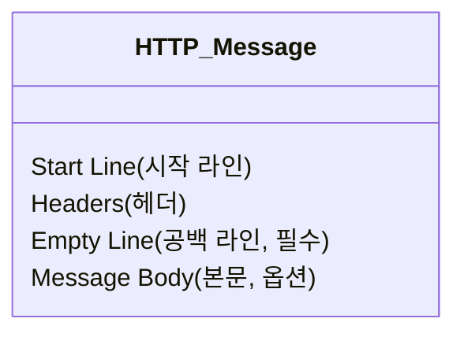

HTTP 메시지는 클라이언트와 서버 간에 데이터 교환을 위해 사용하는 규격화된 데이터 블록이다.

## 메시지의 흐름과 방향성

메시지가 어디서 와서 어디로 가는지에 따라 용어가 구분된다.

- 인바운드(Inbound): 메시지가 서버를 향해 들어오는 방향
- 아웃바운드(Outbound): 메시지가 처리를 마치고 클라이언트로 나가는 방향
- 업스트림(Upstream): 요청 데이터가 흘러가는 방향 (클라이언트 -> 서버)
- 다운스트림(Downstream): 응답 데이터가 흘러가는 방향 (서버 -> 클라이언트)

## HTTP 구조

요청(Request)과 응답(Response) 모두 크게 세 부분으로 나뉜다.

- Start Line: 메시지의 요약 정보 (무엇을 요청했는지, 성공했는지 등)
- Headers: 전송에 필요한 메타 데이터 (길이, 타입, 인증 정보 등)
- Empty Line: 헤더의 끝을 알리는 공백 (`CRLF`)
- Message Body: 실제 전송할 데이터 (HTML, JSON, 이미지 등)



### HTTP Request Message

```http
<Method> <Request-URI> <HTTP-Version>
<Headers>
<CRLF>
<Entity-Body>
```

- Method: 서버가 수행해야 할 동작 (GET, POST, PUT, DELETE 등)
- Request-URI: 요청하는 리소스의 경로 (Path + Query String)
- HTTP-Version: 사용하는 프로토콜 버전 (HTTP/1.1 등)

#### 예시

```http request
GET /index.html HTTP/1.1
Host: www.example.com
User-Agent: Mozilla/5.0 (Macintosh; Intel Mac OS X 10.14; rv:70.0) Gecko/20100101 Firefox/70.0
Accept: text/html,application/xhtml+xml,application/xml;q=0.9,*/*;q=0.8
Accept-Language: ko-KR,ko;q=0.8,en-US;q=0.5,en;q=0.3
Accept-Encoding: gzip, deflate, br
Connection: keep-alive
Upgrade-Insecure-Requests: 1
Cache-Control: max-age=0
```

### HTTP Response Message

HTTP Response Message의 형태와 예시는 다음과 같다.

```http request
<HTTP-Version> <Status-Code> <Reason-Phrase>
<Headers>
<CRLF>
<Entity-Body>
```

- HTTP-Version: 프로토콜 버전
- Status-Code: 처리 결과를 나타내는 3자리 숫자 (200, 404, 500 등)
- Reason-Phrase: 숫자로 된 상태 코드를 사람이 이해할 수 있게 설명하는 짧은 글 (OK, Not Found 등)

#### 예시

```http request
HTTP/1.1 200 OK
Date: Mon, 18 Nov 2019 07:28:00 GMT
Server: Apache/2.4.18 (Ubuntu)
Last-Modified: Mon, 18 Nov 2019 07:27:30 GMT
ETag: "1d3-5a115e6ee8400"
Accept-Ranges: bytes
Content-Length: 467
Vary: Accept-Encoding
Content-Type: text/html

<html>
  ...
</html>
```

## HTTP Header

HTTP 전송에 필요한 모든 부가정보를 담고 있으며, 메시지 내용/크기/압축/인증 등을 포함한다.

```http request
status line
request header field(|| response header field)
general header field
entity header field
etc..
CRLF
```

HTTP 헤더는 크게 아래와 같이 구분할 수 있으며, 각 분류 안에 많은 헤더 필드가 존재한다.

| 분류              |                   설명                   |                                 주요 예시                                 |
|:----------------|:--------------------------------------:|:---------------------------------------------------------------------:|
| General Header  |     요청과 응답 메시지 양쪽 모두에 적용되는 일반적인 정보     |     `Date` (생성 일시), `Connection` (연결 관리), `Cache-Control` (캐시 제어)     |
| Request Header  | 요청 메시지에서만 사용하며, 요청의 내용이나 클라이언트의 정보를 담음 |      `Host`, `User-Agent`, `Referer`, `Accept`, `Authorization`       |
| Response Header |  응답 메시지에서만 사용하며, 서버의 정보나 응답 부가 정보를 담음  |          `Server`, `Set-Cookie`, `Allow`, `Location`, `Vary`          |
| Entity Header   |     실제 전송되는 본문(Body) 데이터에 대한 상세 정보     | `Content-Type`, `Content-Length`, `Content-Encoding`, `Last-Modified` |

이 외에도 명세에 정의되지 않은 사용자가 직접 만들어 사용한 헤더인 `Extension Header`도 존재한다.

## Message Body(Entity Body)

실제 전송하려는 데이터가 담기는 곳이다.

- 모든 메시지가 바디를 가지는 것은 아님
    - GET, HEAD, DELETE 요청은 보통 바디가 없음
    - 204 No Content, 304 Not Modified 응답은 바디가 없음
- 데이터 타입은 텍스트뿐만 아니라 이미지, 영상, 파일 등 바이너리 데이터도 포함 가능 (`Content-Type` 헤더로 명시)

###### 참고자료

- [모든 개발자를 위한 HTTP 웹 기본 지식](https://www.inflearn.com/course/http-웹-네트워크)
- [그림으로 배우는 HTTP & Network Basic](https://kobic.net/book/bookInfo/view.do?isbn=9788931447897)
- [HTTP 완벽 가이드](https://kobic.net/book/bookInfo/view.do?isbn=9788966261208)
