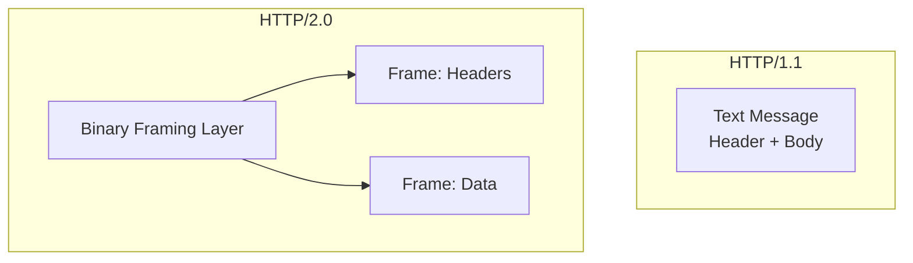

HTTP/1.1의 메시지 포맷은 구현이 쉽고 디버깅이 용이하다는 장점이 있었으나, 웹 환경이 복잡해짐에 따라 성능상의 한계가 드러났다.

- 커넥션 하나당 하나의 요청과 응답만 처리할 수 있는 구조: HOL(Head of Line) Blocking 문제 발생
    - 하나의 요청이 지연되면 뒤따르는 모든 요청이 지연
    - 병렬 커넥션으로 이를 완화하려 했으나, TCP 커넥션 수가 많아지며 오히려 네트워크 혼잡과 지연 증가
- 헤더의 비효율성: 중복되는 헤더 필드가 많아 네트워크 오버헤드 증가

위 문제를 해결하기 위해 2015년에 HTTP/2.0이 표준화되었다.

## 핵심 목표와 특징

기존 HTTP/1.1의 의미(Method, Status Code, Header 등)는 유지하면서 데이터 전송 방식을 획기적으로 개선하여 지연 시간(Latency)을 줄이고 성능을 극대화하는 것을 목표로 설계되었다.

1. 바이너리 프레이밍 계층(Binary Framing Layer)
    - 텍스트가 아닌 바이너리 단위로 데이터를 전송
    - 파싱 속도가 빠르고 오류 발생 가능성이 낮음
2. 멀티플렉싱(Multiplexing)
    - 단일 커넥션에서 여러 요청과 응답을 동시에 주고받음
    - HTTP/1.1의 HOL Blocking 문제 해결
3. 서버 푸시(Server Push)
    - 클라이언트가 요청하지 않은 리소스(CSS, JS 등)를 서버가 미리 전송 가능
4. 헤더 압축(Header Compression)
    - HPACK 알고리즘을 사용하여 중복되는 헤더를 압축 전송
5. HTTP/1.1 호환성
    - 기존 웹 애플리케이션들과 호환성을 최대한 유지하기 요청/응답 메시지의 의미를 최대한 같도록 유지

## HTTP/1.1과의 차이점

HTTP/2.0 역시 TCP 커넥션 위에서 동작하지만, HTTP/1.1과는 구조적으로 큰 차이가 있다.



가장 큰 변화는 애플리케이션 계층과 전송 계층 사이에 바이너리 프레이밍 계층이 추가된 것이다.

### 1. 프레임(Frame)과 바이너리 포맷

HTTP/2 통신의 최소 단위는 프레임으로, 기존의 줄바꿈으로 구분되던 텍스트 메시지가 잘게 쪼개져 바이너리 프레임으로 변환된다.

```
+-----------------------------------------------+
| R |       Length(14)      | Type(8) | Flag(8) |
+---------------+-------------------------------+
|R|   Stream Identifier(31)                     |
+-----------------------------------------------+
| Stream Payload                                |
+-----------------------------------------------+
```

- R(1bit): 예약된 필드 (항상 0)
- Length(24bit): 페이로드의 길이 (헤더 제외)
- Type(8bit): 프레임의 종류
- Flags(8bit): 프레임별 옵션 플래그
- Stream Identifier (31bit): 스트림 ID. 어떤 스트림에 속한 프레임인지 식별


### 2. 스트림(Stream)과 멀티플렉싱

스트림은 구성된 연결 내에서 전달되는 바이트의 양방향 흐름으로, 하나 이상의 메시지가 포함될 수 있다.

- 동작 방식
    - HTTP 메시지(요청/응답)를 여러 개의 프레임으로 분해
    - 각 프레임에 스트림 ID를 부여하여 전송
    - 수신 측에서는 스트림 ID를 보고 프레임을 다시 조립하여 메시지 복원
- 효과
    - 하나의 TCP 커넥션으로 수십 개의 요청과 응답을 동시에 처리 가능
    - 특정 요청이 느려져도 다른 요청에 영향을 주지 않음(HOL Blocking 해결)
    - 특정 스트림에 우선순위 지정 가능

### 3. 서버 푸시 (Server Push)

클라이언트가 HTML을 요청했을 때, 해당 페이지 렌더링에 필요한 CSS나 JavaScript 파일을 서버가 알아서 함께 보내는 기능이다.

- 클라이언트: `GET /index.html` 요청
- 서버: `/index.html` 응답 + (Push Promise) + `/style.css` + `/app.js` 전송
- 효과: 클라이언트의 추가 요청 대기 시간을 제거하여 로딩 속도 향상

## 보안 이슈

### 중개자 캡슐화 공격

HTTP/2 메시지를 프록시가 HTTP/1.1로 변환하여 백엔드 서버로 전달할 때 발생할 수 있는 보안 취약점이다.

- 원인: HTTP/2는 헤더 필드에 바이너리 데이터를 포함할 수 있는데, 이를 텍스트 기반인 HTTP/1.1로 변환하는 과정에서 유효성 검증이 미흡하면 개행 문자 등이 삽입되어 메시지 경계가 모호해질 수 있음
- 결과: 공격자가 요청을 밀어넣어 다른 사용자의 응답을 가로채거나 캐시를 오염시킬 수 있음


### 긴 커넥션 유지로 인한 개인정보 누출

단일 커넥션을 오래 유지하는 특성 때문에 개인 정보 누출 위험이 있어, 브라우저 벤더들은 이에 대응하기 위해 커넥션 유지 정책을 조정하기도 한다.

###### 참고자료

- [HTTP 완벽 가이드](https://kobic.net/book/bookInfo/view.do?isbn=9788966261208)
