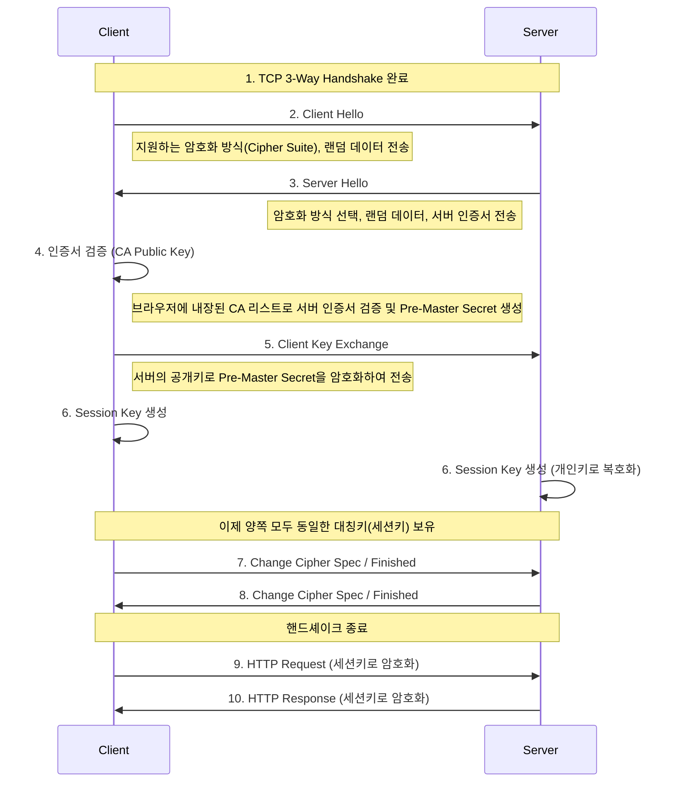

HTTP의 보안 취약점을 보완하기 위해 설계된 프로토콜이다.

- HTTP 프로토콜 내용 자체를 암호화하여 TCP/IP 통신을 수행
- SSL(Secure Socket Layer) 또는 TLS(Transport Layer Security) 보안 계층 위에서 동작

## HTTP의 보안 취약점

HTTP는 텍스트를 평문으로 전송하기 때문에 네트워크 스니핑(Sniffing)과 같은 공격에 취약하다.

1. 도청 가능(Confidentiality 침해)
    - TCP/IP 패킷은 통신 경로 상의 라우터나 네트워크 장비에서 탈취 가능
    - 패킷 캡처 도구(Wireshark 등)를 사용하면 로그인이 ID/PW 등을 쉽게 탈취할 수 있음
2. 위장 가능(Authentication 부재)
    - 클라이언트는 자신이 요청을 보낸 서버가 정말 네이버나 구글 같은 실제 신뢰할 수 있는 서버인지 확인할 방법이 없음
    - 공격자가 위조된 서버를 만들어 클라이언트를 속일 수 있음
3. 변조 가능(Integrity 침해)
    - 서버에서 보낸 데이터가 클라이언트에게 도착하기 전에 중간자(Man-in-the-Middle)가 데이터를 가로채 악성코드를 심거나 내용 변경 가능

## HTTPS의 핵심 원리

HTTPS는 위의 세 가지 문제를 해결하기 위해 SSL/TLS 프로토콜을 사용한다.

- 기밀성(Encryption): 데이터를 암호화하여 도청되더라도 내용을 알 수 없게 함
- 무결성(Integrity): 데이터가 전송 중에 변조되지 않았음을 보장 (MAC: Message Authentication Code 사용)
- 인증(Authentication): 신뢰할 수 있는 인증기관(CA)의 인증서를 통해 접속한 서버가 정당한 서버임을 보장

|          HTTP          |         HTTPS          |
|:----------------------:|:----------------------:|
|    HTTP - 애플리케이션 계층    |    HTTP - 애플리케이션 계층    |
|           -            |   SSL or TLS - 보안 계층   |
|      TCP - 전송 계층       |      TCP - 전송 계층       |
|      IP - 네트워크 계층      |      IP - 네트워크 계층      |
| 네트워크 인터페이스 - 데이터 링크 계층 | 네트워크 인터페이스 - 데이터 링크 계층 |

인코딩 및 디코딩 작업은 대부분 SSL 라이브러리 내부에서 처리되기 때문에, 웹 클라이언트나 서버가 별도로 크게 처리할 부분은 없다.

### 대칭키와 비대칭키의 혼용(하이브리드 암호화)

HTTPS는 속도와 보안의 균형을 맞추기 위해 두 가지 암호화 방식을 혼합하여 사용한다.

- 연결 수립 단계(Handshake): 공개키(비대칭키) 암호화 사용
    - 목적: 대칭키를 안전하게 공유하기 위함
    - 특징: 보안성은 높으나 계산 비용이 비싸고 속도가 느림
- 데이터 전송 단계: 대칭키 암호화 사용
    - 목적: 실제 HTTP 데이터를 빠르게 암호화하여 전송
    - 특징: 계산 비용이 저렴하고 속도가 빠름

### SSL과 TLS의 관계

- SSL(Secure Sockets Layer): 넷스케이프사가 개발한 초기 프로토콜로, 현재는 보안 취약점으로 인해 사용되지 않음
- TLS(Transport Layer Security): SSL을 표준화하여 발전시킨 프로토콜로, 현재는 TLS 1.2와 TLS 1.3이 주로 사용
- 실무에서는 관습적으로 SSL이라 부르지만, 실제로는 TLS 프로토콜을 의미

## HTTP / HTTPS 트랜잭션 비교

URL 프로토콜 스키마에 따라 HTTP/HTTPS로 통신하게 되며, 각각 아래와 같은 트랜잭션을 거치게 된다.

|  암호화되지 않은 HTTP 트랜잭션  |              암호화된 HTTPS 트랜잭션              |
|:--------------------:|:-----------------------------------------:|
| 서버의 80포트로 TCP 커넥션 수립 |           서버의 443포트로 TCP 커넥션 수립           |
|          -           |             SSL 보안 매개변수 핸드셰이크             |
| TCP를 통해 보내진 HTTP 요청  | SSL을 통해 보내진 HTTP 요청 / TCP를 통해 보내진 암호화된 요청 |
| TCP를 통해 보내진 HTTP 응답  | SSL을 통해 보내진 HTTP 응답 / TCP를 통해 보내진 암호화된 응답 |
|          -           |                 SSL 닫힘 통지                 |
|      TCP 커넥션 닫힘      |                TCP 커넥션 닫힘                 |

### SSL Handshake

TCP 3-way Handshake 이후에 TLS Handshake가 수행된다.(TLS 1.2 기준)

1. Client Hello: 클라이언트가 지원하는 암호화 방식 목록(Cipher Suite)과 난수(Random Value)를 전송
2. Server Hello: 서버가 암호화 방식을 선택하고, 자신의 인증서와 난수를 전송
3. 인증서 검증: 클라이언트는 CA의 공개키를 사용해 서버 인증서의 전자 서명을 검증
4. 키 교환: 클라이언트는 임시 비밀키(Pre-Master Secret)를 생성하고, 이를 서버 인증서에 있는 공개키로 암호화하여 전송
5. 세션키 생성: 서버는 자신의 개인키로 이를 복호화함. 이제 양쪽은 동일한 키(세션키)를 가지게 됨
6. 통신 시작: 이후 모든 HTTP 메시지는 이 세션키를 이용해 암호화되어 전송

최신 TLS 1.3은 보안이 취약한 알고리즘을 제거하고, 위 핸드셰이크 과정을 간소화하여(1-RTT) 연결 속도를 획기적으로 개선했다.

## 사이트 인증서 검사

SSL 자체는 사용자에게 인증서 검증 요구를 하지 않지만, 최신 웹브라우저 대부분이 인증서에 대해 기본적인 검사를 한 뒤 높은 수준의 검사를 하는 방법을 사용자에게 제공한다.

### 인증서 검사 절차

넷스케이프에서는 웹 서버 인증서 검사를 위한 알고리즘을 만들어 기초를 구축했으며, 수행 단계에서 아래의 검사를 수행한다.

- 날짜 검사: 인증서의 시작 및 종료일 검사
- 서명자 신뢰도 검사: 브라우저에 내장된 인증서 발급자 목록과 인증서 발급자의 이름을 비교(신뢰할 수 있는 발급자인지 검사)
- 서명 검사: 서명기관의 공개키를 서명에 적용하여 체크섬과 비교하여 무결성 검사
- 사이트 신원 검사: 인증서 복사 혹은 트래픽 중간자 공격을 막기 위해 인증서의 도메인 이름과 통신 중인 서버 호스트의 도메인이 일치하는지 검사

## [SSL(HTTPS)에 이용되는 디지털 암호학 기초](/docs/secure/digital-cryptography-basic/)

###### 참고자료

- [HTTP 완벽 가이드](https://kobic.net/book/bookInfo/view.do?isbn=9788966261208)
