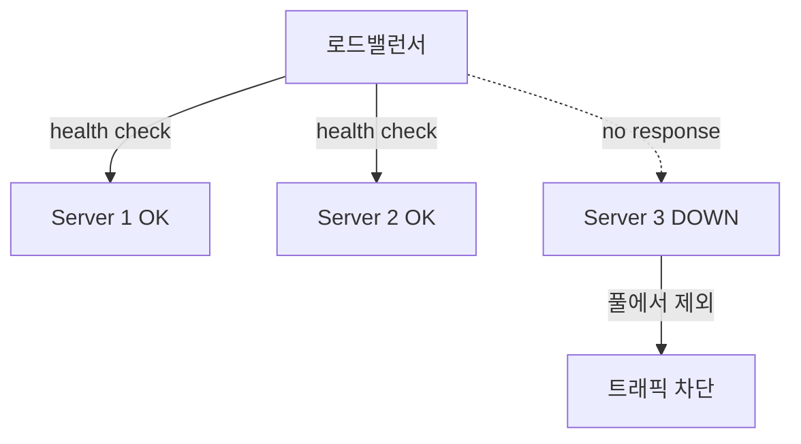
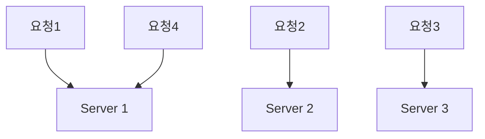
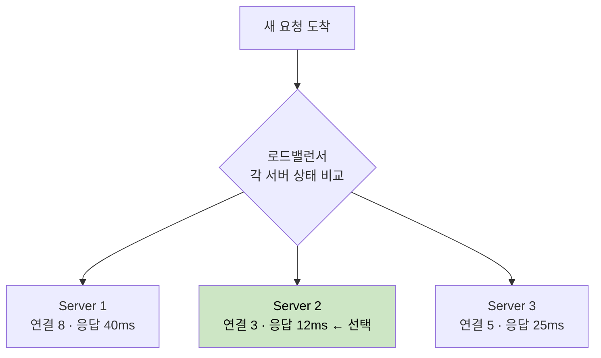
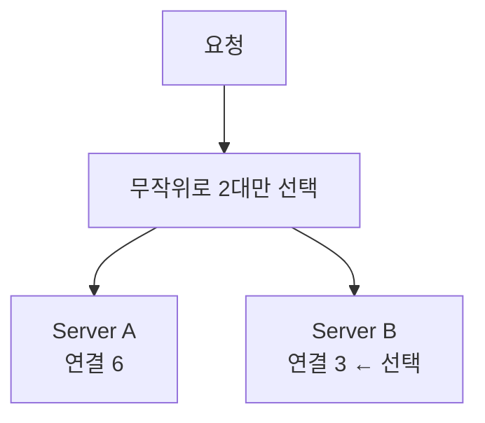
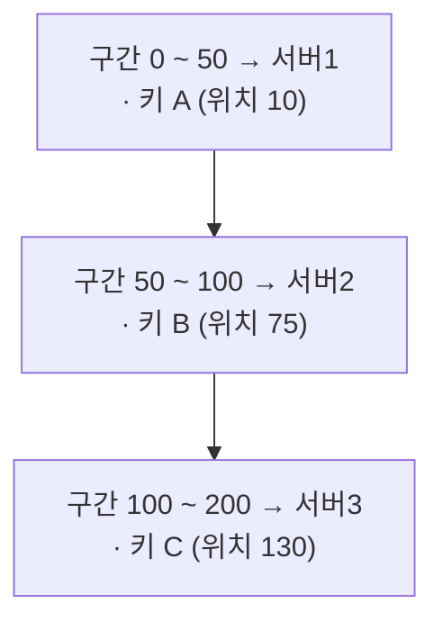
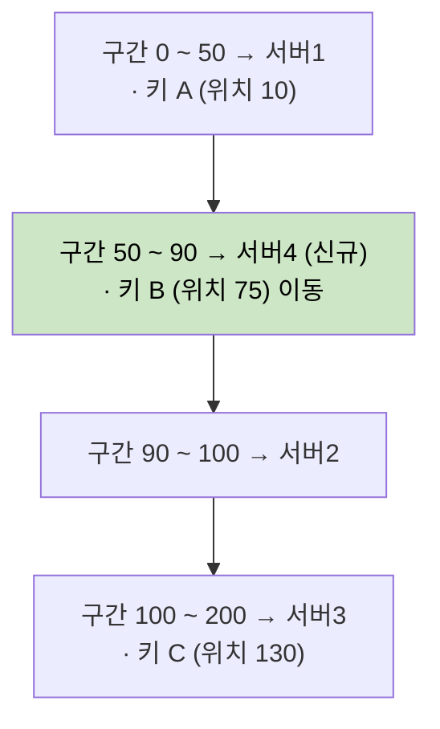

여러 서버 앞에서 들어오는 요청을 나눠 보내, 한 서버에 부하가 몰리는 것을 막는 장치다.

- 클라이언트는 로드밸런서의 단일 엔드포인트만 알면 되고, 뒤에 서버가 몇 대인지 알 필요가 없음
- 서버를 추가·제거하거나 장애가 발생해도 클라이언트가 보는 주소는 그대로 유지 → 무중단 확장·배포의 기반

## 로드밸런서와 프록시의 관계

로드밸런서는 리버스 프록시 중 부하 분산에 특화된 형태다.

|   관점    |   일반 리버스 프록시    |        로드밸런서        |
|:-------:|:---------------:|:-------------------:|
|  주된 목적  | 중계·캐싱·보안·SSL 종료 |   다수 서버로의 트래픽 분산    |
|  대상 서버  |   보통 단일 또는 소수   |   동일 역할의 서버 풀(다수)   |
|  헬스 체크  |       선택적       |  필수 (장애 서버 자동 제외)   |
| 분산 알고리즘 |       없음        | 라운드로빈·최소 연결 등 핵심 기능 |

- Nginx처럼 하나의 소프트웨어가 리버스 프록시이자 로드밸런서로 동시에 기능하기도 함
- 개념적으로는 부하 분산이 목적이냐 아니냐로 구분

## L4 vs L7

로드밸런서가 어느 계층의 정보를 보고 분산하느냐에 따라 성격이 갈린다.

|   구분   |   L4 (Transport)   |       L7 (Application)       |
|:------:|:------------------:|:----------------------------:|
| 판단 기준  | IP·포트 (TCP/UDP 헤더) |  HTTP 헤더·URL·쿠키·메서드 (페이로드)   |
| 처리 비용  |   낮음 (패킷 헤더만 검사)   |     높음 (페이로드 파싱·복호화 필요)      |
| 가능한 분산 |    포트 단위 단순 분산     | URL 경로별 라우팅, A/B 테스트, 카나리 배포 |
| 대표 예시  |  AWS NLB, L4 스위치   | Nginx, AWS ALB, API Gateway  |

- L4는 패킷 헤더만 보고 빠르게 전달하므로 처리량이 높지만, 요청 내용을 기반으로 한 라우팅은 불가능
- L7은 HTTP 본문까지 들여다보므로 경로·헤더 기반 라우팅·SSL 종료·캐싱이 가능하지만 그만큼 비용이 큼

## 로드밸런서의 역할

### 부하 분산

들어오는 요청을 여러 서버에 나눠 한 서버에 부하가 몰리는 것을 막는다.

- 단일 서버의 처리 한계(CPU·메모리·커넥션)를 넘는 트래픽을 여러 서버로 분산
- 특정 서버에 핫스팟이 생기지 않도록 트래픽을 고르게 배치

### 고가용성

헬스 체크로 서버 상태를 주기적으로 점검해 장애 서버를 자동으로 분산 대상에서 제외한다.

|   방식    |             동작              |        비용·정확도        |
|:-------:|:---------------------------:|:--------------------:|
| L4 헬스체크 |     TCP 연결 수립 가능 여부 확인      |  가벼움 / 프로세스 생존만 확인   |
| L7 헬스체크 | `/health` 같은 엔드포인트에 HTTP 요청 | 무거움 / 애플리케이션 동작까지 확인 |

- 헬스 체크에 실패한 서버를 풀에서 빼내 정상 서버로만 트래픽을 보냄 (Failover)
- 단, 로드밸런서 자체가 새로운 단일 장애점(SPOF)이 되므로 보통 Active-Standby·다중화로 이중화

### 확장성

클라이언트에 영향을 주지 않고 서버를 늘리거나 줄일 수 있다.

- 트래픽 증가 시 서버를 풀에 추가(scale-out)하면 로드밸런서가 자동으로 분산 대상에 포함
- 새 서버를 먼저 띄우고 → 헬스 체크 통과 후 트래픽 투입 → 구 서버를 제외하는 무중단 배포(롤링·블루그린)
- 오토스케일링과 결합해 부하에 따라 서버 수를 자동 조절

### 부가 역할 (L7)

|         역할          |                  설명                  |
|:-------------------:|:------------------------------------:|
| SSL/TLS Termination |  로드밸런서에서 복호화해 백엔드 부담 경감, 인증서 일괄 관리   |
|   세션 유지 (Sticky)    |    같은 클라이언트를 같은 서버로 고정 (쿠키·IP 기반)    |
|     콘텐츠 기반 라우팅      | URL·헤더로 요청을 적절한 서버 풀로 분기 (MSA 게이트웨이) |
|         캐싱          |        정적 응답을 캐시해 백엔드 요청 수 감소        |

## 분산 알고리즘 — 정적 vs 동적

|   구분    |      정적 (Static)       |       동적 (Dynamic)        |
|:-------:|:----------------------:|:-------------------------:|
|  판단 근거  |   사전 정의된 규칙·가중치 (고정)   |  서버의 실시간 상태 (연결 수·응답 시간)  |
|  상태 추적  |          불필요           |     필요 (각 서버 상태 모니터링)     |
|   비용    |           낮음           |    높음 (상태 수집·계산 오버헤드)     |
|   적응성   |      서버 부하 편차에 둔감      |       부하 변화에 즉각 적응        |
| 대표 알고리즘 | 라운드로빈, 가중 라운드로빈, IP 해시 | 최소 연결, 가중 최소 연결, 최소 응답 시간 |

### 라운드로빈 (Round Robin)

서버 목록을 순서대로 돌며 `1 → 2 → 3 → 1 ...` 순으로 요청을 하나씩 배정하는 가장 단순한 정적 방식이다.

상태를 추적하지 않고 순서 카운터 하나만 유지하면 되므로 분산 로직 중 가장 가볍다.

- 구현이 쉽고 서버 상태 추적이 없어 동적 알고리즘보다 오버헤드가 거의 없음
- 장기적으로 모든 서버가 동일한 요청 수를 받고, 분산 패턴이 결정적이라 예측 가능

단점은 서버 성능 차와 요청별 처리 비용 편차를 무시한다는 데 있다.

- 저성능 서버에도 같은 양을 배정 → 약한 서버가 과부하
- 무거운 요청이 한 서버에 몰리면 요청 수는 같아도 실제 부하는 불균형
- 매 요청이 다른 서버로 가므로 서버 로컬 세션을 쓰면 세션이 유지되지 않음

라운드로빈은 "요청 수"는 균등하게 나누지만 "실제 부하"는 균등하지 않을 수 있다는 것이 본질적 한계다.

#### 분산된 라운드로빈의 균등성 문제

라운드로빈의 균등 분배는 단일 카운터가 모든 요청을 순환시킬 때만 성립한다.

- 로드밸런서가 여러 대면 각 LB가 독립된 카운터를 돌려, 개별 LB는 균등해도 전역적으로 특정 서버에 겹쳐 쏠릴 수 있음
- DNS 라운드로빈은 리졸버·클라이언트의 캐싱과 TTL 때문에 한 IP로 트래픽이 오래 고정되어 분배가 고르지 않음

### 최소 연결·최소 응답 시간 (동적)

서버의 현재 상태를 보고 가장 여유로운 서버로 보내는 동적 방식으로, 활성 연결 수는 그 서버가 떠안은 일의 양에 대한 가장 싼 근사치다.

|        알고리즘         |           기준           |        적합한 상황         |
|:-------------------:|:----------------------:|:---------------------:|
|  Least Connection   |    활성 연결 수가 최소인 서버     |  요청별 처리 시간 편차가 큰 경우   |
| Least Response Time | 응답 시간(+연결 수)이 가장 빠른 서버 | 서버 성능·상태가 시시각각 변하는 경우 |

- 응답 시간 기반 분산은 보통 단순 평균이 아니라 EWMA(지수가중이동평균)로 추적해 단발성 측정값의 노이즈를 거름
- Linkerd·Envoy 같은 서비스 메시가 Peak EWMA를 기본 정책으로 채택

#### 동적 알고리즘과 분산 환경

최소 연결은 한 LB가 모든 연결 수를 안다는 전제에서만 정확하다.

- LB가 여러 대로 다중화되면 각 LB는 자기가 보낸 연결만 알고 전역 상태를 모름 → 같은 서버로 몰리는 쏠림 발생
- 그래서 대규모에서는 전역 상태에 의존하지 않는 확률적 방식이 오히려 안정적

## 섬세한 밸런싱

단순 라운드로빈이나 기본 동적 분산만으로 부족할 때, 서버 상태를 더 정교하게 반영하는 방법을 단계적으로 더한다.

- 디테일을 더할수록 트래픽이 고르게 분산되어 전체 처리량과 응답 시간이 개선
- 다만 상태 추적·계산 비용이 함께 늘어나므로, 트래픽 특성에 맞는 최소한의 정교함을 택하는 것이 중요

### 가중치로 성능 차 보정

서버 성능이 다르면 가중 라운드로빈·가중 최소 연결로 성능에 비례한 트래픽을 배정한다.

- 예: 8코어 서버에 가중치 2, 4코어 서버에 가중치 1 → 두 서버가 2:1 비율로 요청을 나눠 가짐
- 평균적인 성능 차는 보정하지만 실시간 부하는 모르고, 부하 패턴이 바뀌면 가중치를 수동으로 재조정해야 함

### 대규모에서의 비교 비용 절감 (P2C)

동적 알고리즘은 서버가 수백 대로 늘고 LB도 여러 대가 되면 두 가지 이유로 한계에 부딪힌다.

- 비교 비용: 매 요청마다 전체 서버를 훑어 가장 한가한 곳을 찾는 부담이 서버 수에 비례해 증가
- 쏠림(herd behavior): 여러 LB가 같은 순간 가장 한가한 한 대를 똑같이 골라, 상태가 갱신되기 전에 과부하

P2C(Power of Two Choices)는 전체를 비교하지 않고 무작위로 2대만 뽑아 그중 덜 바쁜 쪽을 고른다.

- 비교 대상이 항상 2대뿐이라 서버가 몇 대든 선택 비용이 일정
- 매번 뽑히는 2대가 달라 모두가 같은 서버로 몰리는 쏠림이 사라짐
- 확률 모델(balls into bins)상 가장 바쁜 서버의 부하가 `log N / log log N`에서 `log log N` 수준으로 급감
- Nginx(`random two` 디렉티브), Envoy, Twitter Finagle 등이 채택

### 상태 보존이 필요할 때 (안정 해싱)

세션·캐시 지역성 때문에 "같은 키는 같은 서버로" 보내야 할 때는 부하가 아니라 키를 기준으로 분산한다.

- 단순한 `hash(key) % N`은 서버 수 N이 바뀌면 나머지 값이 통째로 달라져 거의 모든 키가 재배치 (4대 → 5대 시 약 80%)
- 안정 해싱(Consistent Hashing)은 서버와 키를 같은 해시 링에 올리고, 키에서 시계 방향으로 가장 가까운 서버에 배정

링을 위치 순서대로 펼치면 구간(arc)의 나열이 되고, 각 구간은 그 끝에 놓인 서버가 담당한다.

서버4를 위치 90에 추가하면 50~100 구간만 둘로 쪼개지고, 그 사이에 있던 키 B만 서버4로 이동한다.

- 서버가 추가·제거돼도 영향받는 키는 인접 구간으로만 한정 → 재배치량이 전체의 `1/N` 수준
- 키 분포가 한쪽에 몰리면 특정 서버만 과부하되는 hot spot이 생길 수 있어, Consistent Hashing with Bounded Loads로 서버별 부하 상한을 둬 완화

### 트레이드오프 정리

|     방안     |       장점        |        단점        |
|:----------:|:---------------:|:----------------:|
|    가중치     |     성능 차 보정     |   수동 설정·재조정 부담   |
| 동적(최소연결 등) |    실시간 부하 균형    |    상태 추적 오버헤드    |
|    P2C     | 대규모에서 저비용·쏠림 완화 |  전역 최적은 아닌 근사 해  |
|   안정 해싱    |    상태 지역성 보존    | 부하 균일도가 떨어질 수 있음 |

- 요청·서버가 균일하면 굳이 동적 알고리즘을 쓸 이유가 없음
- 규모가 커지면 정확함(전체 비교)보다 확률적 근사(P2C)가 오히려 안정적
- 따라서 트래픽 특성에 맞는 최소한의 정교함을 택하는 것이 핵심

## 클라이언트 사이드 로드밸런싱

지금까지는 클라이언트와 서버 사이에 로드밸런서를 두는 서버 사이드 분산이지만, 호출하는 쪽이 직접 대상을 고르는 클라이언트 사이드 분산도 있다.

- 서버 사이드: 클라이언트 → 중앙 LB → 서버, 분산 결정을 중간의 LB가 담당
- 클라이언트 사이드: 클라이언트(LB 로직 내장) → 서버, 분산 결정을 호출하는 쪽이 담당

Spring Cloud에서는 이 일을 디스커버리와 분산이라는 두 컴포넌트로 나눠 처리한다.

- Eureka(서비스 디스커버리): 살아 있는 인스턴스 목록을 등록·조회하는 주소록 역할
- Spring Cloud LoadBalancer: 그 목록에서 한 대를 골라 호출하는 분산 주체 (기본 라운드로빈, 과거 Netflix Ribbon을 대체)
- `@LoadBalanced`를 붙인 RestTemplate·WebClient에 서비스 이름만 적으면, 중앙 LB를 거치지 않고 호출하는 쪽에서 직접 인스턴스를 골라 연결

|                장점                |                   단점                   |
|:--------------------------------:|:--------------------------------------:|
| 중앙 LB 홉이 없어 경로가 짧고 병목·단일 장애점이 없음 | 각 클라이언트가 전역 부하를 몰라 분산이 단순함 (기본 라운드로빈)  |
|   디스커버리와 결합해 인스턴스 증감에 자동으로 적응    |  LB 로직이 클라이언트에 내장돼 언어·프레임워크마다 구현이 필요   |
|   별도 LB 인프라 없이 애플리케이션 레벨에서 분산    | 인스턴스 목록을 캐싱하므로 갱신 지연 시 죽은 인스턴스로 호출할 위험 |

전역 부하를 모른다는 점은 다중 LB의 쏠림 문제와 같은 맥락이며, 그래서 클라이언트 사이드에서도 전역 상태가 필요 없는 단순·확률적 분산이 선호된다.
