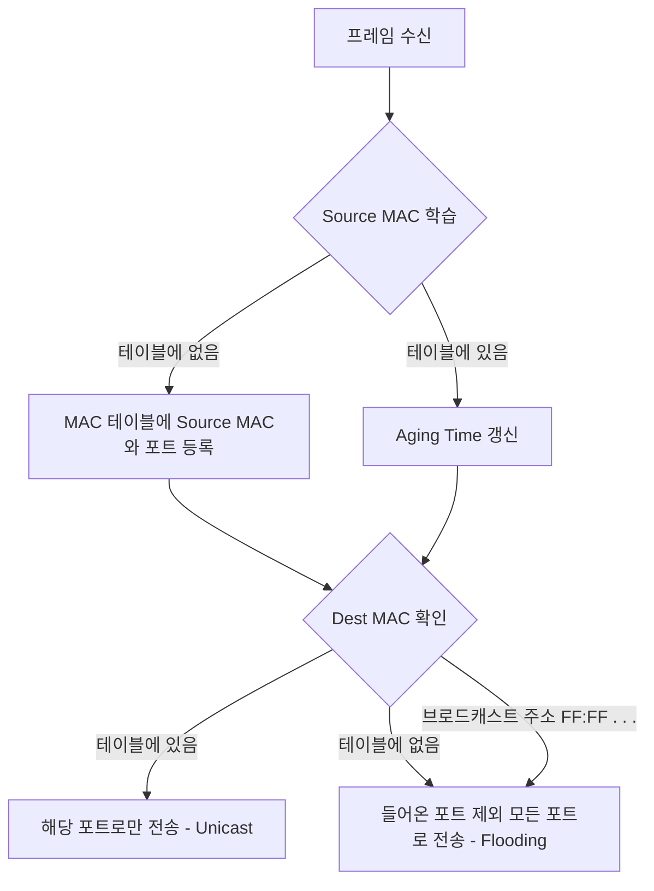

TCP/IP 모델의 최하위 계층으로, OSI 7계층의 물리 계층(Physical Layer)과 데이터 링크 계층(Data Link Layer)을 포함한다.

- 주요 역할
    - 논리 주소(IP)를 물리 주소(MAC)로 변환하고, 에러 제어 및 흐름 제어
    - 소프트웨어적인 데이터(패킷)를 전기 신호로 변환하여 물리적 매체를 통해 실제로 전송하는 역할
    - 각 장비들은 MAC 주소를 가지고 통신하며, 하나의 컴퓨터에 여러 개의 NIC(Network Interface Card) 존재 가능
- 전송 단위: 프레임(Frame)
- 식별자: MAC 주소(Media Access Control Address)
- 주요 프로토콜: Ethernet, Wi-Fi(802.11), PPP

## 이더넷

가장 대표적인 LAN 통신 기술로 데이터를 프레임이라는 단위로 캡슐화하여 전송하며, 각 필드는 데이터의 무결성과 목적지 도달을 보장한다.

```
| Preamble(8) | Dest MAC(6) | Source MAC(6) | EtherType(2) | Payload(46~1500) | FCS(4) |
```

- Preamble: 1과 0이 반복되는 비트열로, 수신 측과 송신 측의 클럭 동기화를 맞추고 프레임의 시작을 알림
- Destination MAC: 수신자의 물리적 주소 (6바이트)
- Source MAC: 송신자의 물리적 주소 (6바이트)
- EtherType: 상위 계층의 프로토콜 타입(IPv4, IPv6, ARP 등)을 식별 (0x0800: IPv4)
- Payload: 상위 계층(IP 계층)에서 내려온 데이터. 최소 46바이트에서 최대 1500바이트(MTU)
    - 데이터가 46바이트보다 작으면 패딩(Padding)을 채워 최소 길이를 맞춤
- FCS (Frame Check Sequence): 데이터 전송 중 에러 발생 여부를 확인하기 위한 CRC 값

## 네트워크 장비(Hardware)

TCP/IP 1계층에서 사용되는 네트워크 장비로는 허브(Hub)와 스위치(Switch)가 있다.

- 허브: OSI 1계층 장비로, 단순히 들어온 신호를 증폭하여 연결된 모든 포트로 전송
    - MAC 주소: 데이터 링크 계층이 아니기 때문에 MAC 주소 개념 X
    - 브로드캐스팅: 목적지를 확인하지 않고 모든 포트로 신호를 보냄 (Flooding)
    - 충돌 도메인(Collision Domain): 허브에 연결된 모든 장비는 하나의 충돌 도메인에 속하여, 장비가 많아질수록 통신 속도가 급격히 저하
    - Half-Duplex: 송신과 수신이 동시에 불가능하며, 충돌 위험이 있음
- 스위치: OSI 2계층 장비로, MAC 주소를 인식하여 목적지 포트로만 데이터를 전송
    - MAC 주소 테이블: 포트와 MAC 주소의 매핑 정보를 저장하여 관리
    - Full-Duplex: 송신과 수신을 동시에 수행 가능
    - 충돌 도메인 분리: 각 포트가 독립적인 충돌 도메인을 가짐
    - MAC 주소 학습 / VLAN 지원 / 충돌 X
    - 스위치의 종류
        - L2 Access switch
            - End-Point와 직접 연결되는 스위치
            - Mac 주소를 기반으로 스위칭
            - 대략 사무실 방 단위
        - L2 Distribution switch
            - L2 Access switch를 연결하는 스위치
            - VLAN(Virtual LAN) 기능 제공
            - 대략 사무실 층 단위

허브와 스위치의 차이점을 정리하여 표로 나타내면 아래와 같다.

|      특성      |           허브           |               스위치               |
|:------------:|:----------------------:|:-------------------------------:|
|    동작 계층     |     Physical (L1)      |         Data Link (L2)          |
|    주소 할당     |     없음 (MAC 주소 없음)     |      MAC 주소 사용하여 특정 포트로 전송      |
|    통신 방식     | Half-Duplex(한 번에 한 방향) |       Full-Duplex(동시 송수신)       |
|    전송 방식     |    Flooding (단순 복제)    | Unicast / Multicast / Broadcast |
|    트래픽 관리    |     모든 포트로 브로드캐스트      |        특정 포트로 트래픽 직접 전달         |
|     대역폭      |  모든 포트가 대역폭 공유 (1/N)   |        각 포트가 독립적 대역폭 보장         |
|      보안      |       패킷 스니핑에 취약       |       상대적으로 안전 (목적지로만 전송)       |
|    충돌 처리     |       CSMA/CD[1]       |              충돌 없음              |
| MAC 주소 학습[2] |           X            |                O                |
|  VLAN 지원[3]  |           X            |                O                |

### 1. CSMA/CD(Carrier Sense Multiple Access with Collision Detection)

이더넷의 반이중(Half-Duplex) 통신 환경(주로 허브)에서 충돌을 제어하는 알고리즘이다.

- Carrier Sense: 회선이 사용 중인지 감시
- Multiple Access: 비어 있으면 누구나 데이터 전송 가능
- Collision Detection: 전송 중 충돌이 감지되면 즉시 전송을 중단하고 잼(Jam) 신호를 보냄
- Backoff: 랜덤한 시간(Binary Exponential Backoff)만큼 대기 후 재전송 시도

### 2. MAC 주소 학습 기능

연결된 디바이스의 MAC 주소를 학습하고, 해당 MAC 주소를 가진 디바이스가 연결된 포트로만 프레임을 전송한다.

1. 플러딩: 허브와 같이 스위치에 연결된 모든 포트로 프레임을 전송
2. 포워딩과 필터링: 수신한 프레임의 목적지 MAC 주소를 참조하여 정확한 포트로 프레임을 전송하고, 해당 MAC 주소를 가진 디바이스가 연결된 포트로만 프레임을 전송
3. 에이징: 일정 시간 동안 프레임을 수신하지 못한 포트의 MAC 주소를 삭제

### 3. VLAN

물리적인 스위치 연결과 상관없이 논리적으로 네트워크(브로드캐스트 도메인)를 분할하는 기술이다.

- 목적: 보안 강화, 불필요한 브로드캐스트 트래픽 차단, 네트워크 관리 효율성 증대
- 802.1Q (Tagging): 이더넷 프레임의 Source MAC과 EtherType 사이에 4바이트의 VLAN 태그를 삽입하여 패킷이 어느 VLAN 소속인지 구분
- Trunk Port: 여러 VLAN의 트래픽을 하나의 물리적 링크로 전송하기 위해 사용하는 포트(스위치 간 연결에 주로 사용)

## 스위치의 동작 원리

스위치는 들어오는 프레임의 MAC 주소를 보고 다음 행동을 결정한다.



1. Learning (학습): 프레임의 출발지(Source) MAC 주소를 읽어, 해당 주소가 어떤 포트에 연결되어 있는지 MAC 테이블에 기록
2. Flooding (플러딩): 목적지(Destination) MAC 주소가 테이블에 없거나 브로드캐스트 주소인 경우, 유입된 포트를 제외한 모든 포트로 프레임 전송
3. Forwarding (전송): 목적지 MAC 주소가 테이블에 존재하면, 해당 포트로만 프레임 전송
4. Filtering (필터링): 목적지 포트 외의 다른 포트로는 프레임이 가지 않도록 방지
5. Aging (에이징): 테이블의 공간 효율성을 위해 일정 시간 동안 통신이 없는 MAC 주소 삭제

###### 참고자료

- [외워서 끝내는 네트워크 핵심이론 - 기초](https://www.inflearn.com/course/네트워크-핵심이론-기초)
- [현실 세상의 컴퓨터 공학 지식 - 네트워크](https://fastcampus.co.kr/dev_online_newcomputer)
