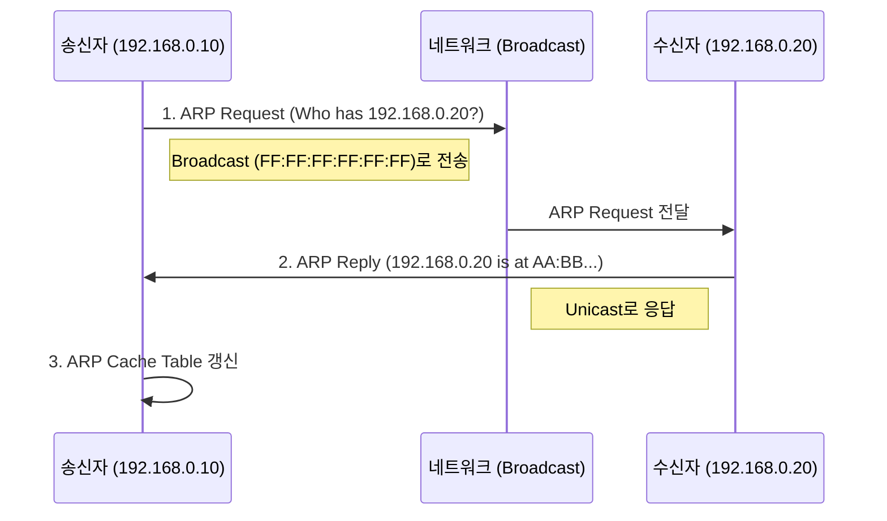
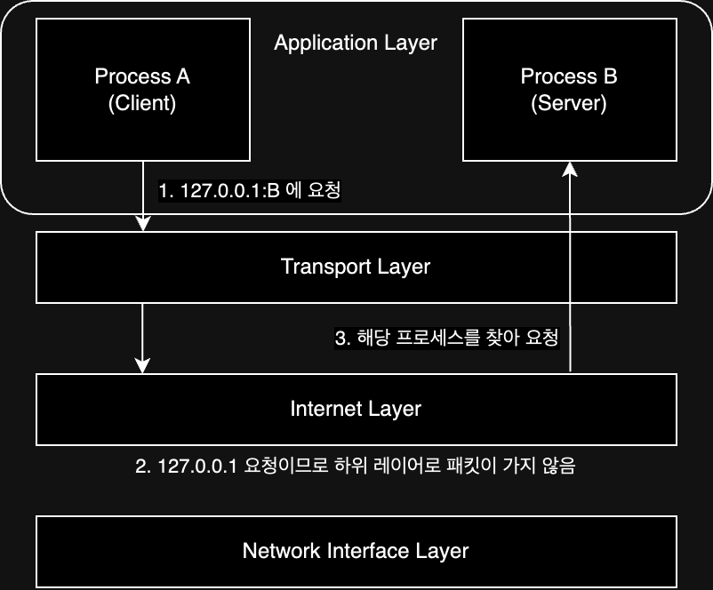

TCP/IP 모델의 2계층으로 OSI 7계층의 네트워크 계층(Network Layer)으로, 물리적 연결을 넘어 최종 목적지까지 데이터를 안전하고 빠르게 전달하는 것이 주 목적이다.

| 계층  |                       목적                       |
|:---:|:----------------------------------------------:|
| 1계층 |           인접한 장치 간의 통신 (Hop-by-Hop)            |
| 2계층 | 최종 목적지까지의 경로를 찾고 패킷을 전달하는 종단 간 통신 (End-to-End) |

- 핵심 역할: 논리적 주소(IP) 지정, 라우팅(Routing), 패킷 전달(Forwarding)
- 전송 단위: 패킷(Packet) 또는 데이터그램(Datagram)
- 주요 프로토콜: IP(IPv4/IPv6), ARP, ICMP, IGMP, 라우팅 프로토콜(OSPF, BGP 등)

## IP(Internet Protocol) 개요

인터넷상에서 데이터를 주고받기 위한 핵심 규약으로, 패킷 교환 방식을 사용하여 데이터를 전송하며, 비연결형(Connectionless)이자 비신뢰성(Unreliable) 특징을 가진다.

### MAC 주소와 IP 주소의 공존 이유

모든 네트워크 장비는 고유한 MAC 주소를 가지지만, 물리적 주소만으로는 거대한 네트워크에서 특정 장비의 위치를 파악하기 어렵다.

|    구분    |           MAC 주소           |           IP 주소            |
|:--------:|:--------------------------:|:--------------------------:|
|    정의    |  네트워크 장비에 할당된 고유한 물리적 주소   | 네트워크에 연결된 컴퓨터를 식별하는 논리적 주소 |
|  할당 주체   | 제조사가 하드웨어에 직접 할당 (Burn-in) |    네트워크 관리자 또는 ISP가 할당     |
| 변경 가능 여부 |        일반적으로 변경 불가능        |      변경 가능 (유동 IP 등)       |
|    길이    |        48비트 (6바이트)         |     일반적으로 32비트 (4바이트)      |

### IP의 한계와 보완

IP는 신속한 전송을 목적으로 하기에 목적지 도달, 순서, 에러 복구를 보장하지 않는다. 이를 상위 계층과 보조 프로토콜로 해결한다.

- 비신뢰성 보완: 상위 계층인 TCP가 패킷의 순서 재조립, 재전송 요청 등을 수행하여 신뢰성 보장
- 에러 통지 보완: ICMP 프로토콜을 사용하여 전송 실패 원인(목적지 도달 불가, 시간 초과 등)을 송신측에 통보

## IP 주소 체계(IPv4 vs IPv6)

IPv4 주소 고갈 문제로 IPv6가 등장했으나, 현재는 NAT 기술 등으로 인해 두 버전이 공존하는 상태다.

|  구분   |        IPv4        |           IPv6            |
|:-----:|:------------------:|:-------------------------:|
| 주소 길이 |    32비트 (4바이트)     |       128비트 (16바이트)       |
| 표기 방식 | 10진수 (192.168.0.1) | 16진수 (2001:0db8::ff00...) |
| 주소 개수 |      약 43억 개       | 약 3.4 x 10^38 개 (사실상 무한)  |
| 헤더 구조 |  가변 길이 (옵션 필드 존재)  |     고정 길이 (확장 헤더 사용)      |
| 보안 기능 |   IPSec 별도 설치 필요   |     IPSec 프로토콜 자체 내장      |

### IPv4 헤더 구조

- 단편화 관련 정보
    - 식별자: 단편화된 패킷 재조립 시 사용하는 고유값
    - 플래그: 단편화 여부 및 추가 조각 유무 표시
    - 단편화 오프셋: 원본 데이터 내에서의 위치 정보
- 제어 및 주소 정보
    - TTL(Time To Live): 라우터 통과 시마다 1씩 감소, 0 도달 시 패킷 폐기 및 ICMP 전송
    - 프로토콜: 상위 계층 프로토콜 명시 (TCP: 6, UDP: 17 등)
    - 헤더 체크섬: 헤더 오류 검출
    - 송신지/목적지 IP 주소

### IPv6 헤더 구조

- 페이로드 길이: 헤더를 제외한 데이터 길이
- 다음 헤더: 확장 헤더를 가리키며, 단편화/인증/암호화 등 필요 기능 추가 시 사용
- 홉 제한: IPv4의 TTL과 동일한 역할
- 송신지/목적지 IP 주소

## 단편화(Fragmentation)

네트워크 인터페이스마다 전송 가능한 최대 크기(MTU, 보통 1500byte)가 다른데, 라우터가 자신의 MTU보다 큰 패킷을 처리해야 할 때 이를 분할하여 전송하는 것을 단편화라 한다.

- 문제점: 분할된 패킷 중 하나만 손실되어도 전체 패킷을 재전송해야 하므로 성능 저하 유발
- 해결책: TCP 계층에서 `MSS(Maximum Segment Size)` 조정 또는 `Path MTU Discovery` 기술을 사용하여 단편화 방지

## ARP(Address Resolution Protocol)

논리적 주소(IP)를 통해 해당 장비의 물리적 주소(MAC)를 알아내는 프로토콜이다.

1. ARP 요청: IP 주소를 담아 브로드캐스트로 네트워크 전체에 질의
2. ARP 응답: 해당 IP를 가진 호스트가 자신의 MAC 주소를 유니캐스트로 응답
3. ARP 캐시 갱신: IP-MAC 매핑 정보를 테이블에 저장하여 재사용 (일정 시간 후 만료)

`동일 네트워크 내`의 호스트의 MAC 주소를 알아내기 위한 프로토콜이기 때문에, 다른 네트워크에 있는 호스트의 MAC 주소를 알아내기 위해서는 다른 프로토콜도 사용하여 통신하게 된다.

## IP 주소의 구조와 서브넷팅

IP 주소는 네트워크를 식별하는 `네트워크 주소`와 특정 기기를 식별하는 `호스트 주소`로 구성된다.

### 클래스풀(Classful) 주소 체계

과거에 사용되던 방식으로, 네트워크 크기에 따라 A, B, C 클래스로 나누어 고정된 길이를 사용했다.

- A Class: 대규모 네트워크 (네트워크 8비트 / 호스트 24비트)
- B Class: 중규모 네트워크 (네트워크 16비트 / 호스트 16비트)
- C Class: 소규모 네트워크 (네트워크 24비트 / 호스트 8비트)
- 단점: 주소 낭비가 심함

### 클래스리스(Classless) 주소 체계와 서브넷 마스크

주소 낭비를 줄이기 위해 등장한 현대적 방식이다. 서브넷 마스크를 이용해 네트워크 ID와 호스트 ID의 경계를 유동적으로 구분한다.

- 서브넷 마스크: IP 주소와 AND 연산을 수행하여 네트워크 주소를 추출하는 비트열
- CIDR 표기법: `192.168.100.103/30`과 같이 프리픽스 길이로 표기
- 계산 예시 (서브넷 마스크가 1인 비트가 네트워크 부분)
    - IP: `11000000.10101000.00001100.00101101`
    - Mask: `11111111.11111111.11111111.00000000`
    - Network: `192.168.12.0` / Host: `45`

## IP 주소 운용 및 할당

### 공인 IP와 사설 IP

- 공인 IP (Public IP): 인터넷 상에서 유일하게 식별되는 주소
- 사설 IP (Private IP): 내부망에서만 사용되는 주소. 인터넷 직접 접속 불가
    - 대역: `10.0.0.0/8`, `172.16.0.0/12`, `192.168.0.0/16`

### NAT (Network Address Translation)

사설 IP를 공인 IP로 변환하여 인터넷 통신을 가능하게 하는 기술이다. 주로 라우터(공유기)가 수행한다.

- 기능: IP 부족 문제 해결 및 내부망 보안 강화
- 포트 포워딩: 하나의 공인 IP를 여러 사설 IP가 공유할 때, 포트 번호로 통신을 구분

### DHCP (Dynamic Host Configuration Protocol)

네트워크 접속 시 호스트에게 IP 주소, 서브넷 마스크, 게이트웨이 등의 정보를 자동으로 할당해주는 프로토콜이다.

- 동작 과정 (DORA)
    1. Discover: 호스트가 DHCP 서버 탐색 (Broadcast)
    2. Offer: 서버가 할당 가능한 IP 제안
    3. Request: 호스트가 해당 IP 사용 요청
    4. Ack: 서버가 최종 승인 및 임대 확정

## 라우팅 (Routing)

패킷을 목적지까지 보낼 최적의 경로를 결정하고 전송하는 과정이다.

- 홉(Hop): 라우터와 라우터 사이의 구간
- 라우팅 테이블: 경로 판단의 기준이 되는 정보 저장소
    - 목적지 주소 및 서브넷 마스크
    - 게이트웨이: 다음으로 거쳐야 할 라우터 IP
    - 인터페이스: 패킷을 내보낼 포트
    - 메트릭: 경로 비용 (낮을수록 우선순위 높음)

## 루프백 (Loopback)

`127.0.0.1`로 예약된 IP 주소로, 자기 자신(Localhost)을 가리킨다. 외부 네트워크를 거치지 않고 운영체제 내부에서 통신이 이루어지며, 주로 서버 상태 점검이나 내부 프로세스 간 통신에 사용된다.

###### 참고자료

- [외워서 끝내는 네트워크 핵심이론 - 기초](https://www.inflearn.com/course/네트워크-핵심이론-기초)
- [현실 세상의 컴퓨터 공학 지식 - 네트워크](https://fastcampus.co.kr/dev_online_newcomputer)
