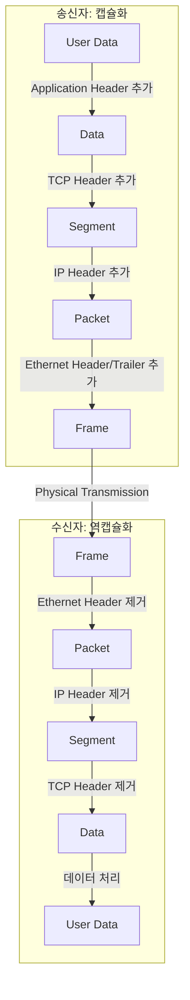
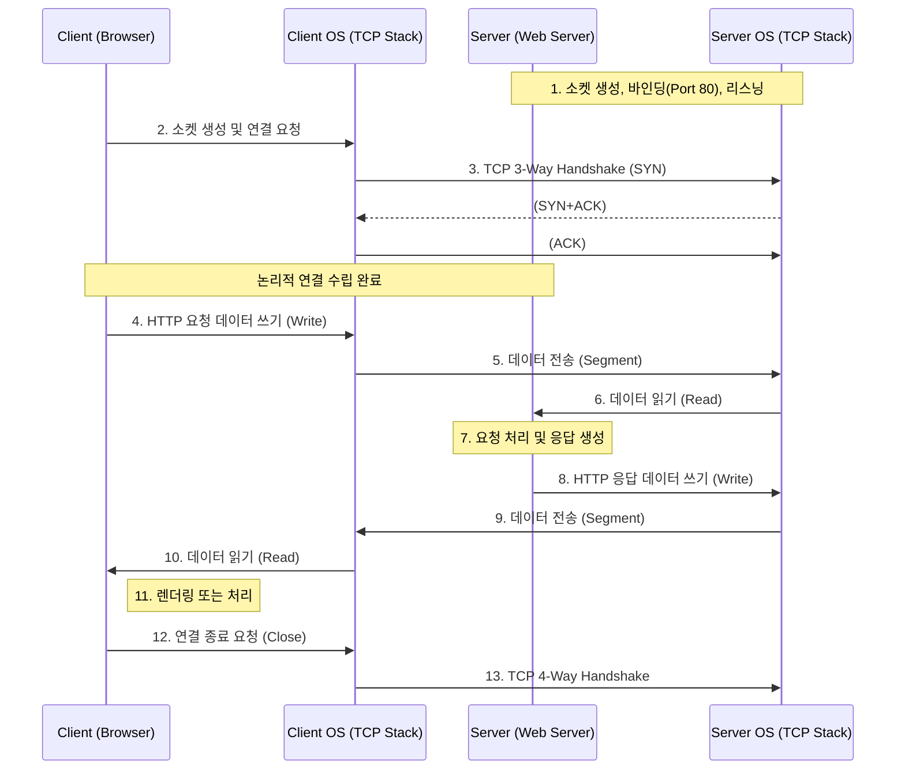

현대 네트워크 통신의 기반이 되는 프로토콜로, 이론적 모델인 OSI 7계층과 달리 실무적 구현과 효율성을 중시하여 설계되었다.

## 모델 구조 및 비교

OSI 7계층이 통신 과정을 논리적으로 세분화했다면, TCP/IP 4계층은 이를 실제 소프트웨어와 하드웨어 처리에 맞춰 단순화한 구조다.

- OSI 7계층: 국제 표준화 기구(ISO)에서 개발한 네트워크 프로토콜 스택 모델로, 네트워크 통신을 기능별로 7개의 계층으로 나눈 것
- TCP/IP 4계층: 실제 구현을 위해 만들어진 모델로, OSI 7계층을 이론적인 설계를 위해 만들어진 모델

OSI 7계층의 계층들을 TCP/IP 4계층에 맞게 재배치하면 아래와 같다.(OSI 7계층과 1:1 대응되지는 않음)

|     TCP/IP 계층     | OSI 7계층 대응 |          PDU (전송 단위)           |                     주요 역할                     |       주요 프로토콜        |
|:-----------------:|:----------:|:------------------------------:|:---------------------------------------------:|:--------------------:|
|    Application    | 5, 6, 7 계층 |         Data / Stream          |           응용 프로그램 간의 데이터 통신 및 포맷 결정           | HTTP, DNS, FTP, SSH  |
|     Transport     |    4 계층    | Segment (TCP) / Datagram (UDP) | 호스트의 프로세스 간 데이터 전송(End-to-End), 오류 제어 및 흐름 제어 |       TCP, UDP       |
|     Internet      |    3 계층    |             Packet             |         논리적 주소(IP) 지정, 라우팅을 통한 경로 설정          |    IP, ICMP, ARP     |
| Network Interface |  1, 2 계층   |             Frame              |         물리적 주소(MAC) 지정, 하드웨어 간 신호 전송          | Ethernet, Wi-Fi, DSL |

- Application Layer (응용 계층)
    - 사용자와 가장 가까운 계층으로, 서버와 클라이언트 간의 실제 응용 서비스 데이터를 처리
    - 데이터의 형식을 정의하거나 압축, 암호화 등의 처리
    - 소켓(Socket) 인터페이스를 통해 하위 계층인 전송 계층과 통신
        - 전송 단위인 Stream은 데이터의 시작은 있으나 끝은 정확하게 정의할 수 없고, 애플리케이션에서 정의하게 됨
        - 전송 데이터가 크면 여러 개의 Segment로 분할되어 전송됨(= Segmentation)
- Transport Layer (전송 계층)
    - 송신자와 수신자의 논리적 연결(Process-to-Process)을 담당
    - 포트(Port) 번호를 통해 어떤 애플리케이션으로 데이터를 전달할지 식별
    - 데이터의 무결성을 보장(TCP)하거나, 속도를 우선시(UDP)하는 전송 방식 결정
    - MSS(Maximum Segment Size)를 기준으로 데이터 분할
- Internet Layer (인터넷 계층)
    - 네트워크 간의 데이터 전송(Inter-networking) 담당
    - IP 주소를 사용하여 목적지 호스트까지의 최적 경로를 탐색(Routing)
    - 데이터가 올바르게 도착했는지 보장하지 않는 비연결성(Connectionless) 특징
- Network Interface Layer (네트워크 인터페이스 계층)
    - OSI의 물리 계층과 데이터 링크 계층을 포함
    - MAC 주소를 사용하여 인접한 노드 간의 데이터 전송 담당
    - LAN 카드와 같은 하드웨어 제어 및 케이블을 통한 물리적 신호 전송 수행

## 데이터 캡슐화 (Encapsulation)

데이터가 상위 계층에서 하위 계층으로 내려갈 때마다 해당 계층의 헤더(정보)가 붙는 과정을 캡슐한다.(반대는 역캡슐화)



TCP/IP 통신 과정에서 전송되는 데이터는 최종적으로 여러 계층의 헤더 정보를 포함한 형태로 전달된다.

```
- *IP 패킷 헤더
----- 버전 / 헤더 길이 / 서비스 유형 / 총 데이터그램 길이(바이트)
----- 패킷 ID / 플래그 / 플래그 오프셋
----- 유지 시간(TTL) / 상위 계층 프로토콜 / 헤더 체크섬
----- 발신지 IP 주소
----- 목적지 IP 주소
--------- *TCP 세그먼트 헤더
------------- 발신지 포트 / 목적지 포트
------------- TCP 순서 번호
------------- 편승(piggback) 확인 응답
------------- 헤더 길이 / 예약어 / URG / ACK / PSH / RST / SYN / FIN / 윈도우 크기
------------- TCP 체크섬
------------- 긴급 포인터
----------------- *TCP 데이터 조각
-------------------- HTTP 메시지
```

### 헤더 구조와 오버헤드

데이터가 전송될 때 실제 내용(Payload) 외에 각 계층의 제어 정보가 헤더로 붙어, 작은 데이터를 보낼 때도 헤더의 크기는 고정적이므로, 데이터가 너무 작으면 배보다 배꼽이 더 큰 오버헤드가 발생할 수 있다.

- Ethernet Header: 목적지 MAC, 발신지 MAC, 이더타입 등 (14 bytes)
- IP Header: 버전, 헤더 길이, TTL, 프로토콜, 발신지 IP, 목적지 IP 등 (20 bytes 이상)
- TCP Header: 발신지 포트, 목적지 포트, 시퀀스 넘버, ACK 넘버, 윈도우 크기, 플래그(SYN, ACK 등) (20 bytes 이상)

## 데이터 분할과 MTU/MSS

애플리케이션의 데이터(Stream)는 물리적 네트워크의 한계로 인해 한 번에 전송될 수 없으므로 적절한 크기로 쪼개서 전송하게 된다.

- MTU(Maximum Transmission Unit)
    - 네트워크 인터페이스(2계층)에서 한 번에 보낼 수 있는 최대 데이터 크기(이더넷 환경에서 기본값은 보통 1500 bytes)
    - IP 패킷의 크기가 MTU보다 크면 IP 계층에서 단편화(Fragmentation) 발생
        - 단편화 발생 시 라우터의 부하를 높이고 패킷 유실 시 전체 재전송을 유발하여 성능 저하의 원인이 됨
- MSS(Maximum Segment Size)
    - TCP(4계층)에서 전송할 수 있는 최대 페이로드 크기
    - IP 단편화를 방지하기 위해 TCP 연결 수립(3-way handshake) 과정에서 서로의 MSS를 교환하고 합의

## 소켓을 통한 HTTP 통신 흐름

웹 브라우저(클라이언트)가 웹 서버에 요청을 보내고 응답을 받는 과정은 OS가 제공하는 소켓 인터페이스를 통해 수행된다.



1. 서버 준비: 서버는 소켓을 생성하고 포트(80)에 바인딩(Bind)하여 클라이언트의 연결을 기다리는 리슨(Listen) 상태로 대기
2. 클라이언트 연결: 클라이언트는 서버의 IP와 포트로 연결(Connect)을 시도하며, 이 과정에서 TCP 3-way Handshake가 발생
3. 데이터 송수신: 연결이 수립되면 클라이언트는 요청 데이터를 소켓에 쓰고(Write), OS는 이를 패킷으로 만들어 전송 -> 서버는 소켓에서 데이터를 읽고(Read) 처리
4. 연결 종료: 데이터 교환이 끝나면 소켓을 닫고(Close), TCP 4-way Handshake를 통해 리소스를 정리
    - HTTP/1.1 Keep-Alive의 경우 연결을 유지하여 여러 요청을 처리할 수 있음

###### 참고자료

- [모든 개발자를 위한 HTTP 웹 기본 지식](https://www.inflearn.com/course/http-웹-네트워크)
- [HTTP 완벽 가이드](https://kobic.net/book/bookInfo/view.do?isbn=9788966261208)
