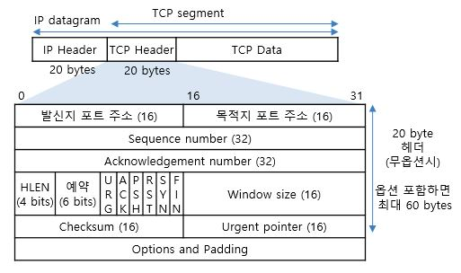
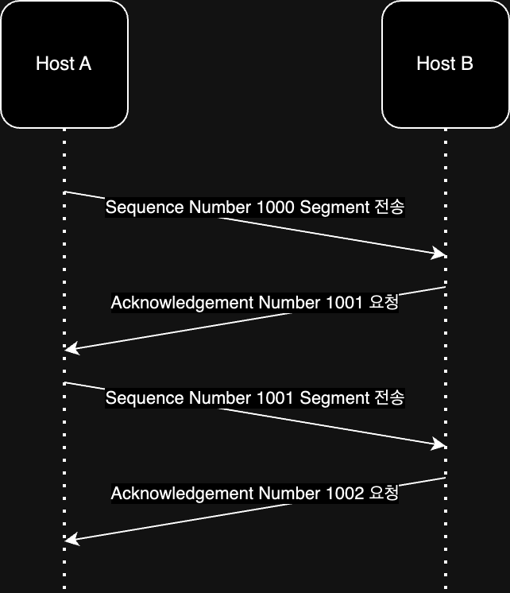
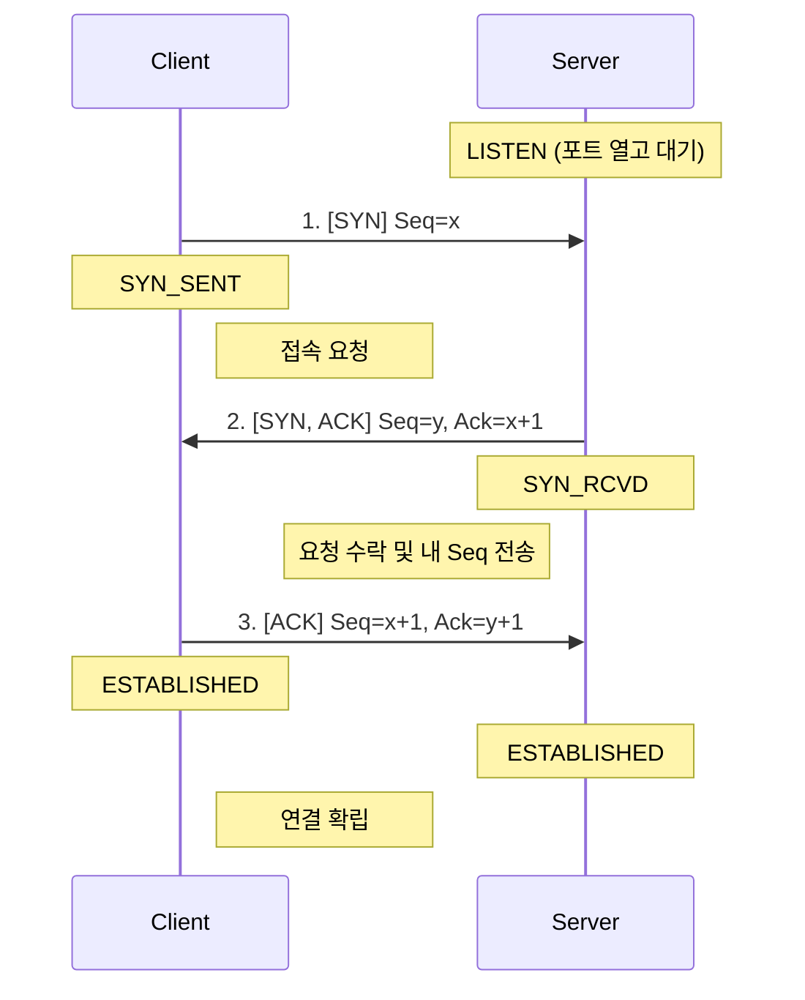
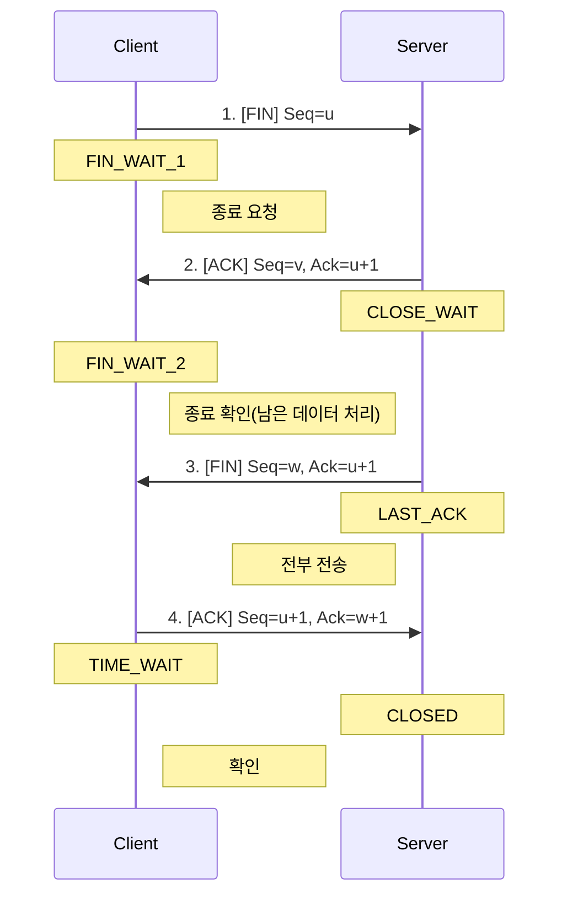
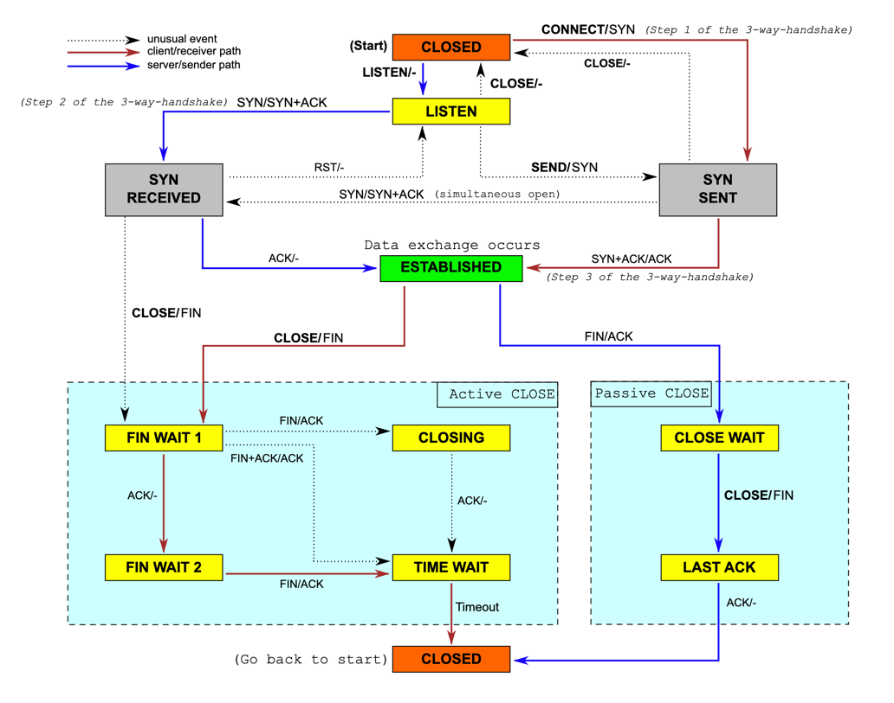

네트워크 계층(IP)이 호스트(PC) 간의 데이터 전달을 담당한다면, 전송 계층은 호스트 내에서 실행 중인 어떤 프로세스(애플리케이션)에게 데이터를 전달할지 결정하고 데이터의 신뢰성을 관리하는 계층이다.

- 멀티플렉싱/디멀티플렉싱: 여러 애플리케이션의 데이터를 묶어 보내거나(Sender), 받아서 구분해 전달(Receiver)
- 프로세스 식별: 포트(Port) 번호 사용
- 신뢰성 및 흐름 제어: TCP 프로토콜 사용

## PORT

단일 호스트 내에서 실행되는 프로세스를 구분하는 논리적인 식별자다.

- 16비트 주소 체계로 0 ~ 65535 범위를 가짐
- 하나의 포트는 하나의 프로세스만 점유 가능(일반적인 경우)

|            포트 종류             |      범위       |                     설명                      |
|:----------------------------:|:-------------:|:-------------------------------------------:|
| Well-known port(System Port) |   0 ~ 1023    |     잘 알려진 포트로, 특정 프로토콜에 할당된 포트(특정 프로토콜)     |
|       Registered port        | 1024 ~ 49151  | 위의 포트보다는 덜 범용적이지만 흔히 사용되는 포트(특정 기업의 애플리케이션) |
|         Dynamic port         | 49152 ~ 65535 |       사용자가 자유롭게 할당 가능한 포트(크롬 같은 브라우저)       |

IANA(Internet Assigned Numbers Authority)에서 관리하고 있으며, 포트 번호에 따라 특정 프로토콜이 할당되어 있다.  
[IANA](https://www.iana.org/assignments/service-names-port-numbers/service-names-port-numbers.xhtml)

## TCP(Transmission Control Protocol)

TCP는 전송 계층의 대표적인 프로토콜로, 신뢰성 있는 데이터 전송을 보장한다.

- 연결 지향(Connection-oriented): 통신 전 논리적인 연결 통로(Virtual Circuit) 먼저 생성
- 신뢰성(Reliability): 패킷 손실, 중복, 순서 바뀜 등을 감지하고 복구
- 세그먼트(Segment): 데이터를 전송하는 단위
    - TCP 헤더와 Payload(애플리케이션 계층에서 전달받은 데이터)로 구성
    - MSS(Maximum Segment Size): IP 계층에서의 단편화를 막기 위해 TCP 레벨에서 데이터를 자르는 최대 크기

### TCP Segment 헤더 구조

헤더는 최소 20바이트에서 옵션에 따라 최대 60바이트까지 가질 수 있다.

- Sequence Number: 데이터의 순서를 보장하기 위한 번호. 전송하는 데이터의 시작 바이트 위치를 나타냄
- Acknowledgement Number (ACK): 다음에 수신하기를 기대하는 바이트 번호 (상대방에게 '여기까지 잘 받았다'는 의미)
- Window Size: 수신 측의 버퍼 여유 용량을 알려주어 흐름 제어에 사용
- Control Flags: 6개의 비트로 통신 상태 제어
    - SYN: 연결 요청
    - ACK: 응답 확인
    - FIN: 연결 종료
    - RST: 연결 강제 초기화 (비정상 종료 시)
    - PSH: 버퍼가 차기를 기다리지 않고 즉시 데이터 전달
    - URG: 긴급 데이터 처리

### TCP Segment Sequence

TCP는 전송 순서를 보장하기 위해 Sequence Number와 Acknowledgement Number를 사용하며, 아래와 같은 흐름으로 동작한다.

### UDP(User Datagram Protocol)

TCP의 복잡한 기능을 제거하고 단순한 데이터 전송에 집중한 프로토콜이다.

- 비연결형: 핸드셰이크 과정 없음
- 비신뢰성: 수신 여부 확인(ACK)이나 순서 보장, 흐름 제어를 하지 않음
- 헤더가 가볍고(8바이트) 전송 속도가 빠름
- 활용: 실시간 스트리밍, DNS, 온라인 게임, 그리고 HTTP/3(QUIC)의 기반 프로토콜

|            TCP             |          UDP           |
|:--------------------------:|:----------------------:|
| 연결 지향(Connection Oriented) | 비연결 지향(Connectionless) |
|           신뢰성 보장           |        신뢰성 보장 X        |
|           순서 보장            |        순서 보장 X         |
|           흐름 제어            |        흐름 제어 X         |
|           혼잡 제어            |        혼잡 제어 X         |
|           느린 성능            |         빠른 성능          |

## TCP 연결 관리 (Connection Management)

TCP는 안정적인 연결을 위해 3-way Handshake로 연결을 맺고, 4-way Handshake로 연결을 끊는다.

### 연결 수립: 3-Way Handshake

통신을 시작하기 전, 양쪽의 논리적 연결을 맺고 서로의 시작 Sequence Number(ISN)를 교환하는 과정이다.

### 연결 해제: 4-Way Handshake

데이터 전송이 끝난 후 리소스를 정리하는 과정이다. 양방향 통신이므로 송/수신 연결을 각각 독립적으로 닫는다.

- TIME_WAIT: 클라이언트가 마지막 ACK를 보내고 일정 시간(보통 2MSL, 1~2분) 동안 소켓을 닫지 않고 기다리는 상태
    - 이유 1: 마지막 ACK가 유실되어 서버가 FIN을 재전송할 경우를 대비
    - 이유 2: 네트워크에 떠돌던 지연 패킷이 뒤늦게 도착해 다음 연결의 데이터와 섞이는 것을 방지

### TCP 상태와 흐름

|      상태      |                          설명                          |
|:------------:|:----------------------------------------------------:|
|    CLOSED    |                    아무런 연결이 없는 상태                     |
|    LISTEN    |      SYN 세그먼트를 기다리는 상태, 보통 서버 호스트가 요청을 기다리는 상태       |
|   SYN-SENT   |         SYN 세그먼트를 보낸 뒤 SYN-ACK 세그먼트를 기다리는 상태         |
| SYN-RECEIVED |         SYN-ACK 세그먼트를 보낸 뒤 ACK 세그먼트를 기다리는 상태         |
| ESTABLISHED  | 연결이 수립된 상태로, Three-way Handshake가 완료되어 데이터를 송수신하는 상태 |

그 외에 FIN-WAIT-1,2 / CLOSE-WAIT / LAST-ACK / TIME-WAIT 는 연결 해제 과정에서 사용되는 상태이며, 종료되면 CLOSED 상태가 된다.

## TCP 신뢰성 보장 메커니즘

신뢰성 있는 데이터 전송을 보장하기 위해 재전송 기반의 오류 제어, 흐름 제어 / 혼잡 제어를 사용한다.

### 1. 오류 제어 (Error Control) - ARQ(Automatic Repeat Request)

TCP는 중복된 ACK 세그먼트를 수신했을 때나 타임아웃이 발생했을 때 잘못 전송되었음을 감지하고, 재전송을 하게 된다.

- Stop-and-Wait ARQ
    - 송신자가 데이터를 전송하고, 수신자가 ACK를 전송할 때까지 기다리는 방식
    - 제대로 보냈음을 확인하면 다음 데이터를 전송
    - 전송 -> ACK -> 전송 -> ACK -> 전송 -> ACK -> ...
    - 네트워크 효율이 낮아져 사용하지 않음
- Go-Back-N ARQ
    - 파이프라이닝 방식으로 여러 개의 세그먼트를 전송하고, 수신자가 올바른 세그먼트에 대해서 ACK를 전송하는 방식
    - 올바르지 않은 세그먼트가 수신되면 그 이후의 세그먼트를 폐기하고, 해당 세그먼트 이후의 세그먼트를 재전송(N번째에서 오류 시 N번째 이후에 대해 폐기 및 재전송)
- Selective Repeat ARQ
    - 파이프라이닝 방식으로 여러 개의 세그먼트를 전송하고, 수신자가 올바른 세그먼트에 대해서 ACK를 전송하는 방식
    - 올바르지 않은 세그먼트가 수신되면 그 세그먼트만 재전송
    - Go-Back-N ARQ에 비해 복잡하지만, 네트워크 효율이 높아 사용

### 2. 흐름 제어 (Flow Control) - Sliding Window

수신자는 버퍼가 가득 차서 데이터를 처리하지 못하게 되는 것을 방지하기 위해, 수신 측의 처리 속도에 맞춰 송신 속도를 조절하는 기술이다.

- 수신 측은 ACK를 보낼 때 자신의 남은 버퍼 크기(Window Size)를 헤더에 담아 전송
- 송신 측은 이 윈도우 크기 내에서 ACK 없이 연속적으로 데이터를 전송 가능
- 윈도우 크기가 0이 되면 전송을 중단하고 주기적으로 윈도우 갱신 패킷(Probe)을 전송

### 3. 혼잡 제어 (Congestion Control)

네트워크 자체의 혼잡 상태를 파악하여 송신 속도를 조절하는 기술로, 라우터에 데이터가 몰려 패킷 유실이 발생하는 것을 방지한다.

- Slow Start: 연결 초기에는 패킷을 하나만 보내고, ACK를 받을 때마다 윈도우 크기(Congestion Window)를 2배씩 지수적으로 증가시킴
- Congestion Avoidance: 특정 임계치(Threshold)에 도달하면 선형적으로 증가시킴
- Fast Retransmit/Recovery: 타임아웃 전이라도 중복된 ACK가 3번 연속 오면 즉시 재전송하고 윈도우 크기를 줄여 혼잡 상황에 대처

## TCP와 성능 이슈

HTTP는 TCP 위에서 동작하므로 TCP의 구조적 특징이 웹 성능에 직접적인 영향을 준다.

- Handshake Latency: 매 연결마다 3-way handshake가 발생하여 RTT(왕복 시간)가 증가
    - 해결: HTTP Keep-Alive를 통해 한 번 맺은 연결을 재사용
- HOL Blocking (Head of Line Blocking): 앞선 패킷이 유실되면 뒤의 패킷들이 멀쩡해도 처리를 못 하고 대기해야 함 (TCP의 순서 보장 특성)
    - 해결: HTTP/3(QUIC)에서는 UDP 기반으로 이를 해결
- Nagle 알고리즘: 작은 패킷을 여러 개 보내는 오버헤드를 줄이기 위해, 버퍼가 찰 때까지 기다렸다가 전송하는 알고리즘
    - 문제: 실시간성이 중요한 온라인 게임이나 반응형 웹에서는 지연(Latency) 유발
    - 해결: `TCP_NODELAY` 옵션으로 Nagle 알고리즘 비활성화

###### 참고자료

- [현실 세상의 컴퓨터 공학 지식 - 네트워크](https://fastcampus.co.kr/dev_online_newcomputer)
- [HTTP 완벽 가이드](https://kobic.net/book/bookInfo/view.do?isbn=9788966261208)
