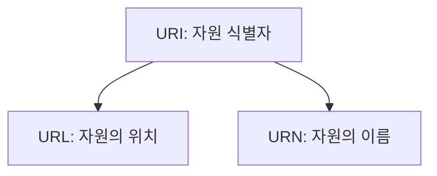

URI(Uniform Resource Identifier)는 웹 애플리케이션과 네트워크에서 리소스를 식별하는 데 사용되는 문자열로, API 엔드포인트, 이미지, 문서 등 다양한 자원을 가리킨다.

## URI 구성 요소

URI는 여러 구송 요소로 이루어져 있으며, 다음과 같이 구성된다.

```
== URL ==

          userinfo       host      port
          ┌──┴───┐ ┌──────┴──────┐ ┌┴┐
  https://john.doe@www.example.com:123/forum/questions;param1=value1?tag=networking&order=newest#top
  └─┬─┘   └─────────────┬────────────┘└───────┬──────┘└──────┬─────┘└────────────┬────────────┘ └┬┘
  scheme          authority                  path         parameter            query           fragment

== URN ==

  urn:oasis:names:specification:docbook:dtd:xml:4.1.2
  └┬┘ └──────────────────────┬──────────────────────┘
  scheme                    path
```

|   구성 요소   |             예시              |                                   설명                                   |
|:---------:|:---------------------------:|:----------------------------------------------------------------------:|
|  scheme   | http, https, ftp, file, ... |                         리소스에 접근하기 위한 프로토콜을 가리킴                         |
| userinfo  |        user:password        |                 서버에 접근할 때 사용자 정보(FTP 같은 몇몇 프로토콜에서 사용)                  |
|   host    |       www.google.com        |                              호스트명 또는 IP주소                              |
|   port    |        80, 443, 8080        |                          접근 포트(일부 port 생략 가능)                          |
|   path    |           /search           |                                 리소스 경로                                 |
| parameter |       ;param1=value1        |             리소스에 대한 추가적인 매개변수 또는 정보를 전달하는 데 사용되며, `;`로 시작함             |
|   query   |       ?q=hello&hl=ko        |             key=value 형태, `?`로 시작 `&`로 구분, query parameter             |
| fragment  |          #bookmark          | 리소스 내의 특정 조각을 가리키는데 사용됨<br>(서버에 전송하지 않고, 클라이언트에서 리소스를 확인한 뒤 해당 위치로 이동) |

## URI/URL/URN

URI는 URL과 URN을 포함하는 상위 개념이다.



- URI (Uniform Resource Identifier): 리소스를 식별하는 통합 자원 식별자
- URL (Uniform Resource Locator): 리소스의 위치를 가리키는 주소
- URN (Uniform Resource Name): 리소스의 고유한 이름

### 비교 예시

- URL: `https://example.com/images/logo.png` (위치가 바뀌면 접근 불가)
- URN: `urn:isbn:978-0-123-45678-9` (책이 어느 도서관에 있든 책의 고유 번호는 변하지 않음)

현대 웹에서는 대부분 자원의 위치를 기반으로 하는 URL을 사용하고 있어, 통상적으로 URI와 URL을 같은 의미로 혼용해서 부르기도 한다.

## URI 인코딩

URI는 US-ASCII 문자 집합(영문, 숫자, 일부 특수문자)으로만 구성되어야한다.

- 7비트로 표현되는 128개까지만 표현 가능(128개의 문자로는 영어와 숫자, 일부 특수문자만 표현)
- 그외에 한글과 같은 다른 언어나 특수문자 사용 불가
- 예약된 문자들은 URI에서 특별한 의미를 가지므로, 일반 문자로 사용 불가

예약어들과 특수문자, 그리고 다른 언어를 표현하기 위해 이스케이프 문자를 통한 인코딩을 사용하게 되었다.

|   문자 분류    |                                          사용 가능 문자 집합                                          |          설명          |
|:----------:|:---------------------------------------------------------------------------------------------:|:--------------------:|
| 예약되지 않은 문자 |                                    영숫자, `-`, `_`, `.`, `~`                                    | URI에서 특별한 의미를 가지지 않음 |
|   예약된 문자   | `?`, `#`, `&`, `=`, `+`, `/`, `:`, `;`, `@`, `!`, `$`, `'`, `(`, `)`, `*`, `,`, `[`, `]`, ` ` |   URI에서 특별한 의미를 가짐   |
|  이스케이프 문자  |                                              `%`                                              |  예약된 문자를 표현하기 위해 사용  |

### 이스케이프 문자 사용 예시

- 예약된 문자나 비-ASCII 문자를 `%` 뒤에 16진수 값으로 변환하여 표현
- 예: 공백(Space) -\> `%20`, 한글 '가' -\> `%EA%B0%80` (UTF-8 기준)

## URL의 한계와 대안

URL은 리소스의 `위치`를 가리키므로, 리소스가 이동하거나 삭제되면 연결이 끊어지는 `Link Rot`(죽은 링크) 현상이 발생한다.(대표적인 예: 404 Not Found)

- PURL(Persistent URL): 중간에 리다이렉션 서버를 두어 실제 URL이 변경되어도 PURL은 유지되도록 하는 방식
- DOI(Digital Object Identifier): 논문이나 전자 문서에 영구적인 식별자를 부여하는 시스템으로 URN의 일종으로 볼 수 있음

###### 참고자료

- [HTTP 완벽 가이드](https://kobic.net/book/bookInfo/view.do?isbn=9788966261208)
