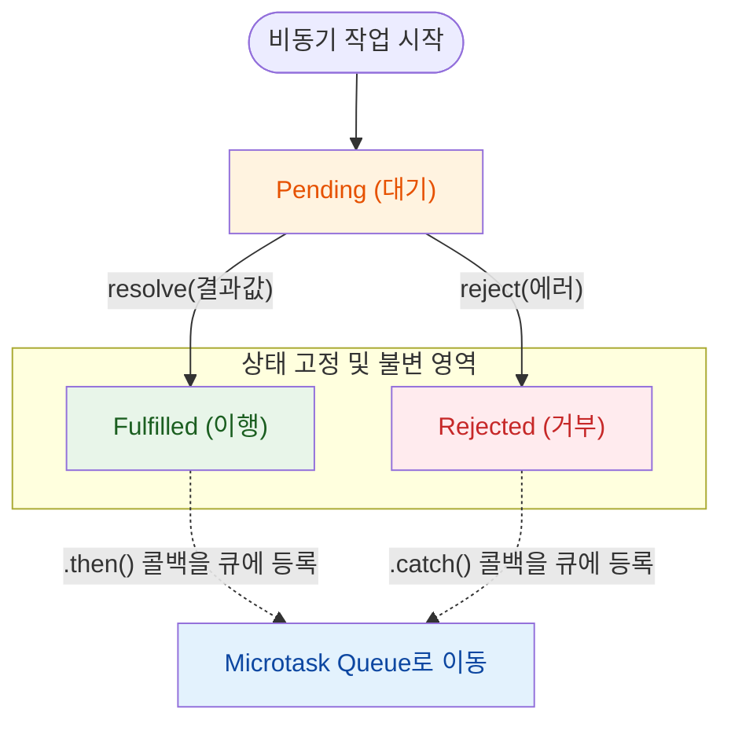
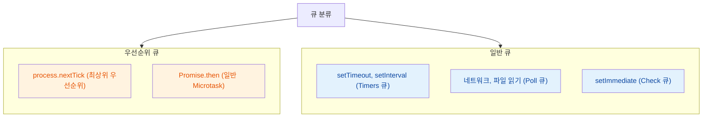

## 비동기 흐름 제어의 진화

자바스크립트 비동기 제어 방식은 콜백의 한계를 극복하고 실행 컨텍스트를 제어하는 방향으로 발전했다.

- Callback: 호출 함수에게 실행 제어권을 완전히 넘겨주는 방식 (제어의 역전)
    - 중첩된 스코프로 인해 가독성이 떨어짐
    - 에러 처리 시 각 콜백마다 개별적으로 `try-catch`를 구성해야 하는 한계 발생
- Promise: 비동기 작업의 최종 완료 또는 실패 상태를 나타내는 일급 객체
    - 비동기 결과를 값으로 다룰 수 있어 제어권을 다시 개발자가 가져옴
    - `.then()` 체이닝을 통해 에러 처리를 일원화하고 흐름을 평탄화함
- Async/Await: V8 엔진 내부적으로 제너레이터 (Generator)와 Promise를 결합하여 비동기 처리의 편의성을 극대화한 문법
    - 비동기 코드를 동기 코드처럼 순차적으로 읽히게 만듦
    - `await`를 만나는 순간 현재 함수의 실행 컨텍스트를 일시 정지 (Suspend)하고 메인 스레드 제어권을 이벤트 루프로 반환

### 코드 변경 예시

동일한 비동기 로직이 Callback, Promise, Async/Await를 거치며 어떻게 평탄화되는지 비교할 수 있다.

- Callback: 뎁스가 깊어지고 에러 처리가 분산됨
- Promise: 뎁스는 평탄화되었으나 상위 스코프 변수 (`userData`) 유지가 번거로움
- Async/Await: 동기 코드와 동일한 흐름으로 읽히며 `try-catch` 하나로 에러 처리 통합 가능

```javascript
// 1. Callback
function getUserAndPostsCallback(userId, callback) {
  db.query('SELECT * FROM users WHERE id = ?', [userId], (err, user) => {
    if (err) return callback(err); // 1차 에러 처리

    db.query('SELECT * FROM posts WHERE user_id = ?', [user.id], (err, posts) => {
      if (err) return callback(err); // 2차 에러 처리
      callback(null, {user, posts});
    });
  });
}

// 2. Promise
function getUserAndPostsPromise(userId) {
  let userData; // 스코프 유지를 위한 외부 변수
  return db.query('SELECT * FROM users WHERE id = ?', [userId])
  .then(user => {
    userData = user;
    return db.query('SELECT * FROM posts WHERE user_id = ?', [user.id]);
  })
  .then(posts => {
    return {user: userData, posts};
  });
}

// 3. Async/Await
async function getUserAndPostsAsync(userId) {
  try {
    const user = await db.query('SELECT * FROM users WHERE id = ?', [userId]);
    const posts = await db.query('SELECT * FROM posts WHERE user_id = ?', [user.id]);
    return {user, posts};
  } catch (err) {
    throw err;
  }
}
```

## Promise의 내부 상태

최신 비동기 문법인 `async/await`도 내부 동작의 근간은 철저하게 Promise를 기반으로 작동한다.

- 제어권 반환: V8 엔진은 `await`를 만나면 비동기 작업을 Promise로 감싸고, 나머지 코드를 암묵적인 `.then()` 핸들러로 묶은 뒤 메인 스레드 제어권을 반환
- 상태 추적과 재개: 기저의 Promise 객체가 연산의 완료 여부를 내부 상태 (State)로 추적하여 일시 정지된 코드를 정확한 시점에 재개 (Resume)

Promise 객체는 생성 시점부터 V8 엔진 메모리 상에서 세 가지 상태 중 하나를 가진다.



- Pending (대기): 비동기 연산이 아직 완료되지 않은 초기 상태
- Fulfilled (이행): 연산이 성공적으로 완료된 상태
    - V8은 내부 슬롯에 결과값을 저장하고 등록된 `.then()` 핸들러들을 Microtask Queue로 전송
- Rejected (거부): 연산이 실패하거나 에러가 발생한 상태
    - 결과값 대신 에러 객체를 저장하고 등록된 `.catch()` 핸들러들을 Microtask Queue로 전송

한 번 Fulfilled나 Rejected 상태로 변경 (Settled)된 Promise는 더 이상 상태나 결과값이 변하지 않는 불변성을 보장한다.

## Task Queue vs Microtask Queue

Node.js 환경에서 비동기 콜백들은 출신에 따라 서로 다른 큐에 담기며 실행 우선순위를 갖는다.



- Task Queue (Macrotask): 타이머나 I/O 콜백들이 들어가는 일반 대기열
    - 이벤트 루프의 각 단계에 맞게 배정되어 순차적으로 실행됨
- Microtask Queue: `Promise` 콜백이나 `process.nextTick`이 들어가는 최우선 대기열
    - Task Queue에 대기 중인 작업이 있더라도 이벤트 루프가 단계를 넘어갈 때마다 Microtask Queue를 먼저 전부 비움
    - Node.js 환경에서는 `process.nextTick`이 Promise보다도 더 높은 우선순위를 가져 가장 먼저 실행됨
