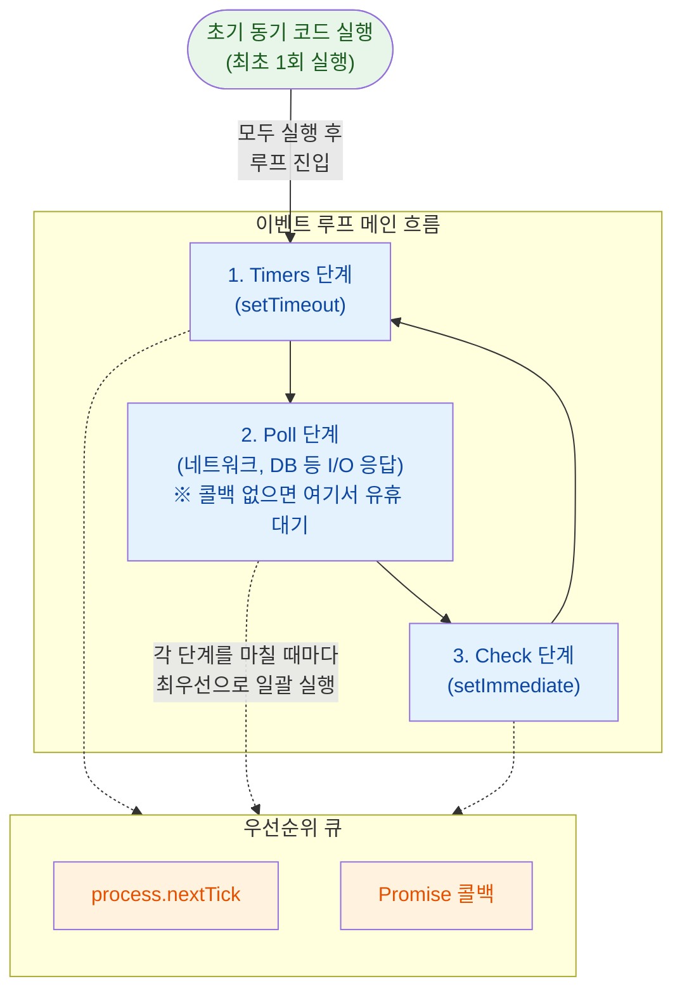
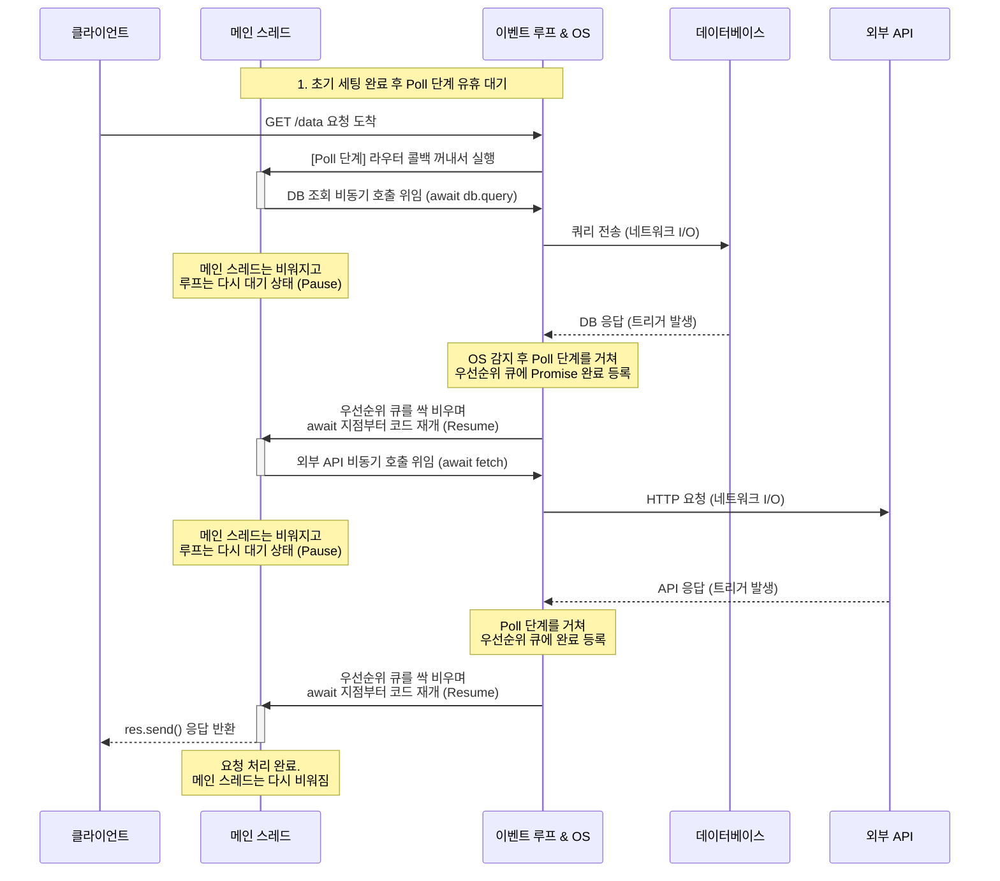

Node.js는 자바스크립트 코드를 단일 스레드에서만 실행하지만, 오래 걸리는 작업을 뒷단에 위임하여 수많은 동시 접속을 처리한다.

## 동기 실행과 비동기 위임

자바스크립트 엔진과 비동기 처리 환경이 역할을 분담하여 메인 스레드의 멈춤을 방지한다.

- 코드 실행: 계산, 조건문, 함수 호출 등 동기적인 로직은 메인 스레드에서 순차적으로 처리
- 네트워크 통신: 외부 API 호출이나 데이터베이스 (DB) 쿼리 같은 네트워크 I/O는 운영체제 커널의 비동기 기능에 위임
- 무거운 작업: 파일 시스템 접근이나 암호화 연산 등은 백그라운드 스레드 풀에 할당하여 병렬로 처리
- 콜백 등록: 위임했던 작업이 끝나면, 그 결과를 바탕으로 실행할 함수 (콜백)를 이벤트 루프의 대기열에 추가

## 실행 흐름과 순환 구조

메인 스레드는 가장 먼저 초기 코드를 전부 실행하여 콜스택을 비운 뒤에야 이벤트 루프에 진입하여 대기열의 콜백들을 처리하기 시작한다.

### 코드 실행 시점 예시

웹 서버를 띄우는 과정을 예로 들면, 초기 세팅 코드와 실제 요청을 처리하는 콜백 코드로 명확히 나뉜다.

```javascript
const express = require('express');
const app = express();

console.log("1. 서버 세팅 시작");

// 라우터 등록 (나중에 클라이언트가 접속하면 실행될 콜백)
app.get('/', (req, res) => {
  console.log("3. 클라이언트 요청 도착 (콜백)");
  res.send("Hello World");
});

app.listen(3000); // 포트 바인딩 시작
console.log("2. 서버 세팅 완료");
```

- 초기 동기 코드: 이벤트 루프가 돌기 전, 최상단의 모듈 불러오기, 라우터 세팅 (`get`), 서버 띄우기 (`listen`)와 `1`, `2` 출력 로직을 메인 스레드에서 가장 먼저 한 번에 모두 실행
- 콜백 실행: 서버 세팅이 끝나 메인 스레드가 비워지면 이벤트 루프가 시작되며, 클라이언트 접속이라는 특정 네트워크 조건이 만족되었을 때 비로소 큐에서 콜백 (`3`)을 꺼내어 메인 스레드 위에서 실행

### 순환 단계

이벤트 루프는 각 단계에 배정된 큐에서 콜백을 꺼내어 메인 스레드 위에서 실행시키며, 한 단계를 마칠 때마다 우선순위 큐를 먼저 비운 뒤 다음 단계로 넘어간다.



- 초기 실행: 애플리케이션 시작 시 작성된 최상단의 코드들을 루프 진입 전에 가장 먼저 1회 실행
- Timers 단계: `setTimeout`이나 `setInterval`로 예약한 시간이 만료된 타이머 콜백 처리
- Poll 단계: 클라이언트의 HTTP 요청 도착, 외부 API 응답, DB 쿼리 결과 반환, 파일 읽기 완료 등 대부분의 비동기 입출력 (I/O) 콜백 처리
    - 유휴 대기: 당장 처리할 콜백이 없다면 새로운 작업이 들어올 때까지 대기하며 CPU 낭비 방지
- Check 단계: Poll 단계 직후에 무조건 실행되도록 보장하는 `setImmediate` 전용 콜백 처리
- 우선순위 큐 (Microtask): `process.nextTick`과 `Promise` 콜백이 담기는 곳. 특히 `async/await` 사용 시, I/O 작업 완료 신호가 이 큐로 전달되어 멈춰있던 코드를
  가장 먼저 재개시키는 핵심 역할을 담당

### API 요청 처리 과정 예시

클라이언트의 `GET` 요청 안에서 DB 조회와 외부 API 호출이 연달아 일어날 때, 메인 스레드와 이벤트 루프는 다음과 같이 흐른다.



- 요청 도착: 클라이언트가 서버에 접속하면 OS가 이를 감지해 Poll 단계 큐에 콜백을 넣고, 메인 스레드가 이를 꺼내 실행 시작
- 일시 정지 (Pause): 로직 중 `await db.query()` 같은 비동기 I/O를 만나면 뒷단에 작업을 위임하고, 현재 함수의 실행을 멈춘 뒤 메인 스레드의 제어권을 넘겨 스레드를 비움
- 완료 트리거 (Trigger): DB나 API 연산이 끝나면 OS가 이를 감지하여 이벤트 루프의 Poll 단계 큐에 완료 신호를 밀어 넣음
- 로직 재개 (Resume): Poll 단계가 이 신호를 받아 **우선순위 큐 (Microtask)**에 Promise 완료를 등록
    - 메인 스레드가 이 우선순위 큐를 싹 비울 때 비로소 일시 정지되었던 `await` 바로 다음 줄부터 코드가 다시 실행됨
- 논블로킹의 핵심: 메인 스레드가 멍하니 멈춰있지 않고 이벤트 루프는 쉴 새 없이 `Timers -> Poll -> Check`단계를 순환하며 다른 수많은 클라이언트의 요청이나 타이머를 병렬적으로 처리

## 이벤트 루프 블로킹 방어

메인 스레드가 무거운 동기식 계산에 묶여 이벤트 루프가 멈추면 모든 클라이언트의 요청 처리가 완전히 정지된다.

- 원인: 메인 스레드에서 대용량 JSON 파싱, 복잡한 정규표현식 매칭, 이미지 변환 등 CPU 연산이 오래 걸리는 작업을 실행
- 파급 효과: 해당 연산이 끝날 때까지 루프가 순환하지 못하여 대기열에 쌓인 다른 정상적인 요청들도 응답을 받지 못함
- 해결 방안: 부하가 큰 작업은 워커 스레드 (Worker Threads)로 옮겨 연산하거나, 아예 별도의 외부 처리 서버로 격리하여 메인 스레드 보호
