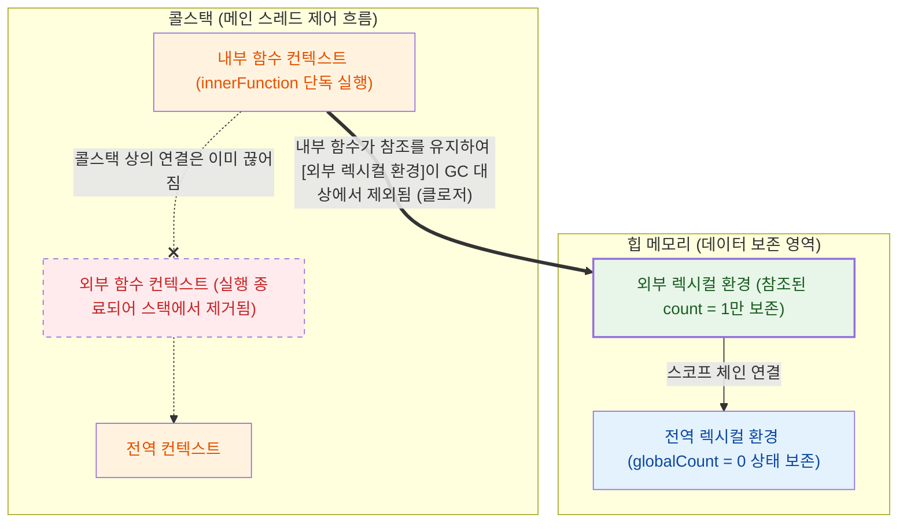

## 동시성 처리와 컨텍스트 수명 주기

Node.js는 띄워진 서버가 멈추지 않고 수많은 요청을 처리하는 장기 실행 (Long-running) 프로세스이므로 변수의 생존 주기가 중요하다.

- 상태 관리의 핵심: 콜백이나 비동기 작업이 잦은 자바스크립트 환경에서 데이터가 유실되지 않고 참조되는 원리를 파악해야 함
- 메모리 누수 방어: V8 엔진의 가비지 컬렉터 (GC)가 제때 객체를 청소할 수 있도록 클로저의 참조를 명확히 다룰 필요가 있음

## 실행 컨텍스트와 렉시컬 환경

V8 엔진은 자바스크립트 코드를 실행할 때마다 코드가 동작하기 위한 환경적 정보들을 모아 실행 컨텍스트 (Execution Context)를 만든다.

- 콜스택 (Call Stack) 적재: 함수가 호출되면 새로운 실행 컨텍스트가 생성되어 스택의 맨 위에 쌓이고 실행이 끝나면 스택에서 제거 (Pop)됨
- 환경 레코드 (Environment Record): 현재 컨텍스트 내부에서 선언된 지역 변수나 매개변수들의 실제 값을 매핑하여 저장하는 공간
- 외부 참조 (Outer Reference): 현재 스코프에 없는 변수를 찾기 위해 자신이 선언될 당시의 바깥쪽 (상위) 렉시컬 환경을 가리키는 역할

## 스코프 체인과 클로저의 구조

자바스크립트의 함수는 자신이 호출된 위치가 아니라 선언된 위치를 기준으로 외부 참조를 묶어버리는 정적 스코프 (Lexical Scope) 방식을 따른다.

```javascript
// 1. 전역 컨텍스트 (Global)
let globalCount = 0;

function outerFunction() {
  // 2. 외부 함수 컨텍스트 (Outer)
  let count = 1;
  let unreferencedVar = "사용 안 함"; // 내부 함수에서 참조하지 않으므로 GC에 의해 즉시 수거됨

  // 3. 내부 함수 컨텍스트 (Inner)
  return function innerFunction() {
    count++; // V8 엔진은 이 참조를 확인하고 count 변수만 힙 메모리에 보존함
    console.log(count);
  };
}

// outerFunction은 여기서 실행을 마치고 콜스택에서 제거(Pop)됨
const myClosure = outerFunction();

// 나중에 innerFunction이 단독으로 실행되지만, 보존된 count에 접근 가능 (클로저)
myClosure();
```



- 스코프 체이닝: 변수를 찾을 때 현재 환경 레코드에 없으면 외부 참조를 따라 상위 렉시컬 환경으로 올라가며 검색하는 과정
- 클로저 (Closure)와 V8 최적화: 내부 함수가 외부 함수의 변수를 명시적으로 참조할 때만 해당 데이터가 힙 메모리에 보존되며, 참조하지 않는 나머지 데이터는 메모리 확보를 위해 GC에 의해 수거

## 실무적 시사점: 클로저와 메모리 누수

클로저는 비동기 콜백에서 상태를 유지해주지만, 무거운 객체에 대한 참조를 해제하지 않으면 V8의 메이저 GC (Mark-Sweep)를 방해하는 원인이 된다.

- GC 방해 원리: 가비지 컬렉터는 최상위 루트에서 참조 그래프를 순회하는데 클로저가 환경 레코드를 계속 참조하고 있으면 쓸모없는 객체라도 영원히 살아있는 것으로 마킹 (Mark)됨
- 이벤트 리스너 누수: 라우터나 이벤트 훅 안에서 거대한 배열이나 요청 객체를 참조하는 클로저를 만들어두고 해제하지 않으면 기존 공간 (Old Space)이 급격히 늘어남

```javascript
// ❌ 클로저로 인한 전형적인 메모리 누수 예시 (Anti-pattern)
let globalCache = [];

app.get('/leaky', (req, res) => {
  const hugeData = new Array(1000000).fill('Heavy Data');

  // 클로저가 거대한 hugeData 배열과 req 객체를 통째로 캡처
  const leakyCallback = () => {
    console.log("요청 IP:", req.ip);
    console.log("데이터 크기:", hugeData.length);
  };

  // 글로벌 배열에 클로저를 밀어넣어 참조를 영원히 살려둠
  // 이 클로저가 살아있는 한 hugeData와 req는 GC의 청소 대상이 되지 못함
  globalCache.push(leakyCallback);

  res.send("Memory is leaking!");
});

// ✅ 메모리 누수를 방지하는 안전한 패턴 (V8 최적화 활용)
app.get('/safe', (req, res) => {
  const hugeData = new Array(1000000).fill('Heavy Data');

  // 무거운 객체를 통째로 캡처하는 대신, 가벼운 원시값(Primitive)만 미리 추출
  const clientIp = req.ip;
  const dataLength = hugeData.length;

  const safeCallback = () => {
    // 내부 함수에서 req와 hugeData를 직접 참조하지 않음
    console.log("요청 IP:", clientIp);
    console.log("데이터 크기:", dataLength);
  };

  globalCache.push(safeCallback);

  // safeCallback이 req와 hugeData를 명시적으로 참조하지 않으므로, 
  // 라우터 처리가 끝나면 앞서 배운 V8 최적화에 의해 무거운 객체들은 즉각 GC에 수거됨
  res.send("Memory is safe!");
});
```

이를 방지하기 위해선, 무거운 데이터를 다룰 때는 객체를 통째로 클로저에 넣지 말고 필요한 값만 복사해서 사용하거나, 사용이 끝난 데이터에 `null`을 할당하여 참조 그래프의 연결 고리를 명시적으로 끊어내야 한다.
