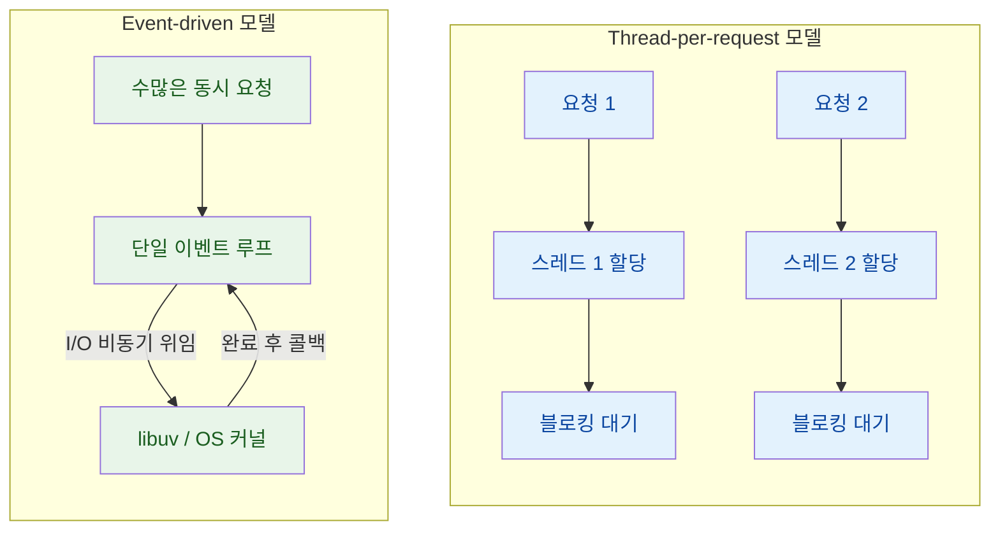

## Event-driven Non-blocking 아키텍처

Node.js는 싱글 스레드 이벤트 루프와 논블로킹 I/O를 결합하여 동시성을 처리한다.

- 메인 스레드: 단일 스레드가 V8 엔진을 통해 JavaScript 코드를 순차적으로 실행
- 논블로킹 I/O 위임: 파일 읽기나 네트워크 요청 등 I/O 작업은 OS 커널이나 libuv의 워커 스레드 풀로 위임
- 콜백 큐 대기: I/O 작업이 완료되면 등록된 콜백 함수가 Task Queue에 적재
- 이벤트 루프 처리: Call Stack이 비어있을 때 이벤트 루프가 Queue의 콜백을 다시 메인 스레드로 올려 실행

## 런타임 스레드 모델 비교

Java 기반의 Spring (MVC)과 Node.js는 들어오는 HTTP 요청을 처리하는 근본적인 방식이 다르다.

### Thread-per-request 모델 (Java/Spring MVC)

요청마다 독립적인 스레드를 할당하여 작업을 처리한다.

- 스레드 풀 관리: 톰캣 (Tomcat) 등 서블릿 컨테이너가 미리 생성해둔 스레드 풀에서 스레드를 꺼내 요청과 1:1로 매핑
- 블로킹 I/O 대기: 스레드가 DB 쿼리나 API 응답을 기다릴 때 해당 스레드는 대기 (Blocked) 상태로 전환되어 정지
- 자원 오버헤드: 동시 요청 비례하여 스레드가 필요하므로 각 스레드가 점유하는 스택 메모리 (약 1MB) 소비 증가
- 컨텍스트 스위칭 비용: CPU 코어 수를 초과하는 스레드 경합으로 인해 운영체제의 스레드 전환에 막대한 CPU 자원 낭비

### Event-driven Non-blocking 모델 (Node.js)

하나의 메인 스레드가 멈추지 않고 수많은 요청을 비동기적으로 처리한다.

- 연결 수용: 수만 개의 동시 커넥션이 들어와도 메인 스레드는 I/O를 기다리지 않고 다음 요청 처리 즉시 시작
- 메모리 점유 최소화: 요청마다 스레드를 생성하지 않으므로 스택 메모리 낭비가 없고 자원 효율성 극대화
- 컨텍스트 스위칭 무효화: 단일 스레드가 연산을 주도하므로 스레드 간 전환 오버헤드가 거의 없음

## 워크로드별 아키텍처 적합성

동시성 모델의 물리적 구조 차이로 인해 워크로드 특성에 따라 환경이 갈린다.

|   비교 항목   |     Java (Thread-per-request)     |       Node.js (Event-driven)        |
|:-------------:|:---------------------------------:|:-----------------------------------:|
|  스레드 할당  |   요청당 1개의 스레드 독립 할당   |  단일 메인 스레드가 모든 요청 수용  |
| I/O 대기 방식 |     블로킹 대기 (스레드 정지)     | 논블로킹 위임 (즉시 다음 요청 처리) |
|  메모리 점유  | 스레드 개수 비례 스택 메모리 소비 |  단일 스택 사용으로 점유율 최소화   |
| 권장 워크로드 |     복잡한 CPU 연산 집약 작업     |  대규모 동시 I/O 및 네트워크 통신   |

### I/O 집약적 워크로드 (Node.js 유리)

네트워크 통신, DB 조회, 파일 입출력이 주를 이루는 시스템이다.

- 대규모 트래픽 처리: 스레드 생성 비용과 블로킹 대기가 없어 대량의 동시 I/O 요청 처리에 적합
- MSA 게이트웨이: 여러 외부 서비스 API를 비동기로 호출하고 취합 (Aggregation)하는 역할에 뛰어남

### CPU 집약적 워크로드 (Java 유리)

복잡한 수학적 계산, 대규모 데이터 변환, 이미지 처리, 암호화 등이 주를 이루는 시스템이다.

- 이벤트 루프 블로킹: Node.js 메인 스레드에서 무거운 연산을 수행하면 이벤트 루프가 정지하여 모든 사용자의 요청 처리 지연
- 멀티 코어 활용: Java는 OS 네이티브 스레드를 여러 개 띄워 CPU 멀티 코어를 온전히 활용한 병렬 연산 수행
