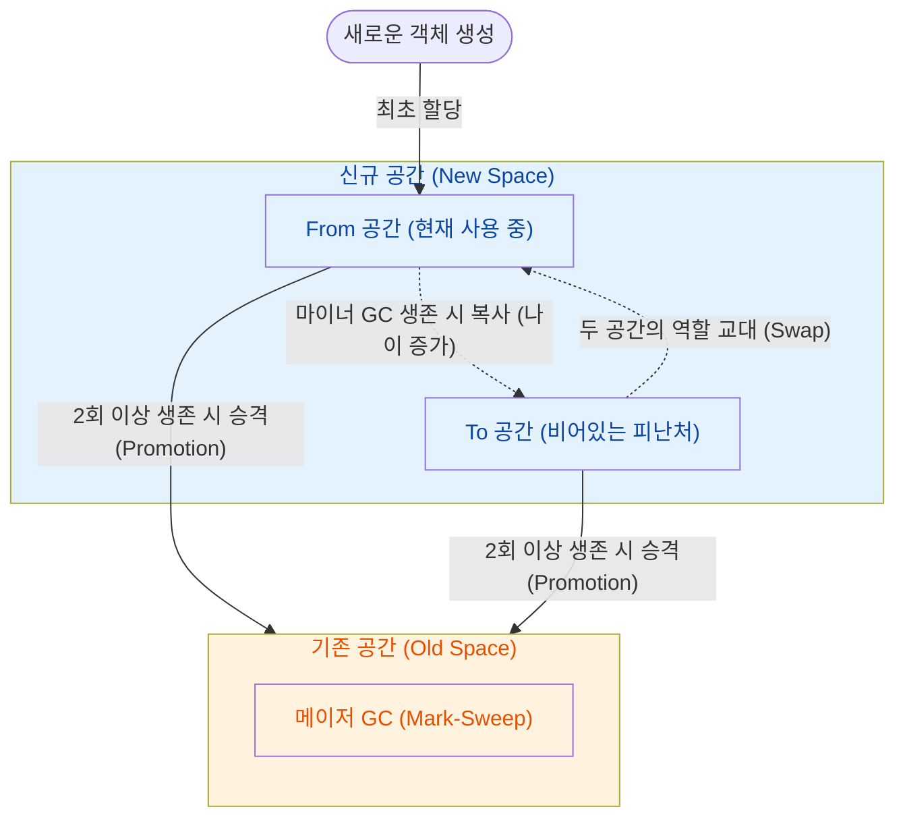

## 동시성 처리와 메모리 관리의 관계

Node.js는 싱글 스레드 기반으로 작동하므로 메인 스레드가 멈추는 시간 (Stop-The-World)을 최소화하는 것이 서버 성능의 핵심이다.

- 가비지 컬렉터 (GC)의 부하: 메모리 자동 정리 작업이 무거워질 경우 메인 스레드 전체가 멈춰서 이벤트 루프 처리가 지연
- 내부 구조 이해의 필요성: 메모리 누수와 멈춤 현상을 사전에 방지하고 고성능 서버를 설계하려면 V8 엔진의 힙 구조 파악이 필수적

## 힙 메모리 구조

V8 엔진은 동적으로 할당되는 객체와 변수들을 힙 (Heap) 메모리에 저장하며, 객체의 수명 (Lifespan)에 따라 공간을 분리하여 효율을 높인다.

- 신규 공간 (New Space): 새로 생성된 객체들이 할당되는 작고 빠른 영역 (Young Generation)
    - 수명이 짧은 임시 변수들이 모이는 곳으로, From 공간과 To 공간이라는 두 개의 서바이버 (Survivor) 공간을 서로 교대 (Swap)해가며 파편화를 막고 관리됨
- 기존 공간 (Old Space): 신규 공간에서 두 번 이상의 가비지 컬렉션을 버티고 살아남은 객체들이 이동하는 넓은 영역 (Old Generation)
    - 글로벌 변수, 롱리브 (Long-lived) 객체, 닫히지 않은 클로저 환경 등 오랫동안 유지되어야 하는 데이터 저장소 역할 수행
- 대형 객체 공간 (Large Object Space): 신규 공간의 크기 제한을 초과하는 거대한 배열이나 문자열이 직접 할당되는 영역
    - 이곳에 할당된 거대 객체는 복사 비용이 너무 크기 때문에 가비지 컬렉터가 다른 공간으로 이동시키지 않음

## 가비지 컬렉션 (GC) 동작 방식

"대부분의 객체는 할당된 직후 곧바로 쓸모없어진다"는 세대별 가설 (Generational Hypothesis)을 바탕으로, 젊은 세대와 늙은 세대에 각기 다른 GC 알고리즘을 적용한다.

- 마이너 GC (Scavenger): 신규 공간의 `From` 영역이 가득 차면 실행되는 빠르고 가벼운 청소 작업
    - 살아있는 객체만 나이 (Age)를 올려 비어있는 `To` 공간으로 피난 (복사)시킴
    - 쓰레기만 남은 `From` 공간을 통째로 비우고 두 공간의 역할을 교대 (Swap)하여 `To`가 새로운 `From`이 됨
- 승격 (Promotion): 이 교대 과정을 두 번 이상 견뎌낸 (나이를 먹은) 생존 객체를 기존 공간 (Old Space)으로 이동시켜 관리 대상을 전환
- 메이저 GC (Mark-Sweep & Compact): 기존 공간의 메모리가 부족해지면 실행되는 본격적이고 무거운 청소 작업
    - 마킹 (Mark): 최상위 루트 (Global, 실행 스택 등)에서 참조 그래프를 따라가며 도달 가능한 살아있는 객체에 식별 표시를 남김
    - 해제 (Sweep) 및 압축 (Compact): 마킹되지 않은 쓰레기 객체의 메모리를 해제하고, 남은 생존 객체들을 한쪽으로 밀어 넣어 새 객체를 할당할 수 없게 만드는 단편화 현상 해결

## 싱글 스레드 환경과 GC 최적화

자바스크립트는 싱글 스레드로 동작하므로 무거운 메이저 GC가 실행되는 동안 메인 스레드가 완전히 멈추는 현상 (Stop-The-World)을 최대한 쪼개고 분산시켜야 한다.

- 동시 마킹 (Concurrent Marking)
    - 메인 스레드가 자바스크립트 코드를 정상적으로 실행하는 동안, 백그라운드의 워커 스레드들이 동시에 참조 그래프를 순회하며 마킹 수행
- 점진적 마킹 (Incremental Marking)
    - 긴 시간을 한 번에 멈추지 않고, 메인 로직 실행 틈틈이 아주 짧게 여러 번 나누어 마킹을 진행하여 이벤트 루프 지연 방지
- 지연 스위핑 (Lazy Sweeping)
    - 죽은 객체들의 메모리를 한꺼번에 무리해서 해제하지 않고, 실제 메모리가 필요한 시점에 필요한 만큼씩만 점진적으로 해제

## 메모리 누수와 이벤트 루프

V8 엔진이 훌륭한 최적화를 제공하더라도, 개발자의 코드 작성 방식에 따라 심각한 병목이 발생할 수 있다.

- 전역 변수 남용: 전역 배열이나 객체에 데이터를 무한히 밀어 넣으면 기존 공간 (Old Space)이 비대해져 메이저 GC의 순회 (Marking) 시간이 기하급수적으로 늘어남
- 이벤트 루프 블로킹: 메이저 GC 시간이 길어진다는 것은 곧 메인 스레드가 멈춰있는 시간이 길어진다는 뜻이며, 이는 수만 명의 사용자 요청을 처리해야 할 이벤트 루프를 마비시키는 직접적인 원인이 됨
