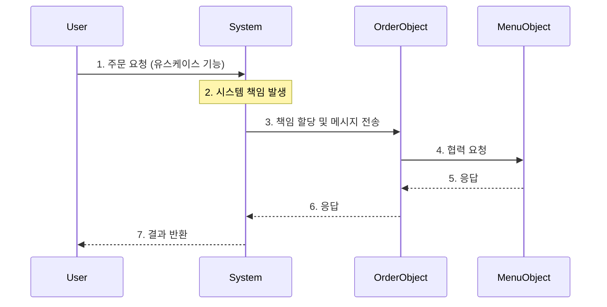

모든 소프트웨어 제품의 설계에는 아래 두 가지 측면의 설계가 존재한다.

- 기능(function) 측면 설계: 제품이 사용자를 위해 무엇을 할 수 있는지를 결정
- 구조(structure) 측면 설계: 제품의 형태가 어떠해야 하는지를 결정

두 측면의 설계에 맞춰 소프트웨어를 안정적으로 요구사항에 따라 개발하기 위해 기능과 구조를 아래와 같이 적용하는 두 가지 모델링 기법을 사용히게 된다.

- 구조(Structure): 도메인 모델링
    - 사용자나 이해관계자가 도메인에 관해 가지고 있는 모델을 기반으로 개념과 관계를 정의
- 기능(Function): 유스케이스 모델링
    - 사용자의 목표를 만족시키기 위해 시스템이 수행해야 하는 행위를 시나리오 형식 표현한

## 구조(도메인 모델) - 안정적인 재료

안정적인 구조를 설계하기 위해서는 해결하고자 하는 문제 영역인 도메인을 이해하고, 이를 단순화하여 표현하는 도메인 모델링이 필요하다.

- 도메인 모델을 통해 도메인의 복잡성을 단순화
- 단순화되고 본질적인 측면이 안정적인 구조 설계에 유용
- 안정적인 구조를 제공하는 도메인 모델을 기반으로 소프트웨어 구조 설계 시 요구사항 변경에 유연하게 대처 가능

도메인 모델은 단순한 ERD나 클래스 다이어그램이 아니라, 이해관계자들이 바라보는 세상의 구조에 초점을 맞춰야한다.

- 기능은 자주 변하지만, 도메인을 구성하는 핵심 개념과 관계는 쉽게 변하지 않음
- 예시: 결제 기능은 추가되거나 변경될 수 있지만, '사용자', '주문', '상품'의 개념과 그 관계는 비교적 안정적

## 기능(유스케이스) - 불안정한 재료

사용자에게 정확한 기능을 제공하기 위해서는 시스템과의 상호작용 관점에서의 흐름을 텍스트로 정리한 유스케이스가 필요하다.

- 기능은 사용자들에게 달성하고자 하는 목표를 제공
- 목표 달성을 위해 시스템 간의 상호작용 관점에서 시스템을 바라봐야 함

### 유스케이스

유스케이스는 단순히 기능 목록을 나열하는 것이 아닌, 사용자가 시스템을 통해 무엇을 얻으려 하는지에 대한 목표와 흐름을 서술한다.

- 텍스트 중심의 상호작용
    - 사용자와 시스템 간의 상호작용을 보여주는 텍스트
    - 다이어그램은 부수적인 도구일 뿐, 핵심은 흐름에 따른 텍스트 서술
- 시나리오의 집합
    - 성공적인 경로(Happy Path)뿐만 아니라 예외적인 경로(Alternative Path)를 포함한 여러 시나리오의 집합
    - 하나의 유스케이스는 연관된 기능들을 하나의 이야기로 묶어 문맥을 제공
- 외부 관점의 행위
    - 시스템 내부 설계와 관련된 정보를 포함하지 않고, 시스템이 외부에 제공해야 하는 행위에 초점
    - 시스템이 외부에 어떤 응답을 제공해야 하는지 집중

## 기능과 구조의 통합(책임-주도 설계)

불안정한 기능(유스케이스)를 안정적인 구조(도메인 모델) 위에 얹는 과정을 수행하기 위해서 책임-주도 설계를 사용할 수 있다.

- 시스템은 사용자의 관점에서 보면 하나의 거대한 객체와 같음
- 사용자가 시스템에 전송하는 요청(유스케이스의 기능)이 곧 시스템이 수행해야 할 책임
- 시스템은 이 책임을 수행하기 위해 내부의 도메인 객체들과 협력

### 설계 프로세스

시스템이 처레해야 할 메시지를 제공하는 유스케이스와 처리할 객체들의 구조를 제공하는 도메인 모델을 책임으로 결합하는 과정을 따르게 된다.

1. 시스템 책임 식별
    - 유스케이스를 통해 시스템이 사용자에게 제공해야 할 기능을 파악하고 이를 시스템의 책임으로 정의
2. 책임 분할 및 할당
    - 시스템이라는 거대한 객체의 책임을 수행하기 위해, 도메인 모델에 정의된 개념들을 후보로 삼아 적절한 객체 선정
    - 시스템의 책임은 더 작은 크기의 객체 책임으로 세분화되어 할당
3. 협력 관계 구축
    - 책임을 할당받은 객체는 혼자서 모든 것을 처리할 수 없으므로 다른 객체에게 도움 요청
    - 해당 과정에서 객체 간의 메시지 전송과 협력 관계 형성
4. 구현
    - 객체의 책임은 오퍼레이션(메서드)으로, 객체의 상태는 속성(필드)으로 변환되어 클래스로 구현

###### 참고자료

- [객체지향의 사실과 오해](https://kobic.net/book/bookInfo/view.do?isbn=9788998139766)
