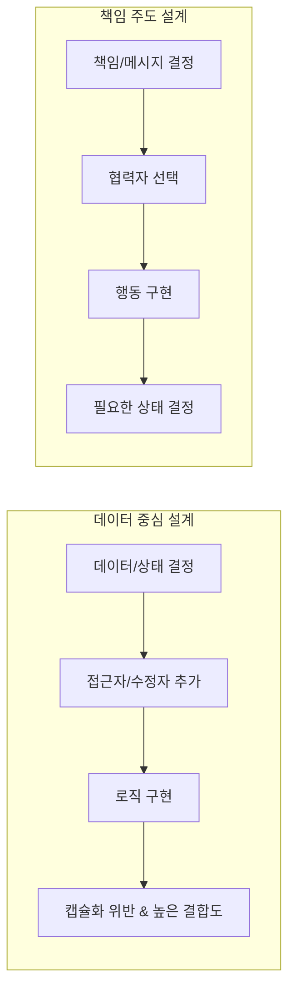

객체지향의 목표는 실세계를 모방하는 것이 아니라 새로운 세계를 창조하는 것이다.

- 실세계의 은유는 객체지향을 이해하기 위한 학습 도구
- 실제 설계에서는 현실에 존재하지 않는 객체라도 소프트웨어 세계에서는 생명과 지능을 가진 존재로 의인화

## 객체지향의 본질

객체지향은 시스템을 상호작용하는 자율적인 객체들의 공동체로 바라보고, 객체를 이용해 시스템을 분할하는 방법론이다.

- 자율적인 객체
    - 상태와 행위를 함께 지니며 스스로 자기 자신을 책임지는 객체
    - 외부의 간섭 없이 자신의 상태를 직접 관리하고 결정
- 협력
    - 객체는 시스템의 기능을 구현하기 위해 다른 객체와 협력
    - 각 객체는 협력 내에서 정해진 역할과 책임을 수행
- 메시지와 메서드 분리
    - 객체는 다른 객체와 협력하기 위해 메시지를 전송
    - 수신한 객체는 메시지를 처리하기 위해 적합한 메서드를 스스로 선택하여 실행

## 클래스지향 X / 객체지향 O

클래스는 객체지향 언어에서 중요한 구현 메커니즘이지만, 클래스 구조보다 객체 간의 협력과 메시지 흐름이 우선되어야 한다.

- 클래스 중심 사고의 문제점
    - 설계를 할 때 데이터(멤버 변수)를 먼저 고민하게 되어 캡슐화 위반 가능
    - 객체의 내부 구조에 의존하게 되어 결합도가 높아짐
- 객체 중심 사고의 전환
    - 코드를 담는 클래스 관점이 아니라 메시지를 주고받는 객체 관점으로 접근 필요
    - 어떤 객체가 필요한지가 아니라, 어떤 메시지(책임)가 필요한지를 먼저 결정
    - 클래스는 협력 관계를 코드로 옮기는 도구

| 구분 |       오해        |            진실             |
|:--:|:---------------:|:-------------------------:|
| 관점 | 클래스와 데이터 구조 중심  |       역할, 책임, 협력 중심       |
| 순서 | 클래스 정의 -> 객체 생성 | 메시지 정의 -> 객체 발견 -> 클래스 구현 |
| 핵심 |   상속을 통한 재사용    |      메시지를 통한 느슨한 결합       |

## 객체

객체는 구체적인 사물일 수도 있고 추상적인 개념일 수도 있으며, 변경 가능한 상태(State), 특징적인 행동(Behavior), 구별 가능한 식별자(Identity)를 가진다.

### 상태

상태는 특정 시점에 객체가 가지고 있는 정보의 집합으로, 현재를 기반으로 객체의 행동 방식을 이해하고 결과를 쉽게 예측할 수 있게 된다.

- 프로퍼티(Property)
    - 객체를 구성하는 정적인 특징
    - 링크(Link): 객체와 객체 사이의 연결
    - 속성(Attribute): 객체가 내부적으로 가지는 단순한 값
- 프로퍼티 값(Property Value)
    - 시간이 흐름에 따라 변하는 동적인 값

### 행동

행동은 외부의 요청(메시지) 또는 내부의 이벤트에 반응하여 실행되는 활동으로, 그 결과로 객체는 자신의 상태를 변경하거나 다른 객체에게 메시지를 전달한다.

- 행동의 특징
    - 상태 변경(Side Effect): 객체 자신의 상태를 변경
    - 메시지 전송: 협력을 위해 다른 객체에게 요청 전송
- 캡슐화와 자율성
    - 객체는 다른 객체의 상태를 직접 변경 불가능
    - 오직 메시지를 통해서만 요청하며, 요청을 수신한 객체가 스스로 상태 변경 여부를 결정

### 식별자

모든 객체는 서로 구별할 수 있는 식별자를 가지는데, 값(Value)과 객체(Entity)를 구분하는 중요한 기준이 된다.

- 동등성(Equality)
    - 값(Value Object) 비교 기준
    - 상태(프로퍼티 값)가 같다면 두 인스턴스는 같은 것으로 판단
- 동일성(Identity)
    - 객체(Entity) 비교 기준
    - 상태가 완전히 같더라도 식별자가 다르면 다른 객체로 인식

## 행동의 상태 결정(책임 주도 설계)

객체지향 설계의 핵심은 상태(데이터)가 아닌 행동(책임)을 먼저 결정하는 것이다.

상태를 중심으로 객체를 바라보게 되면, 필요한 상태를 먼저 설계하고 그 후 행동을 고려한다면 설계에 나쁜 영향을 끼친다.

1. 캡슐화 저해: 상태에 초점을 맞출 경우 상태가 객체 내부로 깔끔하게 캡슐화되지 못하고 공용 인터페이스에 노출
2. 객체의 고립화: 협력이라는 문맥을 고려하지 않고 객체 홀로 존재하게 되어, 애플리케이션 문맥에 부적합한 객체가 만들어짐
3. 객체 재사용성 저하: 특정 데이터 구조에 강하게 결합된 객체는 다른 문맥에서 재사용하기 어려워짐

객체는 다른 객체와 협력하기 위해 존재하며, 행동은 협력헤 참여하는 유일한 방법이므로 적절하게 설계하기 위해선 상태보단 행동을 먼저 고려해야한 후 상태를 설계해야한다.

###### 참고자료

- [객체지향의 사실과 오해](https://kobic.net/book/bookInfo/view.do?isbn=9788998139766)
