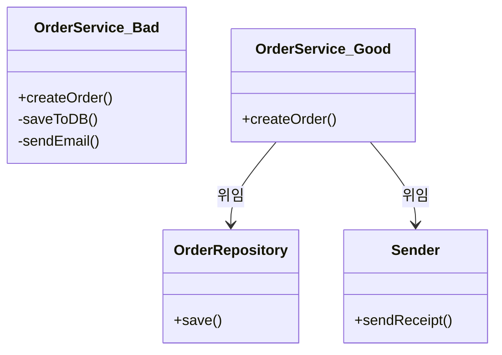
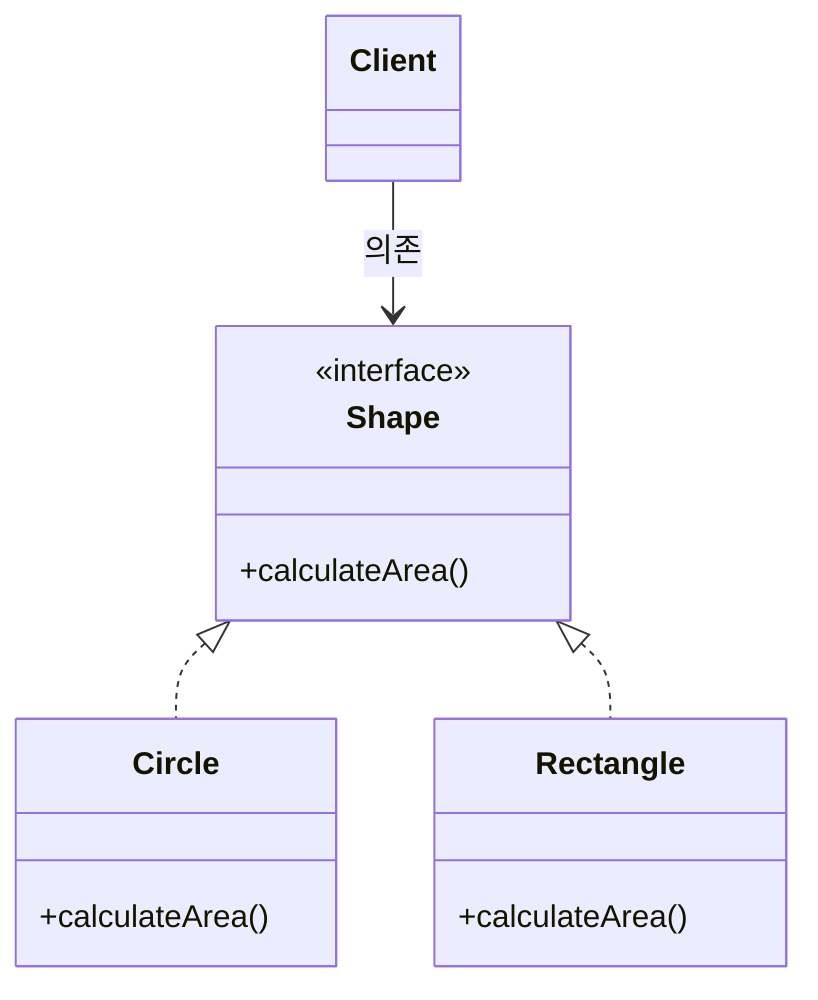
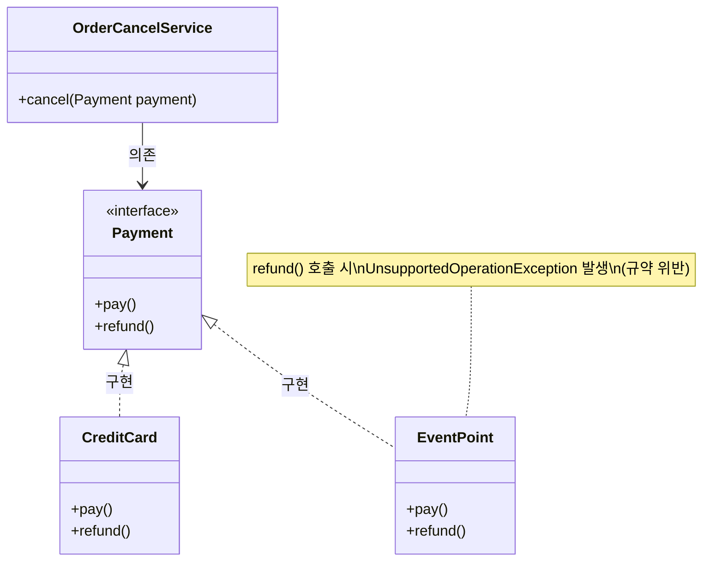
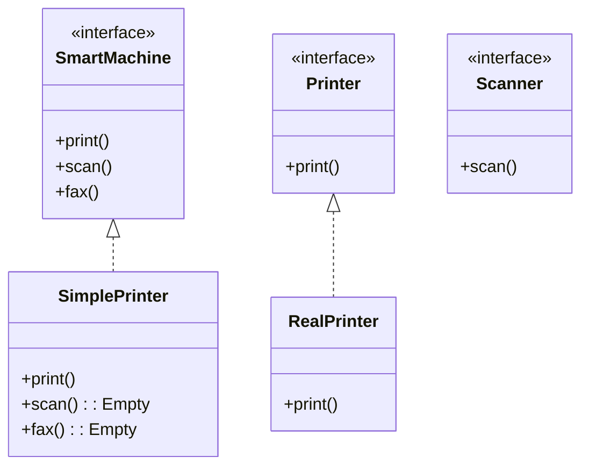
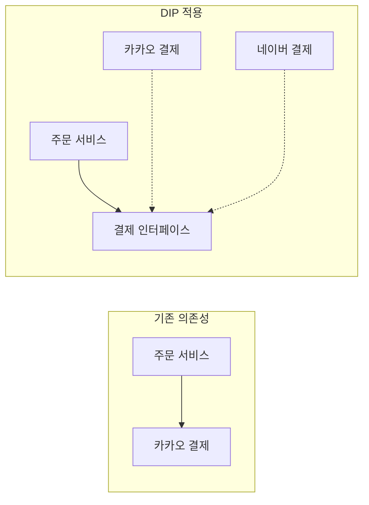

클린 코드로 유명한 로버트 마틴이 정립한 객체지향 설계의 5가지 핵심 원칙으로, 유지보수와 확장이 쉬운 소프트웨어를 만드는 것을 목표로 한다.

## SRP: 단일 책임 원칙(Single Responsibility Principle)

클래스는 단 한 가지의 변경 이유로 변경이 되어야 하며, 책임이 하나여야 한다.

- 핵심 업무 규칙(기획팀 요청)과 기술적인 처리 방식(DB, 이메일 등 인프라 담당)이 같은 클래스 내에 있다면 이는 SRP 위반
- 해당 클래스를 변경해야 하는 이유가 오직 하나일 때, 단일 책임 원칙을 잘 지킨 것

관련된 기능이 모여 있어 수정 범위가 명확해지며, 다른 기능에 영향을 주지 않고 독립적인 변경이 가능해진다.

## OCP: 개방-폐쇄 원칙(Open-Closed principle)

기존 코드를 수정하지 않고 새로운 기능을 추가할 수 있는 유연한 구조를 만드는 것으로, 추상화와 다형성을 활용한다.

- 확장에 열려 있다: 새로운 요구사항이 왔을 때 새로운 클래스를 추가하여 기능 확장
- 변경에 닫혀 있다: 기능을 추가할 때 기존 코드를 수정하지 않음

기존 코드를 건드리지 않으므로 회귀 버그 발생 가능성이 낮아진다.

## LSP: 리스코프 치환 원칙(Liskov Substitution Principle)

서브 타입은 언제나 자신의 기반 타입(Super Type)으로 교체할 수 있어야 한다.

- 정확성을 깨뜨리지 않으면서 상위 클래스의 객체를 하위 클래스로 대체 가능해야 함
- 자식 클래스는 부모 클래스의 규약 위반 금지

모든 결제 수단이 환불 가능할 것이라 가정하고 인터페이스를 설계했으나, 이벤트 무료 포인트는 환불이 불가능한 제약이 있다면 LSP를 위반하게 된다.

하위 타입이 상위 타입의 규약을 준수하므로 코드 변경 시 예기치 않은 부작용 감소하게 된다.

## ISP: 인터페이스 분리 원칙(Interface segregation principle)

여러 기능을 포함한 범용 인터페이스 보단 특정 클라이언트를 위한 인터페이스 여러 개를 생성하는 것이 좋다.

- 인터페이스가 비대해지면, 이를 구현하는 클래스는 필요 없는 기능까지 불필요하게 구현 필요
- 인터페이스를 기능별로 쪼개면 클라이언트는 꼭 필요한 기능만 알면 되므로 결합도 낮아짐

불필요한 의존성 제거하게 되어 인터페이스가 변경되어도 사용하지 않는 클라이언트에는 영향을 주지 않는다.

## DIP: 의존 역전 원칙(Dependency inversion principle)

고수준 모듈은 저수준 모듈에 의존해서는 안 되며, 둘 다 추상화에 의존하여 의존 방향을 역전시켜야 한다.

- 고수준 모듈(비즈니스 로직)이 저수준 모듈(세부 구현 클래스)을 직접 참조하면 결합도가 높아짐
- 중간에 인터페이스를 두어, 저수준 모듈이 인터페이스에 의존하게 만듦으로써 의존 방향 역전

구현체가 변경되어도 고수준 모듈은 영향을 받지 않게되어 유연한 교체가 가능해진다.

## SOLID 원칙 핵심 요약

|        원칙        |  핵심 키워드   |                적용 효과                |
|:----------------:|:---------:|:-----------------------------------:|
|  SRP(단일 책임 원칙)   |  책임의 분리   |   응집도는 높이고 결합도는 낮추어 수정 범위를 명확하게 함   |
|  OCP(개방-폐쇄 원칙)   |  유연한 확장   |  기존 코드를 수정하지 않고 기능을 확장하여 회귀 버그 방지   |
| LSP(리스코프 치환 원칙)  |   규약 준수   | 하위 타입이 상위 규약을 완벽히 준수하여 다형성의 안정성 보장  |
| ISP(인터페이스 분리 원칙) | 인터페이스 최적화 |  불필요한 의존성을 제거하여 인터페이스 변경 시 영향 최소화   |
|  DIP(의존 역전 원칙)   |  의존성 주입   | 구현체가 아닌 추상화에 의존하여 부품 교체하듯 유연한 변경 가능 |

