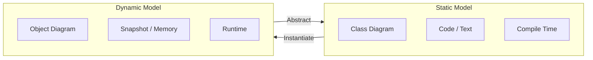

타입은 개념(Concept)을 공학적인 용어로 대체한 것으로, 수학적 정의로는 값의 집합(Set)을 의미하며, 프로그래밍적 관점에서는 데이터를 사용하는 방법과 그에 따른 제약 사항을 정의하는 틀이다.

## 데이터 타입

컴퓨터 메모리의 세계에는 타입이 없지만, 타입 시스템(Type System)은 무질서한 메모리 조각에 질서를 부여하고 의미를 입히기 위해 고안되었다.

- 타입의 역할
    - 데이터가 비트열이 아닌, 애플리케이션 내에서 어떻게 사용되는지를 정의
    - 데이터가 메모리에 실제로 어떻게 표현되는지(구현 세부 사항) 은닉
- 효과
    - 개발자는 메모리 주소나 비트 연산이 아닌, 데이터의 의미와 목적에 집중
    - 잘못된 연산(예: 문자열에 숫자를 곱하는 행위)을 방지하여 프로그램의 안정성 향상

## 객체와 타입

객체지향에서 객체는 데이터가 아니라 행동(Behavior)을 중심으로 정의되는데, 객체의 타입 역시 데이터가 아닌 행동에 의해 결정된다.

- 행동 중심의 타입 결정
    - 객체가 어떤 메시지를 수신하고 어떻게 반응(행동)하는지가 타입 결정
    - 서로 다른 데이터를 가진 두 객체라도, 동일한 행동을 수행한다면 동일한 타입으로 분류
- 다형성(Polymorphism)의 기반
    - 동일한 타입(역할)에 속한 객체는 내부 데이터 표현 방식이 다르더라도, 동일한 메시지를 처리 가능
- 캡슐화(Encapsulation)의 실현
    - 외부에서는 객체의 행동(타입)만 알 뿐, 내부 데이터 표현 방식 은닉
    - 행동만을 외부에 공개하고 데이터는 감추는 캡슐화의 원칙 실현

## 일반화/특수화(Generalization/Specialization)

타입과 타입 사이에는 포함 관계가 성립할 수 있으며, 이를 일반화와 특수화 관계라고 한다.

- 일반적인 타입(Supertype)
    - 더 포괄적인 의미를 가지며, 더 넓은 범위의 객체 집합을 포함
- 특수한 타입(Subtype)
    - 일반적인 개념보다 범위가 더 좁고 구체적
    - 슈퍼타입의 행동을 모두 포함하면서 자신만의 행동을 추가하거나 구체화

### 관계의 법칙과 상속

- 치환 가능성
    - 서브타입의 모든 인스턴스는 슈퍼타입의 집합에 포함
    - 슈퍼타입이 사용되는 모든 문맥에서 서브타입은 슈퍼타입을 대체 가능해야 함(리스코프 치환 원칙, LSP).
- 상속(Inheritance)
    - 프로그래밍 언어에서 일반화/특수화 관계를 구현하는 대표적인 메커니즘
    - 상속은 단순한 코드 재사용 도구가 아니라, 타입 계층을 구조화하는 도구가 주 목적

## 정적 모델과 동적 모델

객체의 복잡성을 다루기 위해 우리는 시간을 제거하거나(정적), 시간을 포함하는(동적) 두 가지 모델링 방식을 혼용한다.

- 동적 모델(Dynamic Model)
    - 어떤 객체의 스냅샷(Snapshot)
    - 애플리케이션이 실행되는 특정 시점에 객체가 구체적으로 어떤 상태와 어떤 것과 연결되어 있는지를 보여줌
    - 디버깅 시 변수 값을 확인하는 과정이 동적 모델을 관찰하는 행위
- 정적 모델(Static Model)
    - 타입 다이어그램(Type Diagram) 개념
    - 시간의 축을 제거하고, 객체가 가질 수 있는 모든 상태와 행동을 정의한 모델
    - 객체의 실제 값은 포함하지 않으며, 객체가 어떤 메시지를 수신할 수 있는지와 어떻게 반응하는지를 정의
    - 클래스(Class)를 작성하는 행위는 시스템을 정적인 모델로 정의하는 과정

## 클래스 vs 타입

- 타입(Type)
    - 객체를 분류하기 위한 개념적 틀
    - 무엇을 할 수 있는지에 집중
- 클래스(Class)
    - 타입을 코드로 구현하기 위한 구현 메커니즘 중 하나
    - 어떻게 구현하는지에 집중
- 관계
    - 객체지향 프로그래밍 언어에서 클래스는 타입을 구현하는 가장 보편적인 방법
    - 하나의 클래스가 여러 타입을 구현할 수도 있고(Interface 구현), 여러 클래스가 동일한 타입을 공유 가능
    - 설계 시에는 클래스(구현)보다 타입(역할과 메시지)를 중심으로해야 유연한 설계 가능

###### 참고자료

- [객체지향의 사실과 오해](https://kobic.net/book/bookInfo/view.do?isbn=9788998139766)
