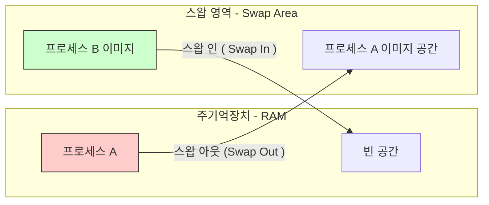

초기 운영체제에서 사용하던 메모리 관리 기법으로, 프로세스를 메모리에 적재할 때 그 크기만큼의 연속적인 메모리 공간을 할당하는 방식이다.

- 구현이 간단하고, 주소 변환이 쉬우며, 메모리 접근 속도가 빠르다는 장점 존재
- 외부 단편화와 메모리 활용률 저하가 있는 구조적 한계 존재

## 스와핑(Swapping)

메모리 공간이 부족할 때, 현재 실행되지 않거나 대기 상태인 프로세스를 일시적으로 보조기억장치로 옮기고 그 빈 공간을 다른 프로세스에게 할당하는 기법이다.

- 스왑 영역(swap space): 프로세스들이 스와핑되어 보내지는 보조기억장치의 일부 영역
- 스왑 아웃(swap-out): 프로세스를 스왑 영역으로 내보내는 작업
- 스왑 인(swap-in): 스왑 영역에 있던 프로세스를 메모리로 가져오는 작업

이를 통해 실제 물리 메모리 크기보다 더 많은 프로세스를 동시에 실행하는 듯한 효과를 낼 수 있다.

## 메모리 할당 방식(Dynamic Storage-Allocation Problem)

위처럼 스왑 인될때나 프로세스가 생성될 때 메모리에 적재하게 되는데, 이때 메모리에 할당하는 방식으로 최초 적합/최적 적합/최악 적합 방식이 있다.

|        방식         |                      설명                      |                      특징                      |
|:-----------------:|:--------------------------------------------:|:--------------------------------------------:|
| 최초 적합 (First Fit) |    메모리 처음부터 검색하여 가장 먼저 발견된 충분한 크기의 공간에 할당    |                 검색 속도가 가장 빠름                 |
| 최적 적합 (Best Fit)  | 모든 빈 공간을 검색하여 프로세스 크기에 가장 딱 맞는(가장 작은) 공간에 할당 |      내부 단편화는 줄지만, 아주 작은 빈 공간(파편)을 많이 생성      |
| 최악 적합 (Worst Fit) |          모든 빈 공간을 검색하여 가장 큰 공간에 할당           | 큰 빈 공간을 쪼개어 내부 단편화를 줄이려 하나, 외부 단편화가 심해질 수 있음 |

대부분의 상황에서는 최초 적합과 최적 적합이 속도와 공간 이용률 측면에서 최악 적합보다 우수하다.

## 외부 단편화(external fragmentation)

연속 메모리 할당의 치명적인 단점으로, 프로세스들이 메모리에 적재되고 제거되는 과정이 반복되면서, 메모리 사이사이에 사용할 수 없는 작은 빈 공간들이 생기는 현상을 말한다.

1. 메모리에 프로세스 A, B, C가 순서대로 적재
2. 프로세스 B가 종료되어 메모리 반환
3. B가 있던 자리가 빈 공간(Hole)이 됨
4. 새로운 프로세스 D가 들어오려는데, B가 있던 공간보다는 크고 전체 빈 공간보다는 작음
5. 결과적으로 전체 메모리 여유 공간의 합은 충분하지만, 연속된 공간이 없어 프로세스를 할당하지 못함

### 해결 방안: 메모리 압축 (Compaction)

외부 단편화를 해결하기 위해 흩어진 빈 공간들을 하나로 모으는 작업이다.

- 방식: 사용 중인 메모리 영역을 한쪽으로 몰고, 빈 공간을 다른 쪽으로 몰아 큰 빈 공간 생성
- 단점
    - 메모리 내의 데이터 위치를 이동시켜야 하므로 시스템 오버헤드가 매우 큼
    - 작업 도중에는 시스템이 멈출 수 있음
    - 실행 시간 바인딩이 지원되어야만 가능함

이러한 외부 단편화와 압축의 비용 문제를 근본적으로 해결하기 위해 현대 운영체제는 페이징(Paging) 기법을 포함한 가상 메모리 시스템을 도입하게 되었다.

###### 참고자료

- [혼자 공부하는 컴퓨터 구조+운영체제](https://kobic.net/book/bookInfo/view.do?isbn=9791162243091)
