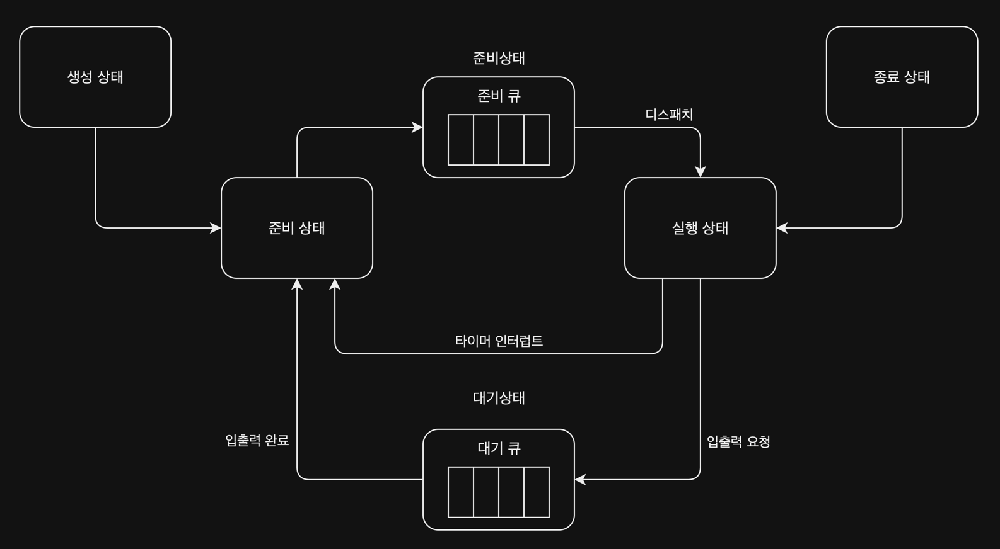

운영체제는 시스템의 성능을 극대화하기 위해 한정된 자원인 CPU를 프로세스들에게 효율적으로 배분하기 위해, 준비 큐에 있는 프로세스 할당을 결정하는 작업인 CPU 스케줄링을 하게 된다.

## 프로세스 유형과 우선순위

프로세스는 실행 과정에서 CPU를 사용하는 시간(CPU Burst)과 입출력을 기다리는 시간(I/O Burst)을 반복한다. 이 특성에 따라 두 가지로 분류된다.

- 입출력 집중 프로세스(I/O Bound Process)
    - 실행 시간의 대부분을 입출력 대기에 소모하는 프로세스 (예: 비디오 재생, 데이터베이스 쿼리)
    - 짧은 CPU 버스트를 자주 가짐
- CPU 집중 프로세스(CPU Bound Process)
    - 복잡한 연산 등 CPU 사용 시간이 많은 프로세스 (예: 머신러닝 학습, 3D 렌더링)
    - 긴 CPU 버스트를 가짐

일반적으로 스케줄러는 입출력 집중 프로세스에게 높은 우선순위를 부여하는데, 그 이유는 다음과 같다.

1. 입출력 작업을 할 때는 CPU 사용과 입출력장치 사용이 계속해서 반복
2. 입출력장치 사용하는 동안 CPU는 대기 상태 진입
3. 입출력 작업을 많이 하는 프로세스는 CPU를 많이 사용하지 않게 됨
4. 때문에 먼저 처리하고, 그 사이에 CPU 작업을 많이 하는 프로세스를 처리하는 것이 더 효율적으로 작업 처리 가능

## 스케줄링 큐(scheduling queue)

운영체제는 프로세스의 상태에 따라 서로 다른 큐에서 PCB(프로세스 제어 블록)를 관리한다.

- 운영체제는 프로세스들을 우선순위에 따라 스케줄링 큐로 구현하여 관리
- 다양한 종류의 스케줄링 큐로 관리

- 대기 큐(waiting queue): 입출력장치를 이용하기 위해 대기 상태에 있는 프로세스들이 저장되는 큐(각 입출력 장치마다 각각 대기 큐가 존재(프린터, 하드 디스크 등)
    1. 입출력 장치를 사용하기 위해 대기 상태에 있는 프로세스들이 대기 큐에 마지막에 삽입
    2. 입출력장치 사용을 위해 차례 대기
    3. 입출력이 완료되면 대기 큐에서 삭제 후 준비 큐에 삽입
- 준비 큐(ready queue): CPU를 할당받기 위해 대기하는 프로세스들이 저장되는 큐
    1. 준비 상태에 있는 프로세스들이 준비 큐에 마지막에 삽입
    2. CPU 사용을 위해 차례 대기
    3. 운영체제에서 큐에 삽입된 순서대로 프로세스를 하나씩 실행(여기서 우선순위가 높은 경우 해당 프로세스가 먼저 실행)

## 선점형 / 비선점형 스케줄링

스케줄링 큐를 관리할 때 실행 중인 프로세스를 강제로 중단하여 다른 프로세스를 실행시키는 방법에 따라 선점형 / 비선점형 스케줄링으로 나뉜다.

- 선점형 스케줄링(preemptive scheduling)
    - 동작 방식
        - 프로세스 실행 중 다른 프로세스가 도착하면 실행 중인 프로세스를 중단
        - 큐 안에 있는 프로세스 중 우선순위가 높은 프로세스를 실행하는 스케줄링
        - 특징
            - 한 프로세스의 자원 독점을 막고 프로세스들에 골고루 자원 배분이 되는 장점 존재
            - 문맥 교환 과정에서 오버헤드 발생 가능성 존재
- 비선점형 스케줄링(non-preemptive scheduling)
    - 동작 방식
        - 프로세스 실행 중 다른 프로세스가 도착하더라도 실행 중인 프로세스를 중단하지 않음
        - 하나의 프로세스가 자원 사용을 독점할 수 있는 스케줄링
    - 특징
        - 문맥 교환 횟수가 줄어들어 오버헤드가 선점형 스케줄링보다 적게 발생
        - 프로세스의 자원 독점이 발생할 수 있음

현재 대부분의 운영체제는 선점형 스케줄링을 사용하고 있다.

## 스케줄링 알고리즘

운영체제는 저마다 다른 스케줄링 알고리즘을 사용하며, 아래 다섯 가지 스케줄링 알고리즘 이외에도 다양한 스케줄링 알고리즘이 존재한다.

- 선입 선처리 스케줄링: 준비 큐에 삽입된 프로세스 순서대로 CPU 할당
- 최단 작업 우선 스케줄링: 준비 큐에 삽입된 프로세스 중 CPU 사용 시간이 가장 짧은 프로세스에게 CPU 할당
- 라운드 로빈 스케줄링: 정해진 시간만큼만 CPU를 할당하고, 할당된 시간이 지나면 다음 프로세스에게 CPU 할당
- 우선순위 스케줄링: 가장 높은 우선순위를 가진 프로세스에게 CPU 할당
- 다단계 피드백 큐 스케줄링: 프로세스들이 큐 사이를 이동하며 CPU를 할당받는 스케줄링

###### 참고자료

- [혼자 공부하는 컴퓨터 구조+운영체제](https://kobic.net/book/bookInfo/view.do?isbn=9791162243091)
