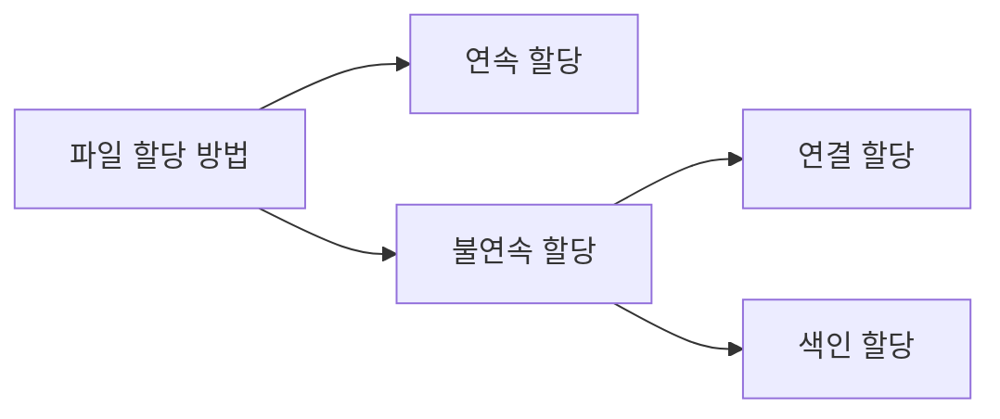

파일 시스템은 운영체제가 저장 매체(HDD, SSD 등)에 데이터를 효율적으로 기록하고 읽어오기 위한 관리 체계다.

## 보조기억장치와 파일 시스템

하드웨어를 운영체제가 인식하고 사용하기 위해서는 파티셔닝과 포매팅이 필수적이다.

1. 파티셔닝 (Partitioning)
    - 물리적인 디스크를 논리적인 구획(파티션)으로 나누는 작업
    - 하나의 디스크를 C드라이브, D드라이브로 나누어 쓰는 것이 이에 해당
    - 파티션 테이블(MBR, GPT)을 생성하여 각 영역의 시작과 끝 주소를 기록
2. 포매팅 (Formatting)
    - 파일 시스템(NTFS, FAT32, ext4 등)을 파티션에 설치하는 작업
    - 데이터를 저장할 수 있는 초기 구조(메타데이터 영역, 데이터 영역) 생성
    - 어떤 파일 시스템을 선택하느냐에 따라 최대 파일 크기, 속도, 안정성 등이 결정

## 파일 할당 방법(File Allocation Methods)

운영체제는 데이터를 여러 세터를 묶어 블록(Block) 단위로 디스크를 읽고 쓴다.(가장 작은 단위인 섹터는 너무 많고 작음)

1. 연속 할당(Contiguous Allocation): 파일을 디스크의 연속된 블록에 저장하는 방식
    - 장점
        - 디스크 헤더의 이동이 최소화되어 읽기/쓰기 속도가 매우 빠름(순차 접근 시 유리)
        - 시작 위치와 길이만 알면 파일 전체에 접근 가능
    - 단점
        - 외부 단편화 발생: 파일 사이사이에 빈 공간이 생기지만, 새로운 큰 파일을 저장하지 못하는 문제 발생
        - 파일 크기 확장이 어려움: 파일 뒤쪽 공간이 사용 중이면 데이터를 다른 곳으로 통째로 옮겨야 함
2. 연결 할당(Linked Allocation): 파일 데이터를 불연속적인 블록에 저장하되, 각 블록에 다음 블록의 주소(포인터)를 기록하여 연결하는 방식
    - 장점
        - 외부 단편화 문제 해결(빈 블록 어디든 저장 가능)
        - 파일 크기 확장이 자유로움
    - 단점
        - 임의 접근(Random Access) 속도가 느림: 중간 지점을 읽으려면 첫 블록부터 순서대로 포인터를 따라가야 함
        - 포인터 저장을 위한 추가 공간 필요
        - 중간 블록이 손상되면 이후의 모든 데이터를 유실할 수 있음
3. 색인 할당(Indexed Allocation): 데이터 블록에 포인터를 저장하는 대신, 인덱스 블록(Index Block)이라는 별도의 블록에 파일의 모든 데이터 블록 주소를 모아 관리하는 방식
    - 장점
        - 외부 단편화 문제 해결
        - 인덱스 블록을 통해 원하는 위치로 즉시 이동 가능하여 임의 접근 속도가 빠름
    - 단점
        - 아주 작은 파일이라도 인덱스 블록이 필요하여 공간 낭비 발생 가능
        - 파일이 매우 커서 하나의 인덱스 블록으로 커버할 수 없는 경우, 다중 인덱스 블록(Linked Index, Multilevel Index) 등의 복잡한 기법 필요

###### 참고자료

- [혼자 공부하는 컴퓨터 구조+운영체제](https://kobic.net/book/bookInfo/view.do?isbn=9791162243091)
