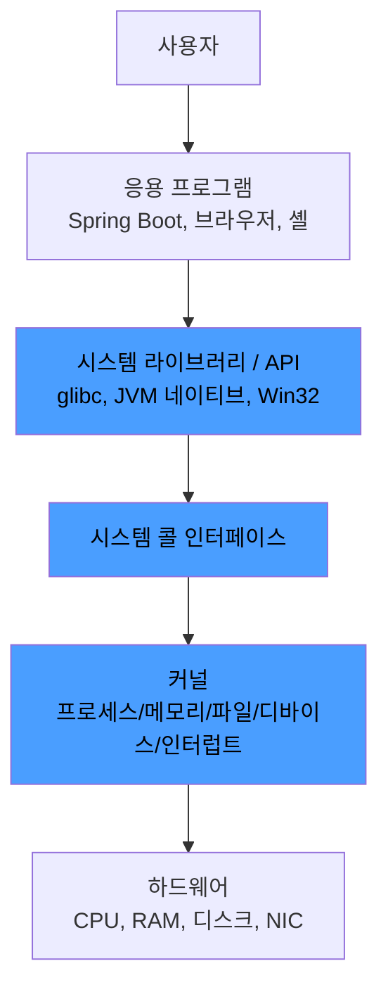

운영체제(OS, Operating System)는 하드웨어와 응용 프로그램 사이에 위치하는 시스템 소프트웨어다.

## 운영체제의 본질적 역할

운영체제는 하드웨어 자원을 통제하면서 그 통제를 응용 프로그램에 추상화하여 가리는 두 가지 역할을 동시에 수행한다.

|    역할     | 책임                            | 구체 예                                   |
|:---------:|:------------------------------|:---------------------------------------|
|  자원 관리자   | 한정된 하드웨어 자원을 여러 프로세스에 분배 및 보호 | CPU 스케줄링, 메모리 할당 및 회수, 파일 디스크립터 관리     |
| 인터페이스 제공자 | 하드웨어 다양성을 추상화해 공통 API 제공      | `read`/`write` 시스템 호출이 디스크 종류와 무관하게 동작 |

애플리케이션 개발자가 NVMe SSD인지 SATA SSD인지 모르고 `write()`를 호출할 수 있는 이유는, 운영체제가 디바이스별 차이를 단일 시스템 호출 인터페이스로 추상화하여 노출하기 때문이다.

## 운영체제의 주요 목적

운영체제의 목적은 크게 효율성, 공정성, 보안, 일관성으로 요약된다.

- 효율성: 하드웨어 자원을 놀리지 않도록 다중 프로그래밍(Multi-Programming)과 시분할(Time Sharing) 수행
- 공정성: 특정 프로세스가 자원을 독점하지 못하도록 스케줄링 적용
- 보안 및 고립: 사용자 모드/커널 모드 구분 및 프로세스 간 메모리 격리
- 일관된 인터페이스: 응용 프로그램이 하드웨어 사양 변화에 영향을 받지 않도록 추상화

## 컴퓨터 시스템 계층 구조

운영체제는 하드웨어와 응용 프로그램 사이에 존재하며, 포함하는 범위에 따라 넓은 의미와 좁은 의미로 나뉜다.

- 좁은 의미의 운영체제: 커널
- 넓은 의미의 운영체제: 커널, 시스템 라이브러리, 유틸리티(셸, init 시스템 등) 포함

응용 프로그램은 직접 커널을 호출하지 않고, 시스템 라이브러리를 통해 시스템 호출(System Call)로 진입한다.

## 부팅과 운영체제

운영체제는 컴퓨터 부팅 직후부터 자원 관리를 시작한다.

1. CPU가 펌웨어(BIOS/UEFI) 시작 주소부터 실행
2. 펌웨어가 하드웨어 점검 후 부트 디바이스에서 부트로더 적재
3. 부트로더(GRUB 등)가 디스크에서 커널 이미지를 메모리에 적재하고 점프
4. 커널이 자체 초기화 수행 (페이지 테이블, 인터럽트 디스크립터 테이블, 디바이스 드라이버 로드)
5. 커널 모드에서 마지막 단계로 첫 사용자 프로세스(PID 1) 실행
6. 이후부터 모든 사용자 프로세스는 첫 프로세스의 자손으로 생성

응용 프로그램은 부팅 단계가 완료된 이후에만 시스템 호출을 통해 운영체제의 서비스를 받을 수 있다.

## 커널 구조 (모놀리식 vs 마이크로커널)

운영체제의 핵심인 커널을 설계하는 방식은 크게 두 갈래로 나뉘며, 현대 운영체제는 대개 두 방식의 절충형을 채택한다.

|   구분    | 모놀리식 커널                                | 마이크로커널                                       |
|:-------:|:---------------------------------------|:---------------------------------------------|
|   구성    | 파일 시스템, 드라이버, 네트워크 스택 등 모두 커널 공간에 위치   | 핵심(스케줄링, IPC, 메모리)만 커널에 위치하고 나머지는 사용자 공간 서비스 |
|   통신    | 함수 호출 (속도 빠름)                          | 메시지 전달 (Mode Switch 오버헤드 누적)                 |
|   안정성   | 한 모듈의 버그가 커널 전체에 영향을 미침                | 서비스가 격리되어 특정 서비스가 죽어도 재시작 가능                 |
| 대표 운영체제 | Linux, 전통 Unix                         | Mach, MINIX, seL4                            |
|   절충형   | 로드 가능한 커널 모듈(LKM)로 드라이버를 동적 적재 (Linux) | XNU (Mach 기반에 BSD 모놀리식 요소 결합, macOS)         |

Linux는 모놀리식 커널이지만, 로드 가능한 커널 모듈(LKM)을 통해 드라이버를 동적으로 끼우고 빼는 방식을 채택하여 모놀리식의 효율성과 마이크로커널의 유연성을 동시에 확보한다.

## 백엔드 관점에서의 운영체제

서버 애플리케이션과 운영체제의 관계를 이해하면 운영체제의 역할이 실제로 어떻게 작동하는지 명확해진다.

- 자원 할당: JVM은 운영체제로부터 메모리, 스레드, 파일 디스크립터, 소켓을 할당받는 응용 프로그램
    - Java 스레드는 운영체제 스레드와 1:1로 매핑 (플랫폼 스레드의 경우)
- 추상화 계층 활용: Linux와 macOS에서 동일한 자바 코드가 실행 가능한 이유는 JVM이 운영체제별 시스템 호출의 차이를 숨기는 또 다른 추상화 계층이기 때문
