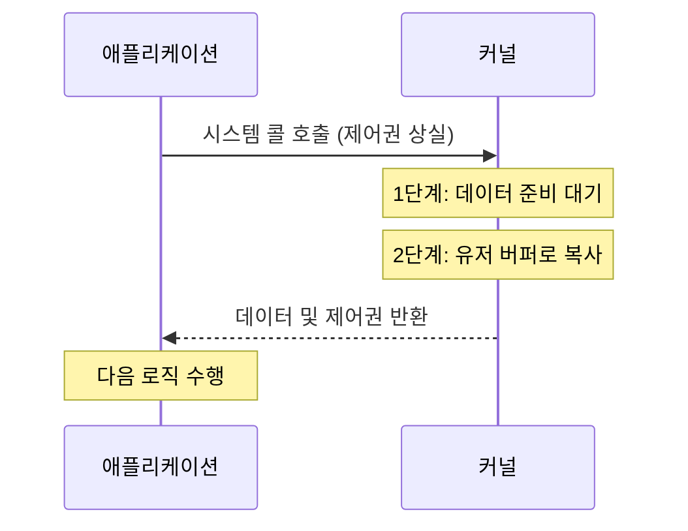
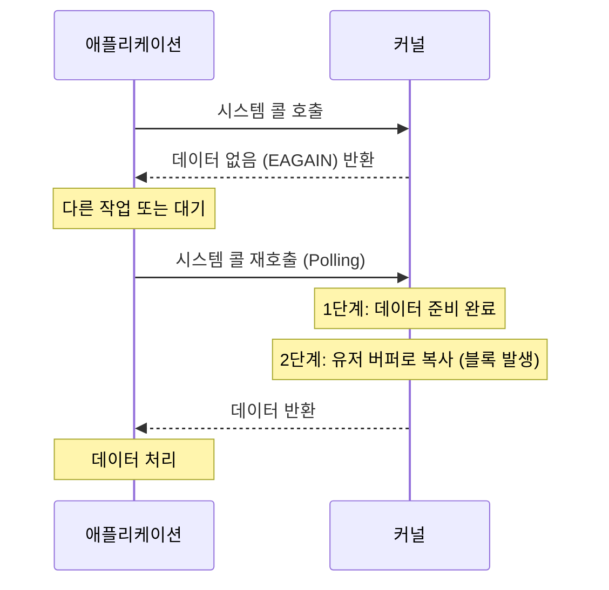
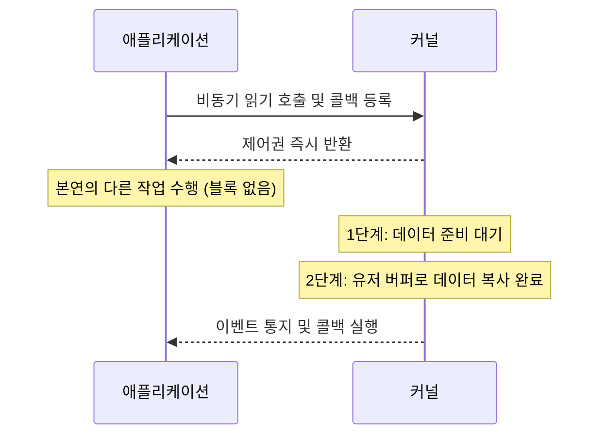

## 개요

운영체제에서 애플리케이션 (User Space)이 커널 (Kernel Space)에 I/O 작업을 요청하고 결과를 처리하는 메커니즘을 두 가지 축으로 분류한다.

- Blocking/Non-blocking: 요청한 I/O 작업이 완료될 때까지 애플리케이션의 제어권을 어떻게 처리할 것인가에 대한 관점
- Synchronous/Asynchronous: I/O 작업의 완료 여부를 누가 확인하고 결과를 처리할 것인가에 대한 관점

## I/O 작업의 2단계 내부 메커니즘

OS 커널 관점에서 I/O 작업은 물리적으로 두 가지 독립적인 단계로 나뉘어 수행된다.

1. 데이터 준비 대기 (Waiting for data to be ready)
    - 네트워크 소켓으로 패킷이 도착하거나 디스크에서 데이터를 읽어 커널 버퍼에 가져오는 단계
    - 외부 요인 (네트워크 지연 등)에 의해 시간이 가장 오래 걸리는 구간
2. 커널 버퍼에서 유저 버퍼로 데이터 복사 (Copying data from kernel to user)
    - 커널 버퍼에 준비된 데이터를 애플리케이션의 메모리 공간으로 물리적으로 복사하는 단계
    - CPU 자원을 직접 소모하며 이 복사가 완료되어야 애플리케이션이 데이터를 읽을 수 있음

## Blocking vs Non-blocking

애플리케이션이 시스템 콜을 호출했을 때 제어권 (Control)을 반환하는 시점의 차이다.

### Blocking I/O

I/O 작업이 완료될 때까지 호출한 애플리케이션 (스레드)은 제어권을 잃고 대기 (Wait) 상태로 전환된다.

- 직관적인 코드: 작업 순서가 보장되어 코드를 이해하고 작성하기 쉬움
- 리소스 낭비: I/O 작업 동안 스레드가 CPU를 사용하지 못하고 멈춰 있어 동시 처리량이 저하됨
- 컨텍스트 스위칭 오버헤드: 다수의 클라이언트를 처리하기 위해 다수의 스레드를 생성하면 커널 레벨의 컨텍스트 스위칭 비용이 급증

### Non-blocking I/O

I/O 작업 완료 여부와 무관하게 시스템 콜 호출 즉시 제어권을 반환받는다.

- 높은 리소스 활용: 스레드가 멈추지 않으므로 데이터 준비 대기 단계에서 다른 작업을 수행할 수 있음
- 상태 확인 반복: 작업 완료를 확인하기 위해 애플리케이션이 커널에 반복적으로 상태를 묻는 폴링 (Polling) 오버헤드 발생 가능
- 복잡한 흐름: 작업 완료 시점에 대한 흐름 제어가 분리되어 코드 작성이 까다로움

## Synchronous vs Asynchronous

작업의 순차성 및 결과에 대한 알림 (Notification) 주체의 차이다.

### Synchronous I/O (동기)

애플리케이션이 I/O 작업의 완료 여부를 직접 주도하여 확인하고 순차적으로 다음 작업을 수행한다.

- 주도적 확인: Blocking 방식은 대기하다가 결과를 받고, Non-blocking 방식은 루프를 돌며 (Polling) 지속적으로 완료 여부를 커널에 확인
- 순차적 흐름: 이전 작업의 완료가 다음 작업의 시작 조건이 됨

### Asynchronous I/O (비동기)

애플리케이션은 I/O 작업을 요청만 하고 즉시 다른 작업을 수행하며, 작업 완료 여부는 커널 (또는 백그라운드 스레드)이 콜백 (Callback)이나 이벤트 (Event)로 애플리케이션에 통보한다.

- 통보 기반: 애플리케이션이 완료 여부를 신경 쓰지 않고 다른 비즈니스 로직에 집중 가능
- 콜백 체인: 복잡한 작업 흐름을 제어하기 위해 콜백 지옥 (Callback Hell)이 발생할 수 있음
- 효율성 극대화: Non-blocking 메커니즘과 결합하여 단일 스레드로 다수의 I/O 작업을 효율적으로 처리

## 4가지 I/O 모델 비교

Blocking/Non-blocking 축과 Sync/Async 축을 결합하여 4가지 모델을 구성한다.

|     구분     |                         Blocking                          |                       Non-blocking                        |
|:------------:|:---------------------------------------------------------:|:---------------------------------------------------------:|
| Synchronous  |     애플리케이션이 대기하다가 데이터를 직접 받아 처리     |   애플리케이션이 루프를 돌며 완료 여부를 직접 반복 확인   |
| Asynchronous | 내부 제약으로 인해 의도치 않게 대기 발생 (실무 사용 드뭄) | 커널이 모든 작업을 마치고 애플리케이션에 완료 이벤트 통지 |

### Sync + Blocking

전통적이고 가장 직관적인 I/O 모델이다. 데이터 준비 단계와 데이터 복사 단계 모두에서 애플리케이션 스레드가 블록된다.

- 메커니즘 특성
    - 애플리케이션이 I/O 시스템 콜을 호출하고 제어권을 커널에 넘김
    - 커널에서 네트워크 패킷을 기다리고, 도착한 데이터를 애플리케이션 버퍼로 복사할 때까지 애플리케이션 스레드는 슬립 (Sleep) 상태로 대기
    - 작업이 끝나면 결과와 함께 제어권을 반환받고 다음 로직을 순차적으로 수행
- 사용처: 일반적인 디스크 파일 읽기, 레거시 JDBC를 이용한 데이터베이스 쿼리

### Sync + Non-blocking

애플리케이션이 제어권을 즉시 돌려받지만 (Non-blocking), 결과가 나올 때까지 지속적으로 상태를 확인 (Sync)한다.

- 메커니즘 특성
    - 시스템 콜 호출 즉시 아직 데이터가 없다는 상태 에러 (EAGAIN 또는 EWOULDBLOCK)와 함께 커널이 제어권 반환
    - 애플리케이션은 다른 작업을 하다가 주기적으로 시스템 콜을 재호출하여 데이터가 준비되었는지 확인 (Polling)
    - 데이터가 커널 버퍼에 준비된 것이 확인되면, 커널에서 유저 공간으로 데이터를 복사하는 2단계 구간에서는 일시적으로 블록 발생
- 문제점: 잦은 시스템 콜 호출로 인한 유저/커널 모드 전환 비용 및 CPU 자원 낭비 발생

### Async + Non-blocking

Node.js, Nginx 등 최신 고성능 서버에서 주력으로 사용하는 완전한 비동기 I/O 모델이다.

- 메커니즘 특성
    - 애플리케이션이 시스템 콜과 함께 작업 완료 시 실행할 콜백 함수를 커널에 전달하고 즉시 제어권 반환
    - 애플리케이션은 I/O 1단계 (데이터 준비)와 2단계 (데이터 복사) 모두 관여하지 않고 본연의 다른 작업 수행
    - 커널은 I/O 작업과 유저 메모리로의 데이터 복사를 모두 마친 후, 최종적으로 애플리케이션에 이벤트를 발생시키거나 등록된 콜백 실행
- 장점: 스레드 대기와 폴링 오버헤드가 전혀 없어, 최소한의 스레드로 극도의 동시성 처리 가능

### Async + Blocking

개념적으로 모순되며 실무에서 의도적으로 사용하는 경우는 매우 드물다.

- 발생 원인: 비동기 논블로킹 방식으로 작동하도록 설계했으나, 내부 라이브러리나 OS 레벨의 한계로 인해 데이터 복사 단계나 디스크 접근 등에서 강제로 블로킹이 발생하는 경우
- 실무 예시: Node.js에서 비동기 I/O 함수를 호출했으나, 데이터베이스 쿼리 과정에서 드라이버 내부의 로직 결함이나 파일 시스템의 동기적 제약 때문에 스레드가 일시 대기 상태에 빠지는 현상
