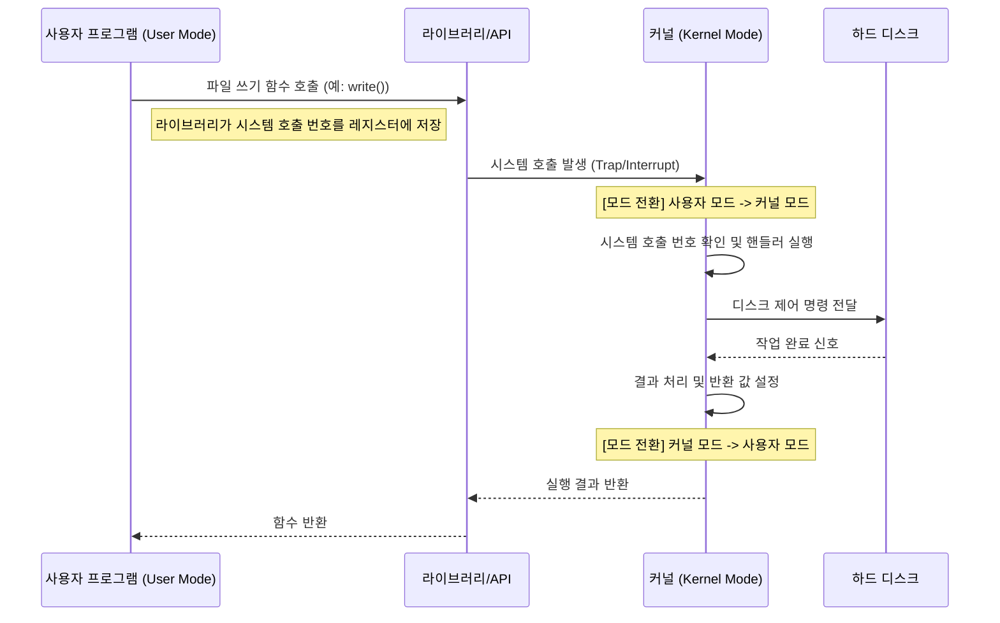

운영체제는 컴퓨터 자원을 관리하는 거대하고 복잡한 소프트웨어로, 그중 커널(Kernel)은 운영체제의 핵심 구성 요소다.

## 커널의 역할

커널은 시스템의 통제권을 가지고 다음과 같은 핵심 기능을 담당한다.

- 프로세스 관리: CPU 스케줄링, 프로세스 생성 및 제거, 동기화 관리
- 메모리 관리: 메모리 할당 및 회수, 가상 메모리 관리
- 파일 시스템 관리: 디스크 파일의 저장, 검색, 갱신
- 디바이스 제어: 키보드, 모니터, 디스크 등 하드웨어 장치의 입출력 제어
- 인터럽트 처리: 하드웨어 및 소프트웨어 인터럽트 관리

## 이중 모드(Dual Mode)

운영체제는 프로그램의 잘못된 조작으로 인해 시스템 전체가 붕괴되는 것을 방지하기 위한 CPU의 실행 모드를 두 가지로 구분하여 운영한다.

- 사용자 모드(user mode): 운영체제 서비스를 제공받을 수 없는 실행 모드
    - 사용자 애플리케이션이 실행되는 제한된 영역
    - 하드웨어에 직접 접근하거나 시스템에 치명적인 영향을 줄 수 있는 명령어 실행 불가능
    - 대부분의 응용 프로그램 코드는 이 모드에서 실행
- 커널 모드(kernel mode): 운영체제 서비스를 제공받을 수 있는 실행 모드
    - 운영체제 코드가 실행되는 특권 영역
    - 모든 시스템 자원 접근 및 모든 CPU 명령어 실행 가능
    - 인터럽트 처리, 하드웨어 제어 등은 반드시 커널 모드에서 수행

## 시스템 호출 (System Call)

사용자 모드에서 실행되는 프로세스가 파일 읽기, 쓰기, 화면 출력 등 커널의 기능을 사용해야 할 때 운영체제에 서비스를 요청하는 인터페이스다. 다음과 같이 작동한다.

- 소프트웨어 인터럽트(Trap): 시스템 호출은 소프트웨어 인터럽트의 일종으로, 호출 시 CPU 제어권이 사용자 프로그램에서 커널로 넘어감
- 컨텍스트 스위칭 비용: 시스템 호출이 발생하면 모드 전환(Mode bit 변경)과 문맥 교환(Context Switching)이 발생하므로 빈번한 시스템 호출은 성능 저하의 원인이 될 수 있음
- API와의 관계: 개발자는 주로 시스템 호출을 직접 사용하기보다 표준 라이브러리(C언어의 glibc, Windows API 등)를 통해 간접적으로 호출함

1. 응용 프로그램이 사용 중이므로 사용자 모드로 실행 중인 상태
2. 자원에 접근하기 위해 커널 모드로 전환하기 위해 시스템 호출
3. 커널 모드로 전환
4. 운영체제 내의 `하드 디스크 데이터 저장 코드`를 실행하여 하드 디스크에 접근
5. `하드 디스크 데이터 저장 코드` 실행 완료
6. 커널 모드에서 사용자 모드로 전환

사용자 응용 프로그램은 실행 과정에서 운영체제 서비스들을 매우 빈번하게 사용하기 때문에 시스템 호출을 발생 시키면서 사용자/커널 모드 전환을 반복하게 된다.

### 시스템 호출 처리 흐름

사용자 프로그램이 하드 디스크에 데이터를 저장하려는 상황을 가정했을 때의 흐름의 예시는 다음과 같다.

1. 사용자 프로그램이 라이브러리 함수 호출
2. 라이브러리가 해당 기능에 매핑된 시스템 호출 번호를 CPU 레지스터에 적재하고 트랩(Trap) 발생
3. CPU가 커널 모드로 전환되고, IDT(Interrupt Descriptor Table)를 참조하여 해당 시스템 호출 핸들러 실행
4. 커널이 하드웨어 제어 작업을 수행
5. 작업 완료 후 다시 사용자 모드로 전환되며 실행 결과 반환

###### 참고자료

- [혼자 공부하는 컴퓨터 구조+운영체제](https://kobic.net/book/bookInfo/view.do?isbn=9791162243091)
