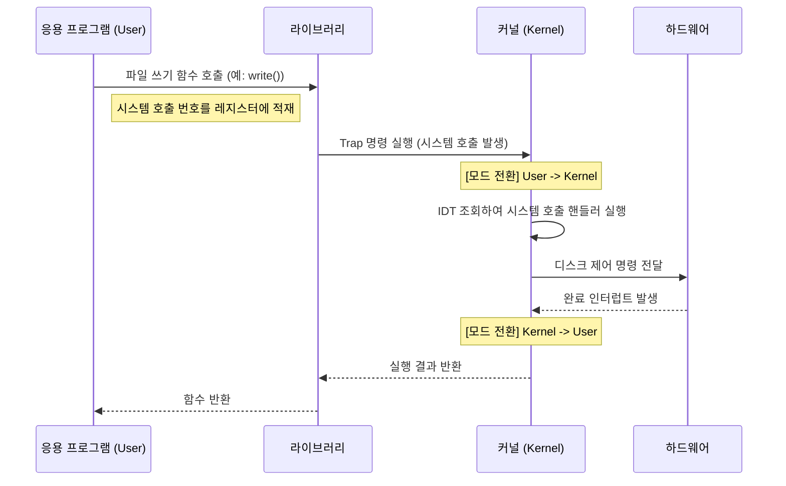

운영체제는 컴퓨터 자원을 관리하는 거대하고 복잡한 소프트웨어로, 그중 커널(Kernel)은 운영체제의 가장 작고 핵심적인 부분이다.

## 커널의 역할

커널은 시스템의 통제권을 가지고 다음과 같은 핵심 기능을 담당한다.

|    역할     |           책임           |       대표 자료 구조        |
|:---------:|:----------------------:|:---------------------:|
|  프로세스 관리  | 생성 및 종료, CPU 스케줄링, 동기화 |    PCB, Run Queue     |
|  메모리 관리   | 물리 메모리 할당 및 회수, 가상 메모리 |     페이지 테이블, TLB      |
| 파일 시스템 관리 |  파일/디렉토리 추상화, 권한, 버퍼링  | inode, dentry, 페이지 캐시 |
|  디바이스 제어  |   드라이버를 통한 하드웨어 입출력    |  디바이스 파일, 디바이스 드라이버   |
|  인터럽트 처리  |   외부 이벤트와 예외에 대한 반응    |     IDT, 인터럽트 핸들러     |

단순한 `read()` 시스템 호출 하나에도 커널의 여러 역할(프로세스 상태 변경, 페이지 캐시 메모리 조회, 파일 시스템의 inode 탐색, 디스크 입출력 제어, 입출력 완료 인터럽트 처리 등)이 수행된다.

## 이중 모드 (Dual Mode)

운영체제는 프로그램의 잘못된 조작으로 인해 시스템 전체가 붕괴되는 것을 방지하기 위해 하드웨어 수준에서 CPU의 실행 모드를 두 가지로 구분하여 운영한다.

|         모드          |              권한               |      실행 주체       |
|:-------------------:|:-----------------------------:|:----------------:|
| 사용자 모드 (User Mode)  | 제한된 명령어만 실행 가능, 하드웨어 직접 접근 불가 |  응용 프로그램, 라이브러리  |
| 커널 모드 (Kernel Mode) |   모든 CPU 명령어와 메모리 영역 접근 가능    | 커널 코드, 디바이스 드라이버 |

- 모드 구분: CPU 내부의 모드 비트(특권 플래그)를 통해 구분
- 예외 발생: 응용 프로그램이 권한 외 명령(예: 페이지 테이블 변경)을 시도하면 예외(Exception) 발생
- 시스템 격리: 이중 모드 덕분에 단일 프로세스의 잘못된 동작이 운영체제의 안정성을 해치지 않도록 격리 가능

### 모드 스위치 (Mode Switch)

CPU의 권한 수준을 사용자 모드와 커널 모드 사이에서 전환하는 작업이다.

- 같은 프로세스가 그대로 실행되며 권한만 변경됨
- 시스템 호출, 인터럽트, 예외 발생 시 트랩(Trap) 명령으로 진입
- CPU의 모드 비트와 프로그램 카운터(PC), 일부 레지스터만 갱신
- 페이지 테이블, TLB, 캐시는 그대로 유지되므로 작업 비용이 매우 작음 (Context Switch 대비)

## 시스템 호출 (System Call)

사용자 모드에서 실행되는 프로세스가 파일 쓰기, 네트워크 송수신 등 커널의 기능을 사용해야 할 때 진입하는 유일한 통로(인터페이스)다.

- 소프트웨어 인터럽트 (Trap): 시스템 호출은 소프트웨어 인터럽트의 일종으로, 호출 시 CPU 제어권이 사용자 프로그램에서 커널로 넘어감
- API 활용: 응용 프로그램 개발자는 시스템 호출을 직접 작성하기보다 시스템 라이브러리(glibc, JVM 네이티브 등)를 통해 간접적으로 호출함

### 시스템 호출 처리 흐름

응용 프로그램이 파일에 데이터를 쓰는 `write()` 시스템 호출을 요청했을 때의 처리 흐름은 다음과 같다.

```mermaid
sequenceDiagram
    participant UserApp as 응용 프로그램 (User)
    participant Library as 라이브러리
    participant Kernel as 커널 (Kernel)
    participant Hardware as 하드웨어
    UserApp ->> Library: 파일 쓰기 함수 호출 (예: write())
    Note right of UserApp: 시스템 호출 번호를 레지스터에 적재
    Library ->> Kernel: Trap 명령 실행 (시스템 호출 발생)
    Note over Kernel: [모드 전환] User -> Kernel
    Kernel ->> Kernel: IDT 조회하여 시스템 호출 핸들러 실행
    Kernel ->> Hardware: 디스크 제어 명령 전달
    Hardware -->> Kernel: 완료 인터럽트 발생
    Note over Kernel: [모드 전환] Kernel -> User
    Kernel -->> Library: 실행 결과 반환
    Library -->> UserApp: 함수 반환
```

1. 사용자 프로그램이 라이브러리 함수 호출
2. 라이브러리가 해당 기능에 매핑된 시스템 호출 번호를 CPU 레지스터에 적재하고 트랩(Trap) 발생
3. CPU가 커널 모드로 전환되고, IDT(Interrupt Descriptor Table)를 참조하여 해당 시스템 호출 핸들러 실행
4. 커널이 하드웨어 제어 작업을 수행
5. 작업 완료 후 다시 사용자 모드로 전환되며 실행 결과 반환

###### 참고자료

- [혼자 공부하는 컴퓨터 구조+운영체제](https://kobic.net/book/bookInfo/view.do?isbn=9791162243091)
