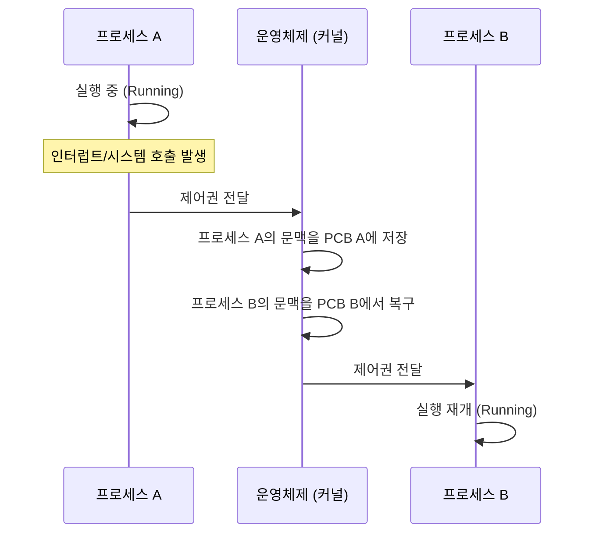
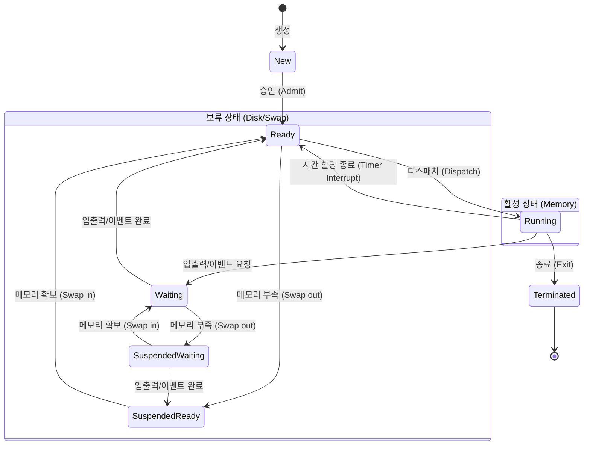

보조기억장치에 저장된 파일인 프로그램을 메모리에 적재되어 CPU 자원을 할당받고 실행되는 상태가 되면 이를 프로세스라 부른다.

## 운영체제 내 실행 중인 프로세스 확인

윈도우에서는 작업 관리자의 프로세스 탭에서 확인할 수 있고, 리눅스에서는 `ps` 명령어로 확인할 수 있다.

```shell
$ ps -ef
  501 99763     1   0  2:45PM ??         0:00.08 /.../MacOS/com.apple.WebKit.Networking
    0  6764  6763   0  3:34PM ttys000    0:00.01 /.../MacOS/ShellLauncher --launch_shell
  501  6765  6764   0  3:34PM ttys000    0:00.25 -zsh
  501  6780     1   0  3:34PM ttys000    0:00.00 -zsh
  501  6813     1   0  3:34PM ttys000    0:00.00 -zsh
  501  6814     1   0  3:34PM ttys000    0:00.00 -zsh
  501  6816  6780   0  3:34PM ttys000    0:00.00 /Users/hyoguoo/.cache/gitstatus/gitstatusd-darwin-arm64 -G v1.5.4 -s -1 -u -1 -d -1 -c -1 -m -1 -v FATAL -t 20
    0  6892  6765   0  3:34PM ttys000    0:00.00 ps -ef
```

## 프로세스의 메모리 영역 구조

프로세스가 실행되면 운영체제는 해당 프로세스를 위해 메모리 공간을 할당한다.

- 코드 영역 (Code/Text Segment)
    - 실행할 프로그램의 코드(기계어)가 저장되는 영역
    - CPU가 명령어를 가져가 실행하는 위치
    - 프로그램 실행 중 코드가 변경되지 않도록 읽기 전용(Read-Only)으로 설정됨
- 데이터 영역 (Data Segment)
    - 전역 변수(Global Variable)와 정적 변수(Static Variable)가 저장되는 영역
    - 프로그램 시작과 동시에 할당되고, 프로그램 종료 시 소멸됨
    - 초기화된 데이터는 Data 영역에, 초기화되지 않은 데이터는 BSS(Block Started by Symbol) 영역에 저장됨
- 힙 영역 (Heap Segment)
    - 프로그래머가 필요에 따라 동적으로 메모리를 할당하고 해제하는 영역 (예: C의 `malloc`, Java의 `new`)
    - 메모리 주소의 낮은 값에서 높은 값으로 할당됨
    - 사용 후 해제하지 않으면 메모리 누수(Memory Leak) 발생
- 스택 영역 (Stack Segment)
    - 함수 호출 시 생성되는 지역 변수, 매개변수, 리턴 주소 등이 저장되는 임시 영역
    - 함수 호출이 완료되면 자동으로 소멸됨
    - 메모리 주소의 높은 값에서 낮은 값으로 할당됨 (힙 영역과의 충돌 방지)

## 문맥 교환 (Context Switch)

CPU가 현재 실행 중인 프로세스의 작업을 중단하고, 다른 프로세스를 실행하기 위해 상태(Context)를 교체하는 작업이다.

### 문맥 교환 과정



### 문맥 교환 오버헤드

잦은 컨테스트 스위칭은 시스템 성능을 저하시키는 주된 원인이 된다.

- 캐시 오염 (Cache Pollution): 프로세스가 바뀌면 CPU 캐시 메모리에 저장된 데이터가 무효화되므로, 새로운 프로세스는 데이터를 메모리에서 다시 읽어와야 함
- TLB 플러시: 가상 메모리 주소 변환을 돕는 TLB(Translation Lookaside Buffer)가 초기화되어 메모리 접근 속도가 일시적으로 느려짐

## 프로세스 제어 블록(Process Control Block, PCB)

프로세스 제어 블록(PCB)은 운영체제가 각 프로세스에 대한 정보를 저장하는 자료구조로, 프로세스의 상태를 관리하고 문맥 교환 시 필요한 정보를 제공한다.

- 프로세스 식별자 (PID): 프로세스를 구분하는 고유 번호
- 프로세스 상태: 현재 프로세스의 상태 (생성, 준비, 실행, 대기, 종료)
- 프로그램 카운터 (PC): 다음에 실행할 명령어의 주소
- CPU 레지스터 값: 문맥 교환 시 백업 및 복구해야 할 누산기, 인덱스 레지스터 등의 값
- CPU 스케줄링 정보: 우선순위, 스케줄링 큐 포인터 등
- 메모리 관리 정보: 베이스 레지스터, 한계 레지스터, 페이지 테이블 정보 등
- 입출력 상태 정보: 프로세스에 할당된 입출력 장치 및 열린 파일 목록

## 프로세스 상태

프로세스는 생성되어 종료될 때까지 상태가 변화하며 실행되는데, 현대 운영체제는 기본 상태 외에 메모리 부족 시 발생하는 보류(Suspended) 상태를 포함하여 관리한다.



- 생성 (New): 프로세스가 생성 중인 단계
- 준비 (Ready): CPU 할당을 기다리는 상태
- 실행 (Running): CPU를 점유하여 명령어를 실행하는 상태
- 대기 (Waiting/Blocked): 입출력 작업 등으로 인해 CPU가 있어도 실행할 수 없는 상태
- 종료 (Terminated): 실행이 완료되어 자원이 회수되는 상태
- 보류 (Suspended): 메모리가 부족하여 프로세스가 디스크의 스왑 영역으로 쫓겨난 상태 (Swap Out)

## 프로세스 계층 구조

프로세스는 실행 도중 시스템 호출을 통해 다른 프로세스를 생성하는 트리 구조를 형성한다.

- 부모 프로세스와 부모 프로세스에 의해 생성된 자식 프로세스로 구분
- 각기 다른 PID를 가지며, 자식 프로세스는 부모 프로세스의 PID를 PPID로 저장
- 최초의 프로세스는 `init` 프로세스이며, 모든 프로세스는 `init` 프로세스로부터 파생

### 프로세스 생성

프로세스 생성은 주로 `fork`와 `exec` 시스템 호출을 통해 이루어진다.

- fork(): 부모 프로세스를 복제하여 새로운 자식 프로세스를 생성
    - 자식 프로세스에 PID를 제외한 코드, 데이터, 힙, 스택 등 모든 자원을 상속
- exec(): 프로세스의 메모리 공간을 새로운 프로그램으로 덮어쓰는 시스템 호출
    - `fork`로 생성된 껍데기 프로세스에 실제 실행할 코드를 주입하는 역할

###### 참고자료

- [혼자 공부하는 컴퓨터 구조+운영체제](https://kobic.net/book/bookInfo/view.do?isbn=9791162243091)
