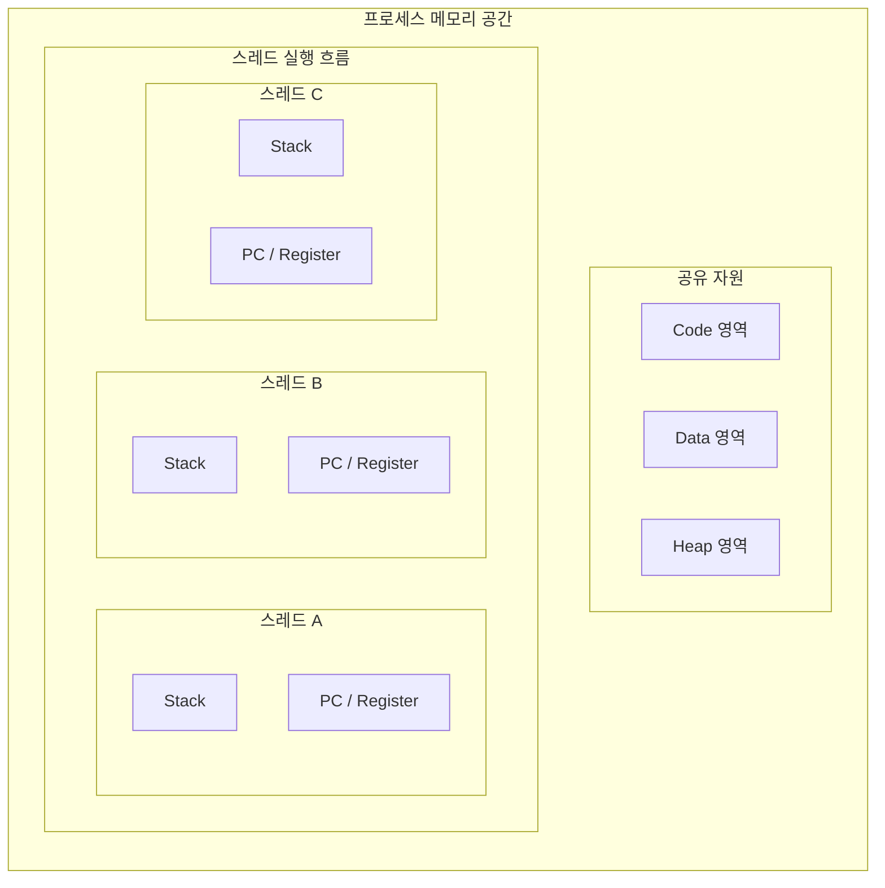

스레드는 프로세스 내에서 실행되는 흐름의 단위이자, CPU 스케줄링의 기본 단위다.

- 과거의 운영체제에서는 프로세스 하나가 하나의 실행 흐름을 가짐
- 현대 운영체제에서는 하나의 프로세스가 여러 개의 스레드를 가져 멀티스레딩(Multithreading) 지원

## 스레드의 메모리 구조

스레드의 가장 큰 특징은 프로세스 내의 자원을 공유하여 효율적인 자원 관리와 데이터 통신을 가능하게 하지만, 동기화 문제를 유발하는 원인이 되기도 한다.

### 자원 공유 방식

- 공유 영역: Code, Data, Heap 영역은 프로세스 내 모든 스레드가 공유
    - 파일 디스크립터(열린 파일 목록)나 전역 변수 등을 손쉽게 공유 가능
- 독립 영역: Stack, PC(Program Counter), 레지스터(Register)는 스레드마다 독립적으로 할당
    - 각 스레드가 독립적인 함수 호출과 실행 흐름을 가지기 위함

```mermaid
graph TB
    subgraph Process [프로세스 메모리 공간]
        direction TB
        subgraph Shared [공유 자원]
            Code[Code 영역]
            Data[Data 영역]
            Heap[Heap 영역]
        end

        subgraph Threads [스레드 실행 흐름]
            direction LR
            subgraph T1 [스레드 A]
                Stack1[Stack]
                Reg1[PC / Register]
            end
            subgraph T2 [스레드 B]
                Stack2[Stack]
                Reg2[PC / Register]
            end
            subgraph T3 [스레드 C]
                Stack3[Stack]
                Reg3[PC / Register]
            end
        end
    end
```

## 프로세스 vs 스레드

프로세스는 운영체제로부터 자원을 할당받는 단위이고, 스레드는 할당된 자원을 사용하는 실행의 단위다.

|  구분   |            프로세스(Process)            |          스레드(Thread)          |
|:-----:|:-----------------------------------:|:-----------------------------:|
|  정의   |        실행 중인 프로그램(자원 할당의 단위)        |    프로세스 안의 실행 흐름(스케줄링의 단위)    |
|  메모리  | 독립된 메모리 영역(Code, Data, Heap, Stack) |   Stack만 독립, 나머지는 프로세스 내 공유   |
| 통신 비용 |        높음(IPC 필요: 파이프, 소켓 등)        | 낮음(공유 메모리(Data, Heap) 직접 접근)  |
| 문맥 교환 |       오버헤드 큼(캐시 초기화 등 비용 높음)        |  오버헤드 작음(메모리 공유로 캐시 적중률 높음)   |
|  안정성  |      한 프로세스 종료가 다른 프로세스에 영향 없음      | 한 스레드의 오류가 프로세스 전체를 종료시킬 수 있음 |

## 멀티 프로세스 vs 멀티 스레드

- 멀티 프로세스: 하나의 프로그램을 여러 프로세스로 구성하여 독립적으로 작업 수행
    - 장점: 독립된 메모리 구조로 인해 하나의 프로세스 장애가 다른 프로세스로 전이되지 않아 안정성이 높음
    - 단점: 문맥 교환 시 캐시 초기화 등 무거운 작업이 필요하며, 프로세스 간 통신(IPC) 비용 발생
- 멀티 스레드: 하나의 프로그램을 여러 스레드로 구성하여 자원을 공유하며 작업 수행
    - 장점: 힙 영역 등을 통해 데이터를 직접 공유하므로 통신이 간단하고 문맥 교환 오버헤드가 적음
    - 단점: 자원 공유로 인한 데이터 정합성 문제(Thread Safety)가 발생할 수 있으며, 한 스레드의 오류가 전체 프로세스에 영향을 줄 수 있음

## 스레드 안전 (Thread Safety)

여러 스레드가 동시에 공유 자원에 접근할 때 프로그램의 실행에 문제가 없는 상태를 의미한다.

- 동기화 메커니즘: 뮤텍스(Mutex), 세마포어(Semaphore) 등을 사용하여 임계 구역에 대한 접근 제어
- 원자성 보장: 중단되지 않는 최소 작업 단위를 보장하여 데이터 정합성 유지

###### 참고자료

- [혼자 공부하는 컴퓨터 구조+운영체제](https://kobic.net/book/bookInfo/view.do?isbn=9791162243091)
