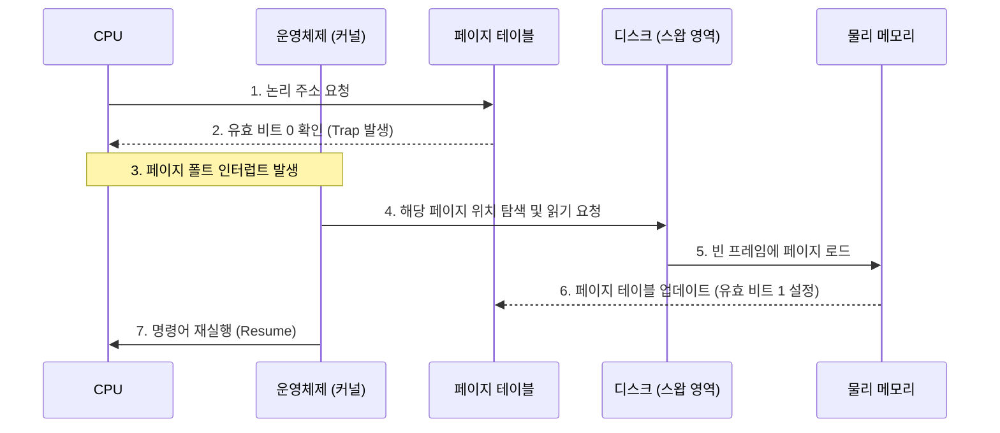

물리 메모리의 크기 한계를 극복하기 위해 나온 기술로, 프로세스 전체가 메모리에 적재되지 않아도 실행이 가능하다는 점에 착안하여 설계되었다.

- 실제 물리 메모리보다 큰 프로세스를 실행 가능
- 멀티태스킹 환경에서 더 많은 프로세스 수용 가능

## 페이징(Paging)

프로세스의 논리 주소 공간과 물리 메모리 공간을 일정한 크기의 단위로 나누어 관리하는 기법으로, 연속 메모리 할당의 문제점인 외부 단편화를 해결하는 핵심 기술이다.

### 구성 단위

- 페이지(Page): 프로세스의 논리 주소 공간을 나눈 단위
- 프레임(Frame): 물리 메모리 공간을 페이지와 동일한 크기로 나눈 단위

일정한 단위로 자른 뒤 `페이지`를 임의의 `프레임`에 불연속적으로 할당하게 되는데, 페이지 번호와 프레임 번호를 짝지어 논리적으로 연속된 것처럼 동작한다.

## 페이지 테이블(Page Table)

물리 메모리에 불연속적으로 저장된 페이지들을 CPU가 연속적인 논리 주소로 인식하고 실행할 수 있도록 돕는 매핑 테이블이다.

- 각 프로세스마다 별도의 페이지 테이블을 가짐
- 주로 PCB(프로세스 제어 블록)에 포인터가 저장

### 역할 및 구조

- 매핑 정보: 페이지 번호(Page Number)와 그에 매칭되는 프레임 번호(Frame Number)를 저장
- 논리 주소 변환: CPU가 내는 논리 주소를 페이지 테이블을 참조하여 물리 주소로 변환함
- 주요 필드: 프레임 번호 외에도 유효 비트(Valid Bit), 보호 비트(Protection Bit), 참조 비트(Reference Bit), 수정 비트(Dirty Bit) 등을 포함하여 페이지 상태를 관리함

## 요구 페이징(Demand Paging)과 스와핑

페이징 시스템에서는 프로세스 실행 시 모든 페이지를 미리 메모리에 올리지 않고, 실행에 필요한 페이지만 메모리에 적재하는 기법을 사용한다.

- 페이지 인(Page In): 필요한 페이지를 보조기억장치(스왑 영역)에서 메모리로 읽어 들이는 작업
- 페이지 아웃(Page Out): 메모리가 부족하거나 당장 필요하지 않은 페이지를 스왑 영역으로 내보내는 작업
- 스와핑 효과: 이 과정을 통해 실제 메모리보다 훨씬 큰 용량의 프로세스를 실행하는 환상을 제공함

## 페이지 폴트(Page Fault)

CPU가 액세스하려는 페이지가 현재 물리 메모리에 없을 때(유효 비트가 0일 때) 발생하는 하드웨어 인터럽트다.

1. CPU가 페이지 참조 시도
2. 페이지 테이블에서 해당 페이지가 메모리에 없음을 확인(Invalid)
3. 페이지 폴트 트랩(Trap) 발생하여 운영체제로 제어권 이동
4. 운영체제는 보조기억장치에서 해당 페이지를 찾음
5. 물리 메모리의 빈 프레임에 페이지를 적재 (빈 프레임이 없으면 페이지 교체 알고리즘 가동)
6. 페이지 테이블을 갱신하고 트랩이 발생했던 명령어를 다시 실행

## 내부 단편화 (Internal Fragmentation)

페이징은 외부 단편화는 완벽히 해결하지만, 내부 단편화라는 문제가 발생하기 때문에, 프로세스의 크기가 페이지 크기의 정수배가 아닐 경우, 마지막 페이지의 남은 공간은 사용되지 않고 낭비된다.

- 예시: 페이지 크기가 10KB이고 프로세스 크기가 32KB인 경우
    - 10KB 페이지 3개 할당 (30KB)
    - 마지막 2KB를 위해 10KB 페이지 1개 추가 할당
    - 결과: 40KB 할당 중 8KB는 사용되지 않는 내부 단편화 발생
- 해결책: 페이지 크기를 너무 크게 잡지 않는 것이 중요하나, 너무 작으면 페이지 테이블의 크기가 커지는 트레이드오프가 존재

###### 참고자료

- [혼자 공부하는 컴퓨터 구조+운영체제](https://kobic.net/book/bookInfo/view.do?isbn=9791162243091)
