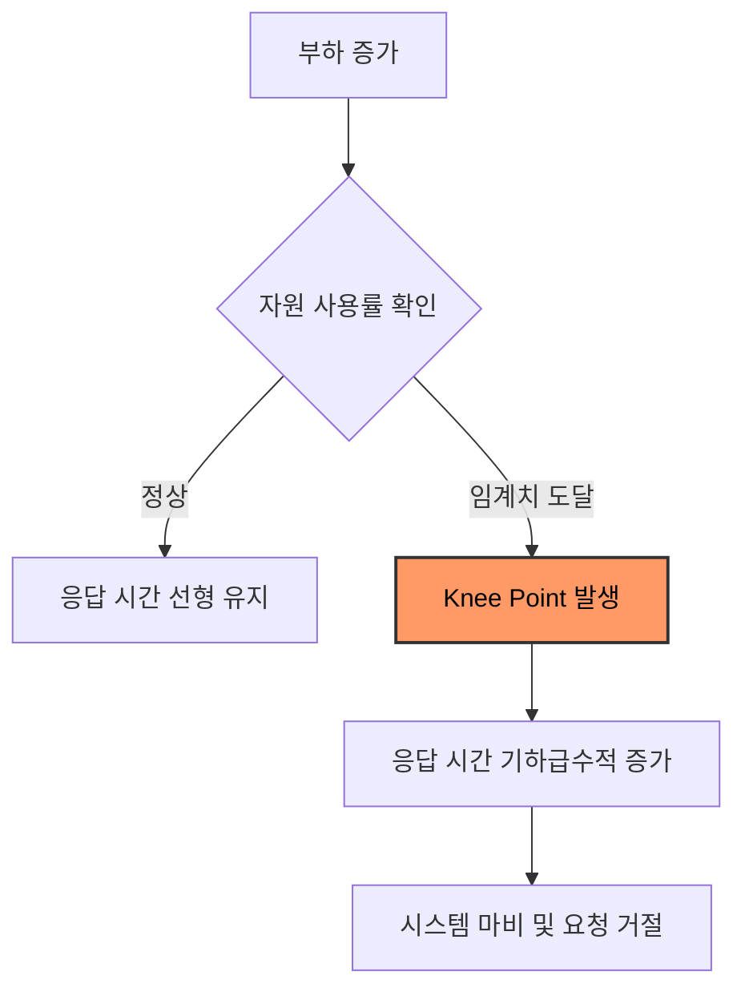

성능 테스트의 궁극적인 목적은 단순히 지표를 수집하는 것이 아니라, 시스템의 한계를 결정짓는 병목 지점(Bottleneck)을 찾아내고 이를 해소하는 것이다.

## Performance Knee Point

부하가 증가함에 따라 응답 시간은 비선형적으로 증가하면서 특정 시점에 도달하면 자원 포화로 인해 응답 시간이 급격히 치솟는데, 이 지점을 Knee Point이라고 한다.

- 처리량 한계: Knee Point 이후에는 부하를 늘려도 처리량이 더 이상 증가하지 않음
- 대기 큐 발생: 처리를 기다리는 요청이 쌓이면서 지연 시간(Latency) 폭증

## Resource Bottleneck

물리적 자원의 한계로 인해 발생하는 병목 현상이다.

|       자원 유형        |                      현상                       |                원인                |                진단 방법                |
|:------------------:|:---------------------------------------------:|:--------------------------------:|:-----------------------------------:|
|   CPU Saturation   | CPU 사용률이 일정 비 이상 지속 및 Context Switching 비용 증가 | 복잡한 연산, 과도한 직렬화/역직렬화, 빈번한 GC 발생  | `top`, `vmstat` (User/System 비중 확인) |
|    Memory & GC     |       Heap 부족으로 인한 빈번한 Full GC 및 STW 지연       |  메모리 누수, 부적절한 캐시 사용, 과도한 객체 생성   |      `jstat`, GC 로그 (회수 패턴 확인)      |
| Disk & Network I/O |        I/O Wait 수치 상승 및 데이터 입출력 속도 저하         | 대량 로그 기록, DB 디스크 한계, 네트워크 대역폭 포화 |   `iostat`, `sar` (I/O 대기 시간 측정)    |

## Software Bottleneck

애플리케이션 설정이나 코드 로직에서 발생하는 병목 현상이다.

### Database Connection Pool

DB 커넥션은 한정된 자원이므로, 이를 효율적으로 관리하지 못하면 시스템 전체가 마비된다.

- HikariCP 고갈: 비동기 처리 시 동시 실행 제어가 없으면 순식간에 커넥션이 바닥남
- 커넥션 대기: 요청이 커넥션을 얻기 위해 `getConnection()` 단계에서 블로킹됨
- 해결: 적절한 Pool Size 설정 및 트랜잭션 범위 최소화

### Thread Pool Saturation

- Tomcat 스레드 고갈: 외부 API 호출 대기 시간이 길어지면 HTTP 스레드 모두 점유
- 블로킹 전파: 특정 서비스의 지연이 전체 시스템의 요청 수용 능력 저하로 이어짐
- 해결: 비동기 논블로킹 아키텍처 도입 또는 가상 스레드 활용

## 병목 사례

실제 결제 시스템 구축 과정에서 마주친 대표적인 병목 지점과 해결 방법이다.

### 가상 스레드 피닝 (Pinning)

Java 21 가상 스레드 사용 시 특정 상황에서 플랫폼 스레드가 고정되어 확장성이 저하되는 현상이다.

- 원인: JDBC 드라이버(MySQL Connector/J 8.x) 내 `synchronized` 블록 사용
- 증상: I/O 작업 시 가상 스레드가 캐리어 스레드를 반납하지 못하고 함께 블로킹
- 해결: `synchronized`가 `ReentrantLock`으로 교체된 최신 드라이버 버전으로 업데이트

### 비동기 처리의 블로킹 함정

단순히 `@Async`를 사용하는 것만으로는 병목을 완전히 해결할 수 없다.

- 현상: `SimpleAsyncTaskExecutor`의 동시 실행 제한 도달 시 호출 스레드가 블로킹
- 결과: 비동기로 호출했음에도 불구하고 HTTP 응답 시간이 외부 API 지연 시간 동기화
- 해결: `LinkedBlockingQueue`를 이용한 명시적 버퍼링과 백그라운드 워커 구조 채택

## Bottleneck Identification Checklist

병목 지점을 체계적으로 찾기 위해 다음 항목을 점검한다.

- [ ] 시스템 부하가 증가할 때 CPU 사용률이 임계치에 도달하는가?
- [ ] DB 커넥션 풀의 활성 상태와 대기 큐 크기가 안정적인가?
- [ ] 특정 API의 응답 시간이 외부 의존성(Third-party API)에 비례하여 늘어나는가?
- [ ] GC 발생 빈도와 Stop-The-World 시간이 서비스 요구사항을 충족하는가?
- [ ] 가상 스레드 사용 시 Pinning 현상으로 인해 캐리어 스레드가 고갈되지 않는가?
