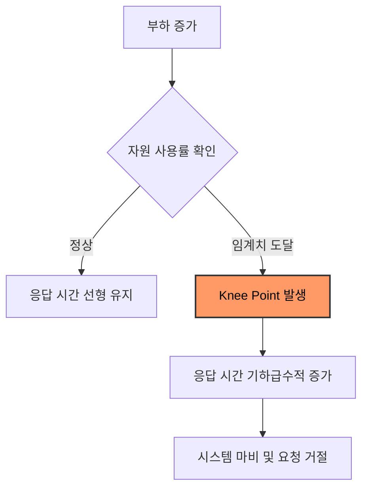

성능 테스트의 궁극적인 목적은 단순히 지표를 수집하는 것이 아니라, 시스템의 한계를 결정짓는 병목 지점(Bottleneck)을 찾아내고 이를 해소하는 것이다.

## Performance Knee Point

부하가 증가함에 따라 응답 시간은 비선형적으로 증가하면서 특정 시점에 도달하면 자원 포화로 인해 응답 시간이 급격히 치솟는데, 이 지점을 Knee Point이라고 한다.



- 처리량 한계: Knee Point 이후에는 부하를 늘려도 처리량이 더 이상 증가하지 않음
- 대기 큐 발생: 처리를 기다리는 요청이 쌓이면서 지연 시간(Latency) 폭증

## Resource Bottleneck

물리적 자원의 한계로 인해 발생하는 병목 현상이다.

|       자원 유형        |                      현상                       |                원인                |                진단 방법                |
|:------------------:|:---------------------------------------------:|:--------------------------------:|:-----------------------------------:|
|   CPU Saturation   | CPU 사용률이 일정 비 이상 지속 및 Context Switching 비용 증가 | 복잡한 연산, 과도한 직렬화/역직렬화, 빈번한 GC 발생  | `top`, `vmstat` (User/System 비중 확인) |
|    Memory & GC     |       Heap 부족으로 인한 빈번한 Full GC 및 STW 지연       |  메모리 누수, 부적절한 캐시 사용, 과도한 객체 생성   |      `jstat`, GC 로그 (회수 패턴 확인)      |
| Disk & Network I/O |        I/O Wait 수치 상승 및 데이터 입출력 속도 저하         | 대량 로그 기록, DB 디스크 한계, 네트워크 대역폭 포화 |   `iostat`, `sar` (I/O 대기 시간 측정)    |

## Software Bottleneck

애플리케이션 설정이나 코드 로직에서 발생하는 병목 현상이다.

### Database Connection Pool

DB 커넥션은 한정된 자원이므로, 이를 효율적으로 관리하지 못하면 시스템 전체가 마비된다.

- HikariCP 고갈: 비동기 처리 시 동시 실행 제어가 없으면 순식간에 커넥션이 바닥남
- 커넥션 대기: 요청이 커넥션을 얻기 위해 `getConnection()` 단계에서 블로킹됨
- 해결: 적절한 Pool Size 설정 및 트랜잭션 범위 최소화

#### Pool TPS Ceiling

Little's Law를 풀 자원에 적용하면 풀이 받아낼 수 있는 최대 TPS가 도출된다.

```text
DB TPS Ceiling = pool size / D̄

- pool size: 커넥션 풀 동시성 한계
- D̄ (Avg DB Hold Time): 요청당 평균 커넥션 점유 시간
```

- 풀 5 + D̄ 100ms → `5 / 0.1 = 50 TPS`가 DB 풀의 이론 천장
- D̄가 길어지면 풀 천장 하락

#### Pool Oversizing Pitfalls

풀 크기를 무리하게 늘리면 처리량이 비례해서 증가하지 않고 오히려 새로운 병목으로 전이된다.

|         구분         |          현상          |                                원인                                 |
|:------------------:|:--------------------:|:-----------------------------------------------------------------:|
| max_connections 한계 |   신규 연결 거절·503 발생    |     앱 노드 N대 × 풀 P가 DB 한계(MySQL 기본 151, PostgreSQL 기본 100) 초과      |
|      연결당 메모리       | idle 상태에서도 메모리 상시 점유 |         PostgreSQL 기준 연결당 약 10MB → 풀 500이면 idle 5GB 고정 사용         |
|   파일 디스크립터·포트 고갈   |  소켓 생성 실패, 연결 자체 실패  | TCP 연결마다 fd와 ephemeral port 소비, `ulimit`/`ip_local_port_range` 도달 |

DB 내부에서는 동시 트랜잭션이 늘수록 처리량이 오히려 감소한다.

- 컨텍스트 스위칭 폭증: vCPU 수 대비 동시 트랜잭션이 과다하면 CPU 시간이 실 작업보다 스위칭에 더 소비되어 Buckle Point에 진입
- 락 경합 비선형 상승: 동시 트랜잭션 수에 비례해 row/page/gap lock 충돌이 증가하고 InnoDB 데드락 빈도 상승

#### HikariCP Sizing Guideline

HikariCP는 작은 풀에서 최적화되도록 설계되어, 풀이 수백 단위로 커지면 내부 ConcurrentBag 핸드오프 비용 자체가 무시할 수 없는 오버헤드가 된다.

- 공식 권장 공식: `pool_size = ((core_count × 2) + effective_spindle_count)`
- 통상 한 자릿수에서 수십 사이가 실효 범위
- 풀 증설보다 D̄ 단축(인덱스 추가, N+1 제거, 트랜잭션 범위 축소)이 같은 ×2 효과를 부작용 없이 달성

운영 관점에서도 큰 풀은 다음과 같은 부작용을 동반한다.

- 재기동 시 Connect Storm: DB 재시작 후 앱 N대가 일제히 P개씩 재연결 시도 → 핸드셰이크 큐 폭발로 2차 장애 유발
- JVM 웜업 비용 증가: prepared statement 캐시와 메타데이터가 풀 크기에 비례해 누적 → 배포 직후 Connection Timeout 사례와 직결
- 모니터링 가시성 하락: 풀 사용률은 낮아 보이지만 실제 병목은 DB 내부에 형성 → "풀은 여유 있는데 응답이 느림" 상태로 진단에 어려움 발생

### Thread Pool Saturation

- Tomcat 스레드 고갈: 외부 API 호출 대기 시간이 길어지면 HTTP 스레드 모두 점유
- 블로킹 전파: 특정 서비스의 지연이 전체 시스템의 요청 수용 능력 저하로 이어짐
- 해결: 비동기 논블로킹 아키텍처 도입 또는 가상 스레드 활용

#### Thread TPS Ceiling

스레드 풀에 같은 공식을 적용하면 in-flight 요청 처리 한계가 도출된다.

```text
Thread TPS Ceiling = thread count / R̄

- thread count: HTTP 워커 스레드 수
- R̄ (Avg Response Time): 요청당 평균 전체 응답 시간
```

- 실효 천장은 두 자원의 최솟값으로 결정: `min(pool / D̄, thread / R̄)`
- 보통 DB 풀이 먼저 막히지만, 외부 API 호출이 잦은 시스템은 스레드가 먼저 막힘
- 두 천장이 비슷할 때 어느 쪽을 키울지는 작업 특성(I/O bound vs CPU bound)에 따라 결정

## 병목 사례

실제 결제 시스템 구축 과정에서 마주친 대표적인 병목 지점과 해결 방법이다.

### 배포 직후 DB Connection Timeout

신규 배포 직후 트래픽 유입 초기에 `JDBCConnectionException: Connection is not available, request timed out` 에러가 발생하는 현상이다.

- 원인: JVM의 지연 클래스 로딩(Lazy Loading)과 커넥션 점유의 상관관계가 핵심
    - 요청 처리를 위해 DB 커넥션을 풀에서 먼저 획득
    - 커넥션을 점유한 상태에서 Jackson, Hibernate, QueryDSL 등의 클래스를 동적으로 로딩
    - 클래스 로딩 및 인터프리터 실행이 CPU 집약적이므로 커넥션 반환이 지연
    - 후속 요청들이 커넥션 대기열에 쌓이다가 타임아웃 초과
- 증상
    - Connection Usage Time: 평소 5ms 미만 → 배포 직후 1s~1.5s로 급증
    - Connection Acquire Time: 평소 1ms 미만 → 타임아웃 임계치(10s)까지 도달
    - CPU 사용률 및 Young GC 발생 빈도 급증
- 해결: JVM 웜업(Warm-up)을 통해 실제 트래픽 유입 전에 클래스 로딩과 JIT 컴파일을 사전 완료하고, Kubernetes `startupProbe`로 웜업 완료 전까지 트래픽 유입 차단

### 가상 스레드 피닝 (Pinning)

Java 21 가상 스레드 사용 시 특정 상황에서 플랫폼 스레드가 고정되어 확장성이 저하되는 현상이다.

- 원인: JDBC 드라이버(MySQL Connector/J 8.x) 내 `synchronized` 블록 사용
- 증상: I/O 작업 시 가상 스레드가 캐리어 스레드를 반납하지 못하고 함께 블로킹
- 해결: `synchronized`가 `ReentrantLock`으로 교체된 최신 드라이버 버전으로 업데이트

### 비동기 처리의 블로킹 함정

단순히 `@Async`를 사용하는 것만으로는 병목을 완전히 해결할 수 없다.

- 현상: `SimpleAsyncTaskExecutor`의 동시 실행 제한 도달 시 호출 스레드가 블로킹
- 결과: 비동기로 호출했음에도 불구하고 HTTP 응답 시간이 외부 API 지연 시간 동기화
- 해결: `LinkedBlockingQueue`를 이용한 명시적 버퍼링과 백그라운드 워커 구조 채택

## Bottleneck Identification Checklist

병목 지점을 체계적으로 찾기 위해 다음 항목을 점검한다.

- [ ] 시스템 부하가 증가할 때 CPU 사용률이 임계치에 도달하는가?
- [ ] DB 커넥션 풀의 활성 상태와 대기 큐 크기가 안정적인가?
- [ ] 특정 API의 응답 시간이 외부 의존성(Third-party API)에 비례하여 늘어나는가?
- [ ] GC 발생 빈도와 Stop-The-World 시간이 서비스 요구사항을 충족하는가?
- [ ] 가상 스레드 사용 시 Pinning 현상으로 인해 캐리어 스레드가 고갈되지 않는가?
